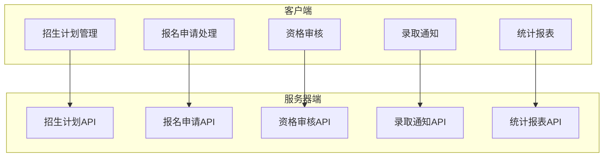
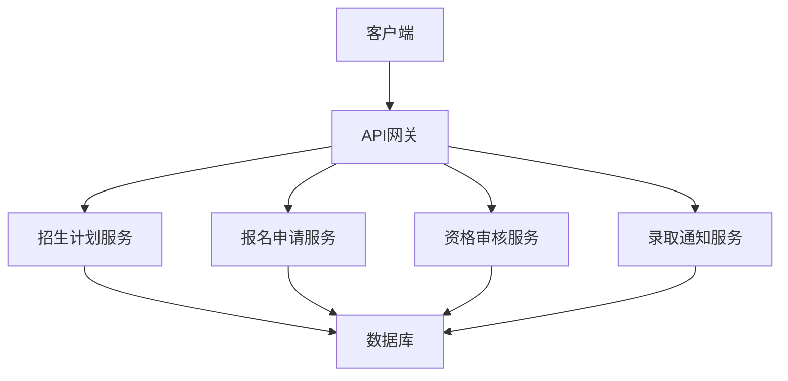
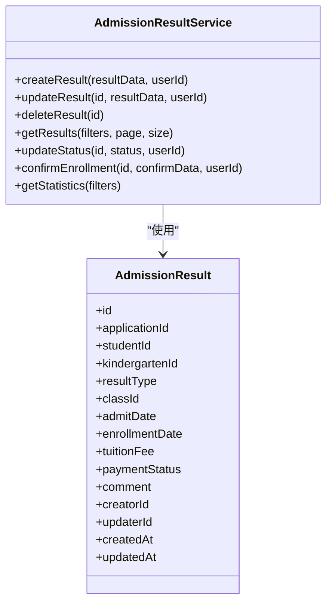
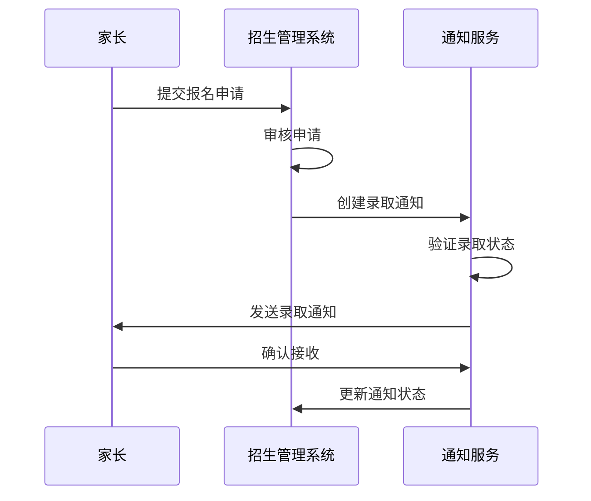
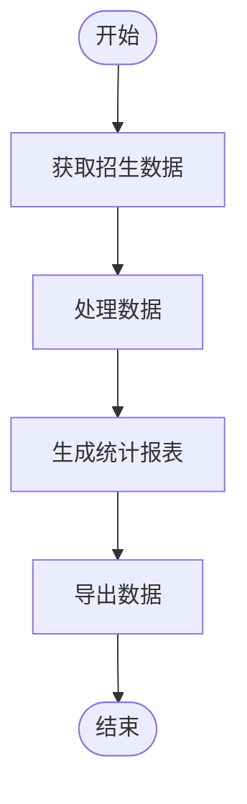
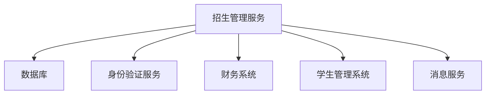

# 招生管理服务

<cite>
**本文档引用的文件**  
- [admission-notification.controller.ts](file://server/src/controllers/admission-notification.controller.ts)
- [admission-result.controller.ts](file://server/src/controllers/admission-result.controller.ts)
- [admission-notification.service.ts](file://server/src/services/enrollment/admission-notification.service.ts)
- [admission-result.service.ts](file://server/src/services/enrollment/admission-result.service.ts)
- [enrollment-plan.vue](file://client/src/pages/enrollment-plan.vue)
- [enrollment-analytics.vue](file://client/src/pages/enrollment-plan/analytics/enrollment-analytics.vue)
- [enrollment.ts](file://client/src/api/modules/enrollment.ts)
- [enrollmentFinance.ts](file://client/src/api/modules/enrollmentFinance.ts)
</cite>

## 目录
1. [引言](#引言)
2. [项目结构](#项目结构)
3. [核心组件](#核心组件)
4. [架构概述](#架构概述)
5. [详细组件分析](#详细组件分析)
6. [依赖分析](#依赖分析)
7. [性能考虑](#性能考虑)
8. [故障排除指南](#故障排除指南)
9. [结论](#结论)

## 引言
招生管理服务是幼儿园管理系统中的关键模块，负责处理从招生计划创建、报名申请、资格审核到录取通知的完整招生流程。该服务还集成了财务系统以处理费用收取，并与学生管理系统进行数据同步。本文档详细阐述了招生管理服务的设计与实现，包括核心业务流程、数据统计与导出功能、状态机管理、并发处理和数据一致性保障机制。

## 项目结构
招生管理服务的代码分布在客户端和服务器端两个主要部分。服务器端实现了核心的业务逻辑和数据处理，而客户端提供了用户界面和交互功能。

**图源**  
- [enrollment-plan.vue](file://client/src/pages/enrollment-plan.vue)
- [enrollment.ts](file://client/src/api/modules/enrollment.ts)

**节源**  
- [enrollment-plan.vue](file://client/src/pages/enrollment-plan.vue)
- [enrollment.ts](file://client/src/api/modules/enrollment.ts)

## 核心组件
招生管理服务的核心组件包括招生计划管理、报名申请处理、资格审核、录取通知和统计报表生成。这些组件通过RESTful API进行通信，并使用数据库进行数据持久化。

**节源**  
- [admission-result.controller.ts](file://server/src/controllers/admission-result.controller.ts)
- [admission-notification.controller.ts](file://server/src/controllers/admission-notification.controller.ts)

## 架构概述
招生管理服务采用分层架构设计，包括表现层、业务逻辑层和数据访问层。表现层处理HTTP请求和响应，业务逻辑层实现核心业务规则，数据访问层负责与数据库交互。

**图源**  
- [admission-result.controller.ts](file://server/src/controllers/admission-result.controller.ts)
- [admission-notification.controller.ts](file://server/src/controllers/admission-notification.controller.ts)

## 详细组件分析

### 招生计划创建与管理
招生计划创建功能允许管理员定义招生的详细信息，包括招生人数、年龄范围、报名时间等。该功能通过`enrollment-plan.vue`组件实现用户界面，通过`enrollment.ts`模块与后端API通信。

**节源**  
- [enrollment-plan.vue](file://client/src/pages/enrollment-plan.vue)
- [enrollment.ts](file://client/src/api/modules/enrollment.ts)

### 报名申请处理
报名申请处理功能接收家长提交的报名信息，并进行初步验证。该功能通过`EnrollmentApplication`模型存储申请数据，并通过`EnrollmentApplicationController`处理相关API请求。

### 资格审核
资格审核功能对报名申请进行详细审查，包括年龄验证、户籍验证等。审核结果存储在`AdmissionResult`模型中，并通过`AdmissionResultService`进行业务逻辑处理。

**图源**  
- [admission-result.service.ts](file://server/src/services/enrollment/admission-result.service.ts)
- [admission-result.model.ts](file://server/src/models/admission-result.model.ts)

**节源**  
- [admission-result.service.ts](file://server/src/services/enrollment/admission-result.service.ts)
- [admission-result.model.ts](file://server/src/models/admission-result.model.ts)

### 录取通知
录取通知功能负责向家长发送录取结果。通知可以通过短信、邮件或系统消息发送。该功能通过`AdmissionNotificationService`实现业务逻辑，并通过`AdmissionNotificationController`处理API请求。

**图源**  
- [admission-notification.service.ts](file://server/src/services/enrollment/admission-notification.service.ts)
- [admission-notification.controller.ts](file://server/src/controllers/admission-notification.controller.ts)

**节源**  
- [admission-notification.service.ts](file://server/src/services/enrollment/admission-notification.service.ts)
- [admission-notification.controller.ts](file://server/src/controllers/admission-notification.controller.ts)

### 统计报表生成
统计报表生成功能提供招生数据的汇总和分析。该功能通过`getStatistics`方法实现，可以按招生计划、幼儿园等维度进行数据统计。

**图源**  
- [admission-result.service.ts](file://server/src/services/enrollment/admission-result.service.ts)
- [enrollment-analytics.vue](file://client/src/pages/enrollment-plan/analytics/enrollment-analytics.vue)

**节源**  
- [admission-result.service.ts](file://server/src/services/enrollment/admission-result.service.ts)
- [enrollment-analytics.vue](file://client/src/pages/enrollment-plan/analytics/enrollment-analytics.vue)

## 依赖分析
招生管理服务依赖于多个外部系统和内部模块。主要依赖包括数据库、身份验证服务、财务系统和学生管理系统。

**图源**  
- [admission-result.service.ts](file://server/src/services/enrollment/admission-result.service.ts)
- [admission-notification.service.ts](file://server/src/services/enrollment/admission-notification.service.ts)

**节源**  
- [admission-result.service.ts](file://server/src/services/enrollment/admission-result.service.ts)
- [admission-notification.service.ts](file://server/src/services/enrollment/admission-notification.service.ts)

## 性能考虑
为了提高大数据量统计查询的性能，招生管理服务采用了多种优化策略，包括数据库索引、查询缓存和异步处理。

### 数据库查询优化
在关键字段上创建索引，如`applicationId`、`studentId`和`kindergartenId`，以加快查询速度。

### 异步处理
对于耗时的操作，如发送大量通知，采用异步处理机制，避免阻塞主线程。

### 缓存策略
使用Redis缓存频繁访问的数据，如招生计划和统计结果，减少数据库查询次数。

**节源**  
- [admission-result.service.ts](file://server/src/services/enrollment/admission-result.service.ts)
- [admission-notification.service.ts](file://server/src/services/enrollment/admission-notification.service.ts)

## 故障排除指南
### 常见问题
1. **无法创建招生计划**：检查用户权限和输入数据的完整性。
2. **报名申请无法提交**：验证网络连接和服务器状态。
3. **录取通知未发送**：检查消息服务配置和家长联系方式。

### 调试步骤
1. 查看服务器日志，定位错误信息。
2. 使用API测试工具验证接口功能。
3. 检查数据库连接和数据完整性。

**节源**  
- [admission-result.controller.ts](file://server/src/controllers/admission-result.controller.ts)
- [admission-notification.controller.ts](file://server/src/controllers/admission-notification.controller.ts)

## 结论
招生管理服务通过模块化设计和分层架构，实现了高效、可靠的招生流程管理。通过集成财务系统和学生管理系统，实现了数据的无缝流转。采用的性能优化策略确保了系统在大数据量下的稳定运行。未来可以进一步优化用户界面，提升用户体验。