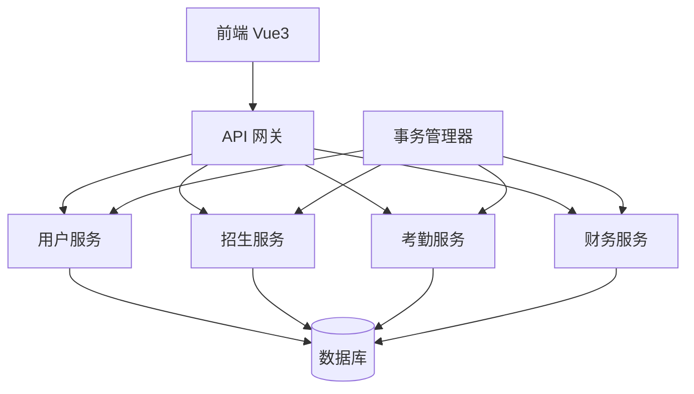
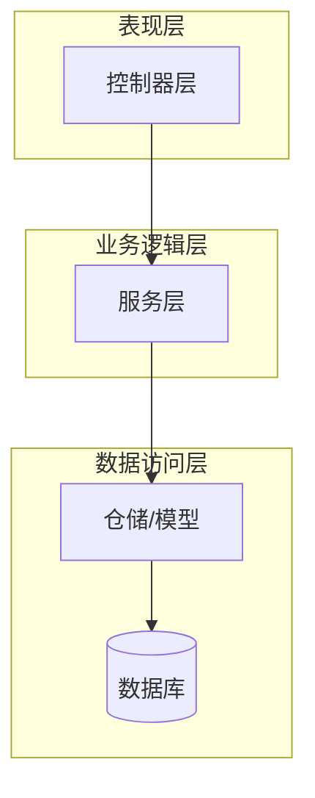
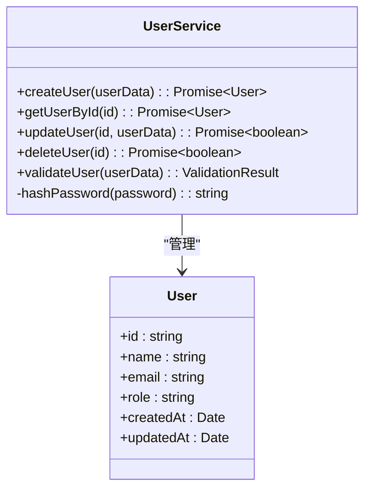
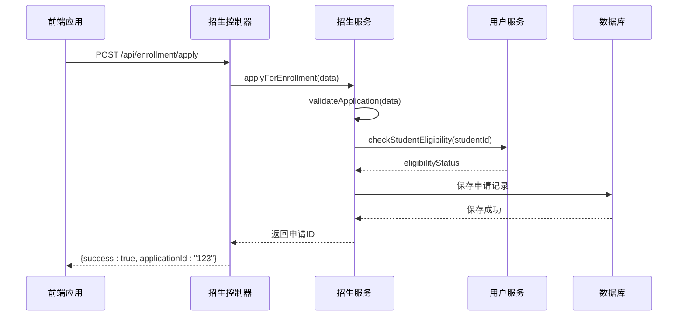
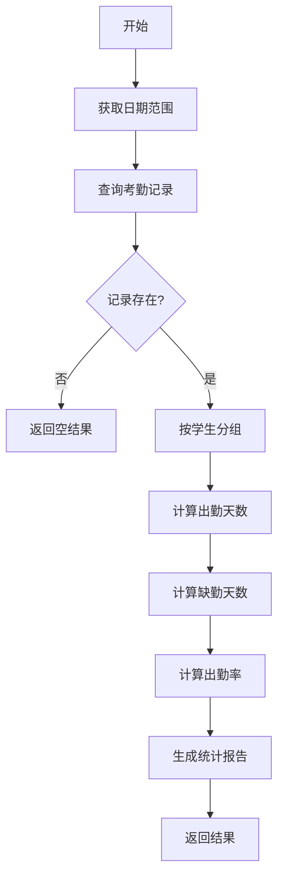
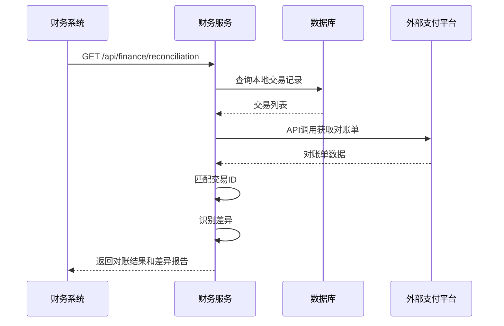
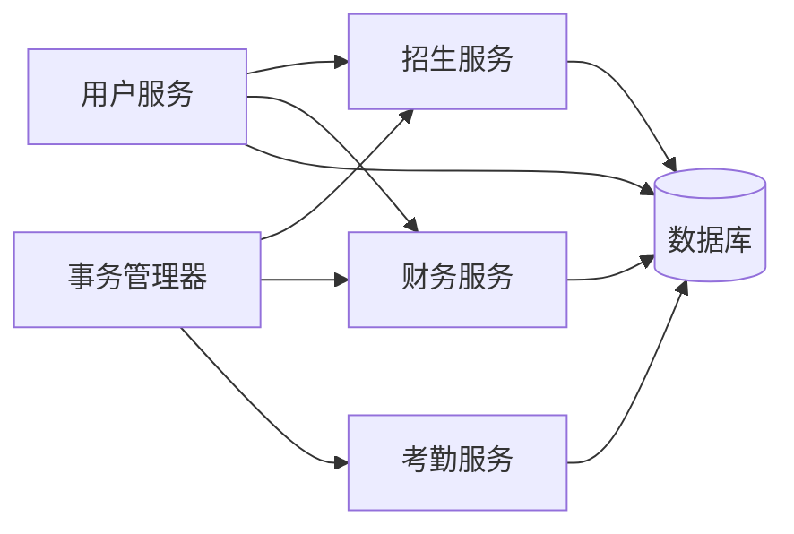

# 核心业务服务

<cite>
**本文档引用的文件**  
- [business-center.service.ts](file://client/src/api/modules/business-center.ts)
- [enrollment.service.ts](file://server/src/services/enrollment.service.ts)
- [attendance.service.ts](file://server/src/services/attendance.service.ts)
- [finance.service.ts](file://server/src/services/finance.service.ts)
- [user.service.ts](file://server/src/services/user.service.ts)
- [enrollment.controller.ts](file://server/src/controllers/enrollment.controller.ts)
- [attendance.controller.ts](file://server/src/controllers/attendance.controller.ts)
- [finance.controller.ts](file://server/src/controllers/finance.controller.ts)
- [user.controller.ts](file://server/src/controllers/user.controller.ts)
- [database.service.ts](file://server/src/services/database.service.ts)
- [transaction.manager.ts](file://server/src/utils/transaction.manager.ts)
- [validation.middleware.ts](file://server/src/middleware/validation.middleware.ts)
</cite>

## 目录

1. [引言](#引言)
2. [项目结构](#项目结构)
3. [核心组件](#核心组件)
4. [架构概述](#架构概述)
5. [详细组件分析](#详细组件分析)
6. [依赖分析](#依赖分析)
7. [性能考虑](#性能考虑)
8. [故障排除指南](#故障排除指南)
9. [结论](#结论)

## 引言

本文档详细阐述了幼儿园管理系统中核心业务服务模块的设计与实现。系统围绕用户管理、招生管理、考勤管理和财务管理四大核心业务展开，采用分层架构设计，确保各服务职责清晰、松耦合且易于维护。通过RESTful API提供统一接口，各服务之间通过明确定义的数据契约进行通信，并在关键业务流程中实现了事务管理、错误传播和重试机制，以保障数据一致性和系统可靠性。

## 项目结构

系统采用前后端分离架构，后端服务位于`server/src`目录下，主要包含`controllers`、`services`、`models`和`middleware`等模块。`services`目录存放核心业务逻辑，每个业务领域（如招生、考勤、财务）都有独立的服务文件。`controllers`负责接收HTTP请求，调用相应服务并返回响应。`middleware`包含参数验证、身份认证等横切关注点。数据库操作通过Sequelize ORM进行管理。

**图示来源**
- [user.service.ts](file://server/src/services/user.service.ts)
- [enrollment.service.ts](file://server/src/services/enrollment.service.ts)
- [attendance.service.ts](file://server/src/services/attendance.service.ts)
- [finance.service.ts](file://server/src/services/finance.service.ts)
- [transaction.manager.ts](file://server/src/utils/transaction.manager.ts)

**本节来源**
- [server/src](file://server/src)
- [client/src](file://client/src)

## 核心组件

核心业务组件包括用户服务、招生服务、考勤服务和财务服务。用户服务负责用户信息的增删改查及权限管理。招生服务处理招生计划、报名申请和录取流程。考勤服务记录学生和教师的出勤情况，并支持统计分析。财务服务管理学费、杂费的收缴、退款及对账。所有服务均遵循单一职责原则，通过公共接口暴露功能，并在内部实现复杂的业务规则和数据验证。

**本节来源**
- [user.service.ts](file://server/src/services/user.service.ts#L1-L200)
- [enrollment.service.ts](file://server/src/services/enrollment.service.ts#L1-L300)
- [attendance.service.ts](file://server/src/services/attendance.service.ts#L1-L250)
- [finance.service.ts](file://server/src/services/finance.service.ts#L1-L350)

## 架构概述

系统采用典型的分层架构，从上至下分为控制器层、服务层和数据访问层。控制器层（Controller）作为HTTP请求的入口，负责解析请求、调用服务层并格式化响应。服务层（Service）是业务逻辑的核心，封装了所有业务规则、计算逻辑和跨服务协调。数据访问层由Sequelize模型和数据库服务组成，负责与数据库交互。各层之间通过接口解耦，确保了系统的可测试性和可维护性。

**图示来源**
- [user.controller.ts](file://server/src/controllers/user.controller.ts)
- [user.service.ts](file://server/src/services/user.service.ts)
- [database.service.ts](file://server/src/services/database.service.ts)

## 详细组件分析

### 用户服务分析

用户服务是系统的基础，管理所有用户（学生、家长、教师、管理员）的生命周期。它提供了创建、查询、更新和删除用户信息的接口，并集成了权限验证逻辑。

#### 用户服务类图

**图示来源**
- [user.service.ts](file://server/src/services/user.service.ts#L20-L100)
- [models/user.model.ts](file://server/src/models/user.model.ts)

### 招生服务分析

招生服务负责管理整个招生流程，从业务规则验证到最终录取。

#### 招生流程序列图

**图示来源**
- [enrollment.controller.ts](file://server/src/controllers/enrollment.controller.ts#L15-L50)
- [enrollment.service.ts](file://server/src/services/enrollment.service.ts#L50-L120)
- [user.service.ts](file://server/src/services/user.service.ts#L150-L180)

### 考勤服务分析

考勤服务处理日常的签到签退和统计计算。

#### 考勤统计计算流程图

**图示来源**
- [attendance.service.ts](file://server/src/services/attendance.service.ts#L80-L200)

### 财务服务分析

财务服务管理学费收缴和对账逻辑。

#### 财务对账逻辑序列图

**图示来源**
- [finance.service.ts](file://server/src/services/finance.service.ts#L200-L300)

**本节来源**
- [enrollment.service.ts](file://server/src/services/enrollment.service.ts)
- [attendance.service.ts](file://server/src/services/attendance.service.ts)
- [finance.service.ts](file://server/src/services/finance.service.ts)

## 依赖分析

各核心服务之间存在明确的依赖关系。招生服务依赖用户服务来验证学生资格。财务服务在生成账单时可能需要调用用户服务获取学生信息。所有服务都依赖数据库服务进行数据持久化。事务管理器被多个服务在需要保证数据一致性的操作中使用，如招生录取和财务扣款。

**图示来源**
- [enrollment.service.ts](file://server/src/services/enrollment.service.ts#L10)
- [finance.service.ts](file://server/src/services/finance.service.ts#L15)
- [transaction.manager.ts](file://server/src/utils/transaction.manager.ts)
- [database.service.ts](file://server/src/services/database.service.ts)

**本节来源**
- [server/src/services](file://server/src/services)
- [server/src/utils](file://server/src/utils)

## 性能考虑

为提升系统性能，建议采用以下优化策略：对于批量导入学生或考勤数据的场景，使用数据库的批量插入（bulk insert）功能，避免逐条插入带来的性能开销。对于频繁访问但不常变更的数据（如招生计划、收费标准），实施Redis缓存策略，减少数据库查询压力。优化数据库查询，为常用查询条件（如学生ID、日期范围）建立索引，并避免N+1查询问题。在高并发场景下，考虑使用消息队列进行异步处理，如将考勤统计任务放入队列，由后台工作进程处理。

## 故障排除指南

当遇到服务调用失败时，首先检查请求参数是否符合验证规则，可通过查看`validation.middleware.ts`中的验证逻辑进行确认。若涉及多个服务的事务操作失败，检查事务管理器的日志，确认是哪个步骤抛出了异常。对于数据库查询缓慢的问题，利用`db:slow-queries`脚本分析慢查询日志，并根据建议优化SQL或添加索引。若出现服务间调用超时，检查网络状况和下游服务的健康状态。

**本节来源**
- [validation.middleware.ts](file://server/src/middleware/validation.middleware.ts)
- [transaction.manager.ts](file://server/src/utils/transaction.manager.ts)
- [package.json](file://package.json#L89-L93)

## 结论

本文档详细阐述了核心业务服务模块的设计与实现。通过清晰的职责划分、规范的接口定义和健壮的错误处理机制，系统能够稳定可靠地支持幼儿园的日常运营。未来可通过引入更高级的缓存策略、读写分离和微服务化进一步提升系统的可扩展性和性能。