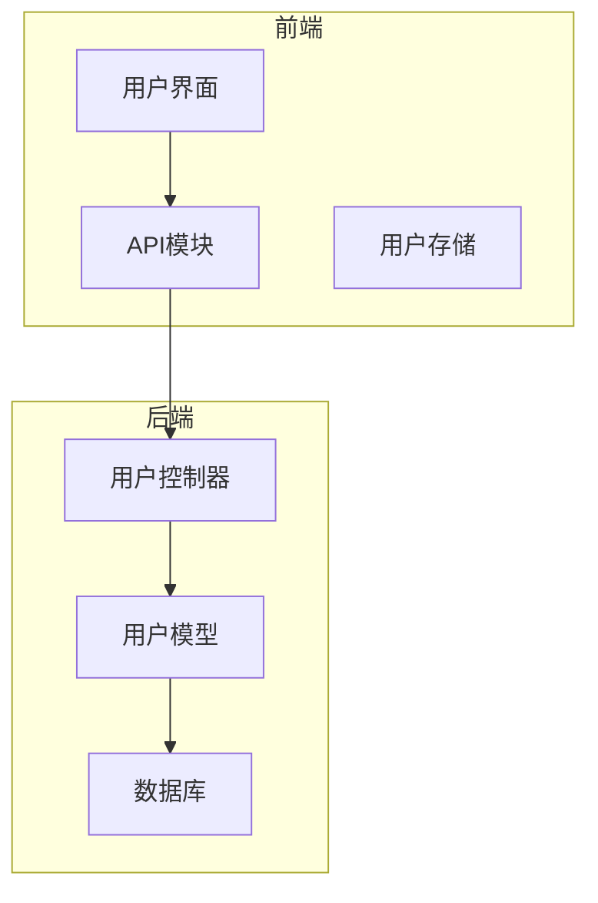
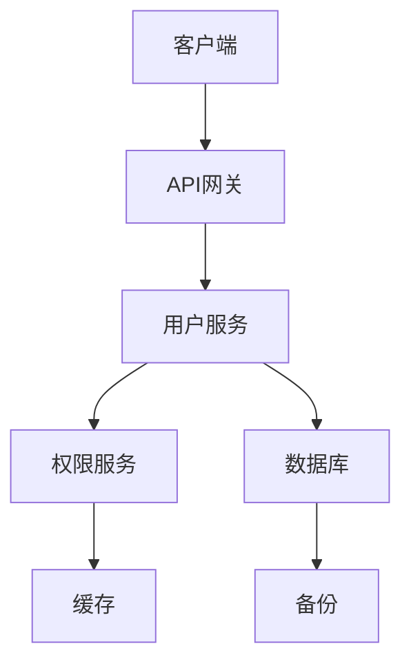
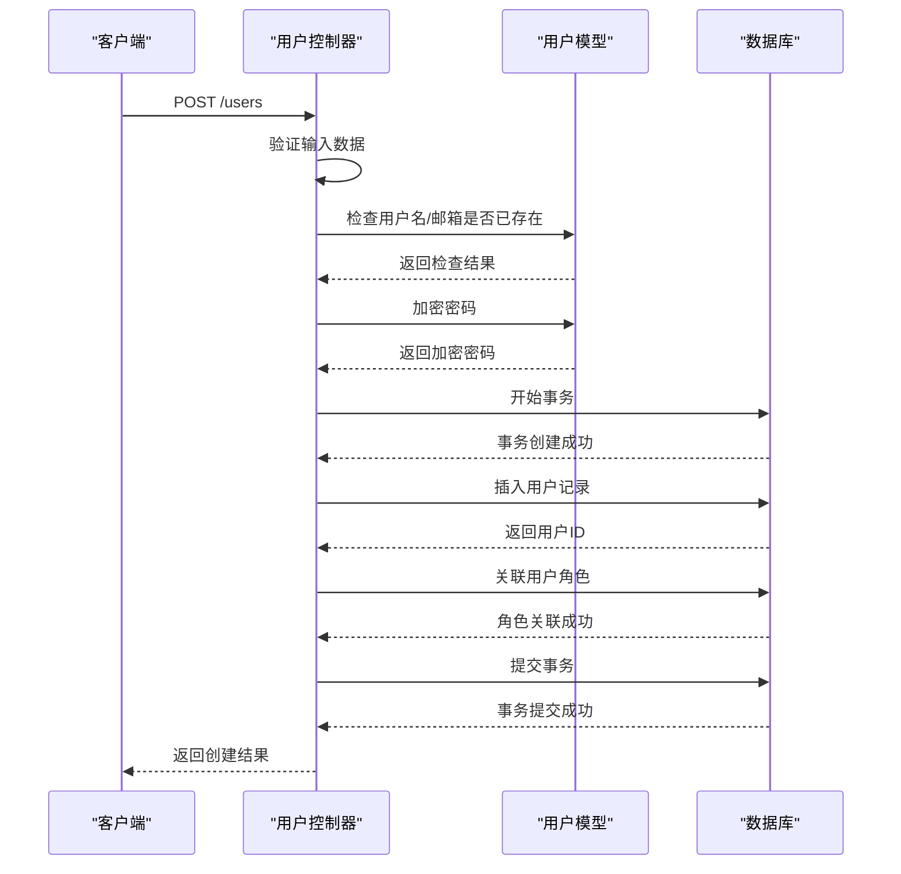
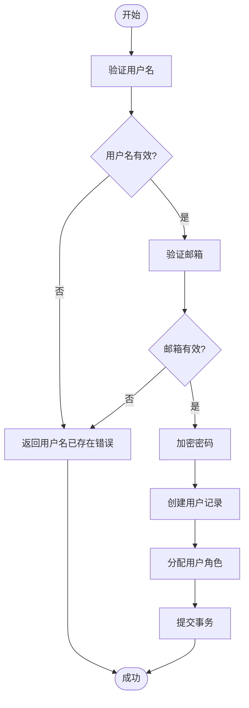
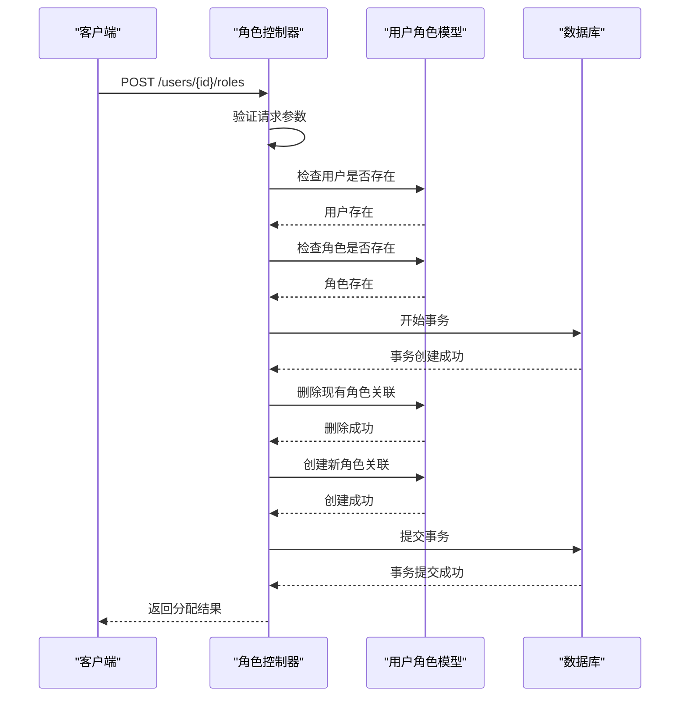
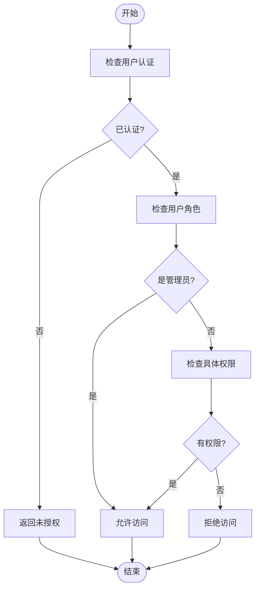
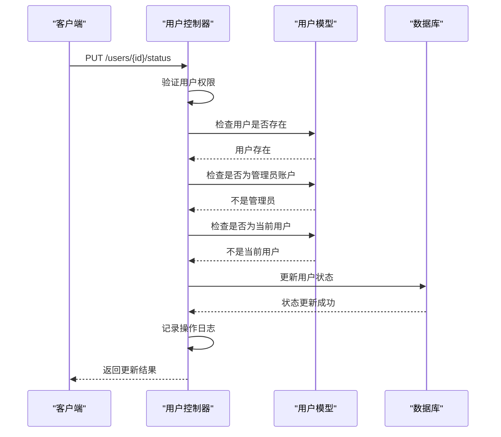
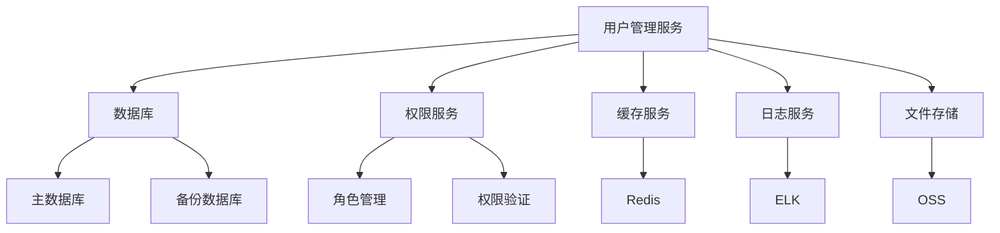

# 用户管理服务

<cite>
**本文档引用的文件**
- [user.controller.ts](file://k.yyup.com/server/src/controllers/user.controller.ts)
- [user-role.controller.ts](file://k.yyup.com/server/src/controllers/user-role.controller.ts)
- [user-profile.controller.ts](file://k.yyup.com/server/src/controllers/user-profile.controller.ts)
- [user.model.ts](file://k.yyup.com/server/src/models/user.model.ts)
- [user.ts](file://k.yyup.com/client/src/api/endpoints/user.ts)
- [user.ts](file://k.yyup.com/client/src/api/modules/user.ts)
- [user.ts](file://k.yyup.com/client/src/types/user.ts)
</cite>

## 目录
1. [简介](#简介)
2. [项目结构](#项目结构)
3. [核心组件](#核心组件)
4. [架构概述](#架构概述)
5. [详细组件分析](#详细组件分析)
6. [依赖分析](#依赖分析)
7. [性能考虑](#性能考虑)
8. [故障排除指南](#故障排除指南)
9. [结论](#结论)

## 简介
本文档详细阐述了用户管理服务的设计与实现。系统提供完整的用户生命周期管理功能，包括用户创建、更新、删除和查询等核心操作。服务实现了严格的数据验证、权限检查和密码加密处理机制。系统支持多角色分配、权限继承和组织架构管理功能，并提供用户批量导入导出、状态管理（激活/禁用）和搜索过滤功能。用户管理服务与其他服务（如权限系统、考勤系统）通过标准化API进行集成。

## 项目结构
用户管理服务采用前后端分离架构，前端位于`k.yyup.com/client`目录，后端位于`k.yyup.com/server`目录。后端服务采用Express框架，使用Sequelize作为ORM工具，支持多租户数据库架构。

**图表来源**
- [user.controller.ts](file://k.yyup.com/server/src/controllers/user.controller.ts)
- [user.model.ts](file://k.yyup.com/server/src/models/user.model.ts)

**章节来源**
- [user.controller.ts](file://k.yyup.com/server/src/controllers/user.controller.ts)
- [user.model.ts](file://k.yyup.com/server/src/models/user.model.ts)

## 核心组件
用户管理服务的核心组件包括用户控制器、用户模型和用户API模块。控制器处理所有用户相关的HTTP请求，模型定义用户数据结构和业务逻辑，API模块封装前端对后端服务的调用。

**章节来源**
- [user.controller.ts](file://k.yyup.com/server/src/controllers/user.controller.ts)
- [user.model.ts](file://k.yyup.com/server/src/models/user.model.ts)
- [user.ts](file://k.yyup.com/client/src/api/modules/user.ts)

## 架构概述
用户管理服务采用分层架构设计，包括表现层、业务逻辑层和数据访问层。服务通过RESTful API提供功能，支持多租户模式，每个租户拥有独立的数据库实例。

**图表来源**
- [user.controller.ts](file://k.yyup.com/server/src/controllers/user.controller.ts)
- [user-role.controller.ts](file://k.yyup.com/server/src/controllers/user-role.controller.ts)

## 详细组件分析

### 用户操作分析
用户管理服务提供完整的CRUD操作，包括创建、读取、更新和删除用户。

#### 用户创建流程

**图表来源**
- [user.controller.ts](file://k.yyup.com/server/src/controllers/user.controller.ts#L67-L230)

#### 用户数据验证

**图表来源**
- [user.controller.ts](file://k.yyup.com/server/src/controllers/user.controller.ts#L76-L110)

**章节来源**
- [user.controller.ts](file://k.yyup.com/server/src/controllers/user.controller.ts#L67-L230)

### 角色与权限分析
系统提供灵活的角色和权限管理功能，支持多角色分配和权限继承。

#### 角色分配流程

**图表来源**
- [user-role.controller.ts](file://k.yyup.com/server/src/controllers/user-role.controller.ts#L14-L104)

#### 权限检查流程

**图表来源**
- [user-role.controller.ts](file://k.yyup.com/server/src/controllers/user-role.controller.ts)
- [user-profile.controller.ts](file://k.yyup.com/server/src/controllers/user-profile.controller.ts)

**章节来源**
- [user-role.controller.ts](file://k.yyup.com/server/src/controllers/user-role.controller.ts#L14-L104)

### 用户状态管理分析
系统提供完整的用户状态管理功能，支持用户激活、禁用和锁定等状态。

#### 用户状态变更流程

**图表来源**
- [user.controller.ts](file://k.yyup.com/server/src/controllers/user.controller.ts#L266-L278)

## 依赖分析
用户管理服务依赖于多个核心组件和外部服务，确保系统的稳定性和可扩展性。

**图表来源**
- [user.controller.ts](file://k.yyup.com/server/src/controllers/user.controller.ts)
- [user-role.controller.ts](file://k.yyup.com/server/src/controllers/user-role.controller.ts)

**章节来源**
- [user.controller.ts](file://k.yyup.com/server/src/controllers/user.controller.ts)
- [user-role.controller.ts](file://k.yyup.com/server/src/controllers/user-role.controller.ts)

## 性能考虑
为确保用户管理服务的高性能，系统实施了多项优化策略。

### 分页查询优化
系统采用分页查询机制，限制单次查询返回的用户数量，避免数据库性能瓶颈。默认每页返回10条记录，最大支持100条记录每页。

### 缓存策略
系统实现多级缓存策略：
1. 用户基本信息缓存：使用Redis缓存用户基本信息，TTL为30分钟
2. 角色权限缓存：缓存用户角色和权限信息，TTL为1小时
3. 查询结果缓存：对常用查询条件的结果进行缓存

### 索引优化
数据库表已建立适当的索引以提高查询性能：
- 用户表：在username、email、status字段上建立索引
- 用户角色关联表：在user_id、role_id字段上建立复合索引
- 操作日志表：在user_id、created_at字段上建立复合索引

**章节来源**
- [user.controller.ts](file://k.yyup.com/server/src/controllers/user.controller.ts#L235-L347)

## 故障排除指南
### 常见问题及解决方案
1. **用户创建失败**
   - 检查用户名或邮箱是否已存在
   - 验证输入数据格式是否正确
   - 检查数据库连接是否正常

2. **角色分配失败**
   - 确认用户和角色ID是否存在
   - 检查当前用户是否有分配角色的权限
   - 查看数据库事务是否正常提交

3. **权限检查失败**
   - 验证用户登录状态
   - 检查用户角色和权限配置
   - 确认缓存是否需要刷新

**章节来源**
- [user.controller.ts](file://k.yyup.com/server/src/controllers/user.controller.ts)
- [user-role.controller.ts](file://k.yyup.com/server/src/controllers/user-role.controller.ts)
- [user-profile.controller.ts](file://k.yyup.com/server/src/controllers/user-profile.controller.ts)

## 结论
用户管理服务提供了完整的用户生命周期管理功能，具有良好的可扩展性和安全性。系统采用分层架构设计，实现了关注点分离，便于维护和扩展。通过实施性能优化策略，系统能够高效处理大量用户数据。未来可以考虑引入更高级的缓存策略和数据库分片技术，以支持更大规模的用户管理需求。