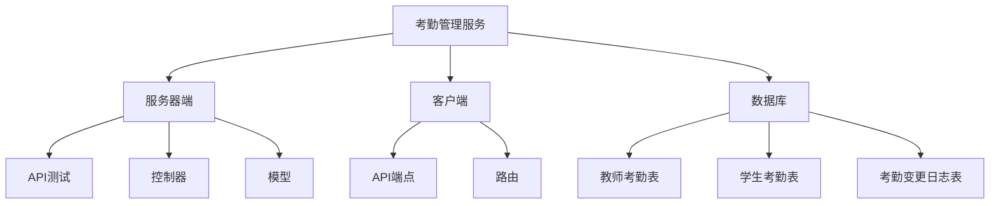
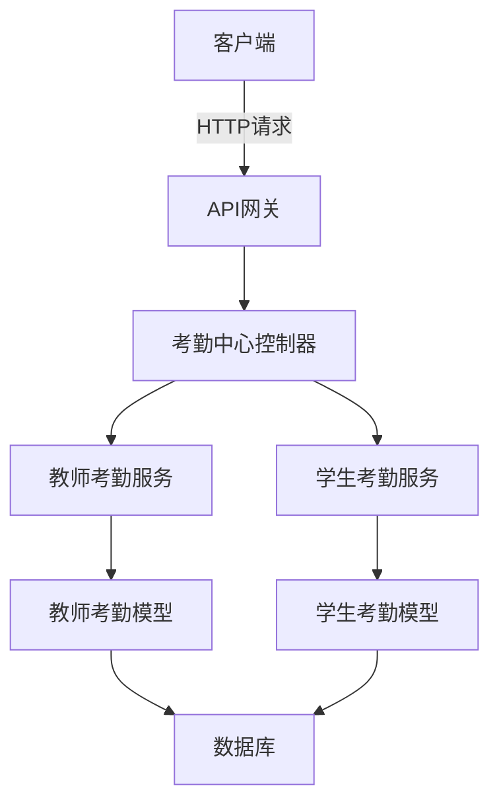
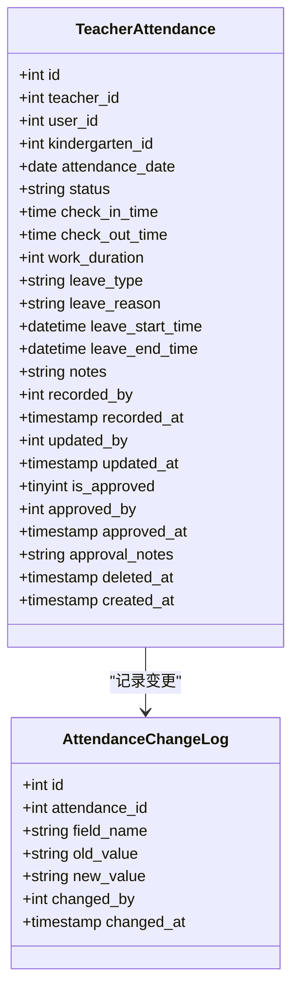
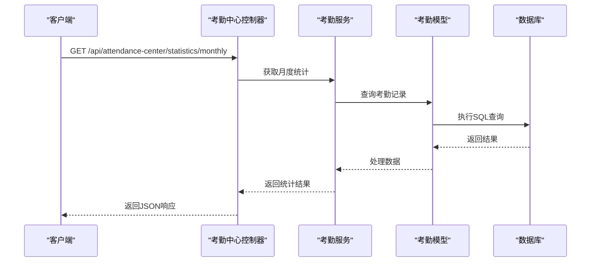
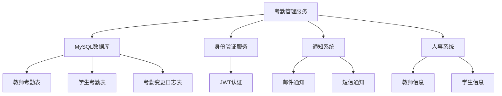

# 考勤管理服务

<cite>
**本文档引用的文件**  
- [create-teacher-attendances-table.js](file://k.yyup.com/create-teacher-attendances-table.js)
- [check-attendance-tables.js](file://k.yyup.com/check-attendance-tables.js)
- [attendance-apis-comprehensive.test.ts](file://k.yyup.com/server/APItest/comprehensive/attendance-apis-comprehensive.test.ts)
- [attendance.ts](file://k.yyup.com/client/src/api/endpoints/attendance.ts)
- [attendance-center.controller.ts.html](file://k.yyup.com/server/coverage/lcov-report/src/controllers/attendance-center.controller.ts.html)
- [teacher-attendance.controller.ts.html](file://k.yyup.com/server/coverage/lcov-report/src/controllers/teacher-attendance.controller.ts.html)
- [attendance-change-log.model.ts.html](file://k.yyup.com/server/coverage/lcov-report/src/models/attendance-change-log.model.ts.html)
- [attendance-center.test.md](file://k.yyup.com/docs/mobile-testing/test-cases/teacher-center/TC-013-考勤管理测试.md)
- [考勤功能完整设计方案-2025-01-09.md](file://k.yyup.com/docs/设计/考勤功能完整设计方案-2025-01-09.md)
- [考勤功能开发计划-2025-01-09.md](file://k.yyup.com/docs/开发计划/考勤功能开发计划-2025-01-09.md)
</cite>

## 目录
1. [简介](#简介)
2. [项目结构](#项目结构)
3. [核心组件](#核心组件)
4. [架构概述](#架构概述)
5. [详细组件分析](#详细组件分析)
6. [依赖分析](#依赖分析)
7. [性能考虑](#性能考虑)
8. [故障排除指南](#故障排除指南)
9. [结论](#结论)

## 简介
本文档详细阐述了考勤管理服务的设计与实现，涵盖教师和学生考勤记录的采集、状态更新和异常处理机制。文档还描述了考勤统计计算（如出勤率、迟到早退统计）、报表生成和趋势分析功能的实现逻辑。此外，提供了批量考勤导入、考勤规则配置（如弹性时间）和数据校验的代码示例，并说明了与通知系统（异常提醒）和人事系统的集成方式。最后，文档包含性能优化建议，如高频考勤数据写入优化、聚合查询优化和数据归档策略。

## 项目结构
考勤管理服务的代码分布在多个目录中，主要包括服务器端的API测试、数据库表创建脚本、客户端API定义以及相关文档。主要文件包括用于创建教师考勤表的脚本、检查考勤相关表的工具、API综合测试用例以及客户端的考勤API定义。

**图示来源**
- [create-teacher-attendances-table.js](file://k.yyup.com/create-teacher-attendances-table.js)
- [check-attendance-tables.js](file://k.yyup.com/check-attendance-tables.js)
- [attendance.ts](file://k.yyup.com/client/src/api/endpoints/attendance.ts)

**本节来源**
- [create-teacher-attendances-table.js](file://k.yyup.com/create-teacher-attendances-table.js)
- [check-attendance-tables.js](file://k.yyup.com/check-attendance-tables.js)
- [attendance.ts](file://k.yyup.com/client/src/api/endpoints/attendance.ts)

## 核心组件
考勤管理服务的核心组件包括教师考勤记录表、学生考勤记录表和考勤变更日志表。这些表通过外键关联，确保数据的一致性和完整性。教师考勤记录表包含教师ID、用户ID、幼儿园ID、考勤日期、状态、签到时间、签退时间、工作时长、请假类型、请假原因、备注等字段。学生考勤记录表和考勤变更日志表也具有类似的结构。

**本节来源**
- [create-teacher-attendances-table.js](file://k.yyup.com/create-teacher-attendances-table.js)
- [check-attendance-tables.js](file://k.yyup.com/check-attendance-tables.js)

## 架构概述
考勤管理服务采用分层架构，包括表示层、业务逻辑层和数据访问层。表示层负责处理用户请求和响应，业务逻辑层实现考勤记录的采集、状态更新和异常处理，数据访问层负责与数据库交互。服务通过RESTful API提供接口，支持教师和学生的考勤记录管理。

**图示来源**
- [attendance-center.controller.ts.html](file://k.yyup.com/server/coverage/lcov-report/src/controllers/attendance-center.controller.ts.html)
- [teacher-attendance.controller.ts.html](file://k.yyup.com/server/coverage/lcov-report/src/controllers/teacher-attendance.controller.ts.html)
- [attendance-change-log.model.ts.html](file://k.yyup.com/server/coverage/lcov-report/src/models/attendance-change-log.model.ts.html)

## 详细组件分析
### 教师考勤记录管理
教师考勤记录管理功能允许管理员或教师记录每日的考勤情况。系统支持多种考勤状态，包括正常出勤、缺勤、迟到、早退、病假、事假和免考勤。签到和签退时间用于计算工作时长，系统还支持请假申请和审批流程。

#### 类图

**图示来源**
- [create-teacher-attendances-table.js](file://k.yyup.com/create-teacher-attendances-table.js)
- [attendance-change-log.model.ts.html](file://k.yyup.com/server/coverage/lcov-report/src/models/attendance-change-log.model.ts.html)

**本节来源**
- [create-teacher-attendances-table.js](file://k.yyup.com/create-teacher-attendances-table.js)
- [attendance-change-log.model.ts.html](file://k.yyup.com/server/coverage/lcov-report/src/models/attendance-change-log.model.ts.html)

### 考勤统计与报表
考勤统计与报表功能提供多种维度的统计分析，包括日、周、月、季度和年度统计，按班级和年龄段统计。系统支持导出考勤报表，便于进一步分析和存档。趋势分析功能帮助管理者了解考勤模式和异常情况。

#### 序列图

**图示来源**
- [attendance-center.controller.ts.html](file://k.yyup.com/server/coverage/lcov-report/src/controllers/attendance-center.controller.ts.html)
- [attendance.ts](file://k.yyup.com/client/src/api/endpoints/attendance.ts)

**本节来源**
- [attendance-center.controller.ts.html](file://k.yyup.com/server/coverage/lcov-report/src/controllers/attendance-center.controller.ts.html)
- [attendance.ts](file://k.yyup.com/client/src/api/endpoints/attendance.ts)

## 依赖分析
考勤管理服务依赖于多个外部系统和组件，包括数据库、身份验证服务、通知系统和人事系统。数据库用于存储考勤记录和相关元数据，身份验证服务确保只有授权用户可以访问考勤数据，通知系统用于发送异常提醒，人事系统用于同步教师和学生信息。

**图示来源**
- [attendance-apis-comprehensive.test.ts](file://k.yyup.com/server/APItest/comprehensive/attendance-apis-comprehensive.test.ts)
- [create-teacher-attendances-table.js](file://k.yyup.com/create-teacher-attendances-table.js)

**本节来源**
- [attendance-apis-comprehensive.test.ts](file://k.yyup.com/server/APItest/comprehensive/attendance-apis-comprehensive.test.ts)
- [create-teacher-attendances-table.js](file://k.yyup.com/create-teacher-attendances-table.js)

## 性能考虑
为了优化高频考勤数据的写入性能，系统采用了批量插入和异步处理机制。聚合查询通过预计算和缓存技术优化，减少数据库负载。数据归档策略定期将历史考勤数据迁移到归档表，保持主表的高效查询性能。

**本节来源**
- [考勤功能完整设计方案-2025-01-09.md](file://k.yyup.com/docs/设计/考勤功能完整设计方案-2025-01-09.md)
- [考勤功能开发计划-2025-01-09.md](file://k.yyup.com/docs/开发计划/考勤功能开发计划-2025-01-09.md)

## 故障排除指南
常见问题包括考勤记录无法保存、统计结果不准确和通知未发送。解决方法包括检查数据库连接、验证API请求格式和确认通知服务配置。详细的错误日志和监控工具帮助快速定位和解决问题。

**本节来源**
- [attendance-center.test.md](file://k.yyup.com/docs/mobile-testing/test-cases/teacher-center/TC-013-考勤管理测试.md)
- [考勤中心500错误分析报告.md](file://k.yyup.com/docs/集团管理/考勤中心500错误分析报告.md)

## 结论
考勤管理服务通过完善的数据库设计、分层架构和丰富的功能模块，实现了高效的考勤记录管理和统计分析。系统支持灵活的考勤规则配置和数据校验，确保数据的准确性和完整性。与通知系统和人事系统的集成进一步提升了系统的实用性和自动化水平。通过性能优化和数据归档策略，系统能够应对大规模数据处理需求，为教育机构提供可靠的考勤管理解决方案。