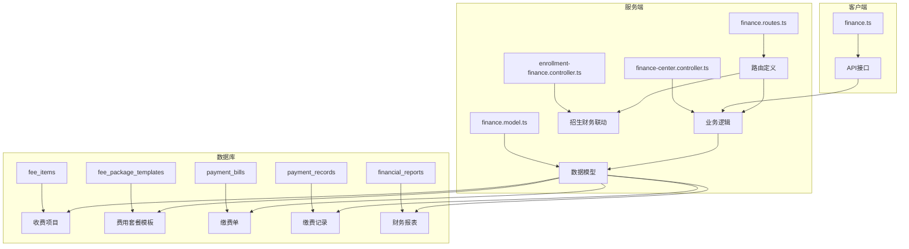
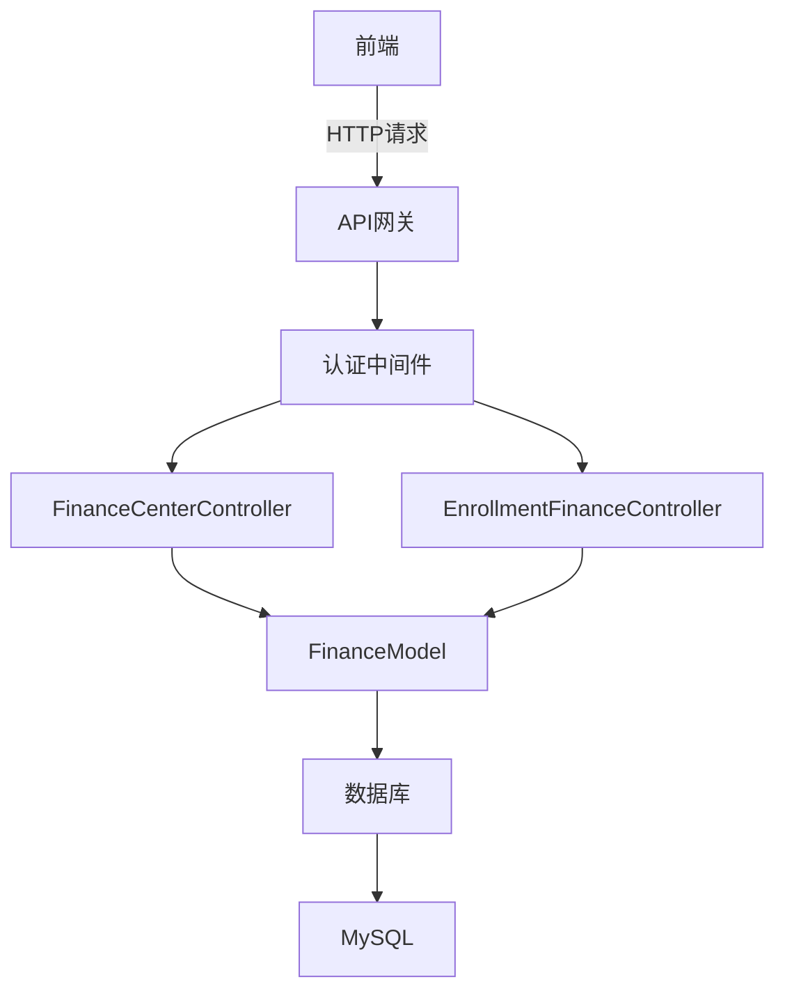
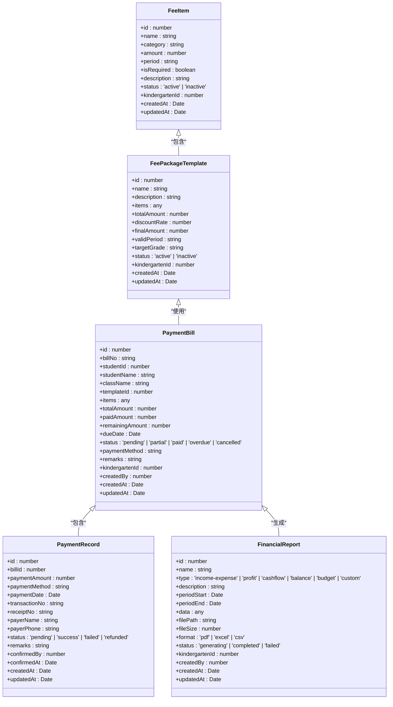
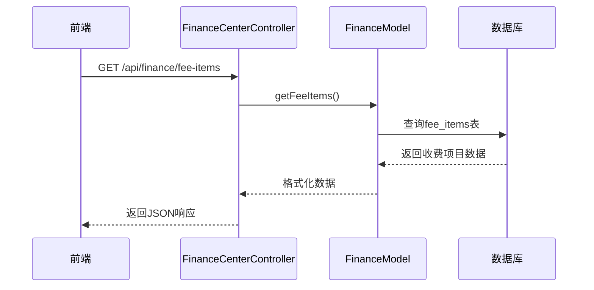
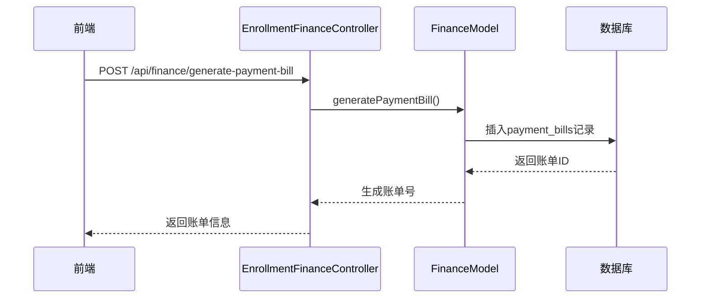
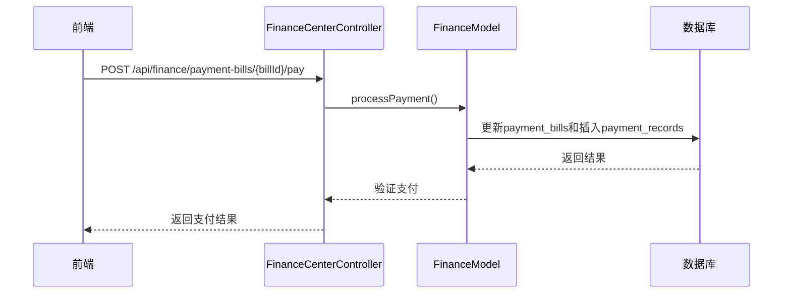
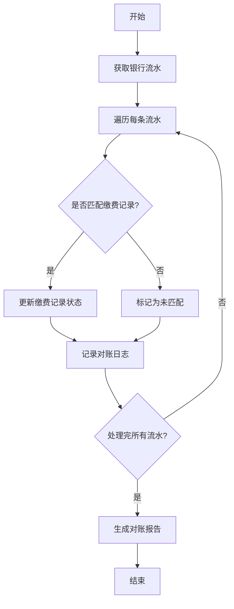
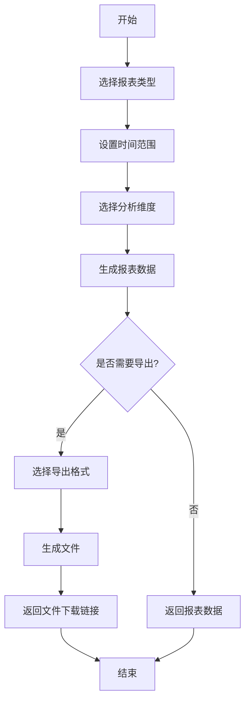
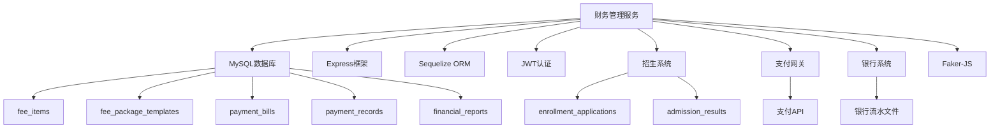

# 财务管理服务

<cite>
**本文档引用的文件**   
- [finance-center.controller.ts](file://k.yyup.com/server/src/controllers/centers/finance-center.controller.ts)
- [enrollment-finance.controller.ts](file://k.yyup.com/server/src/controllers/enrollment-finance.controller.ts)
- [finance.model.ts](file://k.yyup.com/server/src/models/finance.model.ts)
- [finance.routes.ts](file://k.yyup.com/server/src/routes/finance.routes.ts)
- [finance.ts](file://k.yyup.com/client/src/api/modules/finance.ts)
- [run-enrollment-finance-migration.js](file://k.yyup.com/run-enrollment-finance-migration.js)
</cite>

## 目录
1. [简介](#简介)
2. [项目结构](#项目结构)
3. [核心组件](#核心组件)
4. [架构概述](#架构概述)
5. [详细组件分析](#详细组件分析)
6. [依赖分析](#依赖分析)
7. [性能考虑](#性能考虑)
8. [故障排除指南](#故障排除指南)
9. [结论](#结论)
10. [附录](#附录)（如有必要）

## 简介
财务管理服务是幼儿园管理系统的核心模块，负责处理所有与财务相关的业务流程。该服务涵盖了收费项目管理、账单生成、支付处理、财务对账、报表生成等关键功能。系统通过与招生系统、支付网关和银行系统的集成，实现了财务流程的自动化和数据的实时同步。服务采用模块化设计，确保了高内聚低耦合，同时通过事务一致性保障和敏感数据加密处理，确保了财务数据的安全性和完整性。

## 项目结构
财务管理服务的代码结构遵循清晰的分层架构，包括控制器、模型、路由和客户端API模块。服务端代码位于`server/src`目录下，分为`controllers`、`models`和`routes`三个主要部分。客户端API模块位于`client/src/api/modules`目录下，提供了与后端服务交互的接口。数据库迁移脚本和种子数据位于根目录，用于初始化财务相关的数据库表结构和初始数据。

**图表来源**
- [finance-center.controller.ts](file://k.yyup.com/server/src/controllers/centers/finance-center.controller.ts)
- [enrollment-finance.controller.ts](file://k.yyup.com/server/src/controllers/enrollment-finance.controller.ts)
- [finance.model.ts](file://k.yyup.com/server/src/models/finance.model.ts)
- [finance.routes.ts](file://k.yyup.com/server/src/routes/finance.routes.ts)

**章节来源**
- [finance-center.controller.ts](file://k.yyup.com/server/src/controllers/centers/finance-center.controller.ts#L1-L607)
- [enrollment-finance.controller.ts](file://k.yyup.com/server/src/controllers/enrollment-finance.controller.ts#L1-L737)
- [finance.model.ts](file://k.yyup.com/server/src/models/finance.model.ts#L1-L642)
- [finance.routes.ts](file://k.yyup.com/server/src/routes/finance.routes.ts#L1-L326)

## 核心组件
财务管理服务的核心组件包括收费项目管理、账单生成、支付处理、财务对账和报表生成。收费项目管理模块负责维护所有收费项目的定义和状态。账单生成模块根据费用套餐模板自动生成缴费单。支付处理模块支持多种支付方式，并与支付网关集成。财务对账模块通过银行流水匹配实现自动对账。报表生成模块提供多维度的财务分析和数据导出功能。

**章节来源**
- [finance-center.controller.ts](file://k.yyup.com/server/src/controllers/centers/finance-center.controller.ts#L1-L607)
- [enrollment-finance.controller.ts](file://k.yyup.com/server/src/controllers/enrollment-finance.controller.ts#L1-L737)
- [finance.model.ts](file://k.yyup.com/server/src/models/finance.model.ts#L1-L642)

## 架构概述
财务管理服务采用典型的MVC架构，前端通过API与后端交互，后端通过模型与数据库通信。服务通过RESTful API暴露功能，支持JSON格式的数据交换。安全方面，所有API调用都需要JWT认证。数据持久化使用Sequelize ORM，支持MySQL数据库。服务通过Swagger提供API文档，便于前后端协作和第三方集成。

**图表来源**
- [finance-center.controller.ts](file://k.yyup.com/server/src/controllers/centers/finance-center.controller.ts)
- [enrollment-finance.controller.ts](file://k.yyup.com/server/src/controllers/enrollment-finance.controller.ts)
- [finance.model.ts](file://k.yyup.com/server/src/models/finance.model.ts)

## 详细组件分析

### 收费项目管理分析
收费项目管理模块通过`FeeItem`模型管理所有收费项目。每个收费项目包含名称、类别、金额、周期、是否必需等属性。模块提供CRUD操作，支持按类别和状态查询。收费项目的状态分为"active"和"inactive"，用于控制项目的可用性。系统通过`getFeeItems`方法获取收费项目列表，默认只返回活跃的项目。

#### 对于面向对象的组件：

**图表来源**
- [finance.model.ts](file://k.yyup.com/server/src/models/finance.model.ts#L1-L642)

#### 对于API/服务组件：

**图表来源**
- [finance-center.controller.ts](file://k.yyup.com/server/src/controllers/centers/finance-center.controller.ts#L125-L171)
- [finance.model.ts](file://k.yyup.com/server/src/models/finance.model.ts#L14-L30)

**章节来源**
- [finance-center.controller.ts](file://k.yyup.com/server/src/controllers/centers/finance-center.controller.ts#L125-L171)
- [finance.model.ts](file://k.yyup.com/server/src/models/finance.model.ts#L14-L30)

### 账单生成分析
账单生成模块通过`PaymentBill`模型管理缴费单。系统支持手动创建和批量生成缴费单。缴费单包含学生信息、缴费项目、总金额、到期日期和状态等属性。状态包括"pending"（待缴费）、"partial"（部分缴费）、"paid"（已缴费）、"overdue"（逾期）和"cancelled"（已取消）。模块通过`generatePaymentBill`和`batchGeneratePaymentBills`方法实现单个和批量账单生成。

#### 对于API/服务组件：

**图表来源**
- [enrollment-finance.controller.ts](file://k.yyup.com/server/src/controllers/enrollment-finance.controller.ts#L558-L615)
- [finance.model.ts](file://k.yyup.com/server/src/models/finance.model.ts#L58-L81)

**章节来源**
- [enrollment-finance.controller.ts](file://k.yyup.com/server/src/controllers/enrollment-finance.controller.ts#L558-L615)
- [finance.model.ts](file://k.yyup.com/server/src/models/finance.model.ts#L58-L81)

### 支付处理分析
支付处理模块通过`PaymentRecord`模型管理缴费记录。系统支持现金、银行转账、微信、支付宝和信用卡等多种支付方式。缴费记录包含缴费金额、支付方式、缴费日期、交易流水号和状态等属性。状态包括"pending"（待确认）、"success"（成功）、"failed"（失败）和"refunded"（已退款）。模块通过`processPayment`方法处理缴费，支持部分缴费和多次缴费。

#### 对于API/服务组件：

**图表来源**
- [finance.ts](file://k.yyup.com/client/src/api/modules/finance.ts#L628-L640)
- [finance.model.ts](file://k.yyup.com/server/src/models/finance.model.ts#L86-L106)

**章节来源**
- [finance.ts](file://k.yyup.com/client/src/api/modules/finance.ts#L628-L640)
- [finance.model.ts](file://k.yyup.com/server/src/models/finance.model.ts#L86-L106)

### 财务对账分析
财务对账模块通过银行流水匹配实现自动对账。系统从银行获取交易流水，与系统内的缴费记录进行匹配。匹配成功后，更新缴费记录的状态为"success"，并记录确认时间和确认人。模块支持手动确认和批量对账，提高对账效率。对账结果可用于生成财务报表和分析现金流。

#### 对于复杂逻辑组件：

**图表来源**
- [finance.ts](file://k.yyup.com/client/src/api/modules/finance.ts#L322-L330)
- [enrollment-finance.controller.ts](file://k.yyup.com/server/src/controllers/enrollment-finance.controller.ts#L437-L553)

**章节来源**
- [finance.ts](file://k.yyup.com/client/src/api/modules/finance.ts#L322-L330)
- [enrollment-finance.controller.ts](file://k.yyup.com/server/src/controllers/enrollment-finance.controller.ts#L437-L553)

### 财务报表分析
财务报表模块通过`FinancialReport`模型管理报表。系统支持收入支出报表、应收应付报表等多种报表类型。报表数据支持按时间范围、费用类别等多维度分析。模块提供数据导出功能，支持PDF、Excel和CSV格式。报表生成过程异步执行，避免阻塞主线程。

#### 对于复杂逻辑组件：

**图表来源**
- [finance.ts](file://k.yyup.com/client/src/api/modules/finance.ts#L688-L726)
- [finance.model.ts](file://k.yyup.com/server/src/models/finance.model.ts#L109-L131)

**章节来源**
- [finance.ts](file://k.yyup.com/client/src/api/modules/finance.ts#L688-L726)
- [finance.model.ts](file://k.yyup.com/server/src/models/finance.model.ts#L109-L131)

## 依赖分析
财务管理服务依赖于多个外部系统和内部模块。服务通过`sequelize` ORM与MySQL数据库交互，通过`express`框架处理HTTP请求，通过`jsonwebtoken`实现JWT认证。服务与招生系统通过共享数据库表进行集成，与支付网关通过API进行集成，与银行系统通过文件导入或API进行集成。服务还依赖于`faker-js`等工具库用于测试数据生成。

**图表来源**
- [finance.model.ts](file://k.yyup.com/server/src/models/finance.model.ts)
- [finance-center.controller.ts](file://k.yyup.com/server/src/controllers/centers/finance-center.controller.ts)
- [enrollment-finance.controller.ts](file://k.yyup.com/server/src/controllers/enrollment-finance.controller.ts)

**章节来源**
- [finance.model.ts](file://k.yyup.com/server/src/models/finance.model.ts#L1-L642)
- [finance-center.controller.ts](file://k.yyup.com/server/src/controllers/centers/finance-center.controller.ts#L1-L607)
- [enrollment-finance.controller.ts](file://k.yyup.com/server/src/controllers/enrollment-finance.controller.ts#L1-L737)

## 性能考虑
财务管理服务在设计时充分考虑了性能优化。对于大额财务数据计算，系统采用分页查询和缓存机制，避免一次性加载过多数据。并发支付处理通过数据库事务和锁机制保证数据一致性。数据库查询优化通过索引和查询条件优化实现。敏感数据加密处理通过字段级加密和安全传输协议保障数据安全。系统还提供了性能监控和日志记录功能，便于问题排查和性能调优。

**章节来源**
- [finance-center.controller.ts](file://k.yyup.com/server/src/controllers/centers/finance-center.controller.ts#L231-L265)
- [enrollment-finance.controller.ts](file://k.yyup.com/server/src/controllers/enrollment-finance.controller.ts#L15-L17)
- [finance.model.ts](file://k.yyup.com/server/src/models/finance.model.ts#L143-L147)

## 故障排除指南
财务管理服务的故障排除主要关注数据库连接、API调用和数据一致性问题。常见问题包括数据库迁移失败、API认证失败和数据不一致。对于数据库迁移失败，应检查迁移脚本的语法和执行权限。对于API认证失败，应检查JWT令牌的有效性和权限配置。对于数据不一致，应检查事务处理和并发控制。系统提供了详细的日志记录和错误处理机制，便于问题定位和解决。

**章节来源**
- [run-enrollment-finance-migration.js](file://k.yyup.com/run-enrollment-finance-migration.js#L36-L40)
- [finance-center.controller.ts](file://k.yyup.com/server/src/controllers/centers/finance-center.controller.ts#L113-L120)
- [enrollment-finance.controller.ts](file://k.yyup.com/server/src/controllers/enrollment-finance.controller.ts#L85-L92)

## 结论
财务管理服务通过模块化设计和分层架构，实现了高效、安全和可扩展的财务管理系统。服务涵盖了收费项目管理、账单生成、支付处理、财务对账和报表生成等核心功能，满足了幼儿园财务管理的多样化需求。通过与招生系统、支付网关和银行系统的集成，实现了财务流程的自动化和数据的实时同步。服务在性能优化、数据安全和错误处理方面表现出色，为幼儿园提供了可靠的财务管理解决方案。