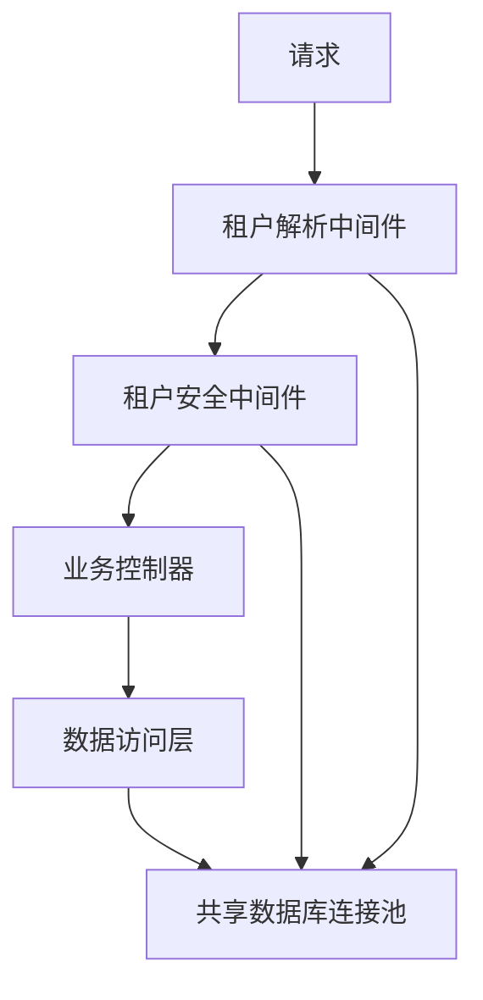
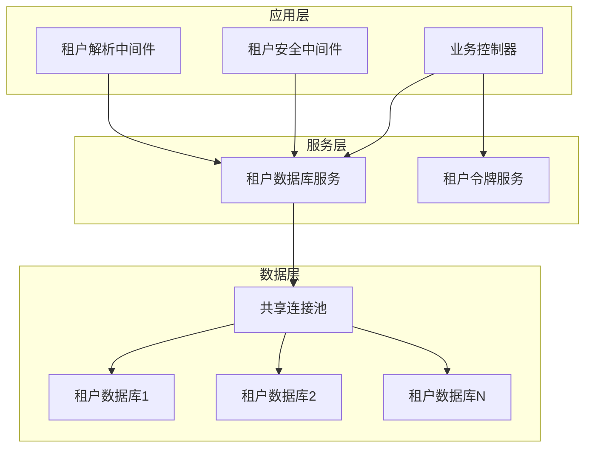
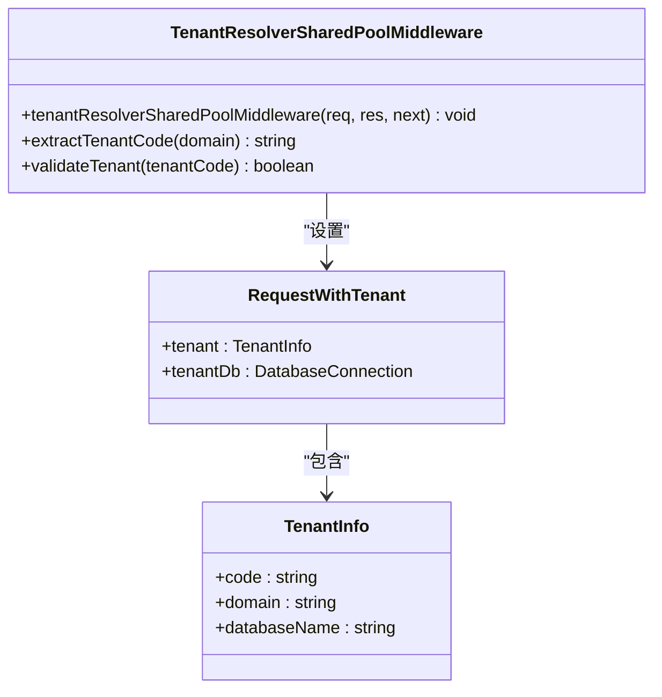
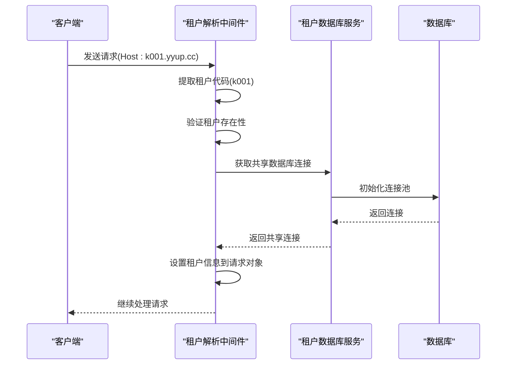
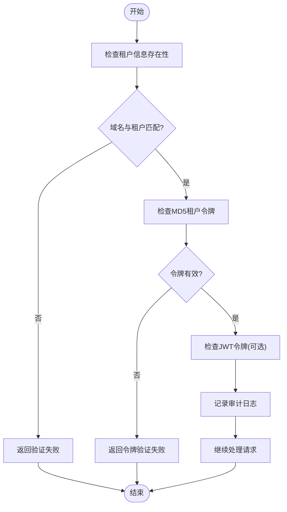
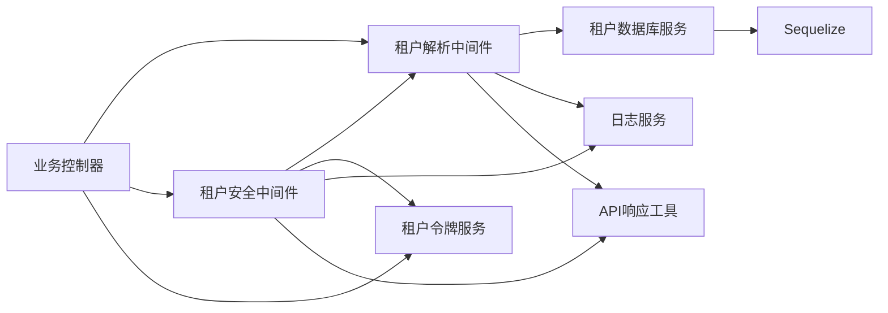

# 上下文传播

<cite>
**本文档引用的文件**   
- [tenant-resolver-shared-pool.middleware.ts](file://tenant-resolver-shared-pool.middleware.ts)
- [tenant-database-shared-pool.service.ts](file://tenant-database-shared-pool.service.ts)
- [k.yyup.com/server/src/middlewares/tenant-resolver.middleware.ts](file://k.yyup.com/server/src/middlewares/tenant-resolver.middleware.ts)
- [k.yyup.com/server/src/middlewares/tenant-security.middleware.ts](file://k.yyup.com/server/src/middlewares/tenant-security.middleware.ts)
- [k.yyup.com/server/src/services/tenant-database.service.ts](file://k.yyup.com/server/src/services/tenant-database.service.ts)
- [k.yyup.com/server/src/controllers/tenant-token.controller.ts](file://k.yyup.com/server/src/controllers/tenant-token.controller.ts)
</cite>

## 目录
1. [引言](#引言)
2. [项目结构](#项目结构)
3. [核心组件](#核心组件)
4. [架构概述](#架构概述)
5. [详细组件分析](#详细组件分析)
6. [依赖分析](#依赖分析)
7. [性能考虑](#性能考虑)
8. [故障排除指南](#故障排除指南)
9. [结论](#结论)

## 引言
本文档详细介绍了k.yyupgame项目中租户上下文传播机制的实现。重点阐述了如何在请求生命周期内保持租户信息的一致性，特别是在`tenant-resolver-shared-pool.middleware.ts`和`tenant.middleware.ts`之间的数据流转。文档解释了租户上下文如何被注入到后续的业务逻辑处理中，确保所有数据库操作和服务调用都能正确关联到当前租户。同时描述了上下文传播过程中的异常处理机制，以及如何在各层安全地获取和使用租户上下文。

## 项目结构
项目采用分层架构，租户相关的核心逻辑主要分布在中间件、服务和控制器三个层级。通过共享连接池的方式，实现了高效的租户隔离和资源利用。

**图示来源**
- [tenant-resolver-shared-pool.middleware.ts](file://tenant-resolver-shared-pool.middleware.ts#L26-L92)
- [k.yyup.com/server/src/middlewares/tenant-security.middleware.ts](file://k.yyup.com/server/src/middlewares/tenant-security.middleware.ts#L27-L142)

**章节来源**
- [tenant-resolver-shared-pool.middleware.ts](file://tenant-resolver-shared-pool.middleware.ts#L1-L142)
- [k.yyup.com/server/src/middlewares/tenant-resolver.middleware.ts](file://k.yyup.com/server/src/middlewares/tenant-resolver.middleware.ts#L1-L224)

## 核心组件
本项目的核心组件包括租户解析中间件、租户安全中间件、租户数据库服务和租户令牌控制器。这些组件协同工作，确保租户上下文在整个请求处理链路中的一致性和安全性。

**章节来源**
- [tenant-resolver-shared-pool.middleware.ts](file://tenant-resolver-shared-pool.middleware.ts#L26-L92)
- [k.yyup.com/server/src/middlewares/tenant-security.middleware.ts](file://k.yyup.com/server/src/middlewares/tenant-security.middleware.ts#L27-L142)
- [tenant-database-shared-pool.service.ts](file://tenant-database-shared-pool.service.ts#L9-L172)

## 架构概述
系统采用共享连接池的租户隔离架构，所有租户共享一个数据库连接池，通过完整表名访问不同租户的数据。这种设计既保证了租户间的数据隔离，又避免了为每个租户维护独立连接池的资源开销。

**图示来源**
- [tenant-database-shared-pool.service.ts](file://tenant-database-shared-pool.service.ts#L9-L172)
- [k.yyup.com/server/src/services/tenant-database.service.ts](file://k.yyup.com/server/src/services/tenant-database.service.ts#L30-L367)

## 详细组件分析
### 租户解析中间件分析
租户解析中间件负责从请求中提取租户信息，并将其存储在请求对象中供后续处理使用。

#### 租户解析中间件类图

**图示来源**
- [tenant-resolver-shared-pool.middleware.ts](file://tenant-resolver-shared-pool.middleware.ts#L26-L92)
- [k.yyup.com/server/src/middlewares/tenant-resolver.middleware.ts](file://k.yyup.com/server/src/middlewares/tenant-resolver.middleware.ts#L25-L113)

#### 租户解析流程序列图

**图示来源**
- [tenant-resolver-shared-pool.middleware.ts](file://tenant-resolver-shared-pool.middleware.ts#L26-L92)
- [tenant-database-shared-pool.service.ts](file://tenant-database-shared-pool.service.ts#L15-L55)

**章节来源**
- [tenant-resolver-shared-pool.middleware.ts](file://tenant-resolver-shared-pool.middleware.ts#L1-L142)
- [k.yyup.com/server/src/middlewares/tenant-resolver.middleware.ts](file://k.yyup.com/server/src/middlewares/tenant-resolver.middleware.ts#L1-L224)

### 租户安全中间件分析
租户安全中间件负责验证租户上下文的完整性和安全性，防止租户数据泄露和越权访问。

#### 租户安全验证流程

**图示来源**
- [k.yyup.com/server/src/middlewares/tenant-security.middleware.ts](file://k.yyup.com/server/src/middlewares/tenant-security.middleware.ts#L27-L142)
- [k.yyup.com/server/src/controllers/tenant-token.controller.ts](file://k.yyup.com/server/src/controllers/tenant-token.controller.ts#L34-L89)

**章节来源**
- [k.yyup.com/server/src/middlewares/tenant-security.middleware.ts](file://k.yyup.com/server/src/middlewares/tenant-security.middleware.ts#L1-L270)
- [k.yyup.com/server/src/controllers/tenant-token.controller.ts](file://k.yyup.com/server/src/controllers/tenant-token.controller.ts#L1-L310)

## 依赖分析
系统各组件之间的依赖关系清晰，形成了一个完整的租户上下文传播链。

**图示来源**
- [tenant-resolver-shared-pool.middleware.ts](file://tenant-resolver-shared-pool.middleware.ts#L6-L9)
- [k.yyup.com/server/src/middlewares/tenant-security.middleware.ts](file://k.yyup.com/server/src/middlewares/tenant-security.middleware.ts#L6-L9)
- [k.yyup.com/server/src/services/tenant-database.service.ts](file://k.yyup.com/server/src/services/tenant-database.service.ts#L11-L12)

**章节来源**
- [tenant-resolver-shared-pool.middleware.ts](file://tenant-resolver-shared-pool.middleware.ts#L1-L142)
- [k.yyup.com/server/src/middlewares/tenant-security.middleware.ts](file://k.yyup.com/server/src/middlewares/tenant-security.middleware.ts#L1-L270)
- [k.yyup.com/server/src/services/tenant-database.service.ts](file://k.yyup.com/server/src/services/tenant-database.service.ts#L1-L370)

## 性能考虑
系统采用共享连接池架构，有效降低了数据库连接的开销。全局连接池默认配置为5-30个连接，可以根据实际负载进行调整。通过完整表名访问不同租户的数据库，避免了频繁切换数据库的开销。

**章节来源**
- [tenant-database-shared-pool.service.ts](file://tenant-database-shared-pool.service.ts#L20-L35)
- [k.yyup.com/server/src/services/tenant-database.service.ts](file://k.yyup.com/server/src/services/tenant-database.service.ts#L36-L41)

## 故障排除指南
当遇到租户上下文相关问题时，可以按照以下步骤进行排查：

1. 检查请求的Host头是否正确
2. 确认租户代码是否符合命名规范(k001格式)
3. 验证租户数据库是否存在
4. 检查共享连接池是否正常初始化
5. 确认租户令牌是否有效且未过期

**章节来源**
- [tenant-resolver-shared-pool.middleware.ts](file://tenant-resolver-shared-pool.middleware.ts#L44-L69)
- [k.yyup.com/server/src/middlewares/tenant-security.middleware.ts](file://k.yyup.com/server/src/middlewares/tenant-security.middleware.ts#L34-L64)
- [k.yyup.com/server/src/controllers/tenant-token.controller.ts](file://k.yyup.com/server/src/controllers/tenant-token.controller.ts#L96-L152)

## 结论
k.yyupgame项目的租户上下文传播机制设计合理，通过中间件链实现了租户信息的提取、验证和传播。共享连接池的架构既保证了租户间的数据隔离，又提高了资源利用率。配合MD5租户令牌的安全验证机制，有效防止了租户数据泄露和越权访问的风险。开发者在使用时应遵循最佳实践，确保租户上下文的一致性和安全性。