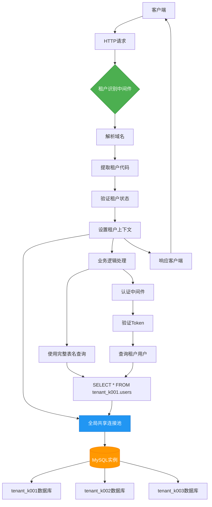

# 多租户架构模式

<cite>
**本文档引用的文件**  
- [tenant-resolver-shared-pool.middleware.ts](file://tenant-resolver-shared-pool.middleware.ts)
- [tenant-database-shared-pool.service.ts](file://tenant-database-shared-pool.service.ts)
- [auth-shared-pool-example.middleware.ts](file://auth-shared-pool-example.middleware.ts)
- [database-initialization.ts](file://database-initialization.ts)
- [k.yyup.com/server/src/middlewares/tenant-resolver.middleware.ts](file://k.yyup.com/server/src/middlewares/tenant-resolver.middleware.ts)
- [k.yyup.com/server/src/services/tenant-database.service.ts](file://k.yyup.com/server/src/services/tenant-database.service.ts)
</cite>

## 目录
1. [架构概述](#架构概述)
2. [数据库模式选择](#数据库模式选择)
3. [租户识别机制](#租户识别机制)
4. [租户上下文传播](#租户上下文传播)
5. [数据库连接池管理](#数据库连接池管理)
6. [多租户系统架构图](#多租户系统架构图)
7. [开发者最佳实践](#开发者最佳实践)
8. [总结](#总结)

## 架构概述

k.yyupgame 采用共享数据库-分离Schema的多租户架构模式，所有租户共享一个MySQL实例，但每个租户拥有独立的数据库Schema（如tenant_k001、tenant_k002）。该架构通过全局共享连接池实现高效的数据库连接管理，避免了为每个租户维护独立连接池的资源开销。

系统通过域名识别租户，支持k001.yyup.cc等子域名格式，并通过统一认证系统验证租户的有效性和激活状态。在请求处理过程中，租户信息被注入到请求上下文中，并在整个请求生命周期中保持一致。

**Section sources**
- [tenant-resolver-shared-pool.middleware.ts](file://tenant-resolver-shared-pool.middleware.ts#L1-L142)
- [tenant-database-shared-pool.service.ts](file://tenant-database-shared-pool.service.ts#L1-L177)

## 数据库模式选择

k.yyupgame 采用**共享数据库-分离Schema模式**而非独立数据库模式。在这种模式下，所有租户共享同一个MySQL实例，但每个租户拥有独立的数据库Schema，命名格式为`tenant_{租户代码}`（如tenant_k001）。

### 技术考量

选择该模式主要基于以下技术考量：

1. **资源效率**：共享连接池显著降低了数据库连接的总体开销。系统配置了5-30个连接的全局连接池，避免了为每个租户维护独立连接池导致的连接数爆炸。
2. **运维简化**：数据库备份、监控、性能调优等运维操作可以在单个MySQL实例上统一进行，降低了管理复杂度。
3. **成本控制**：避免了独立数据库模式下每个租户都需要独立数据库实例的高昂成本。
4. **弹性扩展**：新租户的创建只需创建新的Schema，无需配置新的数据库实例或连接池。

### 业务需求

该模式满足了以下业务需求：

1. **快速租户开通**：新幼儿园（租户）可以快速开通服务，系统自动创建对应的数据库Schema。
2. **数据隔离**：通过Schema级别的隔离，确保不同租户的数据完全分离，满足数据安全和隐私要求。
3. **统一管理**：支持统一的租户管理中心，可以跨租户进行统计分析和运营监控。
4. **开发测试便利**：开发环境可以轻松模拟多个租户场景，便于测试多租户功能。

**Section sources**
- [tenant-database-shared-pool.service.ts](file://tenant-database-shared-pool.service.ts#L1-L177)
- [k.yyup.com/server/src/services/tenant-database.service.ts](file://k.yyup.com/server/src/services/tenant-database.service.ts#L1-L370)

## 租户识别机制

系统通过HTTP请求的Host头或域名来识别当前租户，实现了无侵入式的租户识别。

### 域名识别规则

系统支持以下域名格式来提取租户代码：

- `k001.yyup.cc` → 租户代码：k001
- `tenant1.kindergarten.com` → 租户代码：tenant1
- `k002.kyyup.com` → 租户代码：k002

### 实现流程

租户识别的实现流程如下：

1. **获取域名**：从HTTP请求的`Host`头或`hostname`属性获取完整域名。
2. **提取租户代码**：使用正则表达式解析域名，提取租户代码部分。
3. **验证租户**：调用统一租户中心API验证租户是否存在且处于激活状态。
4. **设置上下文**：将租户信息（代码、域名、数据库名）设置到请求对象中。

```typescript
function extractTenantCode(domain: string): string | null {
  const cleanDomain = domain.split(':')[0];
  const match = cleanDomain.match(/^(k\d+)\.yyup\.cc$/);
  if (match) {
    return match[1];
  }
  const altMatch = cleanDomain.match(/^([a-zA-Z0-9]+)\.(kindergarten|kyyup)\.com$/);
  if (altMatch) {
    return altMatch[1];
  }
  return null;
}
```

在生产环境中，无法识别的域名将返回错误响应；在开发环境中，系统提供默认配置以方便测试。

**Section sources**
- [tenant-resolver-shared-pool.middleware.ts](file://tenant-resolver-shared-pool.middleware.ts#L103-L119)
- [k.yyup.com/server/src/middlewares/tenant-resolver.middleware.ts](file://k.yyup.com/server/src/middlewares/tenant-resolver.middleware.ts#L120-L138)

## 租户上下文传播

系统通过Express框架的请求对象（Request）在请求生命周期中传播租户上下文，确保在整个请求处理过程中租户信息的一致性。

### 上下文结构

租户上下文包含以下关键信息：

- `code`：租户代码（如k001）
- `domain`：请求域名
- `databaseName`：租户数据库名称（如tenant_k001）

### 传播机制

1. **中间件注入**：租户识别中间件在请求处理早期阶段执行，将租户信息注入到`req.tenant`对象中。
2. **数据库连接绑定**：同时将共享的全局数据库连接绑定到`req.tenantDb`属性。
3. **后续中间件和路由使用**：后续的认证、业务逻辑等中间件和路由处理器可以直接访问`req.tenant`和`req.tenantDb`。

这种机制确保了：
- 租户信息在单个请求中全局可用
- 避免了在函数参数中显式传递租户信息
- 提高了代码的可读性和可维护性
- 减少了因租户信息传递错误导致的安全风险

**Section sources**
- [tenant-resolver-shared-pool.middleware.ts](file://tenant-resolver-shared-pool.middleware.ts#L14-L21)
- [k.yyup.com/server/src/middlewares/tenant-resolver.middleware.ts](file://k.yyup.com/server/src/middlewares/tenant-resolver.middleware.ts#L18-L20)

## 数据库连接池管理

系统采用全局共享连接池策略，所有租户共享同一个数据库连接池，实现了高效的连接复用和资源管理。

### 连接池配置

连接池的关键配置参数：

- **最大连接数**：30（可通过`DB_POOL_MAX`环境变量配置）
- **最小连接数**：5（可通过`DB_POOL_MIN`环境变量配置）
- **获取连接超时**：30秒
- **空闲连接超时**：10秒

### 管理策略

1. **单例模式**：`TenantDatabaseService`以单例模式运行，确保整个应用只有一个全局连接池。
2. **延迟初始化**：连接池在首次请求时初始化，避免应用启动时的长时间等待。
3. **健康检查**：提供健康检查接口，定期验证连接池的可用性。
4. **优雅关闭**：在应用关闭时，正确释放所有数据库连接。

### 连接复用机制

系统通过"完整表名"的方式实现连接复用：
- 所有查询使用完整的数据库.表名格式，如`tenant_k001.users`
- 同一个数据库连接可以访问不同租户的Schema
- 避免了为每个租户维护独立连接的开销

这种策略在保证数据隔离的同时，最大化了连接的利用率，特别适合租户数量多但单个租户并发量不高的场景。

**Section sources**
- [tenant-database-shared-pool.service.ts](file://tenant-database-shared-pool.service.ts#L20-L36)
- [k.yyup.com/server/src/services/tenant-database.service.ts](file://k.yyup.com/server/src/services/tenant-database.service.ts#L36-L41)

## 多租户系统架构图



**Diagram sources**
- [tenant-resolver-shared-pool.middleware.ts](file://tenant-resolver-shared-pool.middleware.ts#L26-L97)
- [tenant-database-shared-pool.service.ts](file://tenant-database-shared-pool.service.ts#L9-L67)
- [auth-shared-pool-example.middleware.ts](file://auth-shared-pool-example.middleware.ts#L19-L135)

## 开发者最佳实践

### 中间件使用

开发者应使用预定义的租户识别中间件，确保租户上下文的正确初始化：

```typescript
import { tenantResolverMiddleware } from './middlewares/tenant-resolver.middleware';

app.use(tenantResolverMiddleware);
```

对于不需要强制租户识别的路由，可以使用可选的租户中间件：

```typescript
import { optionalTenantResolverMiddleware } from './middlewares/tenant-resolver.middleware';

app.get('/public/info', optionalTenantResolverMiddleware, publicInfoController);
```

### 服务层的租户感知实现

在服务层实现中，应通过`req.tenantDb`访问数据库，并使用完整表名：

```typescript
// ✅ 正确做法：使用完整表名
const [users] = await req.tenantDb.query(
  `SELECT * FROM tenant_${req.tenant.code}.users WHERE status = ?`,
  { replacements: ['active'] }
);

// ❌ 错误做法：直接使用表名
// const users = await User.findAll({ where: { status: 'active' } });
```

### 跨租户访问控制

系统默认禁止跨租户数据访问，开发者必须遵守以下原则：

1. **严格使用租户上下文**：所有数据库查询必须基于当前请求的租户上下文。
2. **避免硬编码租户信息**：不要在代码中硬编码租户代码或数据库名。
3. **特殊跨租户操作需授权**：如需实现跨租户功能（如集团报表），必须通过专门的API和严格的权限控制。

### 错误处理

正确处理租户相关的错误情况：

```typescript
if (!req.tenant) {
  return ApiResponse.error(res, '租户信息缺失', 'MISSING_TENANT_INFO');
}

if (!req.tenantDb) {
  return ApiResponse.error(res, '数据库连接失败', 'DB_CONNECTION_FAILED');
}
```

**Section sources**
- [auth-shared-pool-example.middleware.ts](file://auth-shared-pool-example.middleware.ts#L63-L77)
- [k.yyup.com/server/src/services/tenant-database.service.ts](file://k.yyup.com/server/src/services/tenant-database.service.ts#L174-L176)

## 总结

k.yyupgame的多租户架构通过共享数据库-分离Schema模式，在数据隔离、资源效率和运维成本之间取得了良好平衡。系统通过域名识别租户，利用全局共享连接池实现高效的连接管理，并通过请求上下文传播租户信息。

该架构特别适合教育行业SaaS应用的特点：租户数量较多（幼儿园）、单个租户并发量适中、需要快速开通和统一管理。通过完整表名的查询方式，系统在共享连接池的基础上实现了租户间的数据隔离，既保证了安全性，又提高了资源利用率。

未来可考虑的优化方向包括：实现连接池的动态伸缩、增加租户级别的连接配额控制、以及更精细化的数据库性能监控。

**Section sources**
- [tenant-resolver-shared-pool.middleware.ts](file://tenant-resolver-shared-pool.middleware.ts#L1-L142)
- [tenant-database-shared-pool.service.ts](file://tenant-database-shared-pool.service.ts#L1-L177)
- [database-initialization.ts](file://database-initialization.ts#L1-L89)