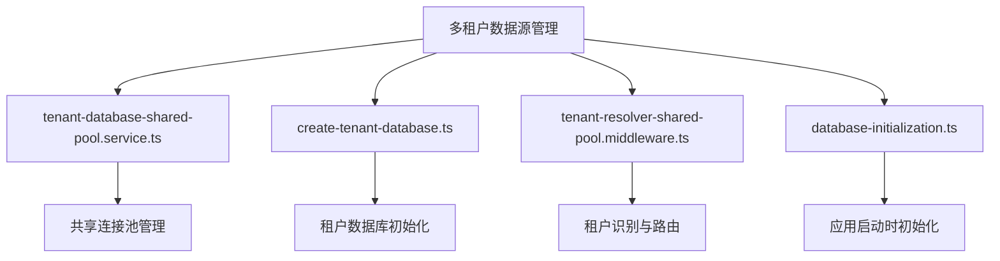
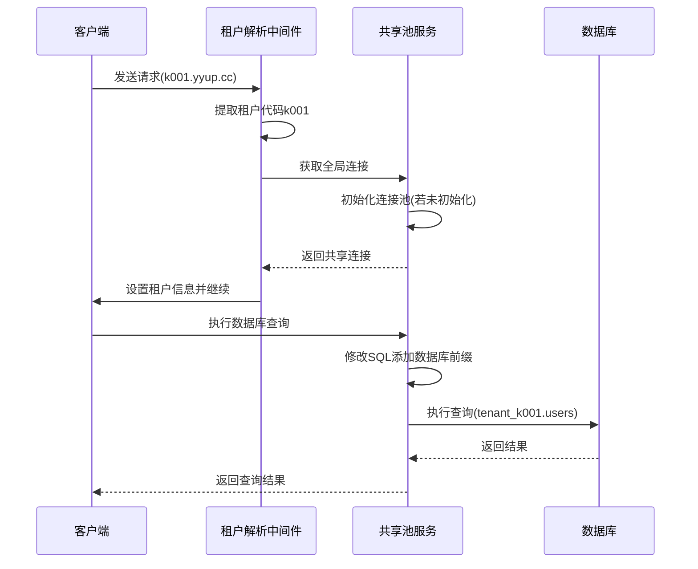
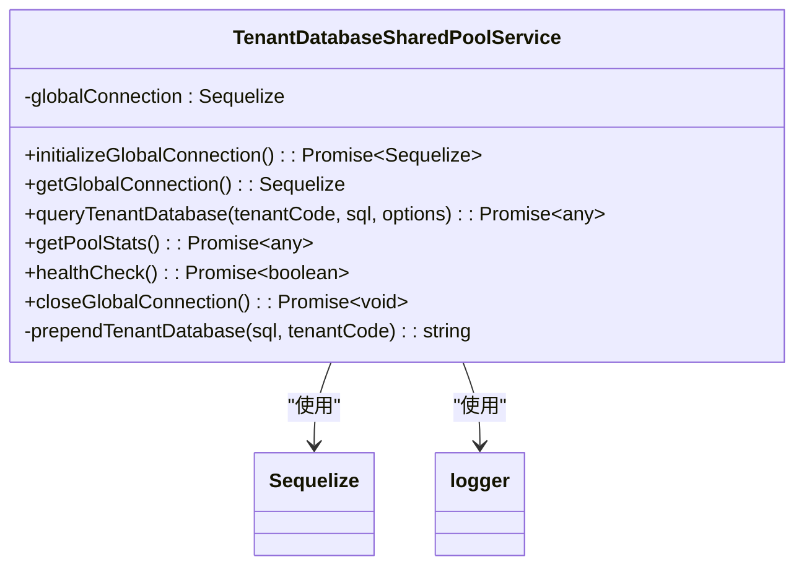
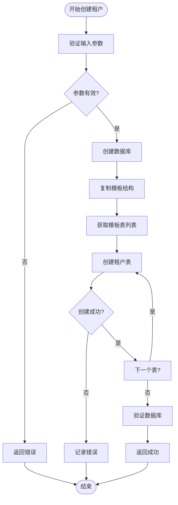
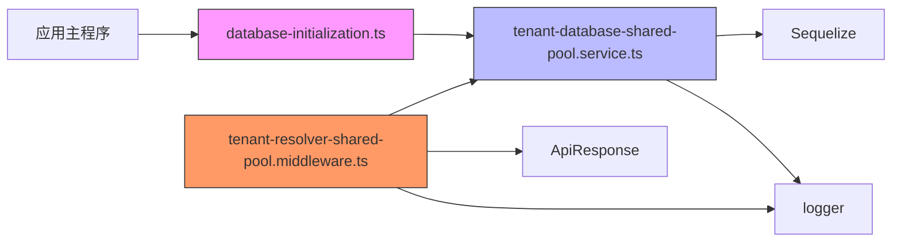
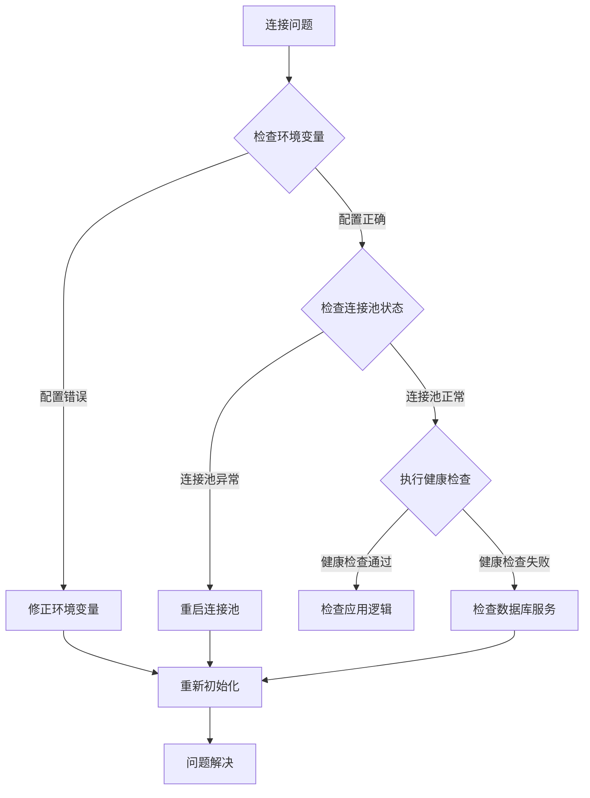

# 数据源管理

<cite>
**本文档引用的文件**
- [tenant-database-shared-pool.service.ts](file://tenant-database-shared-pool.service.ts)
- [create-tenant-database.ts](file://k.yyup.com/create-tenant-database.ts)
- [tenant-resolver-shared-pool.middleware.ts](file://tenant-resolver-shared-pool.middleware.ts)
- [database-initialization.ts](file://database-initialization.ts)
</cite>

## 目录
1. [引言](#引言)
2. [项目结构](#项目结构)
3. [核心组件](#核心组件)
4. [架构概述](#架构概述)
5. [详细组件分析](#详细组件分析)
6. [依赖分析](#依赖分析)
7. [性能考虑](#性能考虑)
8. [故障排除指南](#故障排除指南)
9. [结论](#结论)

## 引言
本文档详细介绍了k.yyupgame项目中多租户数据源管理的实现机制，重点阐述了租户数据库连接池的设计与实现。文档涵盖了共享连接池服务的管理机制、租户数据库初始化流程、连接池性能优化策略以及高并发场景下的稳定性保障措施。通过本指南，开发者可以深入了解系统如何高效管理多个租户的数据库连接，并掌握最佳实践。

## 项目结构
项目采用模块化设计，将多租户数据源管理功能分散在多个核心文件中。主要组件包括共享连接池服务、租户解析中间件、数据库初始化脚本和租户创建工具。

**Diagram sources**
- [tenant-database-shared-pool.service.ts](file://tenant-database-shared-pool.service.ts#L1-L177)
- [create-tenant-database.ts](file://k.yyup.com/create-tenant-database.ts#L1-L165)
- [tenant-resolver-shared-pool.middleware.ts](file://tenant-resolver-shared-pool.middleware.ts#L1-L142)
- [database-initialization.ts](file://database-initialization.ts#L1-L89)

**Section sources**
- [tenant-database-shared-pool.service.ts](file://tenant-database-shared-pool.service.ts#L1-L177)
- [create-tenant-database.ts](file://k.yyup.com/create-tenant-database.ts#L1-L165)

## 核心组件
系统的核心是`TenantDatabaseSharedPoolService`类，它实现了共享连接池模式，所有租户共享同一个数据库连接池。该服务通过完整的表名访问不同租户的数据库，避免了为每个租户维护独立连接池的资源开销。

**Section sources**
- [tenant-database-shared-pool.service.ts](file://tenant-database-shared-pool.service.ts#L9-L173)

## 架构概述
系统采用共享连接池架构，所有租户共用一个全局数据库连接池。当请求到达时，租户解析中间件根据域名识别租户，并将对应的数据库连接附加到请求对象上。这种设计既保证了租户间的数据隔离，又最大限度地利用了数据库连接资源。

**Diagram sources**
- [tenant-database-shared-pool.service.ts](file://tenant-database-shared-pool.service.ts#L9-L173)
- [tenant-resolver-shared-pool.middleware.ts](file://tenant-resolver-shared-pool.middleware.ts#L26-L97)

## 详细组件分析

### 共享连接池服务分析
`TenantDatabaseSharedPoolService`实现了单例模式的全局连接池管理，提供连接的创建、复用和销毁功能。

#### 连接池管理机制

**Diagram sources**
- [tenant-database-shared-pool.service.ts](file://tenant-database-shared-pool.service.ts#L9-L173)

**Section sources**
- [tenant-database-shared-pool.service.ts](file://tenant-database-shared-pool.service.ts#L9-L173)

#### 租户数据库初始化流程

**Diagram sources**
- [create-tenant-database.ts](file://k.yyup.com/create-tenant-database.ts#L27-L165)

**Section sources**
- [create-tenant-database.ts](file://k.yyup.com/create-tenant-database.ts#L1-L165)

## 依赖分析
系统各组件之间存在明确的依赖关系，形成了清晰的调用链路。

**Diagram sources**
- [database-initialization.ts](file://database-initialization.ts#L6-L89)
- [tenant-database-shared-pool.service.ts](file://tenant-database-shared-pool.service.ts#L6-L177)
- [tenant-resolver-shared-pool.middleware.ts](file://tenant-resolver-shared-pool.middleware.ts#L7-L142)

**Section sources**
- [database-initialization.ts](file://database-initialization.ts#L1-L89)

## 性能考虑
系统在设计时充分考虑了性能优化，通过多种机制确保连接池的高效运行。

### 连接池配置参数
| 参数 | 默认值 | 说明 |
|------|--------|------|
| 最大连接数(DB_POOL_MAX) | 30 | 连接池中允许的最大连接数量 |
| 最小连接数(DB_POOL_MIN) | 5 | 连接池中保持的最小空闲连接数 |
| 获取连接超时(acquire) | 30000ms | 从池中获取连接的最大等待时间 |
| 空闲连接超时(idle) | 10000ms | 连接在池中保持空闲的最大时间 |

### 健康检查机制
系统定期执行健康检查，确保连接池的可用性。`healthCheck()`方法会尝试验证数据库连接，如果失败则记录错误日志，便于及时发现和解决问题。

**Section sources**
- [tenant-database-shared-pool.service.ts](file://tenant-database-shared-pool.service.ts#L141-L153)

## 故障排除指南
当遇到数据库连接相关问题时，可以按照以下步骤进行排查：

1. **检查环境变量配置**：确保`DB_HOST`、`DB_PORT`、`DB_USER`、`DB_PASSWORD`等环境变量正确设置
2. **验证连接池状态**：调用`getPoolStats()`方法检查连接池的活跃和空闲连接数
3. **执行健康检查**：调用`healthCheck()`方法验证数据库连接的可用性
4. **查看日志信息**：检查应用日志中是否有数据库连接相关的错误信息

**Section sources**
- [tenant-database-shared-pool.service.ts](file://tenant-database-shared-pool.service.ts#L141-L153)
- [database-initialization.ts](file://database-initialization.ts#L13-L41)

## 结论
本项目通过共享连接池机制实现了高效的多租户数据源管理。`TenantDatabaseSharedPoolService`提供了稳定的连接池管理功能，`create-tenant-database.ts`脚本简化了租户数据库的初始化过程，而`tenant-resolver-shared-pool.middleware.ts`则实现了无缝的租户识别和路由。这种架构设计在保证数据隔离的同时，最大限度地优化了数据库连接资源的使用，为系统的高并发处理能力提供了坚实的基础。