# 租户识别

<cite>
**本文档引用的文件**
- [tenant-resolver-shared-pool.middleware.ts](file://tenant-resolver-shared-pool.middleware.ts)
- [tenant-database-shared-pool.service.ts](file://tenant-database-shared-pool.service.ts)
- [k.yyup.com/server/src/middlewares/tenant-resolver.middleware.ts](file://k.yyup.com/server/src/middlewares/tenant-resolver.middleware.ts)
- [k.yyup.com/server/src/middlewares/tenant-security.middleware.ts](file://k.yyup.com/server/src/middlewares/tenant-security.middleware.ts)
- [k.yyup.com/server/src/services/tenant-database.service.ts](file://k.yyup.com/server/src/services/tenant-database.service.ts)
- [k.yyup.com/server/src/services/tenant-token.service.ts](file://k.yyup.com/server/src/services/tenant-token.service.ts)
</cite>

## 目录
1. [项目结构](#项目结构)
2. [租户识别机制概述](#租户识别机制概述)
3. [租户解析中间件实现](#租户解析中间件实现)
4. [租户验证与数据库连接](#租户验证与数据库连接)
5. [租户安全验证机制](#租户安全验证机制)
6. [错误处理与HTTP状态码](#错误处理与http状态码)
7. [多租户环境下的请求路由](#多租户环境下的请求路由)
8. [租户识别中间件调用流程](#租户识别中间件调用流程)

## 项目结构

本项目采用多租户架构，核心租户识别相关文件位于项目根目录和k.yyup.com子目录中。主要包含租户解析中间件、数据库服务、安全验证等模块。

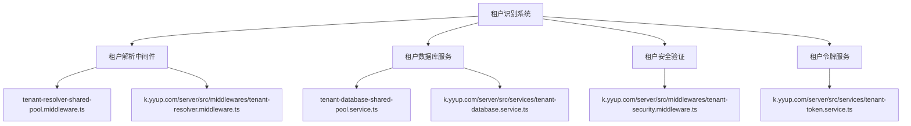

**图示来源**
- [tenant-resolver-shared-pool.middleware.ts](file://tenant-resolver-shared-pool.middleware.ts)
- [tenant-database-shared-pool.service.ts](file://tenant-database-shared-pool.service.ts)
- [k.yyup.com/server/src/middlewares/tenant-resolver.middleware.ts](file://k.yyup.com/server/src/middlewares/tenant-resolver.middleware.ts)
- [k.yyup.com/server/src/middlewares/tenant-security.middleware.ts](file://k.yyup.com/server/src/middlewares/tenant-security.middleware.ts)
- [k.yyup.com/server/src/services/tenant-database.service.ts](file://k.yyup.com/server/src/services/tenant-database.service.ts)
- [k.yyup.com/server/src/services/tenant-token.service.ts](file://k.yyup.com/server/src/services/tenant-token.service.ts)

**本节来源**
- [tenant-resolver-shared-pool.middleware.ts](file://tenant-resolver-shared-pool.middleware.ts)
- [tenant-database-shared-pool.service.ts](file://tenant-database-shared-pool.service.ts)

## 租户识别机制概述

本项目采用基于域名的租户识别机制，通过共享连接池模式实现多租户数据隔离。系统根据HTTP请求的Host头或域名来识别租户，支持多种域名格式的租户代码提取。

租户识别流程包括：
1. 从HTTP请求头或域名中提取租户标识符
2. 验证租户的有效性并与数据库记录匹配
3. 设置租户上下文信息
4. 建立数据库连接
5. 执行安全验证

系统支持两种主要的域名格式：
- `k001.yyup.cc` → 租户代码：k001
- `tenant1.kindergarten.com` → 租户代码：tenant1

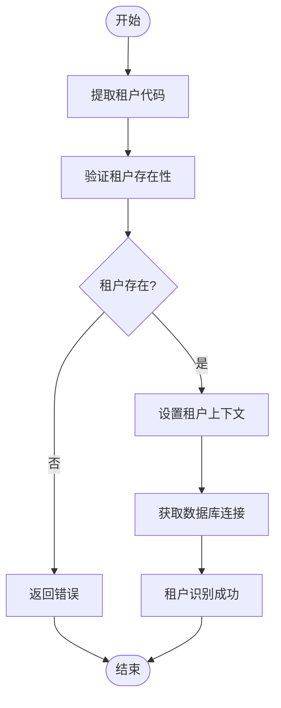

**图示来源**
- [tenant-resolver-shared-pool.middleware.ts](file://tenant-resolver-shared-pool.middleware.ts#L103-L119)
- [k.yyup.com/server/src/middlewares/tenant-resolver.middleware.ts](file://k.yyup.com/server/src/middlewares/tenant-resolver.middleware.ts#L120-L138)

**本节来源**
- [tenant-resolver-shared-pool.middleware.ts](file://tenant-resolver-shared-pool.middleware.ts)
- [k.yyup.com/server/src/middlewares/tenant-resolver.middleware.ts](file://k.yyup.com/server/src/middlewares/tenant-resolver.middleware.ts)

## 租户解析中间件实现

租户解析中间件负责从HTTP请求中提取租户标识符并进行初步验证。系统提供了两种实现方式：`tenant-resolver-shared-pool.middleware.ts`和`tenant-resolver.middleware.ts`，两者功能相似但位于不同位置。

### 租户代码提取逻辑

中间件通过正则表达式从域名中提取租户代码，支持以下格式：

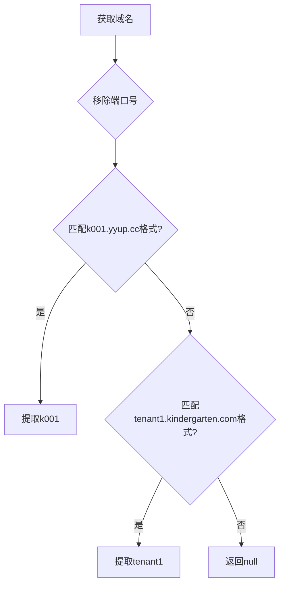

**图示来源**
- [tenant-resolver-shared-pool.middleware.ts](file://tenant-resolver-shared-pool.middleware.ts#L103-L119)
- [k.yyup.com/server/src/middlewares/tenant-resolver.middleware.ts](file://k.yyup.com/server/src/middlewares/tenant-resolver.middleware.ts#L120-L138)

### 租户解析流程

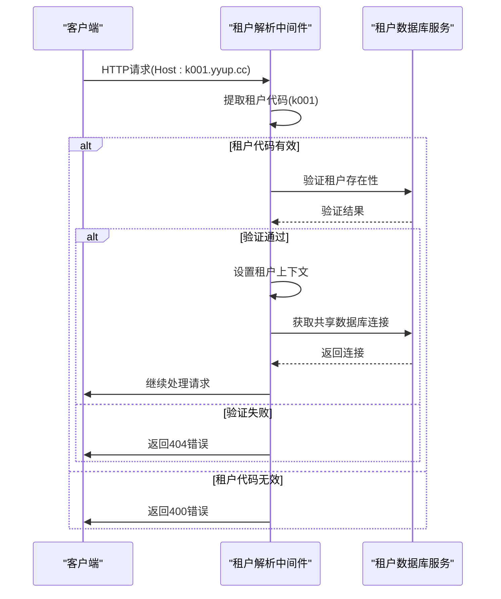

**图示来源**
- [tenant-resolver-shared-pool.middleware.ts](file://tenant-resolver-shared-pool.middleware.ts#L30-L96)
- [k.yyup.com/server/src/middlewares/tenant-resolver.middleware.ts](file://k.yyup.com/server/src/middlewares/tenant-resolver.middleware.ts#L25-L113)

**本节来源**
- [tenant-resolver-shared-pool.middleware.ts](file://tenant-resolver-shared-pool.middleware.ts)
- [k.yyup.com/server/src/middlewares/tenant-resolver.middleware.ts](file://k.yyup.com/server/src/middlewares/tenant-resolver.middleware.ts)

## 租户验证与数据库连接

### 租户验证机制

系统通过`validateTenant`函数验证租户的有效性。在生产环境中，该函数会调用统一租户中心API进行验证；在开发环境中，采用简化验证逻辑。

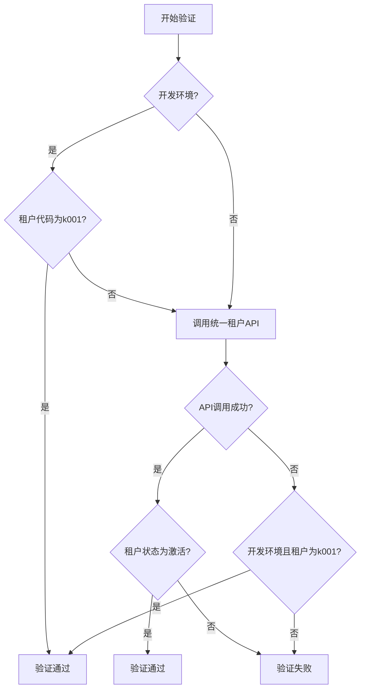

**图示来源**
- [tenant-resolver-shared-pool.middleware.ts](file://tenant-resolver-shared-pool.middleware.ts#L126-L137)
- [k.yyup.com/server/src/middlewares/tenant-resolver.middleware.ts](file://k.yyup.com/server/src/middlewares/tenant-resolver.middleware.ts#L144-L177)

### 数据库连接管理

系统采用共享连接池模式，所有租户共享一个全局数据库连接池。通过`tenantDatabaseSharedPoolService`服务管理连接。

```mermaid
classDiagram
class TenantDatabaseSharedPoolService {
-globalConnection : Sequelize
+initializeGlobalConnection() : Promise~Sequelize~
+getGlobalConnection() : Sequelize
+queryTenantDatabase(tenantCode, sql, options) : Promise~any~
+getPoolStats() : Promise~any~
+healthCheck() : Promise~boolean~
+closeGlobalConnection() : Promise~void~
}
class TenantDatabaseService {
-globalConnection : Sequelize
-isInitialized : boolean
-initPromise : Promise~Sequelize~
+initializeGlobalConnection() : Promise~Sequelize~
+getGlobalConnection() : Sequelize
+getTenantConnection(tenantCode) : Promise~Sequelize~
+getFullTableName(tenantCode, tableName) : string
+closeGlobalConnection() : Promise~void~
+getPoolStats() : Promise~PoolStats~
+healthCheck() : Promise~{healthy : boolean, details : any}~
}
TenantDatabaseSharedPoolService <|-- TenantDatabaseService : "继承"
```

**图示来源**
- [tenant-database-shared-pool.service.ts](file://tenant-database-shared-pool.service.ts)
- [k.yyup.com/server/src/services/tenant-database.service.ts](file://k.yyup.com/server/src/services/tenant-database.service.ts)

**本节来源**
- [tenant-resolver-shared-pool.middleware.ts](file://tenant-resolver-shared-pool.middleware.ts)
- [tenant-database-shared-pool.service.ts](file://tenant-database-shared-pool.service.ts)
- [k.yyup.com/server/src/middlewares/tenant-resolver.middleware.ts](file://k.yyup.com/server/src/middlewares/tenant-resolver.middleware.ts)
- [k.yyup.com/server/src/services/tenant-database.service.ts](file://k.yyup.com/server/src/services/tenant-database.service.ts)

## 租户安全验证机制

系统通过`tenant-security.middleware.ts`实现租户安全验证，防止数据泄露和越权访问。

### 安全验证流程

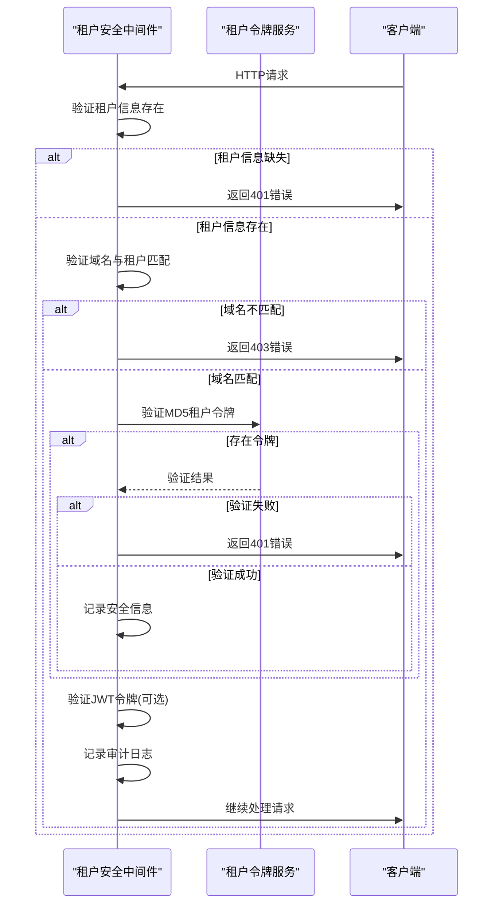

**图示来源**
- [k.yyup.com/server/src/middlewares/tenant-security.middleware.ts](file://k.yyup.com/server/src/middlewares/tenant-security.middleware.ts)

### 租户数据访问控制

系统通过`tenantDataAccessMiddleware`确保用户只能访问自己租户的数据，防止越权访问。

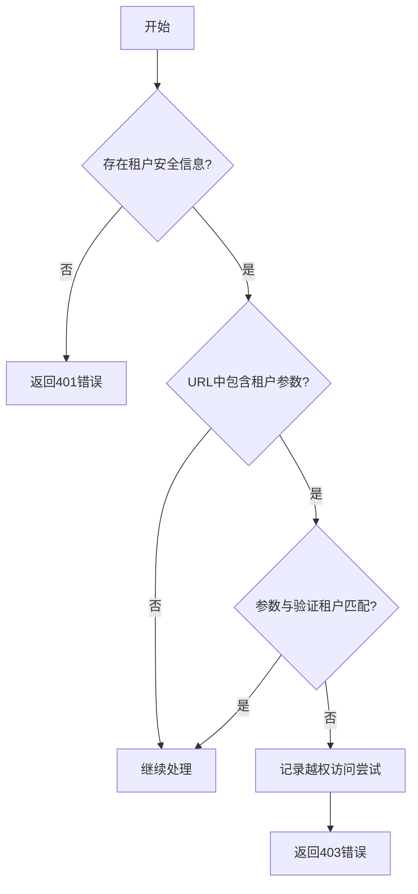

**图示来源**
- [k.yyup.com/server/src/middlewares/tenant-security.middleware.ts](file://k.yyup.com/server/src/middlewares/tenant-security.middleware.ts#L184-L222)

**本节来源**
- [k.yyup.com/server/src/middlewares/tenant-security.middleware.ts](file://k.yyup.com/server/src/middlewares/tenant-security.middleware.ts)

## 错误处理与HTTP状态码

系统定义了完整的错误处理机制，针对不同场景返回适当的HTTP状态码和错误信息。

### 错误类型与状态码

| 错误类型 | HTTP状态码 | 错误代码 | 错误信息 |
|---------|----------|---------|---------|
| 无法识别租户域名 | 400 | INVALID_TENANT_DOMAIN | 无法识别的租户域名 |
| 租户不存在或未激活 | 404 | TENANT_NOT_FOUND | 租户不存在或未激活 |
| 数据库连接失败 | 500 | DB_CONNECTION_FAILED | 数据库连接失败 |
| 租户验证失败 | 401 | TENANT_VALIDATION_FAILED | 租户验证失败 |
| 域名与租户不匹配 | 403 | DOMAIN_TENANT_MISMATCH | 域名与租户代码不匹配 |
| 租户令牌无效 | 401 | TENANT_TOKEN_INVALID | 租户令牌验证失败 |
| 数据访问被拒绝 | 403 | TENANT_DATA_ACCESS_DENIED | 无权访问此租户数据 |
| 租户解析失败 | 500 | TENANT_RESOLVER_ERROR | 租户解析失败 |

**本节来源**
- [tenant-resolver-shared-pool.middleware.ts](file://tenant-resolver-shared-pool.middleware.ts)
- [k.yyup.com/server/src/middlewares/tenant-resolver.middleware.ts](file://k.yyup.com/server/src/middlewares/tenant-resolver.middleware.ts)
- [k.yyup.com/server/src/middlewares/tenant-security.middleware.ts](file://k.yyup.com/server/src/middlewares/tenant-security.middleware.ts)

## 多租户环境下的请求路由

系统通过中间件链实现多租户环境下的请求正确分发。

### 请求处理流程

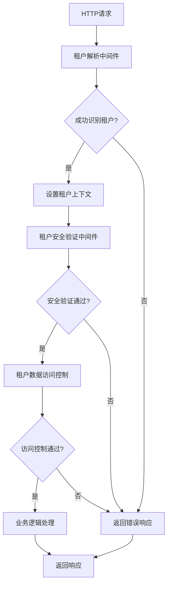

**图示来源**
- [tenant-resolver-shared-pool.middleware.ts](file://tenant-resolver-shared-pool.middleware.ts)
- [k.yyup.com/server/src/middlewares/tenant-resolver.middleware.ts](file://k.yyup.com/server/src/middlewares/tenant-resolver.middleware.ts)
- [k.yyup.com/server/src/middlewares/tenant-security.middleware.ts](file://k.yyup.com/server/src/middlewares/tenant-security.middleware.ts)

### 租户上下文传递

系统通过扩展Request对象实现租户上下文的传递：

```typescript
interface RequestWithTenant extends Request {
  tenant?: {
    code: string;
    domain: string;
    databaseName: string;
  };
  tenantDb?: any; // 共享的全局数据库连接
}
```

**本节来源**
- [tenant-resolver-shared-pool.middleware.ts](file://tenant-resolver-shared-pool.middleware.ts#L14-L21)
- [k.yyup.com/server/src/middlewares/tenant-resolver.middleware.ts](file://k.yyup.com/server/src/middlewares/tenant-resolver.middleware.ts#L18-L20)

## 租户识别中间件调用流程

### 中间件调用顺序

系统按照特定顺序调用租户识别相关中间件，确保请求处理的正确性和安全性。

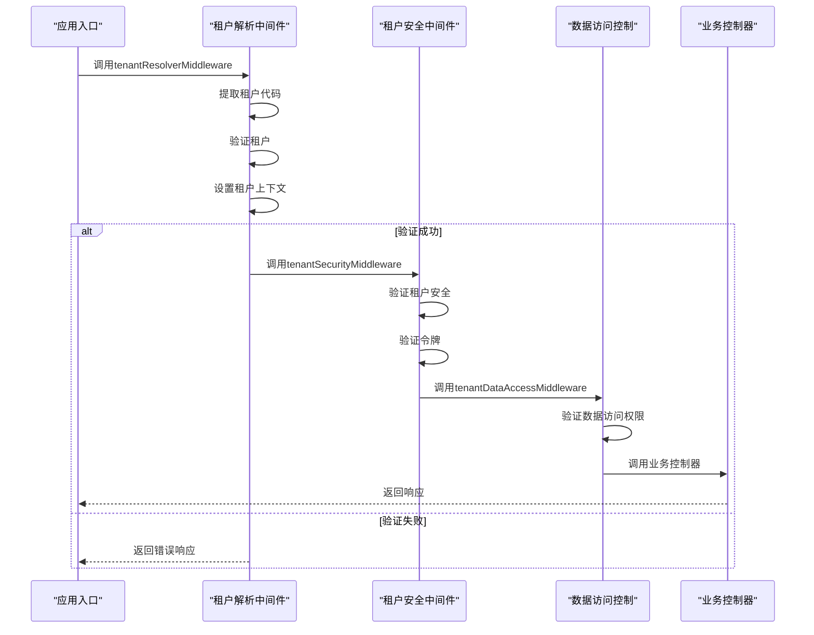

**图示来源**
- [tenant-resolver-shared-pool.middleware.ts](file://tenant-resolver-shared-pool.middleware.ts)
- [k.yyup.com/server/src/middlewares/tenant-resolver.middleware.ts](file://k.yyup.com/server/src/middlewares/tenant-resolver.middleware.ts)
- [k.yyup.com/server/src/middlewares/tenant-security.middleware.ts](file://k.yyup.com/server/src/middlewares/tenant-security.middleware.ts)

### 不同场景下的租户识别

#### API调用场景

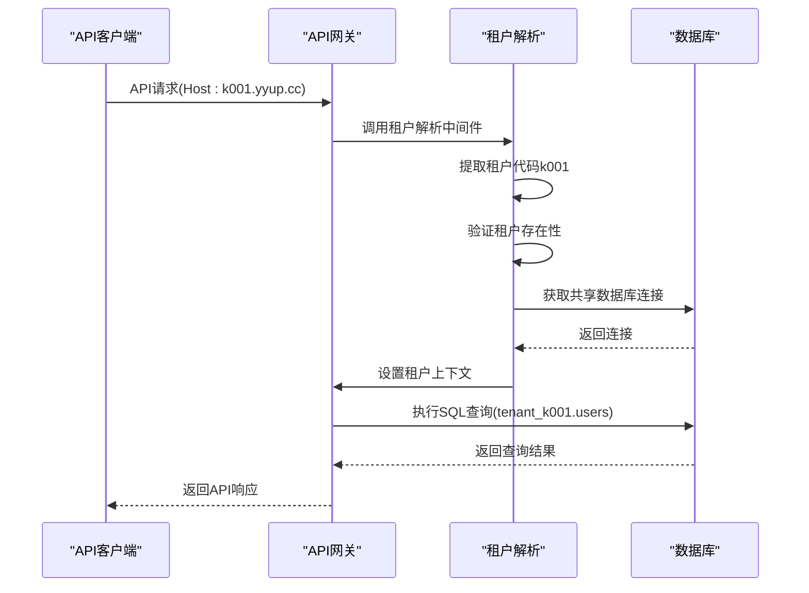

#### WebSocket连接场景

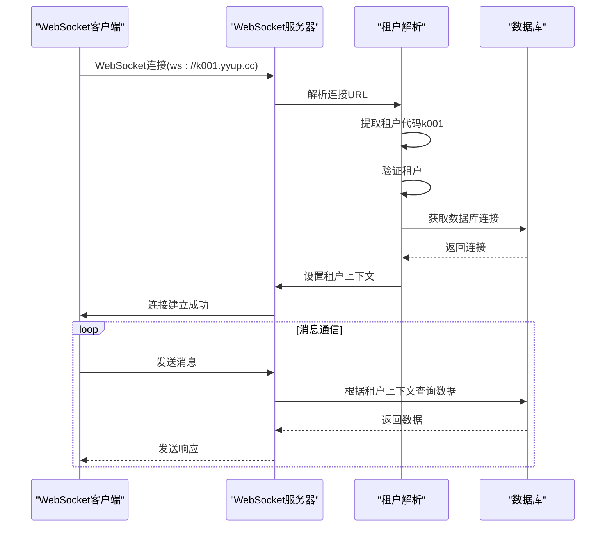

**图示来源**
- [tenant-resolver-shared-pool.middleware.ts](file://tenant-resolver-shared-pool.middleware.ts)
- [k.yyup.com/server/src/middlewares/tenant-resolver.middleware.ts](file://k.yyup.com/server/src/middlewares/tenant-resolver.middleware.ts)
- [tenant-database-shared-pool.service.ts](file://tenant-database-shared-pool.service.ts)

**本节来源**
- [tenant-resolver-shared-pool.middleware.ts](file://tenant-resolver-shared-pool.middleware.ts)
- [k.yyup.com/server/src/middlewares/tenant-resolver.middleware.ts](file://k.yyup.com/server/src/middlewares/tenant-resolver.middleware.ts)
- [tenant-database-shared-pool.service.ts](file://tenant-database-shared-pool.service.ts)