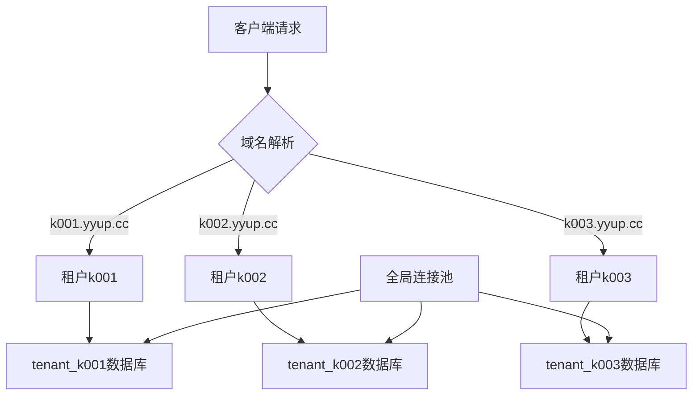
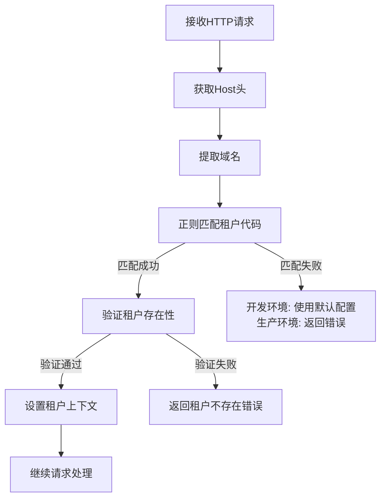
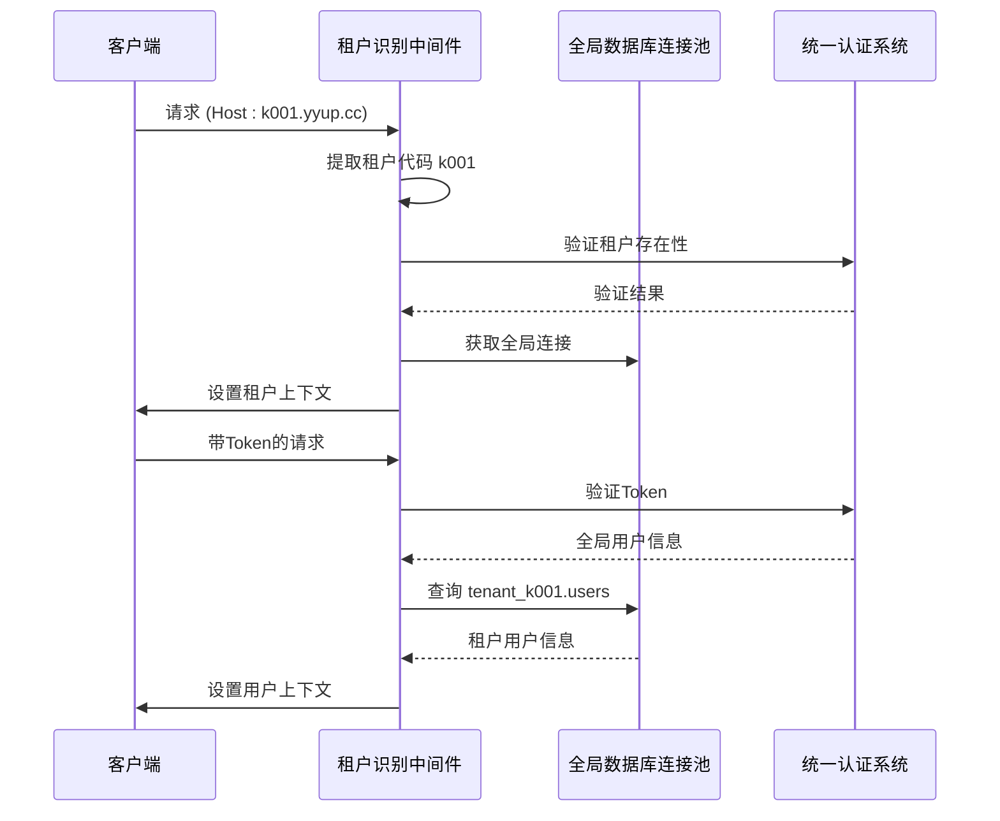
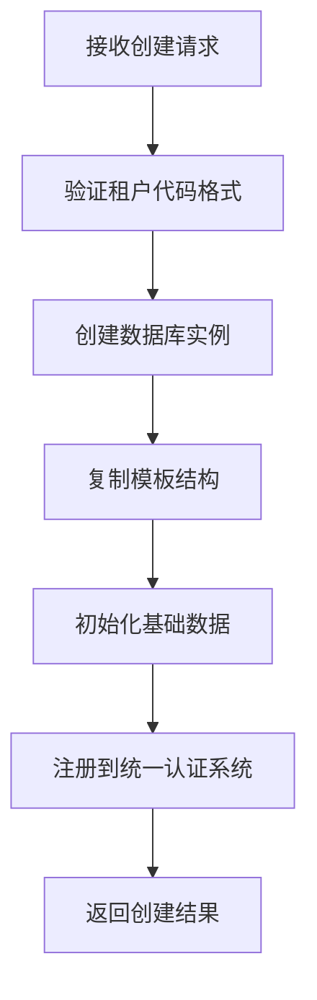

# 多租户系统

<cite>
**本文档引用的文件**  
- [tenant-database-shared-pool.service.ts](file://tenant-database-shared-pool.service.ts)
- [tenant-resolver-shared-pool.middleware.ts](file://tenant-resolver-shared-pool.middleware.ts)
- [auth-shared-pool-example.middleware.ts](file://auth-shared-pool-example.middleware.ts)
- [create-tenant-database.ts](file://k.yyup.com/create-tenant-database.ts)
- [check-tenant-databases.cjs](file://k.yyup.com/check-tenant-databases.cjs)
</cite>

## 目录
1. [引言](#引言)
2. [多租户架构设计](#多租户架构设计)
3. [租户识别机制](#租户识别机制)
4. [数据隔离方案](#数据隔离方案)
5. [租户配置管理](#租户配置管理)
6. [租户生命周期管理](#租户生命周期管理)
7. [开发者指南](#开发者指南)
8. [结论](#结论)

## 引言
本项目k.yyupgame采用先进的多租户系统架构，支持多个幼儿园实例的独立运行。系统通过域名识别不同租户，实现数据完全隔离，同时共享核心连接池资源以提高性能和可维护性。该架构设计旨在为教育机构提供安全、高效、可扩展的SaaS解决方案。

## 多租户架构设计
本系统采用**独立数据库模式**作为多租户架构的核心设计。每个租户拥有独立的数据库实例，数据库名称遵循`tenant_{租户代码}`的命名规范（如`tenant_k001`）。这种设计确保了最高级别的数据隔离和安全性。

系统通过共享连接池机制优化数据库资源使用。所有租户共享一个全局数据库连接池，该连接池连接到MySQL系统数据库，通过完整的数据库.表名格式访问各个租户的独立数据库。这种混合架构结合了独立数据库的数据隔离优势和共享连接池的资源效率优势。



**图示来源**  
- [tenant-database-shared-pool.service.ts](file://tenant-database-shared-pool.service.ts#L6-L177)
- [tenant-resolver-shared-pool.middleware.ts](file://tenant-resolver-shared-pool.middleware.ts#L6-L142)

## 租户识别机制
系统通过**域名**识别当前租户，采用多级匹配策略确保灵活性和兼容性。

### 域名识别规则
1. **标准格式**: `k{数字}.yyup.cc` → 提取`k{数字}`作为租户代码
   - 示例: `k001.yyup.cc` → 租户代码 `k001`
2. **备用格式**: `{代码}.(kindergarten|kyyup).com` → 提取`{代码}`作为租户代码
   - 示例: `abc.kindergarten.com` → 租户代码 `abc`

### 识别流程


租户识别由`tenant-resolver-shared-pool.middleware.ts`中间件实现，该中间件在请求处理链的早期阶段执行，确保后续所有操作都能访问正确的租户上下文。

**图示来源**  
- [tenant-resolver-shared-pool.middleware.ts](file://tenant-resolver-shared-pool.middleware.ts#L26-L97)

## 数据隔离方案
系统采用多层次的数据隔离策略，确保不同租户的数据完全独立且安全。

### 数据库级隔离
每个租户拥有独立的数据库实例，物理上完全隔离。数据库创建脚本`create-tenant-database.ts`从模板数据库`kargerdensales`复制完整的表结构，确保所有租户具有相同的基础架构。

### 查询级隔离
通过SQL语句预处理实现数据访问隔离。系统在执行SQL查询前，自动将表名替换为完整的数据库.表名格式：
- 原始SQL: `SELECT * FROM users`
- 处理后: `SELECT * FROM tenant_k001.users`

此功能由`TenantDatabaseSharedPoolService`类的`prependTenantDatabase`方法实现，支持常见的SQL操作（FROM、JOIN、INTO、UPDATE、DELETE FROM）。

### 认证与授权隔离
在用户认证过程中，系统同时验证全局用户身份和租户内用户身份：
1. 通过统一认证系统验证全局Token
2. 在租户数据库中查询对应的用户记录
3. 如果用户不存在，则自动创建租户内用户

这种双重验证机制确保了用户只能访问其所属租户的数据。



**图示来源**  
- [tenant-database-shared-pool.service.ts](file://tenant-database-shared-pool.service.ts#L68-L123)
- [auth-shared-pool-example.middleware.ts](file://auth-shared-pool-example.middleware.ts#L19-L255)

## 租户配置管理
系统支持租户特定的配置管理，包括主题、权限和个性化设置。

### 配置存储
租户配置存储在各自数据库的专用表中，与业务数据物理隔离。主要配置类型包括：
- **主题配置**: 界面颜色、logo、字体等UI相关设置
- **权限配置**: 基于角色的访问控制（RBAC）策略
- **业务配置**: 幼儿园特定的业务规则和流程

### 配置加载
配置在租户识别成功后自动加载到请求上下文中，供后续中间件和业务逻辑使用。系统支持配置的动态更新和缓存机制，确保高性能访问。

## 租户生命周期管理
系统提供完整的租户生命周期管理功能，包括创建、激活、停用和删除。

### 租户创建流程


租户创建由`create-tenant-database.ts`脚本实现，该脚本执行以下步骤：
1. 创建以`tenant_{租户代码}`命名的新数据库
2. 从`kargerdensales`模板数据库复制所有表结构
3. 执行验证检查确保数据库创建成功

### 状态管理
租户具有以下生命周期状态：
- **创建中**: 数据库正在初始化
- **已创建**: 数据库就绪但未激活
- **已激活**: 可正常访问
- **已停用**: 暂时不可访问
- **已删除**: 资源已清理

状态变更通过统一认证系统协调，确保所有服务组件同步更新。

**图示来源**  
- [create-tenant-database.ts](file://k.yyup.com/create-tenant-database.ts#L27-L165)
- [check-tenant-databases.cjs](file://k.yyup.com/check-tenant-databases.cjs#L3-L90)

## 开发者指南
本节为开发者提供多租户系统的工作原理和最佳实践。

### 处理租户上下文
在业务逻辑中访问租户上下文：
```typescript
// 从请求对象获取租户信息
const tenantCode = req.tenant?.code;
const databaseName = req.tenant?.databaseName;

// 使用共享连接执行查询
const result = await req.tenantDb.query(
  `SELECT * FROM ${databaseName}.users WHERE status = ?`,
  { replacements: ['active'] }
);
```

### 调试多租户问题
1. **检查租户识别**: 确认`req.tenant`对象是否正确设置
2. **验证数据库连接**: 检查`req.tenantDb`是否可用
3. **审查SQL语句**: 确保表名包含正确的数据库前缀
4. **查看日志**: 使用`[租户识别]`和`[数据库]`标签过滤相关日志

### 性能优化
1. **连接池配置**: 根据负载调整`DB_POOL_MAX`和`DB_POOL_MIN`环境变量
2. **查询优化**: 在租户数据库上为常用查询字段创建索引
3. **缓存策略**: 对静态配置数据实施缓存机制
4. **监控**: 定期检查连接池统计信息和数据库性能指标

### 安全注意事项
1. **SQL注入防护**: 始终使用参数化查询，避免字符串拼接
2. **租户边界**: 确保所有数据访问都包含租户上下文验证
3. **权限验证**: 在敏感操作前重新验证用户权限
4. **审计日志**: 记录关键操作的租户上下文信息

## 结论
k.yyupgame的多租户系统通过独立数据库模式实现了最高级别的数据隔离，同时利用共享连接池优化了资源使用效率。系统通过域名识别租户，采用自动化的数据库创建和配置机制，支持快速部署新的幼儿园实例。完善的租户生命周期管理和配置体系确保了系统的可维护性和可扩展性。该架构设计为教育SaaS平台提供了安全、稳定、高效的基础支撑。