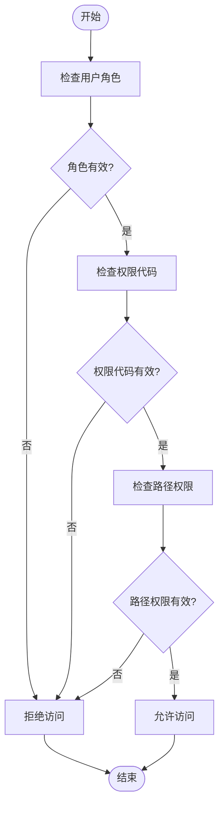
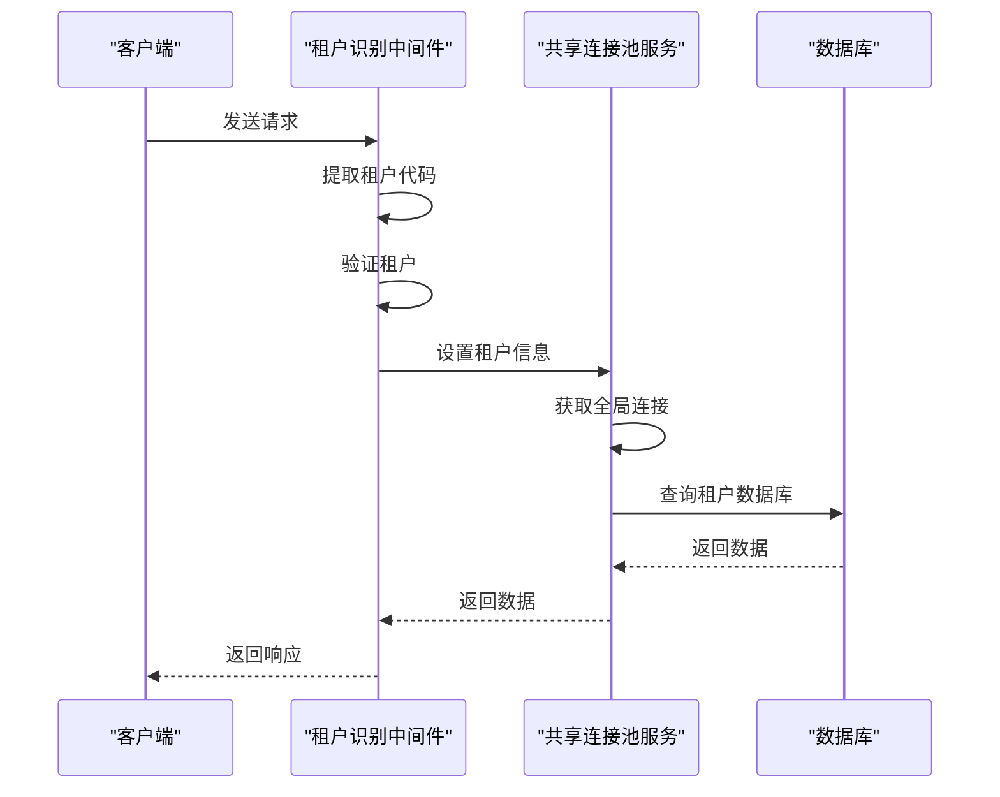
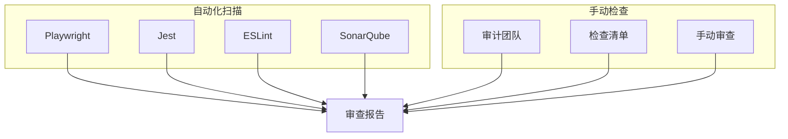
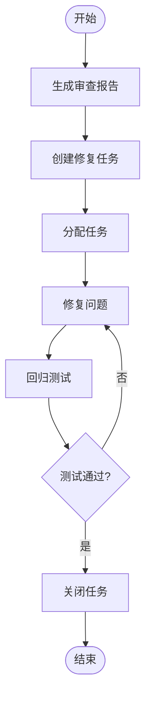

# 合规审查

<cite>
**本文档引用的文件**  
- [tenant-resolver-shared-pool.middleware.ts](file://tenant-resolver-shared-pool.middleware.ts)
- [tenant-database-shared-pool.service.ts](file://tenant-database-shared-pool.service.ts)
- [database-initialization.ts](file://database-initialization.ts)
- [permissions.ts](file://k.yyup.com/backup/permission-system/permissions.ts)
- [permission-cache.service.ts](file://k.yyup.com/backup/permission-system/permission-cache.service.ts)
- [permission-cache.controller.ts](file://k.yyup.com/backup/permission-system/permission-cache.controller.ts)
- [check-ai-usage-compliance.ts](file://k.yyup.com/server/scripts/check-ai-usage-compliance.ts)
</cite>

## 目录
1. [引言](#引言)
2. [合规审查流程](#合规审查流程)
3. [数据访问权限检查](#数据访问权限检查)
4. [租户间数据隔离验证](#租户间数据隔离验证)
5. [潜在数据泄漏风险识别](#潜在数据泄漏风险识别)
6. [审查工具与方法](#审查工具与方法)
7. [审查报告生成与跟踪](#审查报告生成与跟踪)
8. [审计团队最佳实践](#审计团队最佳实践)
9. [结论](#结论)

## 引言

k.yyupgame平台采用多租户架构，为不同幼儿园提供独立的数据隔离环境。为确保系统符合数据隔离要求，必须建立完善的合规审查机制。本文件详细描述了k.yyupgame的合规审查流程，包括数据访问权限检查、租户间数据隔离验证、潜在数据泄漏风险识别等方面。通过自动化扫描和手动检查相结合的方式，确保系统的安全性和合规性。

**Section sources**
- [tenant-resolver-shared-pool.middleware.ts](file://tenant-resolver-shared-pool.middleware.ts#L1-L142)

## 合规审查流程

k.yyupgame的合规审查流程分为定期审查和事件驱动审查两种模式。定期审查按月进行，事件驱动审查在系统重大变更后立即执行。审查流程包括准备、执行、报告和修复四个阶段。

审查准备阶段，审计团队确定审查范围和目标，准备审查工具和检查清单。执行阶段，通过自动化工具扫描系统，同时进行手动检查。报告阶段，生成详细的审查报告，包括发现的问题、风险等级和修复建议。修复阶段，跟踪问题修复进度，直至所有问题得到解决。

审查流程的关键是确保数据隔离的有效性，防止租户间数据泄漏。通过租户识别中间件和共享连接池服务，系统能够正确识别租户并隔离数据访问。

**Section sources**
- [tenant-resolver-shared-pool.middleware.ts](file://tenant-resolver-shared-pool.middleware.ts#L1-L142)
- [tenant-database-shared-pool.service.ts](file://tenant-database-shared-pool.service.ts#L1-L177)

## 数据访问权限检查

数据访问权限检查是合规审查的核心内容之一。系统通过权限管理机制确保用户只能访问其授权的数据。权限检查包括用户角色验证、权限代码验证和路径权限验证三个层次。

用户角色验证检查用户是否具有访问特定资源的角色。权限代码验证检查用户是否具有执行特定操作的权限代码。路径权限验证检查用户是否有访问特定路径的权限。这些验证通过权限缓存服务实现，提高检查效率。

**Diagram sources**
- [permissions.ts](file://k.yyup.com/backup/permission-system/permissions.ts#L1-L513)
- [permission-cache.service.ts](file://k.yyup.com/backup/permission-system/permission-cache.service.ts#L1-L572)

## 租户间数据隔离验证

租户间数据隔离验证确保不同租户的数据完全隔离，防止数据泄漏。系统通过租户识别中间件和共享连接池服务实现数据隔离。

租户识别中间件根据域名识别租户，设置租户信息到请求对象。共享连接池服务通过完整表名访问不同租户的数据库，确保数据隔离。验证过程包括租户识别测试、数据库连接测试和数据访问测试。

**Diagram sources**
- [tenant-resolver-shared-pool.middleware.ts](file://tenant-resolver-shared-pool.middleware.ts#L1-L142)
- [tenant-database-shared-pool.service.ts](file://tenant-database-shared-pool.service.ts#L1-L177)

## 潜在数据泄漏风险识别

潜在数据泄漏风险识别是合规审查的重要环节。系统通过静态代码分析、动态行为监控和日志审计等方式识别潜在风险。

静态代码分析检查代码中是否存在硬编码的敏感信息、不安全的API调用等。动态行为监控检查运行时是否存在异常的数据访问模式。日志审计检查系统日志中是否存在可疑的操作记录。

风险识别的关键是建立全面的检查清单，覆盖所有可能的风险点。通过自动化工具扫描代码库，结合手动审查，确保不遗漏任何潜在风险。

**Section sources**
- [check-ai-usage-compliance.ts](file://k.yyup.com/server/scripts/check-ai-usage-compliance.ts#L1-L100)

## 审查工具与方法

k.yyupgame采用自动化扫描和手动检查相结合的审查方法。自动化扫描使用Playwright、Jest等工具进行端到端测试和单元测试。手动检查由审计团队进行，重点关注自动化工具难以覆盖的复杂场景。

审查工具包括：
- Playwright：用于端到端测试，模拟用户操作
- Jest：用于单元测试，验证单个函数的正确性
- ESLint：用于代码质量检查，发现潜在问题
- SonarQube：用于代码分析，评估代码质量

**Diagram sources**
- [check-ai-usage-compliance.ts](file://k.yyup.com/server/scripts/check-ai-usage-compliance.ts#L1-L100)

## 审查报告生成与跟踪

审查报告生成与跟踪机制确保发现的问题得到及时修复。审查报告包括问题描述、风险等级、修复建议和修复状态。

报告生成后，通过Jira等项目管理工具创建任务，分配给相关开发人员。审计团队定期跟踪任务进度，确保问题在规定时间内修复。修复完成后，进行回归测试，验证问题是否真正解决。

**Diagram sources**
- [permission-cache.controller.ts](file://k.yyup.com/backup/permission-system/permission-cache.controller.ts#L1-L390)

## 审计团队最佳实践

为确保合规审查的有效性，审计团队应遵循以下最佳实践：

1. **审查频率**：每月进行一次全面审查，重大变更后进行专项审查
2. **检查清单**：建立全面的检查清单，覆盖所有可能的风险点
3. **报告模板**：使用标准化的报告模板，确保报告的一致性和完整性
4. **工具使用**：熟练掌握各种审查工具，提高审查效率
5. **团队协作**：加强团队协作，分享审查经验和最佳实践

通过遵循这些最佳实践，审计团队能够更有效地发现和解决潜在问题，确保系统的安全性和合规性。

**Section sources**
- [permission-cache.controller.ts](file://k.yyup.com/backup/permission-system/permission-cache.controller.ts#L1-L390)

## 结论

k.yyupgame通过完善的合规审查机制，确保系统的安全性和合规性。通过定期的安全审计，检查数据访问权限的正确性，验证租户间数据隔离的有效性，识别潜在的数据泄漏风险。采用自动化扫描和手动检查相结合的方法，提高审查效率和覆盖率。通过审查报告生成与跟踪机制，确保发现的问题得到及时修复。审计团队遵循最佳实践，不断提高审查能力，为系统的安全稳定运行提供有力保障。