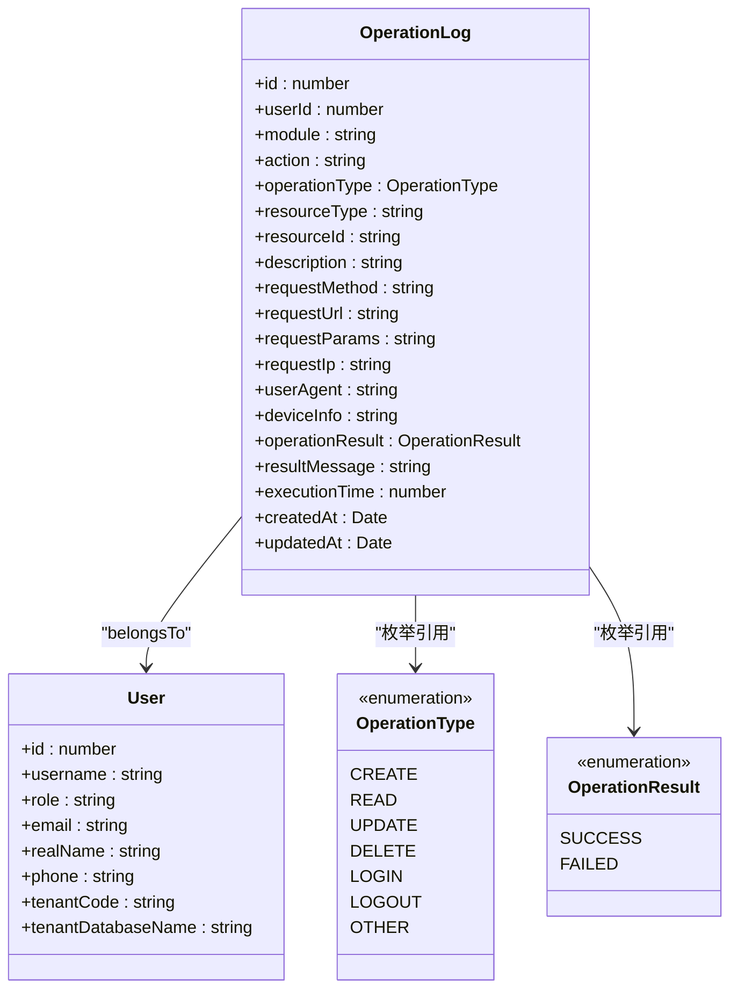
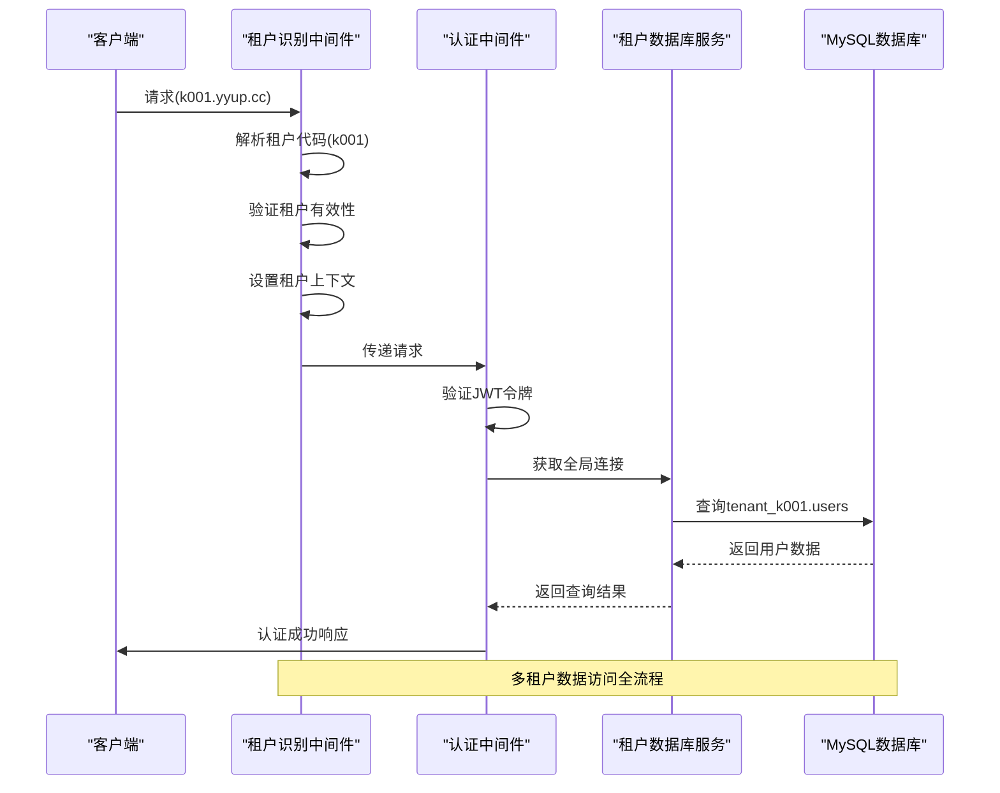
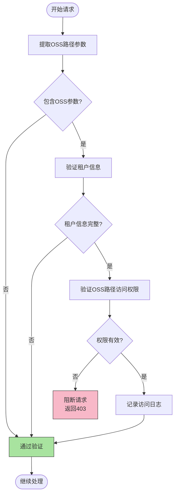
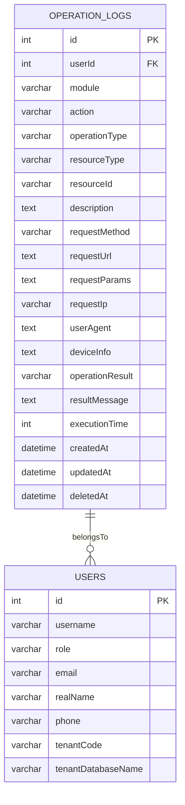

# 安全审计与监控

<cite>
**本文档引用的文件**  
- [audit-log.middleware.ts](file://k.yyup.com/server/src/middlewares/audit-log.middleware.ts)
- [operation-log.model.ts](file://k.yyup.com/server/src/models/operation-log.model.ts)
- [auth.middleware.ts](file://k.yyup.com/server/src/middlewares/auth.middleware.ts)
- [oss-security.middleware.ts](file://k.yyup.com/server/src/middlewares/oss-security.middleware.ts)
- [data-import-security.middleware.ts](file://k.yyup.com/server/src/middlewares/data-import-security.middleware.ts)
- [logger.ts](file://k.yyup.com/server/src/utils/logger.ts)
- [tenant-resolver-shared-pool.middleware.ts](file://tenant-resolver-shared-pool.middleware.ts)
- [tenant-database-shared-pool.service.ts](file://tenant-database-shared-pool.service.ts)
</cite>

## 目录
1. [安全审计日志机制](#安全审计日志机制)
2. [多租户环境下的数据访问监控](#多租户环境下的数据访问监控)
3. [异常访问检测与实时告警](#异常访问检测与实时告警)
4. [审计日志的存储与访问控制](#审计日志的存储与访问控制)
5. [定期安全审计流程](#定期安全审计流程)
6. [安全监控最佳实践](#安全监控最佳实践)

## 安全审计日志机制

本系统通过 `audit-log.middleware.ts` 实现全面的安全审计日志记录机制。该中间件自动捕获所有关键操作，包括数据访问、修改和删除等行为。

审计日志记录的关键操作包括：
- **创建操作**：POST 请求，如新增用户、创建班级等
- **读取操作**：GET 请求，如查询学生信息、获取通知等
- **更新操作**：PUT/PATCH 请求，如修改用户资料、更新活动信息等
- **删除操作**：DELETE 请求，如删除相册、移除家长等
- **登录操作**：用户认证和会话管理

日志中包含的租户相关信息包括：
- **租户代码**（tenantCode）：通过域名解析获取，如 k001.yyup.cc
- **用户ID**（userId）：当前操作用户的唯一标识
- **操作时间**：精确到毫秒的时间戳，包含 createdAt 和 updatedAt 字段
- **全局用户ID**（globalUserId）：统一认证系统中的用户标识

审计日志还记录了丰富的上下文信息：
- 请求方法（requestMethod）和请求URL（requestUrl）
- 请求参数（query、body、params）
- 客户端IP地址（requestIp）和用户代理（userAgent）
- 操作执行时间（executionTime）
- 操作结果（operationResult）和结果消息（resultMessage）

**图表来源**
- [operation-log.model.ts](file://k.yyup.com/server/src/models/operation-log.model.ts#L15-L32)
- [audit-log.middleware.ts](file://k.yyup.com/server/src/middlewares/audit-log.middleware.ts#L10-L185)

**本节来源**
- [audit-log.middleware.ts](file://k.yyup.com/server/src/middlewares/audit-log.middleware.ts#L1-L185)
- [operation-log.model.ts](file://k.yyup.com/server/src/models/operation-log.model.ts#L1-L179)

## 多租户环境下的数据访问监控

系统通过租户识别中间件和数据库连接池服务实现多租户环境下的数据访问监控。`tenant-resolver-shared-pool.middleware.ts` 负责根据请求域名识别租户，而 `tenant-database-shared-pool.service.ts` 管理共享的数据库连接池。

租户识别流程如下：
1. 从请求头中的 Host 字段提取域名
2. 通过正则表达式解析租户代码（如 k001.yyup.cc → k001）
3. 验证租户是否存在且已激活
4. 将租户信息注入请求对象

数据访问隔离通过以下机制实现：
- **完整表名查询**：在 SQL 查询中使用 `tenant_k001.users` 这样的完整表名格式
- **共享连接池**：所有租户共享一个数据库连接池，但通过数据库前缀实现逻辑隔离
- **租户上下文**：在请求对象中维护租户代码、数据库名称等信息

**图表来源**
- [tenant-resolver-shared-pool.middleware.ts](file://tenant-resolver-shared-pool.middleware.ts#L26-L96)
- [tenant-database-shared-pool.service.ts](file://tenant-database-shared-pool.service.ts#L9-L176)
- [auth.middleware.ts](file://k.yyup.com/server/src/middlewares/auth.middleware.ts#L142-L369)

**本节来源**
- [tenant-resolver-shared-pool.middleware.ts](file://tenant-resolver-shared-pool.middleware.ts#L1-L142)
- [tenant-database-shared-pool.service.ts](file://tenant-database-shared-pool.service.ts#L1-L177)
- [auth.middleware.ts](file://k.yyup.com/server/src/middlewares/auth.middleware.ts#L1-L1378)

## 异常访问检测与实时告警

系统实现了多层次的异常访问检测和实时告警机制。`oss-security.middleware.ts` 负责监控 OSS 资源访问，防止跨租户越权访问。

异常访问模式识别包括：
- **跨租户资源访问**：检测用户尝试访问其他租户的 OSS 资源
- **非法文件路径访问**：拦截对 `/rent/` 等敏感路径的访问尝试
- **手机号不匹配**：验证请求路径中的手机号与当前用户是否一致

实时告警和自动阻断机制：
- 当检测到越权访问时，立即返回 403 状态码阻止请求
- 记录详细的警告日志，包含用户手机号（部分掩码）、租户代码、IP 地址等信息
- 通过 `ApiResponse.error()` 统一返回标准化的错误响应

对于高风险操作，系统还实现了额外的安全检查：
- **数据导入安全中间件**：`data-import-security.middleware.ts` 对数据导入操作进行多层验证
- **风险等级评估**：基于记录数量和数据类型评估导入风险（低、中、高、严重）
- **权限检查**：批量导入超过 1000 条记录需要管理员权限
- **频率限制**：每小时最多导入 5 次，每天最多 20 次

**图表来源**
- [oss-security.middleware.ts](file://k.yyup.com/server/src/middlewares/oss-security.middleware.ts#L26-L208)
- [data-import-security.middleware.ts](file://k.yyup.com/server/src/middlewares/data-import-security.middleware.ts#L22-L261)

**本节来源**
- [oss-security.middleware.ts](file://k.yyup.com/server/src/middlewares/oss-security.middleware.ts#L1-L209)
- [data-import-security.middleware.ts](file://k.yyup.com/server/src/middlewares/data-import-security.middleware.ts#L1-L262)

## 审计日志的存储与访问控制

审计日志的存储和访问控制策略确保了日志本身的安全性和完整性。系统采用双重日志记录机制：

**数据库存储**：
- 使用 `OperationLog` 模型将审计日志持久化到 `operation_logs` 表
- 启用软删除（paranoid: true）防止日志被意外删除
- 所有字段都经过严格的数据类型和约束定义
- 通过 Sequelize ORM 实现安全的数据库操作

**文件系统存储**：
- 使用 `logger.ts` 工具同时将日志写入文件系统
- 日志文件按日期分割，格式为 `access-YYYY-MM-DD.log` 和 `error-YYYY-MM-DD.log`
- 日志目录自动创建，确保写入权限
- 每条日志包含时间戳和日志级别标识

访问控制策略：
- **最小权限原则**：只有管理员角色可以查询审计日志
- **操作追溯**：所有对审计日志的访问本身也会被记录
- **数据完整性**：日志一旦创建不可修改，只能通过软删除标记
- **加密传输**：日志数据在传输过程中使用 HTTPS 加密

日志轮转和归档：
- 每天创建新的日志文件，便于管理和归档
- 错误日志和访问日志分离存储，便于问题排查
- 日志条目包含完整的上下文信息，支持事后审计

**图表来源**
- [operation-log.model.ts](file://k.yyup.com/server/src/models/operation-log.model.ts#L62-L168)
- [logger.ts](file://k.yyup.com/server/src/utils/logger.ts#L1-L129)

**本节来源**
- [operation-log.model.ts](file://k.yyup.com/server/src/models/operation-log.model.ts#L1-L179)
- [logger.ts](file://k.yyup.com/server/src/utils/logger.ts#L1-L129)

## 定期安全审计流程

定期安全审计流程确保系统的数据隔离策略持续有效，并及时识别潜在的数据泄漏风险。

**数据隔离策略有效性检查**：
1. **租户边界验证**：定期检查是否存在跨租户数据访问的漏洞
2. **权限矩阵审查**：验证角色-权限映射是否符合最小权限原则
3. **数据库隔离测试**：通过自动化测试验证不同租户的数据完全隔离
4. **OSS访问控制测试**：模拟越权访问尝试，验证安全中间件的有效性

**数据泄漏风险识别**：
- **异常访问模式分析**：识别高频、异常时间或异常IP的访问模式
- **敏感操作监控**：重点关注数据导出、批量删除等高风险操作
- **权限变更审计**：跟踪权限分配和角色变更的历史记录
- **用户行为分析**：建立正常行为基线，检测偏离基线的异常行为

审计流程包括：
1. **自动化扫描**：每日运行安全扫描脚本，检查已知漏洞
2. **手动审查**：每月由安全团队进行深度代码审查
3. **渗透测试**：每季度聘请第三方进行渗透测试
4. **合规性检查**：确保符合相关法律法规和行业标准

审计报告包含：
- 发现的安全问题和风险等级
- 修复建议和优先级排序
- 历史问题的修复验证
- 安全态势的整体评估

**本节来源**
- [audit-log.middleware.ts](file://k.yyup.com/server/src/middlewares/audit-log.middleware.ts#L1-L185)
- [oss-security.middleware.ts](file://k.yyup.com/server/src/middlewares/oss-security.middleware.ts#L1-L209)
- [data-import-security.middleware.ts](file://k.yyup.com/server/src/middlewares/data-import-security.middleware.ts#L1-L262)

## 安全监控最佳实践

为安全团队提供以下监控多租户系统安全状态的最佳实践：

**关键监控指标**：
- **认证失败率**：监控登录失败的频率，识别暴力破解尝试
- **异常访问频率**：检测同一用户在短时间内对多个租户的访问
- **高风险操作计数**：跟踪数据导入、批量删除等操作的频率
- **权限变更频率**：监控角色和权限的变更频率，识别异常模式
- **OSS访问异常**：检测对敏感路径的访问尝试

**告警阈值设置**：
- **登录失败**：5分钟内连续5次失败触发告警
- **高频访问**：1小时内超过100次API调用触发告警
- **批量操作**：单次导入超过1000条记录需要二次确认
- **非工作时间访问**：夜间22:00-6:00的管理操作触发告警
- **异地登录**：检测IP地理位置突变的登录行为

**应急响应流程**：
1. **告警确认**：安全团队立即确认告警的真实性
2. **影响评估**：评估安全事件的影响范围和严重程度
3. **临时阻断**：必要时暂时阻断相关用户或IP的访问
4. **根源分析**：深入分析事件的根本原因
5. **修复实施**：部署修复措施并验证有效性
6. **事后复盘**：总结经验教训，完善防御机制

**安全监控工具集成**：
- **集中式日志分析**：将所有日志集成到统一的日志分析平台
- **实时仪表板**：创建实时安全态势仪表板，可视化关键指标
- **自动化响应**：配置自动化响应规则，如自动封禁恶意IP
- **定期报告**：生成每日、每周和每月的安全报告

**本节来源**
- [audit-log.middleware.ts](file://k.yyup.com/server/src/middlewares/audit-log.middleware.ts#L1-L185)
- [oss-security.middleware.ts](file://k.yyup.com/server/src/middlewares/oss-security.middleware.ts#L1-L209)
- [data-import-security.middleware.ts](file://k.yyup.com/server/src/middlewares/data-import-security.middleware.ts#L1-L262)
- [logger.ts](file://k.yyup.com/server/src/utils/logger.ts#L1-L129)