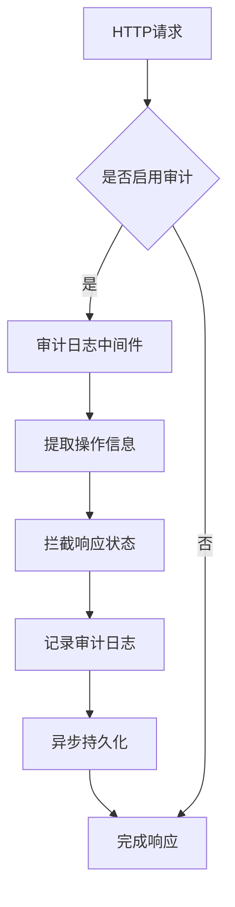
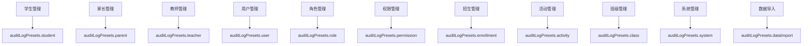
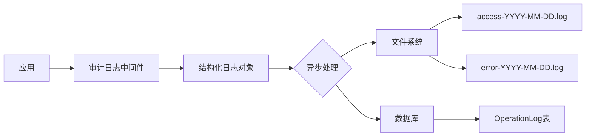
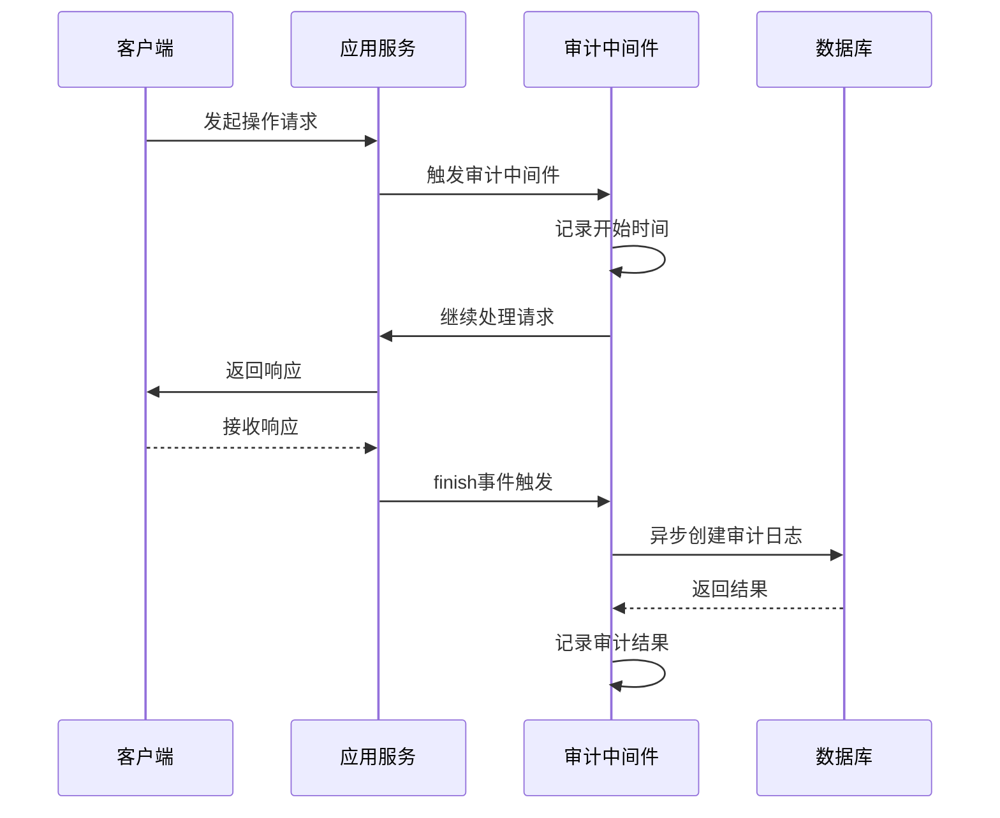
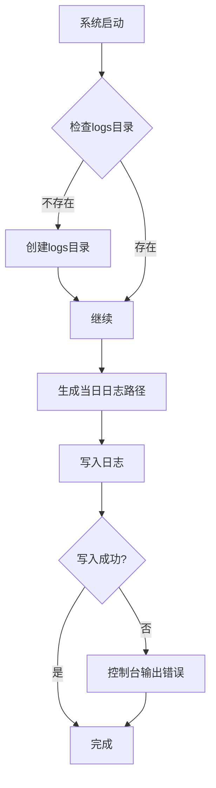

# 审计日志

<cite>
**本文档引用的文件**  
- [audit-log.middleware.ts](file://k.yyup.com/server/src/middlewares/audit-log.middleware.ts)
- [logger.ts](file://k.yyup.com/server/src/utils/logger.ts)
- [operation-log.model.ts](file://k.yyup.com/server/src/models/operation-log.model.ts)
- [tenant-resolver-shared-pool.middleware.ts](file://tenant-resolver-shared-pool.middleware.ts)
- [tenant-database-shared-pool.service.ts](file://tenant-database-shared-pool.service.ts)
</cite>

## 目录
1. [引言](#引言)
2. [审计日志机制概述](#审计日志机制概述)
3. [日志记录范围与敏感操作](#日志记录范围与敏感操作)
4. [日志内容结构与关键信息](#日志内容结构与关键信息)
5. [日志格式设计与存储策略](#日志格式设计与存储策略)
6. [日志完整性与防篡改机制](#日志完整性与防篡改机制)
7. [日志分级策略](#日志分级策略)
8. [日志轮转与归档机制](#日志轮转与归档机制)
9. [日志查询与分析](#日志查询与分析)
10. [日志监控最佳实践](#日志监控最佳实践)

## 引言
本文档详细描述了 k.yyupgame 系统在多租户环境下审计日志的实现机制。重点介绍系统如何自动记录关键操作日志，确保操作可追溯、安全合规，并为运维团队提供有效的监控和分析手段。

## 审计日志机制概述

k.yyupgame 采用基于中间件的自动化审计日志机制，通过 `audit-log.middleware.ts` 实现对所有关键操作的透明记录。该机制与多租户架构深度集成，能够准确识别租户上下文并记录相关操作。

**图示来源**  
- [audit-log.middleware.ts](file://k.yyup.com/server/src/middlewares/audit-log.middleware.ts#L68-L186)

**本节来源**  
- [audit-log.middleware.ts](file://k.yyup.com/server/src/middlewares/audit-log.middleware.ts#L1-L186)

## 日志记录范围与敏感操作

系统对以下类型的敏感操作进行自动审计记录：

- **数据创建（CREATE）**：通过 POST 请求创建新资源
- **数据读取（READ）**：通过 GET 请求访问敏感数据
- **数据更新（UPDATE）**：通过 PUT/PATCH 请求修改数据
- **数据删除（DELETE）**：通过 DELETE 请求删除数据
- **系统管理操作**：用户、角色、权限等关键配置变更
- **数据导入操作**：批量数据导入和处理

这些操作通过预设的审计日志中间件进行标记和记录：

**图示来源**  
- [audit-log.middleware.ts](file://k.yyup.com/server/src/middlewares/audit-log.middleware.ts#L173-L185)

**本节来源**  
- [audit-log.middleware.ts](file://k.yyup.com/server/src/middlewares/audit-log.middleware.ts#L173-L185)

## 日志内容结构与关键信息

每条审计日志包含以下关键信息字段，确保操作的完整可追溯性：

| 字段名称 | 类型 | 描述 |
|---------|------|------|
| userId | string | 执行操作的用户ID |
| module | string | 操作所属模块（如"学生管理"） |
| action | string | 操作动作（如"create"） |
| operationType | enum | 操作类型（CREATE/READ/UPDATE/DELETE） |
| resourceType | string | 资源类型 |
| resourceId | string | 操作资源的ID |
| description | string | 操作描述文本 |
| requestMethod | string | HTTP方法 |
| requestUrl | string | 请求URL |
| requestParams | json | 请求参数（query、body、params） |
| requestIp | string | 客户端IP地址 |
| userAgent | string | 用户代理信息 |
| deviceInfo | string | 设备信息 |
| operationResult | enum | 操作结果（SUCCESS/FAILED） |
| resultMessage | string | 结果消息或错误信息 |
| executionTime | number | 执行时间（毫秒） |
| tenantCode | string | 租户代码（通过上下文获取） |

**本节来源**  
- [audit-log.middleware.ts](file://k.yyup.com/server/src/middlewares/audit-log.middleware.ts#L122-L143)
- [operation-log.model.ts](file://k.yyup.com/server/src/models/operation-log.model.ts)

## 日志格式设计与存储策略

审计日志采用结构化存储设计，主要特点包括：

1. **多级存储架构**：
   - 实时访问日志：记录到 `access-{date}.log` 文件
   - 错误日志：记录到 `error-{date}.log` 文件
   - 持久化审计日志：存储在数据库的 `OperationLog` 表中

2. **文件存储路径**：
   - 日志目录：`logs/`（相对于项目根目录）
   - 文件命名：按日期分割（如 `access-2025-07-11.log`）

3. **数据库存储**：
   - 使用 Sequelize ORM 模型 `OperationLog` 进行持久化
   - 与租户数据库共享连接池，通过完整表名访问

**图示来源**  
- [audit-log.middleware.ts](file://k.yyup.com/server/src/middlewares/audit-log.middleware.ts#L120-L160)
- [logger.ts](file://k.yyup.com/server/src/utils/logger.ts#L1-L129)

**本节来源**  
- [audit-log.middleware.ts](file://k.yyup.com/server/src/middlewares/audit-log.middleware.ts)
- [logger.ts](file://k.yyup.com/server/src/utils/logger.ts)

## 日志完整性与防篡改机制

系统通过以下机制确保审计日志的完整性和不可篡改性：

1. **异步非阻塞记录**：使用 `setImmediate` 异步记录日志，避免影响主业务流程，同时确保日志记录的可靠性。

2. **错误重试机制**：当日志记录失败时，系统会在日志中记录错误信息，便于后续排查和补救。

3. **多副本存储**：日志同时写入文件系统和数据库，提供冗余备份。

4. **租户隔离**：通过租户识别中间件确保日志记录正确的租户上下文，防止跨租户日志混淆。

5. **最小权限原则**：只有特定服务账户才能访问审计日志数据，限制普通用户的访问权限。

**图示来源**  
- [audit-log.middleware.ts](file://k.yyup.com/server/src/middlewares/audit-log.middleware.ts#L110-L160)
- [tenant-resolver-shared-pool.middleware.ts](file://tenant-resolver-shared-pool.middleware.ts)

**本节来源**  
- [audit-log.middleware.ts](file://k.yyup.com/server/src/middlewares/audit-log.middleware.ts)
- [tenant-resolver-shared-pool.middleware.ts](file://tenant-resolver-shared-pool.middleware.ts)

## 日志分级策略

系统采用多级日志分级策略，不同级别日志的记录条件和用途如下：

| 日志级别 | 记录条件 | 用途 | 存储位置 |
|---------|---------|------|---------|
| INFO | 正常操作完成 | 记录成功操作、系统状态 | access.log |
| WARN | 非关键性问题 | 记录潜在问题、边界情况 | access.log |
| ERROR | 操作失败、异常 | 故障排查、错误分析 | error.log |
| DEBUG | 开发环境 | 详细调试信息 | access.log（仅开发环境） |
| API | 所有HTTP请求 | 性能监控、流量分析 | access.log |

日志级别通过不同的方法调用实现：
- `logger.info()`：信息日志
- `logger.warn()`：警告日志  
- `logger.error()`：错误日志
- `logger.debug()`：调试日志（仅非生产环境）
- `logger.api()`：API请求日志

**本节来源**  
- [logger.ts](file://k.yyup.com/server/src/utils/logger.ts#L40-L127)

## 日志轮转与归档机制

系统实现了自动化的日志轮转和归档机制：

1. **按日轮转**：日志文件按日期命名，每天生成新的日志文件，便于管理和归档。

2. **自动创建目录**：系统启动时自动创建 `logs/` 目录（如果不存在）。

3. **异步写入**：使用 `fs.appendFile` 异步写入日志，避免阻塞主线程。

4. **路径管理**：通过 `getCurrentDate()` 函数动态生成当日日志文件路径。

5. **错误处理**：写入失败时在控制台输出错误信息，确保日志系统自身的可观测性。

**图示来源**  
- [logger.ts](file://k.yyup.com/server/src/utils/logger.ts#L1-L37)

**本节来源**  
- [logger.ts](file://k.yyup.com/server/src/utils/logger.ts)

## 日志查询与分析

系统提供多种日志查询和分析途径：

1. **数据库查询**：通过 `OperationLog` 模型进行结构化查询，支持按用户、模块、时间范围、操作类型等条件过滤。

2. **文件搜索**：使用系统命令（如 `grep`、`tail`）对日志文件进行文本搜索和实时监控。

3. **API监控**：通过访问日志分析请求模式、性能瓶颈和异常流量。

4. **多租户隔离查询**：结合租户识别机制，确保查询结果仅包含当前租户的操作日志。

推荐的查询场景包括：
- 按用户ID查询特定用户的所有操作
- 按时间范围查询系统关键操作
- 按操作类型查找所有删除操作
- 按结果状态查找所有失败操作

**本节来源**  
- [audit-log.middleware.ts](file://k.yyup.com/server/src/middlewares/audit-log.middleware.ts)
- [operation-log.model.ts](file://k.yyup.com/server/src/models/operation-log.model.ts)

## 日志监控最佳实践

为运维团队提供以下日志监控最佳实践：

1. **关键日志模式识别**：
   - 高频失败操作：连续多个 `operationResult: FAILED` 记录
   - 异常时间访问：非工作时间的大规模数据访问
   - 敏感操作：删除、权限变更等高风险操作
   - 异常IP地址：来自非常用地区的访问

2. **告警设置建议**：
   - 设置阈值告警：单位时间内失败操作超过阈值
   - 关键操作告警：所有删除操作和权限变更操作
   - 异常模式告警：检测暴力破解、数据爬取等异常行为模式
   - 系统错误告警：审计日志记录失败等系统级错误

3. **监控工具集成**：
   - 使用 ELK（Elasticsearch, Logstash, Kibana）或类似工具进行日志集中管理和可视化
   - 配置日志轮转策略，避免磁盘空间耗尽
   - 定期归档历史日志，满足合规要求

4. **安全审计流程**：
   - 定期审查审计日志，确保系统安全
   - 对高风险操作进行二次验证
   - 保留足够长的日志保留周期，满足法规要求

**本节来源**  
- [audit-log.middleware.ts](file://k.yyup.com/server/src/middlewares/audit-log.middleware.ts)
- [logger.ts](file://k.yyup.com/server/src/utils/logger.ts)