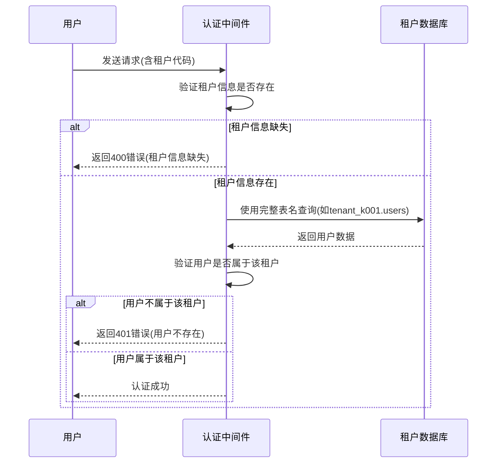
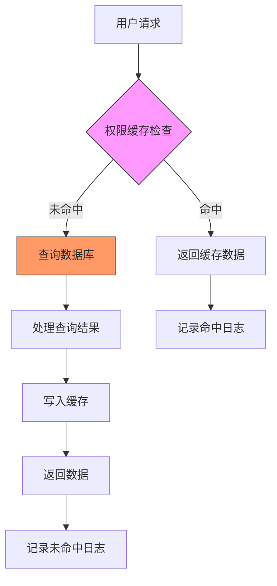
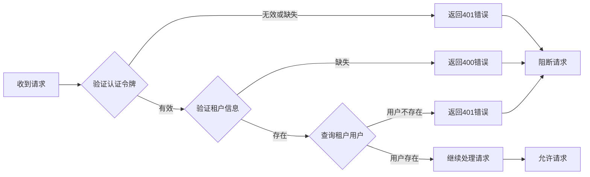

# 异常检测

<cite>
**本文档引用的文件**
- [auth-shared-pool-example.middleware.ts](file://auth-shared-pool-example.middleware.ts)
- [tenant-database-shared-pool.service.ts](file://tenant-database-shared-pool.service.ts)
- [k.yyup.com/backup/permission-system/cache-invalidation.middleware.ts](file://k.yyup.com/backup/permission-system/cache-invalidation.middleware.ts)
- [k.yyup.com/backup/permission-system/permission-cache.service.ts](file://k.yyup.com/backup/permission-system/permission-cache.service.ts)
- [k.yyup.com/backup/permission-system/permission-cache.controller.ts](file://k.yyup.com/backup/permission-system/permission-cache.controller.ts)
- [k.yyup.com/backup/permission-system/route-cache.service.ts](file://k.yyup.com/backup/permission-system/route-cache.service.ts)
- [k.yyup.com/backup/permission-system/role-cache.service.ts](file://k.yyup.com/backup/permission-system/role-cache.service.ts)
</cite>

## 目录
1. [介绍](#介绍)
2. [异常检测机制](#异常检测机制)
3. [跨租户访问检测](#跨租户访问检测)
4. [异常登录模式识别](#异常登录模式识别)
5. [高频数据访问监控](#高频数据访问监控)
6. [检测规则配置与管理](#检测规则配置与管理)
7. [实时告警与通知](#实时告警与通知)
8. [自动阻断策略](#自动阻断策略)
9. [检测模型更新与优化](#检测模型更新与优化)
10. [异常事件分析与响应](#异常事件分析与响应)

## 介绍
k.yyupgame系统在多租户环境下通过一系列中间件和服务组件实现安全监控和异常行为检测。虽然没有专门的异常检测模块，但系统通过认证、权限管理和缓存机制来监控和记录潜在的异常行为。本文档详细描述了系统如何通过日志记录、权限验证和缓存监控来检测可疑行为，并提供安全团队进行事件分析和响应的指导。

## 异常检测机制
k.yyupgame系统的异常检测主要通过认证中间件、权限服务和缓存管理组件实现。系统在关键操作点记录详细的日志信息，包括认证成功、认证失败、登录成功和登录失败等事件。这些日志为安全监控提供了基础数据。

系统采用共享连接池架构，通过完整的表名（如`tenant_${tenantCode}.users`）访问租户数据库，确保了租户间数据的隔离。这种架构设计本身就提供了一定程度的跨租户访问防护。

**Section sources**
- [auth-shared-pool-example.middleware.ts](file://auth-shared-pool-example.middleware.ts#L1-L255)
- [tenant-database-shared-pool.service.ts](file://tenant-database-shared-pool.service.ts#L1-L177)

## 跨租户访问检测
系统通过租户解析中间件和数据库访问模式来防止跨租户访问。在认证过程中，系统会验证请求中的租户信息，并使用该租户代码构建完整的表名进行数据库查询。

当用户尝试访问资源时，系统会检查其租户代码，并确保所有数据库操作都限定在该租户的数据库范围内。如果租户信息缺失或无效，系统会拒绝请求。

**Diagram sources**
- [auth-shared-pool-example.middleware.ts](file://auth-shared-pool-example.middleware.ts#L61-L77)
- [tenant-database-shared-pool.service.ts](file://tenant-database-shared-pool.service.ts#L78-L123)

## 异常登录模式识别
系统在认证中间件中实现了基本的登录异常检测。当用户登录时，系统会记录成功和失败的登录尝试。虽然没有实现复杂的异常登录模式分析（如短时间内多次失败尝试），但系统通过日志记录为后续分析提供了数据基础。

登录失败时，系统会记录详细的错误信息，包括失败原因（如无效凭证、认证失败等）。这些信息可以帮助安全团队识别暴力破解尝试或其他异常登录模式。

**Section sources**
- [auth-shared-pool-example.middleware.ts](file://auth-shared-pool-example.middleware.ts#L140-L255)

## 高频数据访问监控
系统通过权限缓存服务和路由缓存服务来监控数据访问模式。虽然没有直接的高频数据访问检测机制，但系统通过缓存统计和性能指标间接反映了数据访问情况。

权限缓存服务记录了缓存查询的命中率、数据库查询时间和缓存写入等信息。异常高的数据库查询频率可能表明存在异常的数据访问模式。

**Diagram sources**
- [k.yyup.com/backup/permission-system/permission-cache.service.ts](file://k.yyup.com/backup/permission-system/permission-cache.service.ts#L50-L134)

## 检测规则配置与管理
系统没有显式的检测规则配置文件，但通过环境变量和代码配置来管理安全相关参数。例如，数据库连接池的大小通过环境变量`DB_POOL_MAX`和`DB_POOL_MIN`配置。

权限系统通过角色和权限的关联来实现访问控制，这些配置存储在数据库中。管理员可以通过管理界面修改角色权限，从而间接调整"检测规则"。

缓存失效中间件提供了预定义的缓存失效策略，可以根据不同的操作类型（用户、角色、权限变更等）自动清除相关缓存。

**Section sources**
- [tenant-database-shared-pool.service.ts](file://tenant-database-shared-pool.service.ts#L20-L22)
- [k.yyup.com/backup/permission-system/cache-invalidation.middleware.ts](file://k.yyup.com/backup/permission-system/cache-invalidation.middleware.ts#L13-L20)

## 实时告警与通知
系统目前主要依赖日志记录而非实时告警机制。关键事件如认证成功、认证失败、登录失败等都会被记录到日志中。

权限缓存控制器提供了管理员接口来查看缓存状态和变更历史，这可以作为监控系统健康状况的手段。虽然注释中提到了通知服务（`NotificationService.broadcastPermissionUpdate()`），但实际代码中已被注释掉，表明该功能尚未实现。

**Section sources**
- [auth-shared-pool-example.middleware.ts](file://auth-shared-pool-example.middleware.ts#L119-L124)
- [k.yyup.com/backup/permission-system/permission-cache.controller.ts](file://k.yyup.com/backup/permission-system/permission-cache.controller.ts#L47-L48)

## 自动阻断策略
系统实现了基本的自动阻断策略。当检测到无效的认证令牌、缺失的租户信息或无效的登录凭证时，系统会自动返回相应的错误响应，阻止用户继续访问。

在数据库连接失败或健康检查失败时，系统也会拒绝新的连接请求，防止在数据库异常状态下继续提供服务。

**Diagram sources**
- [auth-shared-pool-example.middleware.ts](file://auth-shared-pool-example.middleware.ts#L24-L85)

## 检测模型更新与优化
系统通过缓存机制和定期的缓存刷新来实现"检测模型"的更新。当权限或角色配置发生变化时，相关的缓存会被自动清除，确保系统使用最新的权限数据。

管理员可以手动刷新权限缓存，或在紧急情况下强制刷新缓存。系统还提供了缓存预热功能，可以在高负载前预先加载常用数据到缓存中。

**Section sources**
- [k.yyup.com/backup/permission-system/permission-cache.controller.ts](file://k.yyup.com/backup/permission-system/permission-cache.controller.ts#L22-L84)
- [k.yyup.com/backup/permission-system/route-cache.service.ts](file://k.yyup.com/backup/permission-system/route-cache.service.ts#L269-L284)

## 异常事件分析与响应
安全团队可以通过分析系统日志来识别异常事件。关键的日志条目包括：

- 认证失败事件（`[认证] Token验证失败`）
- 登录失败事件（`[认证] 登录失败`）
- 租户信息缺失事件
- 数据库连接失败事件

对于频繁的认证失败，可能表明存在暴力破解尝试；对于租户信息缺失的请求，可能表明存在跨租户访问尝试。

响应策略包括：
1. 分析日志以确定异常模式
2. 临时阻断可疑IP地址
3. 重置受影响用户的凭证
4. 检查系统配置是否存在漏洞
5. 更新权限配置以加强访问控制

**Section sources**
- [auth-shared-pool-example.middleware.ts](file://auth-shared-pool-example.middleware.ts#L128-L134)
- [database-initialization.ts](file://database-initialization.ts#L37-L38)