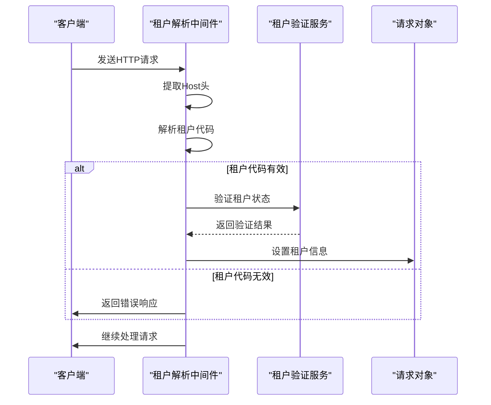
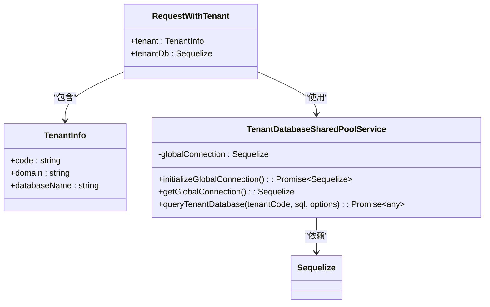
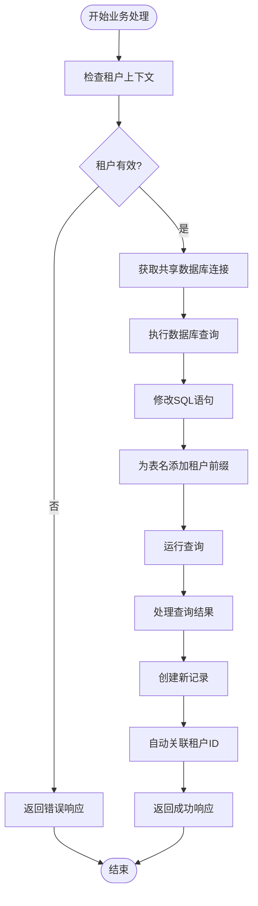
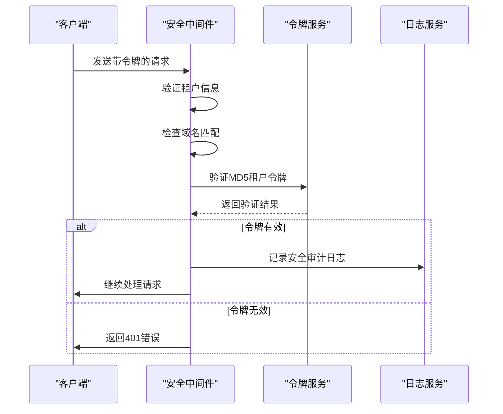

# 上下文传播机制

<cite>
**本文档引用的文件**   
- [tenant-resolver-shared-pool.middleware.ts](file://tenant-resolver-shared-pool.middleware.ts)
- [tenant-database-shared-pool.service.ts](file://tenant-database-shared-pool.service.ts)
- [server/src/middlewares/tenant-resolver.middleware.ts](file://k.yyup.com/server/src/middlewares/tenant-resolver.middleware.ts)
- [server/src/middlewares/tenant-security.middleware.ts](file://k.yyup.com/server/src/middlewares/tenant-security.middleware.ts)
- [server/src/controllers/tenant-token.controller.ts](file://k.yyup.com/server/src/controllers/tenant-token.controller.ts)
- [server/src/services/tenant-token.service.ts](file://k.yyup.com/server/src/services/tenant-token.service.ts)
- [auth-shared-pool-example.middleware.ts](file://auth-shared-pool-example.middleware.ts)
</cite>

## 目录
1. [引言](#引言)
2. [租户上下文识别与解析](#租户上下文识别与解析)
3. [租户上下文存储与传递](#租户上下文存储与传递)
4. [业务逻辑中的上下文使用](#业务逻辑中的上下文使用)
5. [异步操作中的上下文一致性](#异步操作中的上下文一致性)
6. [上下文安全与验证](#上下文安全与验证)
7. [开发实践与常见陷阱](#开发实践与常见陷阱)
8. [结论](#结论)

## 引言
本项目采用多租户架构，通过上下文传播机制确保每个租户的数据隔离和安全访问。上下文传播机制的核心是租户上下文（tenant context）在应用各层间的传递，包括从中间件到控制器再到服务层的完整路径。该机制通过域名识别租户，并使用共享连接池技术提高数据库连接效率。租户上下文包含租户代码、域名和数据库名称等关键信息，这些信息在请求处理过程中被安全地传递和使用，确保业务逻辑能够正确地关联租户数据。

## 租户上下文识别与解析

租户上下文的识别与解析是整个传播机制的起点，主要通过中间件在请求进入系统时完成。系统根据请求的域名自动识别租户，支持多种域名格式，如`k001.yyup.cc`或`tenant1.kindergarten.com`。识别过程首先从请求头中获取Host信息，然后通过正则表达式提取租户代码。对于无法识别的域名，生产环境会返回错误，而开发环境则允许使用默认配置。

租户识别后，系统会验证租户是否存在且已激活。这通过调用统一认证系统API或从缓存中获取租户信息来完成。验证成功后，租户信息被设置到请求对象中，包括租户代码、域名和数据库名称。这种设计确保了每个请求都能准确地关联到特定租户，为后续的数据访问和业务处理奠定了基础。

**Diagram sources**
- [tenant-resolver-shared-pool.middleware.ts](file://tenant-resolver-shared-pool.middleware.ts#L1-L142)
- [server/src/middlewares/tenant-resolver.middleware.ts](file://k.yyup.com/server/src/middlewares/tenant-resolver.middleware.ts#L1-L224)

**Section sources**
- [tenant-resolver-shared-pool.middleware.ts](file://tenant-resolver-shared-pool.middleware.ts#L1-L142)
- [server/src/middlewares/tenant-resolver.middleware.ts](file://k.yyup.com/server/src/middlewares/tenant-resolver.middleware.ts#L1-L224)

## 租户上下文存储与传递

租户上下文的存储与传递通过扩展的请求对象实现，确保上下文在应用各层间安全传递。系统定义了`RequestWithTenant`接口，扩展了标准的Express Request对象，添加了`tenant`和`tenantDb`属性。`tenant`属性存储租户基本信息，如租户代码、域名和数据库名称；`tenantDb`属性存储共享的全局数据库连接实例。

上下文传递的关键在于共享连接池的设计。系统使用`TenantDatabaseSharedPoolService`类管理全局数据库连接，所有租户共享一个连接池。当租户信息被解析后，中间件通过`tenantDatabaseSharedPoolService.getGlobalConnection()`获取共享连接，并将其赋值给`req.tenantDb`。这种设计避免了为每个租户创建独立连接池的资源浪费，同时通过完整表名（如`tenant_k001.users`）确保数据隔离。

**Diagram sources**
- [tenant-resolver-shared-pool.middleware.ts](file://tenant-resolver-shared-pool.middleware.ts#L1-L142)
- [tenant-database-shared-pool.service.ts](file://tenant-database-shared-pool.service.ts#L1-L177)

**Section sources**
- [tenant-resolver-shared-pool.middleware.ts](file://tenant-resolver-shared-pool.middleware.ts#L1-L142)
- [tenant-database-shared-pool.service.ts](file://tenant-database-shared-pool.service.ts#L1-L177)

## 业务逻辑中的上下文使用

在业务逻辑中，租户上下文被用于安全地访问和使用租户数据。控制器和服务层通过`req.tenant`和`req.tenantDb`访问租户信息和数据库连接。当创建新记录时，系统自动关联租户ID，确保数据正确归属。例如，在用户认证过程中，系统使用完整表名查询租户数据库，如`SELECT * FROM tenant_${tenantCode}.users`，避免了跨租户数据访问的风险。

业务逻辑中的上下文使用遵循严格的模式：首先验证租户信息是否存在，然后使用共享连接执行数据库操作。在插入新记录时，系统会自动填充租户相关的字段，如`tenant_id`。这种设计确保了所有数据操作都与特定租户关联，实现了数据的自动隔离和归属。

**Diagram sources**
- [auth-shared-pool-example.middleware.ts](file://auth-shared-pool-example.middleware.ts#L1-L255)
- [server/src/controllers/tenant-token.controller.ts](file://k.yyup.com/server/src/controllers/tenant-token.controller.ts#L1-L310)

**Section sources**
- [auth-shared-pool-example.middleware.ts](file://auth-shared-pool-example.middleware.ts#L1-L255)
- [server/src/controllers/tenant-token.controller.ts](file://k.yyup.com/server/src/controllers/tenant-token.controller.ts#L1-L310)

## 异步操作中的上下文一致性

在异步操作、定时任务或消息队列处理中，保持租户上下文的一致性至关重要。由于异步操作可能跨越多个事件循环或在不同的执行上下文中运行，传统的请求对象存储方式不再适用。系统通过将租户上下文序列化并作为元数据传递来解决这个问题。

在消息队列场景中，生产者将租户代码、数据库名称等关键信息作为消息头或消息体的一部分发送。消费者在处理消息时，首先从消息中提取租户上下文，然后使用`tenantDatabaseSharedPoolService`获取相应的数据库连接。对于定时任务，系统在任务调度时明确指定租户上下文，确保任务执行时能够正确访问租户数据。

这种设计确保了即使在复杂的异步场景下，租户上下文也能被正确传递和使用，避免了上下文丢失或污染的问题。通过将上下文作为显式参数传递，而不是依赖隐式的执行上下文，系统实现了更高的可靠性和可预测性。

**Section sources**
- [server/src/services/tenant-token.service.ts](file://k.yyup.com/server/src/services/tenant-token.service.ts#L1-L353)
- [tenant-database-shared-pool.service.ts](file://tenant-database-shared-pool.service.ts#L1-L177)

## 上下文安全与验证

上下文安全与验证是防止租户数据泄露和越权访问的关键。系统实现了多层次的安全验证机制，包括域名与租户代码的匹配验证、MD5租户令牌验证和JWT令牌验证。租户安全中间件在请求处理链中执行这些验证，确保只有经过验证的请求才能访问租户数据。

MD5租户令牌验证是核心安全措施，它基于用户手机号、租户代码、域名和时间戳生成一个唯一的令牌。每次请求时，系统验证令牌的有效性，防止令牌被伪造或重放。此外，系统还实现了租户数据访问权限检查中间件，防止URL参数中的租户代码与验证的租户不匹配，从而阻止越权访问尝试。

**Diagram sources**
- [server/src/middlewares/tenant-security.middleware.ts](file://k.yyup.com/server/src/middlewares/tenant-security.middleware.ts#L1-L270)
- [server/src/services/tenant-token.service.ts](file://k.yyup.com/server/src/services/tenant-token.service.ts#L1-L353)

**Section sources**
- [server/src/middlewares/tenant-security.middleware.ts](file://k.yyup.com/server/src/middlewares/tenant-security.middleware.ts#L1-L270)
- [server/src/services/tenant-token.service.ts](file://k.yyup.com/server/src/services/tenant-token.service.ts#L1-L353)

## 开发实践与常见陷阱

开发者在使用上下文传播机制时应遵循最佳实践，避免常见陷阱。首要原则是始终通过`req.tenant`和`req.tenantDb`访问租户上下文，而不是硬编码租户信息。在编写数据库查询时，应使用参数化查询和表名前缀机制，确保SQL语句的租户安全性。

常见陷阱包括：忘记验证租户上下文直接访问数据库、在异步操作中丢失上下文、以及在日志记录中泄露敏感信息。为避免这些问题，开发者应在每个业务方法的开始处验证租户上下文的存在性，并在异步操作中显式传递上下文。此外，应使用日志掩码技术隐藏敏感信息，如手机号和令牌。

另一个重要实践是正确处理错误情况。当租户上下文缺失或无效时，应立即返回适当的错误响应，而不是继续执行可能引发安全问题的业务逻辑。通过遵循这些实践，开发者可以确保应用程序的安全性和可靠性。

**Section sources**
- [tenant-resolver-shared-pool.middleware.ts](file://tenant-resolver-shared-pool.middleware.ts#L1-L142)
- [server/src/middlewares/tenant-security.middleware.ts](file://k.yyup.com/server/src/middlewares/tenant-security.middleware.ts#L1-L270)

## 结论
本项目的上下文传播机制通过租户识别、上下文存储、安全验证和一致性保障等环节，实现了多租户环境下的数据隔离和安全访问。该机制利用共享连接池技术提高了资源利用率，同时通过严格的验证和访问控制确保了系统的安全性。开发者应遵循最佳实践，正确使用上下文传播机制，避免常见陷阱，从而构建安全可靠的多租户应用。