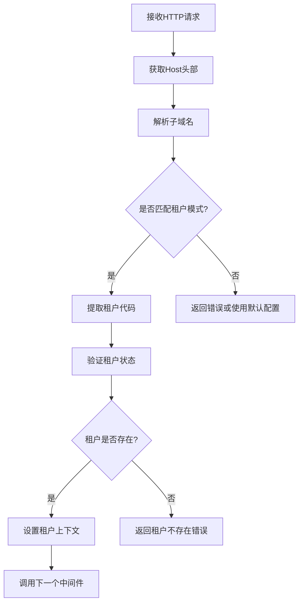
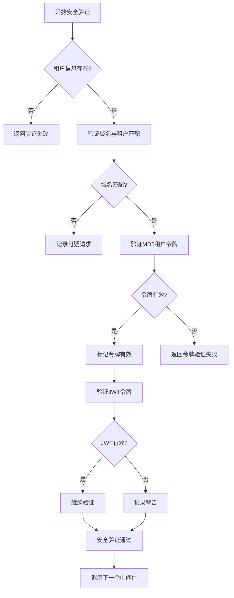
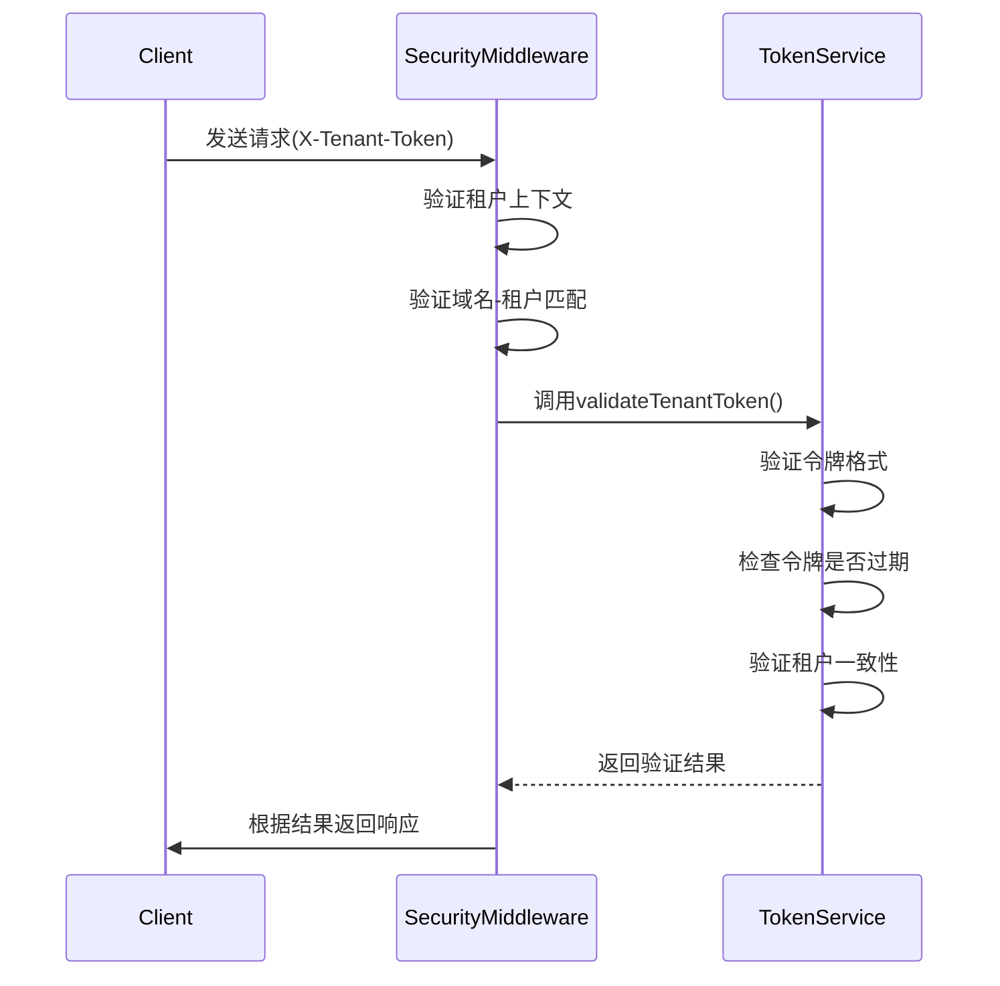
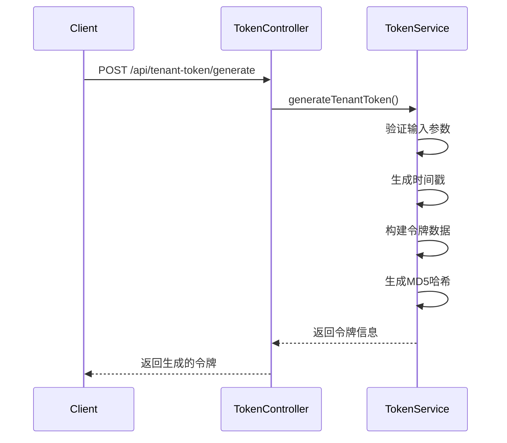

# 应用层隔离机制

<cite>
**本文档引用的文件**  
- [tenant-resolver.middleware.ts](file://k.yyup.com/server/src/middlewares/tenant-resolver.middleware.ts)
- [tenant-security.middleware.ts](file://k.yyup.com/server/src/middlewares/tenant-security.middleware.ts)
- [tenant-database.service.ts](file://k.yyup.com/server/src/services/tenant-database.service.ts)
- [tenant-token.service.ts](file://k.yyup.com/server/src/services/tenant-token.service.ts)
- [tenant-token.controller.ts](file://k.yyup.com/server/src/controllers/tenant-token.controller.ts)
- [tenant-token.routes.ts](file://k.yyup.com/server/src/routes/tenant-token.routes.ts)
- [minimal-tenant-app.ts](file://k.yyup.com/server/src/minimal-tenant-app.ts)
- [tenant-resolver-shared-pool.middleware.ts](file://tenant-resolver-shared-pool.middleware.ts)
- [tenant-database-shared-pool.service.ts](file://tenant-database-shared-pool.service.ts)
</cite>

## 目录
1. [引言](#引言)
2. [租户识别机制](#租户识别机制)
3. [租户安全验证](#租户安全验证)
4. [数据库连接与查询隔离](#数据库连接与查询隔离)
5. [租户令牌系统](#租户令牌系统)
6. [应用层数据访问控制](#应用层数据访问控制)
7. [开发者最佳实践](#开发者最佳实践)
8. [总结](#总结)

## 引言

k.yyupgame 系统采用先进的应用层隔离机制，确保多租户环境下的数据安全与隔离。本系统通过租户中间件、安全验证、共享连接池和MD5令牌机制，实现了高效、安全的多租户架构。每个租户的数据访问都受到严格控制，防止跨租户数据泄露，同时优化了数据库连接资源的使用。

## 租户识别机制

### 租户中间件工作原理

租户识别中间件是应用层隔离的第一道防线，负责从HTTP请求中提取租户标识并建立租户上下文。系统主要通过子域名来识别租户，例如 `k001.yyup.cc` 中的 `k001` 即为租户代码。

中间件工作流程如下：
1. 从请求的 `Host` 头部或 `hostname` 获取完整域名
2. 使用正则表达式解析租户代码
3. 验证租户是否存在且已激活
4. 将租户信息注入到请求对象中，供后续处理使用



**Diagram sources**
- [tenant-resolver.middleware.ts](file://k.yyup.com/server/src/middlewares/tenant-resolver.middleware.ts#L25-L224)

**租户代码提取**

系统支持多种域名格式的租户代码提取：
- `k001.yyup.cc` → `k001`
- `tenant1.kindergarten.com` → `tenant1`
- `customer.kyyup.com` → `customer`

```typescript
function extractTenantCode(domain: string): string | null {
  const cleanDomain = domain.split(':')[0];
  const match = cleanDomain.match(/^(k\d+)\.yyup\.cc$/);
  if (match) {
    return match[1];
  }
  const altMatch = cleanDomain.match(/^([a-zA-Z0-9]+)\.(kindergarten|kyyup)\.com$/);
  if (altMatch) {
    return altMatch[1];
  }
  return null;
}
```

**租户验证**

租户验证通过调用统一租户中心API完成，确保租户处于激活状态：

```typescript
async function validateTenant(tenantCode: string): Promise<boolean> {
  const response = await fetch(`${process.env.UNIFIED_TENANT_API_URL}/api/tenants/${tenantCode}`, {
    method: 'GET',
    headers: {
      'Content-Type': 'application/json',
      'X-Service-Name': 'kindergarten-system'
    }
  });
  
  if (response.ok) {
    const data = await response.json();
    return data.success && data.data.status === 'active';
  }
  return false;
}
```

**Section sources**
- [tenant-resolver.middleware.ts](file://k.yyup.com/server/src/middlewares/tenant-resolver.middleware.ts#L116-L178)
- [tenant-resolver-shared-pool.middleware.ts](file://tenant-resolver-shared-pool.middleware.ts#L99-L138)

## 租户安全验证

### 多重安全验证机制

系统采用多重安全验证机制，确保租户数据访问的安全性：

1. **域名-租户匹配验证**：防止Host头部伪造攻击
2. **MD5租户令牌验证**：核心安全检查机制
3. **JWT令牌验证**：可选的传统身份验证



**Diagram sources**
- [tenant-security.middleware.ts](file://k.yyup.com/server/src/middlewares/tenant-security.middleware.ts#L27-L147)

### 域名-租户匹配验证

为了防止恶意用户通过修改Host头部访问其他租户数据，系统实施了严格的域名-租户匹配验证：

```typescript
function isValidTenantDomain(domain: string, tenantCode: string): boolean {
  const cleanDomain = domain.split(':')[0];
  const expectedPattern = `^${tenantCode}\\.yyup\\.cc$`;
  const domainPattern = new RegExp(expectedPattern);
  
  if (domainPattern.test(cleanDomain)) {
    return true;
  }
  
  // 开发环境的额外验证
  if (process.env.NODE_ENV === 'development') {
    if (cleanDomain === 'localhost' || cleanDomain === '127.0.0.1') {
      return true;
    }
  }
  
  return false;
}
```

### MD5租户令牌验证

MD5租户令牌是系统的核心安全机制，通过用户手机号、租户代码、域名等信息生成唯一令牌：



**Diagram sources**
- [tenant-security.middleware.ts](file://k.yyup.com/server/src/middlewares/tenant-security.middleware.ts#L67-L103)
- [tenant-token.service.ts](file://k.yyup.com/server/src/services/tenant-token.service.ts#L126-L163)

**Section sources**
- [tenant-security.middleware.ts](file://k.yyup.com/server/src/middlewares/tenant-security.middleware.ts#L27-L147)

## 数据库连接与查询隔离

### 共享连接池架构

系统采用共享连接池架构，所有租户共享一个数据库连接池（默认30个连接），通过完整表名访问不同租户的数据库，实现了资源的高效利用和数据的物理隔离。

```mermaid
graph TB
subgraph "应用服务器"
A[连接池(30个连接)]
B[租户数据库服务]
end
subgraph "MySQL数据库"
C[(tenant_k001)]
D[(tenant_k002)]
E[(tenant_k003)]
F[(系统数据库)]
end
A --> C
A --> D
A --> E
A --> F
B --> A
```

**Diagram sources**
- [tenant-database-shared-pool.service.ts](file://tenant-database-shared-pool.service.ts#L9-L177)
- [tenant-database.service.ts](file://k.yyup.com/server/src/services/tenant-database.service.ts#L27-L370)

### 数据库服务实现

`TenantDatabaseService` 类负责管理共享连接池，提供全局数据库连接：

```typescript
export class TenantDatabaseService {
  private globalConnection: Sequelize | null = null;
  private isInitialized: boolean = false;
  private initPromise: Promise<Sequelize> | null = null;
  
  async initializeGlobalConnection(): Promise<Sequelize> {
    if (this.globalConnection && this.isInitialized) {
      return this.globalConnection;
    }
    
    if (this.initPromise) {
      return this.initPromise;
    }
    
    this.initPromise = this._createGlobalConnection();
    
    try {
      this.globalConnection = await this.initPromise;
      this.isInitialized = true;
      return this.globalConnection;
    } catch (error) {
      this.initPromise = null;
      throw error;
    }
  }
  
  private async _createGlobalConnection(): Promise<Sequelize> {
    const sequelize = new Sequelize({
      host: process.env.DB_HOST || 'localhost',
      port: parseInt(process.env.DB_PORT || '3306'),
      username: process.env.DB_USER || 'root',
      password: process.env.DB_PASSWORD || '',
      database: 'mysql', // 连接到MySQL系统数据库
      dialect: 'mysql',
      timezone: '+08:00',
      pool: {
        max: parseInt(process.env.DB_POOL_MAX || '30'),
        min: parseInt(process.env.DB_POOL_MIN || '5'),
        acquire: 30000,
        idle: 10000
      }
    });
    
    await sequelize.authenticate();
    return sequelize;
  }
  
  getGlobalConnection(): Sequelize {
    if (!this.globalConnection || !this.isInitialized) {
      throw new Error('数据库连接未初始化');
    }
    return this.globalConnection;
  }
}
```

### 查询过滤器自动注入

系统通过SQL语句重写机制，自动为查询注入租户ID条件，确保每个数据库查询都包含租户隔离：

```typescript
private prependTenantDatabase(sql: string, tenantCode: string): string {
  const databaseName = `tenant_${tenantCode}`;
  
  const tableNames = [
    'users', 'roles', 'permissions', 'user_roles',
    'classes', 'students', 'teachers', 'parents',
    'announcements', 'activities', 'enrollments'
  ];
  
  let modifiedSql = sql;
  for (const tableName of tableNames) {
    const regex = new RegExp(
      `(FROM|JOIN|INTO|UPDATE|DELETE FROM)\\s+${tableName}\\b`,
      'gi'
    );
    modifiedSql = modifiedSql.replace(
      regex,
      `$1 ${databaseName}.${tableName}`
    );
  }
  
  return modifiedSql;
}
```

**Section sources**
- [tenant-database-shared-pool.service.ts](file://tenant-database-shared-pool.service.ts#L68-L123)
- [tenant-database.service.ts](file://k.yyup.com/server/src/services/tenant-database.service.ts#L173-L176)

## 租户令牌系统

### 令牌生成与验证

租户令牌系统使用MD5哈希算法，结合用户手机号、租户代码、域名等信息生成安全令牌，有效期为30分钟。



**Diagram sources**
- [tenant-token.controller.ts](file://k.yyup.com/server/src/controllers/tenant-token.controller.ts#L34-L90)
- [tenant-token.service.ts](file://k.yyup.com/server/src/services/tenant-token.service.ts#L64-L117)

### 令牌服务实现

```typescript
export class TenantTokenService {
  generateTenantToken(
    userPhone: string,
    tenantCode: string,
    tenantDomain: string,
    databaseName: string
  ): TenantTokenInfo {
    this.validateTokenInputs(userPhone, tenantCode, tenantDomain, databaseName);
    
    const timestamp = Math.floor(Date.now() / (TOKEN_CONFIG.TIMESTAMP_UNIT * 1000));
    const tokenData = `${userPhone}:${tenantCode}:${tenantDomain}:${databaseName}:${timestamp}:${TOKEN_CONFIG.SALT}`;
    const md5Hash = crypto.createHash('md5').update(tokenData, 'utf8').digest('hex');
    const token = `${TOKEN_CONFIG.TOKEN_PREFIX}${md5Hash}`;
    const expiresAt = new Date(timestamp * TOKEN_CONFIG.TIMESTAMP_UNIT * 1000 + TOKEN_CONFIG.EXPIRES_IN);
    
    return {
      userPhone,
      tenantCode,
      tenantDomain,
      databaseName,
      timestamp,
      token,
      expiresAt
    };
  }
  
  validateTenantToken(
    token: string,
    currentTenantCode: string,
    currentDomain: string
  ): { isValid: boolean; tenantInfo?: TenantTokenInfo; error?: string } {
    if (!token || !token.startsWith(TOKEN_CONFIG.TOKEN_PREFIX)) {
      return { isValid: false, error: '令牌格式无效' };
    }
    
    const timestamp = this.extractTimestampFromToken(token);
    if (this.isTokenExpired(timestamp)) {
      return { isValid: false, error: '令牌已过期' };
    }
    
    const expectedDomainPattern = `^${currentTenantCode}\\.yyup\\.cc$`;
    if (!new RegExp(expectedDomainPattern).test(currentDomain)) {
      return { isValid: false, error: '租户域名不匹配' };
    }
    
    return { isValid: true };
  }
}
```

**Section sources**
- [tenant-token.service.ts](file://k.yyup.com/server/src/services/tenant-token.service.ts#L39-L353)
- [tenant-token.controller.ts](file://k.yyup.com/server/src/controllers/tenant-token.controller.ts#L34-L310)

## 应用层数据访问控制

### 服务层和控制器层的租户上下文使用

在服务层和控制器层，开发者可以通过 `req.tenant` 访问租户上下文信息，并在业务逻辑中进行租户相关的决策：

```typescript
// 在控制器中使用租户上下文
app.get('/api/protected-data', tenantSecurityMiddleware, (req: Request, res: Response) => {
  res.json({
    success: true,
    message: '受保护的数据访问成功',
    data: {
      tenantInfo: (req as any).tenant,
      securityInfo: (req as any).tenantSecurity,
      protectedContent: '这是需要MD5令牌验证才能访问的敏感数据'
    }
  });
});
```

### 租户数据访问中间件

系统提供了租户数据访问中间件，防止URL参数中的租户越权访问：

```typescript
export const tenantDataAccessMiddleware = async (
  req: RequestWithTenantSecurity,
  res: Response,
  next: NextFunction
): Promise<void> => {
  const urlTenantCode = req.query.tenant || req.params.tenant || req.body?.tenant;
  if (urlTenantCode && urlTenantCode !== req.tenantSecurity.verifiedTenantCode) {
    logger.warn('检测到租户数据越权访问尝试', {
      url: req.url,
      verifiedTenant: req.tenantSecurity.verifiedTenantCode,
      attemptedTenant: urlTenantCode
    });
    
    ApiResponse.error(res, '无权访问此租户数据', 'TENANT_DATA_ACCESS_DENIED');
    return;
  }
  
  next();
};
```

### API路由分发

API网关或路由层通过中间件链处理多租户请求的分发：

```typescript
// 在最小化应用中配置中间件链
app.use(tenantResolverMiddleware);
app.use('/api/tenant-token', tenantTokenRoutes);
app.use('/api/protected-data', tenantSecurityMiddleware, (req, res) => {
  // 受保护的路由
});
```

**Section sources**
- [minimal-tenant-app.ts](file://k.yyup.com/server/src/minimal-tenant-app.ts#L49-L101)
- [tenant-security.middleware.ts](file://k.yyup.com/server/src/middlewares/tenant-security.middleware.ts#L184-L223)

## 开发者最佳实践

### 正确使用租户上下文

1. **始终验证租户上下文存在性**：
```typescript
if (!req.tenant || !req.tenant.code) {
  return ApiResponse.error(res, '租户验证失败', 'TENANT_VALIDATION_FAILED');
}
```

2. **使用共享连接池**：
```typescript
const connection = tenantDatabaseService.getGlobalConnection();
```

3. **在业务逻辑中考虑租户因素**：
```typescript
// 基于租户代码执行不同的业务逻辑
if (req.tenant.code.startsWith('k')) {
  // 幼儿园租户特殊处理
} else {
  // 普通租户处理
}
```

### 处理跨租户操作

对于需要跨租户操作的特殊情况，应使用专门的管理员接口，并进行额外的安全验证：

```typescript
// 管理员接口需要额外的安全验证
router.delete('/cleanup',
  tenantResolverMiddleware,
  tenantSecurityMiddleware,
  async (req: any, res: any) => {
    // 只有管理员才能执行此操作
    if (!isAdmin(req)) {
      return ApiResponse.error(res, '无权执行此操作', 'UNAUTHORIZED');
    }
    
    await tenantTokenService.cleanExpiredTokens();
    ApiResponse.success(res, { message: '过期令牌清理完成' });
  }
);
```

### 测试应用层隔离有效性

1. **测试租户识别**：
- 验证不同子域名能否正确识别租户
- 测试无效域名的处理

2. **测试安全验证**：
- 使用无效令牌访问受保护接口
- 尝试通过修改Host头部访问其他租户数据

3. **测试数据隔离**：
- 验证查询结果是否包含正确的租户数据
- 测试跨租户数据访问是否被阻止

**Section sources**
- [tenant-security.middleware.ts](file://k.yyup.com/server/src/middlewares/tenant-security.middleware.ts#L184-L223)
- [tenant-token.routes.ts](file://k.yyup.com/server/src/routes/tenant-token.routes.ts#L158-L176)

## 总结

k.yyupgame 的应用层隔离机制通过租户中间件、安全验证、共享连接池和MD5令牌系统，实现了高效、安全的多租户架构。系统能够准确识别租户，确保数据访问的安全性，并通过查询过滤器自动注入机制防止跨租户数据访问。开发者应遵循最佳实践，正确使用租户上下文，处理特殊情况，并充分测试应用层隔离的有效性，以确保系统的安全稳定运行。