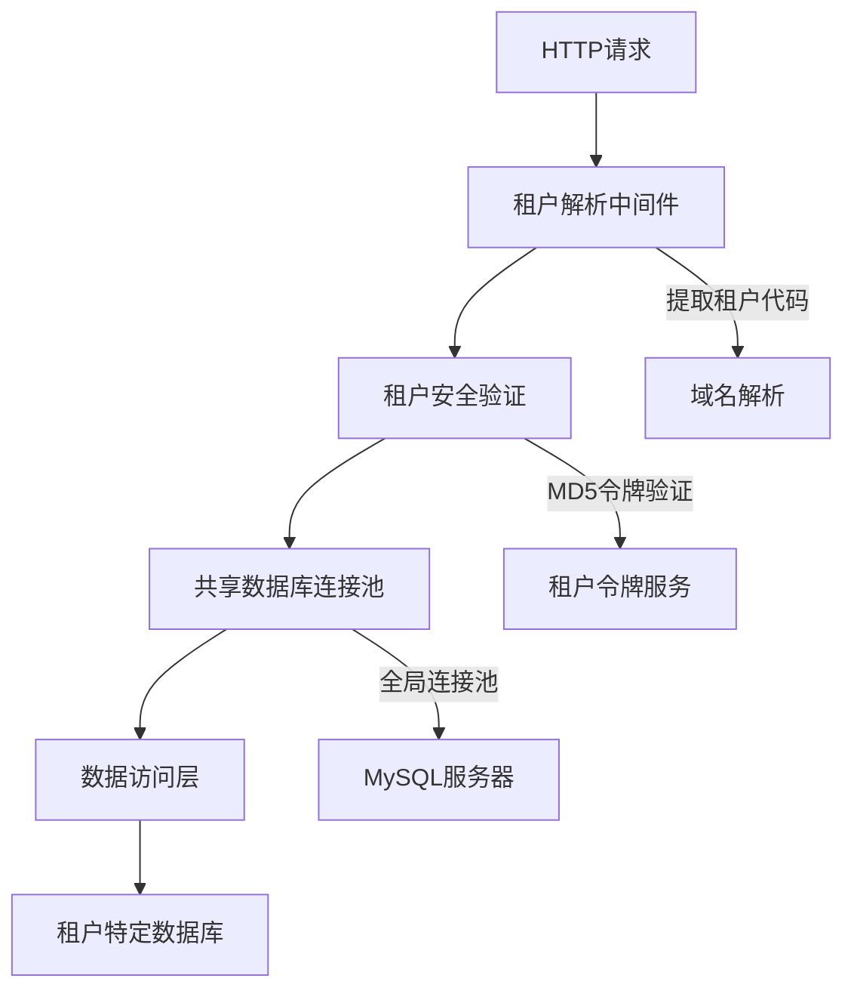
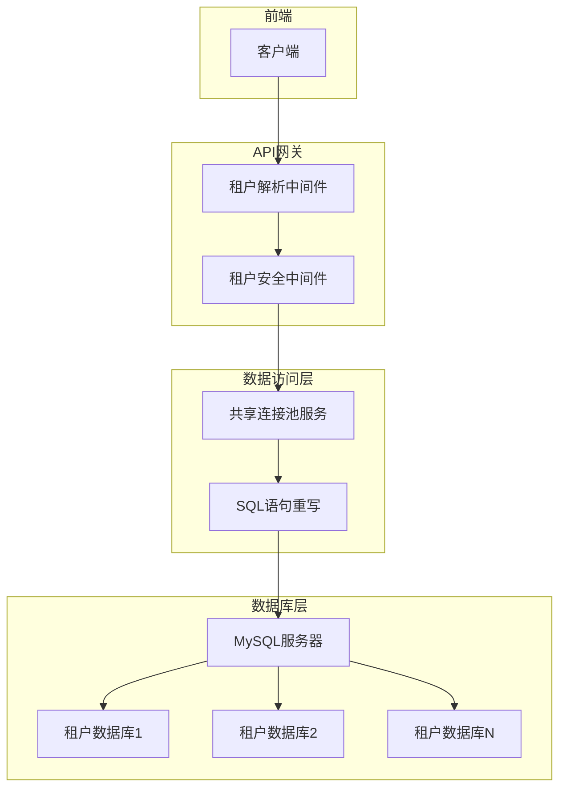
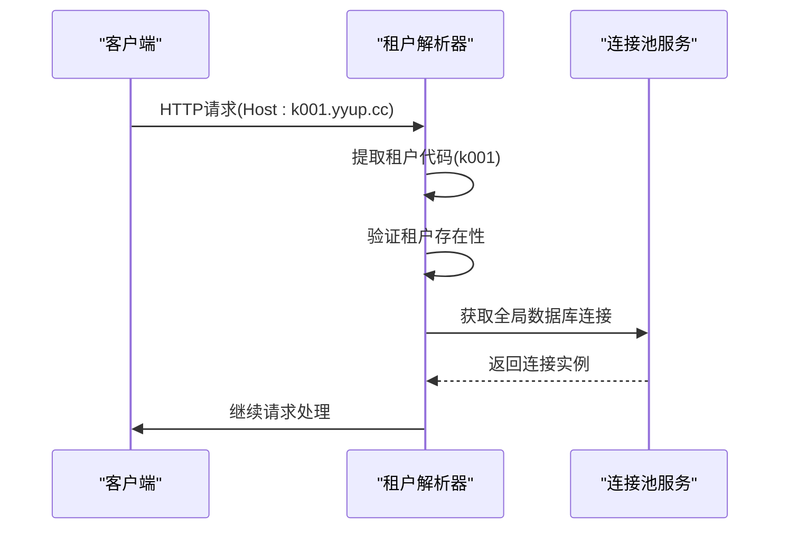
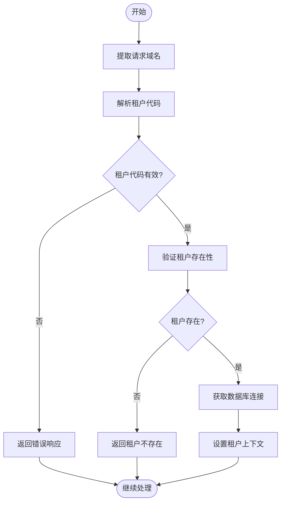
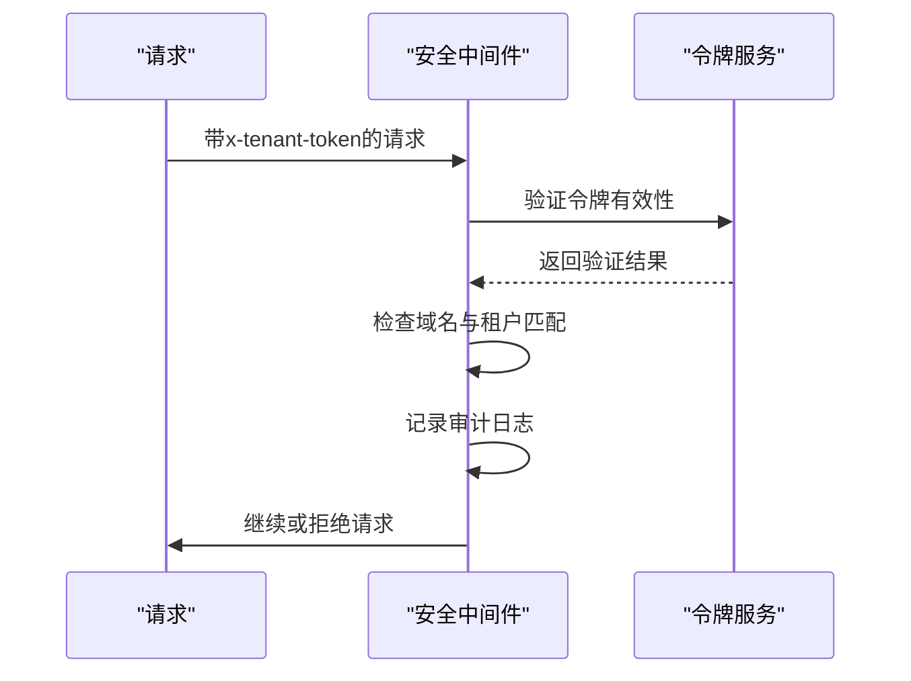
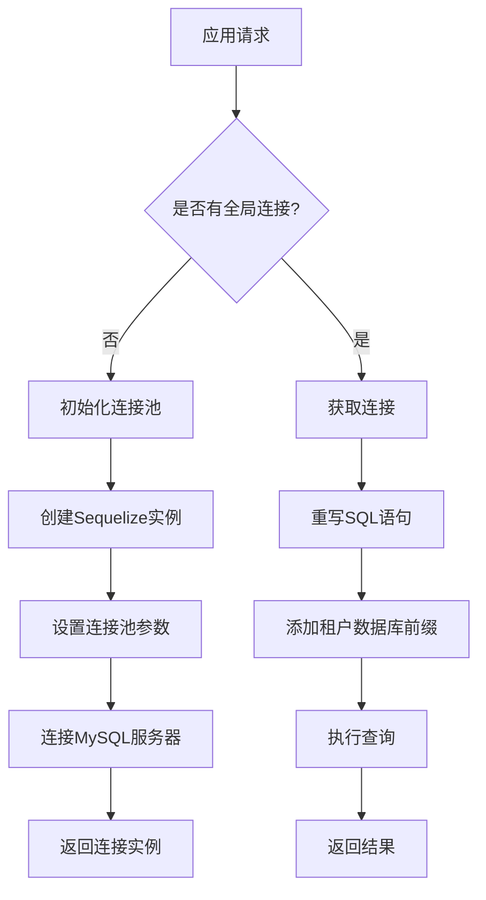
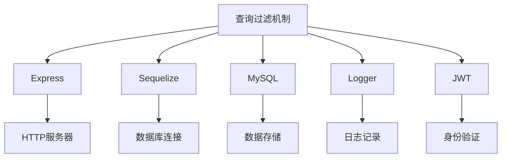

# 查询过滤机制

<cite>
**本文档引用的文件**
- [tenant-resolver-shared-pool.middleware.ts](file://tenant-resolver-shared-pool.middleware.ts)
- [tenant-database-shared-pool.service.ts](file://tenant-database-shared-pool.service.ts)
- [tenant-security.middleware.ts](file://k.yyup.com/server/src/middlewares/tenant-security.middleware.ts)
- [sequelize.ts](file://k.yyup.com/server/src/config/sequelize.ts)
- [tenant.model.ts](file://unified-tenant-system/server/src/models/tenant.model.ts)
</cite>

## 目录
1. [简介](#简介)
2. [项目结构](#项目结构)
3. [核心组件](#核心组件)
4. [架构概述](#架构概述)
5. [详细组件分析](#详细组件分析)
6. [依赖分析](#依赖分析)
7. [性能考虑](#性能考虑)
8. [故障排除指南](#故障排除指南)
9. [结论](#结论)

## 简介
本文档详细介绍了本项目中实现的查询过滤机制，重点阐述了如何在数据访问层自动注入租户ID过滤条件。系统通过中间件和共享连接池服务实现了多租户环境下的数据隔离，确保每个数据库查询都包含当前租户的上下文信息。文档将深入分析租户识别、安全验证和数据库访问控制的实现机制。

## 项目结构
本项目的查询过滤机制主要由租户解析中间件、租户安全中间件和共享数据库连接池服务组成。这些组件协同工作，确保在请求处理的早期阶段就建立租户上下文，并在整个请求生命周期中保持数据隔离。

**图示来源**
- [tenant-resolver-shared-pool.middleware.ts](file://tenant-resolver-shared-pool.middleware.ts)
- [tenant-security.middleware.ts](file://k.yyup.com/server/src/middlewares/tenant-security.middleware.ts)
- [tenant-database-shared-pool.service.ts](file://tenant-database-shared-pool.service.ts)

**本节来源**
- [tenant-resolver-shared-pool.middleware.ts](file://tenant-resolver-shared-pool.middleware.ts)
- [tenant-security.middleware.ts](file://k.yyup.com/server/src/middlewares/tenant-security.middleware.ts)

## 核心组件
系统的核心组件包括租户解析器、租户安全验证器和共享数据库连接池服务。租户解析器从请求的Host头中提取租户代码，安全验证器通过MD5令牌确保请求的合法性，而共享连接池服务则管理所有租户的数据库连接。

**本节来源**
- [tenant-resolver-shared-pool.middleware.ts](file://tenant-resolver-shared-pool.middleware.ts)
- [tenant-security.middleware.ts](file://k.yyup.com/server/src/middlewares/tenant-security.middleware.ts)
- [tenant-database-shared-pool.service.ts](file://tenant-database-shared-pool.service.ts)

## 架构概述
系统的查询过滤架构采用分层设计，从请求进入开始就建立租户上下文。首先通过域名识别租户，然后验证租户令牌，最后通过共享连接池访问租户特定的数据库。这种设计既保证了安全性，又提高了数据库连接的利用率。

**图示来源**
- [tenant-resolver-shared-pool.middleware.ts](file://tenant-resolver-shared-pool.middleware.ts)
- [tenant-security.middleware.ts](file://k.yyup.com/server/src/middlewares/tenant-security.middleware.ts)
- [tenant-database-shared-pool.service.ts](file://tenant-database-shared-pool.service.ts)

## 详细组件分析

### 租户解析器分析
租户解析器中间件负责从HTTP请求中提取租户信息。它通过解析Host头来识别租户代码，并在开发环境中提供默认配置支持。

#### 对于中间件组件：

**图示来源**
- [tenant-resolver-shared-pool.middleware.ts](file://tenant-resolver-shared-pool.middleware.ts)

#### 对于租户验证逻辑：

**图示来源**
- [tenant-resolver-shared-pool.middleware.ts](file://tenant-resolver-shared-pool.middleware.ts)

**本节来源**
- [tenant-resolver-shared-pool.middleware.ts](file://tenant-resolver-shared-pool.middleware.ts)

### 租户安全验证分析
租户安全中间件通过MD5令牌机制确保请求的合法性，防止租户数据越权访问。

#### 对于安全验证流程：

**图示来源**
- [tenant-security.middleware.ts](file://k.yyup.com/server/src/middlewares/tenant-security.middleware.ts)

**本节来源**
- [tenant-security.middleware.ts](file://k.yyup.com/server/src/middlewares/tenant-security.middleware.ts)

### 共享数据库连接池分析
共享连接池服务管理所有租户的数据库连接，通过SQL语句重写实现租户隔离。

#### 对于数据库访问流程：

**图示来源**
- [tenant-database-shared-pool.service.ts](file://tenant-database-shared-pool.service.ts)

**本节来源**
- [tenant-database-shared-pool.service.ts](file://tenant-database-shared-pool.service.ts)

## 依赖分析
查询过滤机制依赖于多个核心服务和配置，包括Express框架、Sequelize ORM、MySQL数据库和日志服务。这些依赖关系确保了系统的稳定性和可维护性。

**图示来源**
- [sequelize.ts](file://k.yyup.com/server/src/config/sequelize.ts)
- [tenant-resolver-shared-pool.middleware.ts](file://tenant-resolver-shared-pool.middleware.ts)

**本节来源**
- [sequelize.ts](file://k.yyup.com/server/src/config/sequelize.ts)
- [tenant-resolver-shared-pool.middleware.ts](file://tenant-resolver-shared-pool.middleware.ts)

## 性能考虑
共享连接池设计显著提高了数据库连接的利用率，减少了频繁创建和销毁连接的开销。连接池配置了合理的最大和最小连接数，确保在高并发场景下仍能保持稳定性能。

## 故障排除指南
当遇到查询过滤问题时，应首先检查租户解析日志，确认租户代码是否正确提取。然后验证租户令牌的有效性，并检查数据库连接状态。系统提供了详细的审计日志，有助于快速定位问题。

**本节来源**
- [tenant-resolver-shared-pool.middleware.ts](file://tenant-resolver-shared-pool.middleware.ts)
- [tenant-security.middleware.ts](file://k.yyup.com/server/src/middlewares/tenant-security.middleware.ts)
- [tenant-database-shared-pool.service.ts](file://tenant-database-shared-pool.service.ts)

## 结论
本项目的查询过滤机制通过租户解析、安全验证和共享连接池的协同工作，实现了高效且安全的多租户数据隔离。系统设计充分考虑了性能、安全性和可维护性，为大规模多租户应用提供了可靠的基础设施支持。