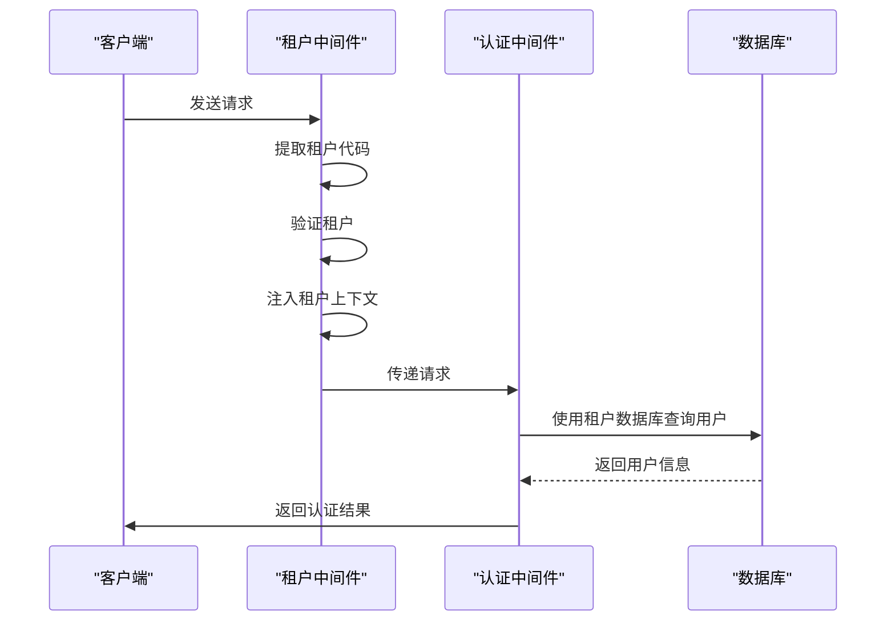

# 租户中间件机制

<cite>
**本文档引用的文件**   
- [tenant-resolver.middleware.ts](file://k.yyup.com/server/src/middlewares/tenant-resolver.middleware.ts)
- [tenant-resolver-shared-pool.middleware.ts](file://tenant-resolver-shared-pool.middleware.ts)
- [tenant-security.middleware.ts](file://k.yyup.com/server/src/middlewares/tenant-security.middleware.ts)
- [tenant-database.service.ts](file://k.yyup.com/server/src/services/tenant-database.service.ts)
- [app.ts](file://k.yyup.com/server/src/app.ts)
- [TENANT_DATABASE_CODE_FLOW.md](file://TENANT_DATABASE_CODE_FLOW.md)
</cite>

## 目录
1. [引言](#引言)
2. [租户识别机制](#租户识别机制)
3. [租户上下文注入](#租户上下文注入)
4. [中间件执行顺序与协同工作](#中间件执行顺序与协同工作)
5. [租户安全验证](#租户安全验证)
6. [错误处理机制](#错误处理机制)
7. [中间件注册与使用](#中间件注册与使用)
8. [最佳实践](#最佳实践)
9. [总结](#总结)

## 引言

本项目采用多租户架构，通过中间件机制实现租户隔离与数据安全。租户中间件是系统的核心组件，负责从HTTP请求中提取租户标识，解析并验证租户信息，将租户上下文注入到请求对象中，供后续的控制器和服务层使用。该机制确保了不同租户的数据隔离，同时提供了灵活的租户识别方式。

**Section sources**
- [TENANT_DATABASE_CODE_FLOW.md](file://TENANT_DATABASE_CODE_FLOW.md#L1-L499)

## 租户识别机制

租户中间件通过多种方式从HTTP请求中提取租户标识，主要支持子域名、请求头和JWT令牌三种方式。

### 子域名识别

中间件首先从请求的Host头中提取域名，然后通过正则表达式匹配租户代码。支持的格式包括`k001.yyup.cc`和`tenant1.kindergarten.com`等。例如，对于域名`k001.yyup.cc`，中间件会提取出租户代码`k001`。

```typescript
function extractTenantCode(domain: string): string | null {
  const cleanDomain = domain.split(':')[0];
  const match = cleanDomain.match(/^(k\d+)\.yyup\.cc$/);
  if (match) {
    return match[1];
  }
  const altMatch = cleanDomain.match(/^([a-zA-Z0-9]+)\.(kindergarten|kyyup)\.com$/);
  if (altMatch) {
    return altMatch[1];
  }
  return null;
}
```

### 请求头识别

除了子域名，中间件还支持从请求头中获取租户信息。虽然在当前实现中主要依赖子域名，但系统设计上保留了通过`X-Tenant-ID`等请求头识别租户的能力，为未来的扩展提供了灵活性。

### JWT令牌识别

对于经过认证的请求，中间件可以从JWT令牌中提取租户信息。这需要在认证过程中将租户代码编码到令牌的payload中，后续请求通过解析令牌来获取租户上下文。

**Section sources**
- [tenant-resolver.middleware.ts](file://k.yyup.com/server/src/middlewares/tenant-resolver.middleware.ts#L120-L139)
- [tenant-resolver-shared-pool.middleware.ts](file://tenant-resolver-shared-pool.middleware.ts#L103-L119)

## 租户上下文注入

一旦成功识别租户，中间件会将租户上下文注入到请求对象中，供后续的业务逻辑使用。

### 上下文数据结构

租户上下文包含以下关键信息：
- **租户代码**：租户的唯一标识符，如`k001`
- **域名**：请求的原始域名
- **数据库名称**：对应的租户数据库名称，格式为`tenant_k001`

```typescript
req.tenant = {
  code: tenantCode,
  domain: domain,
  databaseName: `tenant_${tenantCode}`
};
```

### 数据库连接管理

中间件通过`tenantDatabaseService`获取租户的数据库连接。在共享连接池模式下，所有租户共享一个全局连接池，通过完整表名（如`tenant_k001.users`）来访问不同租户的数据。

```typescript
req.tenantDb = tenantDatabaseService.getGlobalConnection();
```

这种设计显著降低了数据库连接数，从每个租户独立连接池的模式优化为全局共享连接池，提高了资源利用率和系统性能。

**Section sources**
- [tenant-resolver.middleware.ts](file://k.yyup.com/server/src/middlewares/tenant-resolver.middleware.ts#L81-L87)
- [tenant-database.service.ts](file://k.yyup.com/server/src/services/tenant-database.service.ts#L145-L150)

## 中间件执行顺序与协同工作

中间件的执行顺序对系统的正常运行至关重要。租户中间件需要在认证中间件之前执行，以确保认证过程能够基于正确的租户上下文进行。

### 执行流程

1. **请求到达**：HTTP请求首先经过租户识别中间件
2. **租户识别**：提取租户代码，验证租户存在性
3. **上下文注入**：将租户信息注入请求对象
4. **认证处理**：认证中间件使用租户上下文验证用户身份
5. **业务逻辑**：控制器和服务层使用租户上下文执行业务逻辑

### 与认证中间件的协同

认证中间件依赖于租户中间件提供的上下文。在登录和Token验证过程中，系统会使用`req.tenantDb`来查询租户数据库中的用户信息，确保用户只能访问自己租户的数据。



**Diagram sources **
- [TENANT_DATABASE_CODE_FLOW.md](file://TENANT_DATABASE_CODE_FLOW.md#L169-L306)

**Section sources**
- [app.ts](file://k.yyup.com/server/src/app.ts#L748-L771)

## 租户安全验证

为了防止租户数据泄露和越权访问，系统实现了多层次的安全验证机制。

### 域名与租户匹配验证

中间件会验证请求域名与租户代码的匹配关系，防止通过Host头伪造进行越权访问。例如，租户`k001`只能通过`k001.yyup.cc`域名访问。

```typescript
function isValidTenantDomain(domain: string, tenantCode: string): boolean {
  const cleanDomain = domain.split(':')[0];
  const expectedPattern = `^${tenantCode}\\.yyup\\.cc$`;
  const domainPattern = new RegExp(expectedPattern);
  return domainPattern.test(cleanDomain);
}
```

### MD5租户令牌验证

系统实现了基于MD5的租户令牌验证机制，结合用户手机号、租户域名、数据库名和时间戳生成安全令牌，有效防止令牌伪造和重放攻击。

```typescript
const tokenData = `${userPhone}:${tenantCode}:${tenantDomain}:${databaseName}:${timestamp}:${TOKEN_CONFIG.SALT}`;
const md5Hash = crypto.createHash('md5').update(tokenData, 'utf8').digest('hex');
const token = `${TOKEN_CONFIG.TOKEN_PREFIX}${md5Hash}`;
```

### 数据访问权限检查

在数据访问层面，中间件会检查URL参数、查询参数和请求体中的租户信息是否与已验证的租户匹配，防止通过参数篡改进行数据越权访问。

**Section sources**
- [tenant-security.middleware.ts](file://k.yyup.com/server/src/middlewares/tenant-security.middleware.ts#L152-L178)
- [tenant-security.middleware.ts](file://k.yyup.com/server/src/middlewares/tenant-security.middleware.ts#L197-L210)

## 错误处理机制

中间件对各种异常情况进行了完善的错误处理，确保系统的健壮性和用户体验。

### 租户识别失败

当无法从请求中识别租户时，中间件会根据环境返回不同的响应：
- **生产环境**：返回"无法识别的租户域名"错误
- **开发环境**：使用默认配置，允许继续执行

```typescript
if (!tenantCode) {
  if (process.env.NODE_ENV === 'production') {
    ApiResponse.error(res, '无法识别的租户域名', 'INVALID_TENANT_DOMAIN');
    return;
  } else {
    // 开发环境使用默认配置
    req.tenant = { code: 'dev', domain: domain, databaseName: 'tenant_dev' };
    next();
    return;
  }
}
```

### 租户不存在或未激活

当识别出的租户不存在或未激活时，返回"租户不存在或未激活"错误，引导用户检查域名是否正确。

### 数据库连接失败

在获取数据库连接失败时，中间件会尝试初始化连接，如果仍然失败，则返回"数据库连接失败"错误，便于运维人员排查问题。

**Section sources**
- [tenant-resolver.middleware.ts](file://k.yyup.com/server/src/middlewares/tenant-resolver.middleware.ts#L43-L50)
- [tenant-resolver.middleware.ts](file://k.yyup.com/server/src/middlewares/tenant-resolver.middleware.ts#L73-L78)

## 中间件注册与使用

租户中间件在应用启动时注册，根据请求路径决定使用强制租户识别还是可选租户识别。

### 中间件注册

在`app.ts`中，通过路由前缀判断是否需要强制租户识别：

```typescript
const requireTenantPaths = [
  '/api/users',
  '/api/students',
  '/api/teachers',
  // ... 其他需要租户识别的路径
];

app.use('/api', (req, res, next) => {
  const requestPath = req.path;
  const needsTenant = requireTenantPaths.some(path => requestPath.startsWith(path));
  
  if (needsTenant) {
    return tenantResolverMiddleware(req, res, next);
  } else {
    return optionalTenantResolverMiddleware(req, res, next);
  }
});
```

### 使用示例

开发者可以在控制器中直接使用注入的租户上下文：

```typescript
// 在控制器中使用租户上下文
export const getUserList = async (req: Request, res: Response) => {
  const tenantDb = req.tenantDb;
  const tenantCode = req.tenant?.code;
  
  const users = await tenantDb.query('SELECT * FROM users');
  res.json({ success: true, data: users });
};
```

**Section sources**
- [app.ts](file://k.yyup.com/server/src/app.ts#L748-L771)

## 最佳实践

### 自定义中间件扩展

开发者可以创建自定义中间件来扩展租户功能，例如：

```typescript
export const customTenantMiddleware = async (
  req: Request,
  res: Response,
  next: NextFunction
) => {
  // 在租户上下文基础上添加自定义逻辑
  if (req.tenant) {
    // 添加租户特定的配置
    req.tenantConfig = await getTenantConfig(req.tenant.code);
  }
  next();
};
```

### 性能优化

- **连接池配置**：根据实际负载调整连接池大小，生产环境建议设置`DB_POOL_MAX=30`，`DB_POOL_MIN=5`
- **缓存租户信息**：对于频繁访问的租户信息，可以使用Redis等缓存机制减少数据库查询
- **异步初始化**：在应用启动时异步初始化数据库连接池，提高启动速度

### 安全建议

- **环境隔离**：确保生产环境和开发环境的租户配置分离
- **日志审计**：记录所有租户相关的操作日志，便于安全审计
- **定期检查**：定期检查租户数据库的健康状态和连接使用情况

## 总结

本项目的租户中间件机制通过子域名、请求头和JWT令牌等多种方式识别租户，将租户上下文注入请求对象，并与认证中间件协同工作，确保了多租户环境下的数据隔离和安全访问。通过共享连接池的优化设计，显著提升了系统性能和资源利用率。完善的错误处理机制和安全验证策略，保障了系统的稳定性和安全性。开发者可以根据业务需求，通过自定义中间件扩展租户功能，实现更加灵活的多租户解决方案。