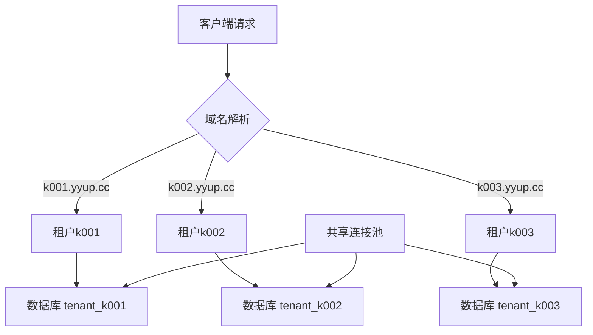
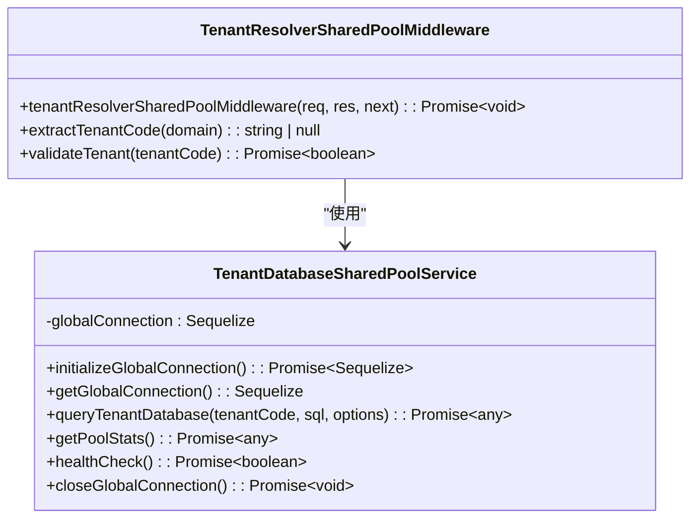
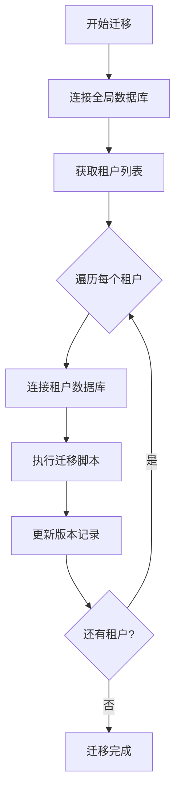

# 数据库隔离策略

<cite>
**本文档引用的文件**  
- [tenant-database-shared-pool.service.ts](file://tenant-database-shared-pool.service.ts)
- [tenant-resolver-shared-pool.middleware.ts](file://tenant-resolver-shared-pool.middleware.ts)
- [database-initialization.ts](file://database-initialization.ts)
- [k.yyup.com/database/migrations/20250815_create_website_automation_tables.sql](file://k.yyup.com/database/migrations/20250815_create_website_automation_tables.sql)
- [k.yyup.com/database/migrations/create_ai_shortcuts_table.sql](file://k.yyup.com/database/migrations/create_ai_shortcuts_table.sql)
- [unified-tenant-system/database/init-unified-auth.sql](file://unified-tenant-system/database/init-unified-auth.sql)
</cite>

## 目录
1. [引言](#引言)
2. [数据库隔离模式](#数据库隔离模式)
3. [数据库连接池管理](#数据库连接池管理)
4. [ORM配置与多租户支持](#orm配置与多租户支持)
5. [数据库迁移策略](#数据库迁移策略)
6. [数据库性能优化](#数据库性能优化)
7. [多租户查询最佳实践](#多租户查询最佳实践)
8. [结论](#结论)

## 引言
k.yyupgame项目采用先进的多租户架构，通过数据库层面的隔离策略确保不同租户数据的安全性和独立性。本项目实现了基于共享连接池的独立数据库隔离模式，所有租户拥有独立的数据库实例，但共享同一个连接池资源。这种架构既保证了数据的完全隔离，又优化了数据库连接资源的使用效率。系统通过域名识别租户，并自动路由到相应的数据库，为教育机构提供安全、高效、可扩展的SaaS服务。

## 数据库隔离模式
k.yyupgame项目采用**独立数据库-共享连接池**的多租户隔离模式。每个租户拥有完全独立的数据库实例，确保数据层面的物理隔离和安全性。数据库命名遵循`tenant_{租户代码}`的规范，例如租户k001的数据库名为`tenant_k001`。

该模式通过在SQL查询中动态添加数据库前缀来实现租户数据访问。系统识别租户后，会自动将原始SQL语句中的表名（如`users`）转换为完整的数据库表名格式（如`tenant_k001.users`）。这种设计避免了不同租户间的数据混淆，同时保持了查询逻辑的简洁性。

**图示来源**  
- [tenant-database-shared-pool.service.ts](file://tenant-database-shared-pool.service.ts#L78-L123)
- [tenant-resolver-shared-pool.middleware.ts](file://tenant-resolver-shared-pool.middleware.ts#L42-L77)

## 数据库连接池管理
项目采用全局共享的数据库连接池机制，所有租户共享同一个连接池资源。连接池配置由环境变量`DB_POOL_MAX`和`DB_POOL_MIN`控制，默认最大连接数为30，最小连接数为5。这种设计优化了数据库资源利用率，避免了为每个租户创建独立连接池导致的资源浪费。

连接池通过单例模式实现，确保整个应用实例中只有一个全局连接。当请求到达时，租户识别中间件会将共享连接注入到请求上下文中，供后续业务逻辑使用。连接池还提供了健康检查机制，定期验证连接状态，确保数据库服务的稳定性。

**图示来源**  
- [tenant-database-shared-pool.service.ts](file://tenant-database-shared-pool.service.ts#L9-L177)
- [tenant-resolver-shared-pool.middleware.ts](file://tenant-resolver-shared-pool.middleware.ts#L6-L142)

**本节来源**  
- [tenant-database-shared-pool.service.ts](file://tenant-database-shared-pool.service.ts#L15-L169)
- [database-initialization.ts](file://database-initialization.ts#L13-L55)

## ORM配置与多租户支持
项目使用Sequelize作为ORM框架，并通过自定义服务层实现多租户支持。ORM本身不直接管理多租户逻辑，而是由`TenantDatabaseSharedPoolService`服务封装了租户识别和数据库路由功能。

在模型定义方面，系统采用动态SQL重写机制而非静态模型配置。当执行查询时，系统会自动分析SQL语句并为表名添加租户数据库前缀。目前支持的表名包括：`users`、`roles`、`permissions`、`classes`、`students`、`teachers`、`parents`、`announcements`、`activities`和`enrollments`等核心业务表。

事务管理通过共享连接池实现，确保在单个请求上下文中所有数据库操作都针对同一个租户数据库。这种设计避免了跨租户的数据污染风险，同时保持了事务的ACID特性。

**本节来源**  
- [tenant-database-shared-pool.service.ts](file://tenant-database-shared-pool.service.ts#L71-L123)
- [tenant-resolver-shared-pool.middleware.ts](file://tenant-resolver-shared-pool.middleware.ts#L79-L82)

## 数据库迁移策略
在多租户环境下，数据库迁移采用集中式管理策略。迁移脚本存储在`database/migrations`目录中，包含创建AI助手快捷操作表和网站自动化功能表等核心结构。

迁移执行流程如下：首先在全局认证数据库`unified_auth`中执行基础架构迁移，然后为每个租户数据库执行相同的迁移脚本。这种策略确保所有租户的数据库结构保持同步。例如，`create_ai_shortcuts_table.sql`脚本会在每个`tenant_*`数据库中创建相同的`ai_shortcuts`表结构。

系统还实现了数据库版本管理机制，通过`schema_version`表记录迁移历史，便于追踪和回滚。迁移过程包含事务控制，确保结构变更的原子性，避免部分更新导致的数据不一致问题。

**图示来源**  
- [unified-tenant-system/database/init-unified-auth.sql](file://unified-tenant-system/database/init-unified-auth.sql#L8-L253)
- [k.yyup.com/database/migrations/create_ai_shortcuts_table.sql](file://k.yyup.com/database/migrations/create_ai_shortcuts_table.sql#L1-L241)

## 数据库性能优化
针对多租户环境的性能优化，项目采取了多项策略。首先，连接池配置经过精心调优，最大连接数设置为30，避免过多连接导致数据库性能下降。连接获取超时设置为30秒，空闲连接超时为10秒，确保连接资源的高效利用。

在查询优化方面，系统为常用查询字段创建了适当的索引。例如，在`automation_tasks`表中为`user_id`、`status`和`created_at`字段创建了索引，显著提升了查询性能。同时，系统实现了连接池统计信息监控，可实时查看活跃连接数和空闲连接数，为性能调优提供数据支持。

缓存机制主要在应用层实现，数据库层面依赖MySQL自身的查询缓存。对于高频读取的配置数据，如AI助手快捷操作，系统建议在应用层使用Redis等缓存技术，减少数据库访问压力。

**本节来源**  
- [tenant-database-shared-pool.service.ts](file://tenant-database-shared-pool.service.ts#L20-L36)
- [k.yyup.com/database/migrations/20250815_create_website_automation_tables.sql](file://k.yyup.com/database/migrations/20250815_create_website_automation_tables.sql#L22-L25)

## 多租户查询最佳实践
为确保高效、安全的多租户数据库查询，开发者应遵循以下最佳实践：

1. **始终通过服务层访问数据库**：避免直接使用Sequelize实例，应通过`TenantDatabaseSharedPoolService`提供的方法进行查询，确保租户隔离逻辑的正确执行。

2. **使用参数化查询**：防止SQL注入攻击，特别是在处理用户输入时。Sequelize的查询接口支持参数化，应优先使用。

3. **合理使用连接池**：避免长时间占用数据库连接，及时释放资源。对于复杂操作，应考虑使用连接池的获取和释放机制。

4. **监控查询性能**：对于复杂查询，应添加执行时间监控，及时发现性能瓶颈。可以利用Sequelize的logging功能进行调试。

5. **遵循事务边界**：确保事务范围明确，避免跨租户操作。在多步操作中，应确保所有步骤都在同一个租户上下文中执行。

6. **处理连接异常**：实现重试机制和优雅降级策略，当数据库连接失败时提供友好的错误提示。

**本节来源**  
- [tenant-database-shared-pool.service.ts](file://tenant-database-shared-pool.service.ts#L71-L92)
- [tenant-resolver-shared-pool.middleware.ts](file://tenant-resolver-shared-pool.middleware.ts#L80-L90)

## 结论
k.yyupgame项目的数据库隔离策略通过独立数据库-共享连接池的架构，成功实现了多租户环境下的数据安全与资源优化平衡。系统采用动态SQL重写机制，结合域名驱动的租户识别，确保了数据访问的准确性和隔离性。连接池的集中管理提高了数据库资源利用率，而完善的迁移和监控机制保障了系统的稳定运行。这一架构为教育SaaS平台提供了可扩展、高性能、安全可靠的数据库解决方案，值得在类似多租户系统中推广应用。