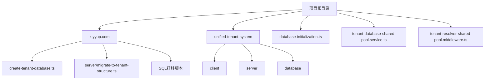
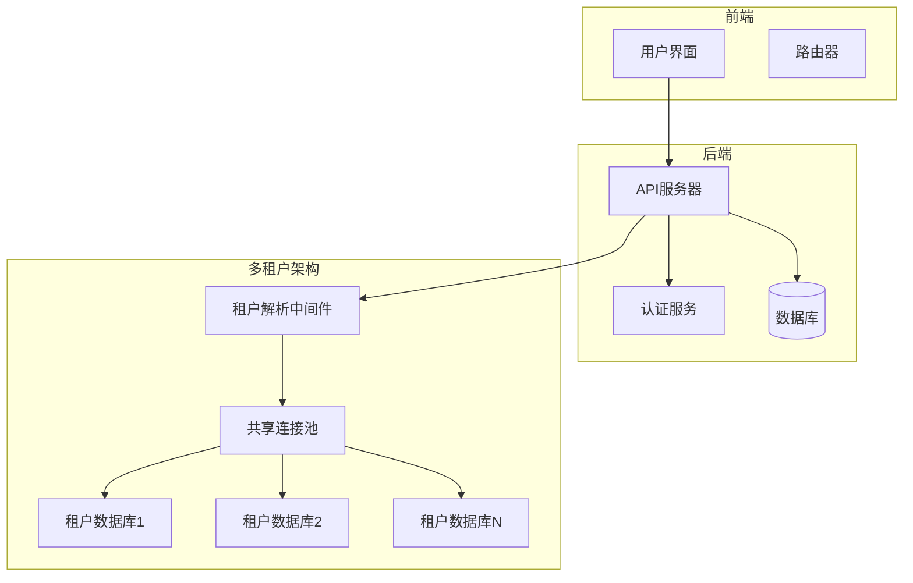
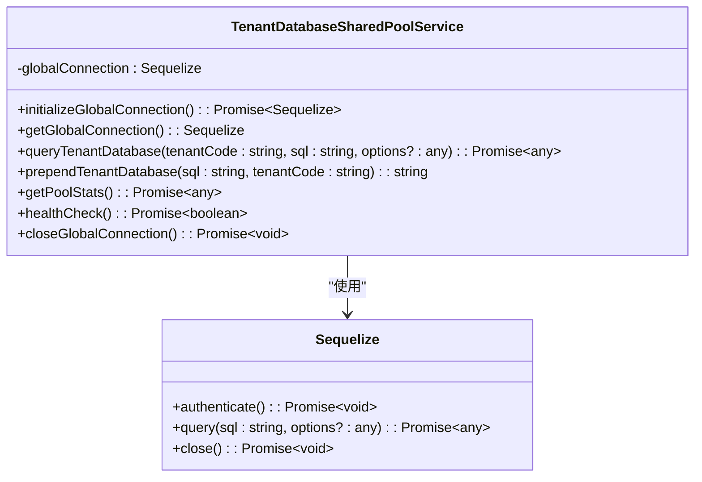
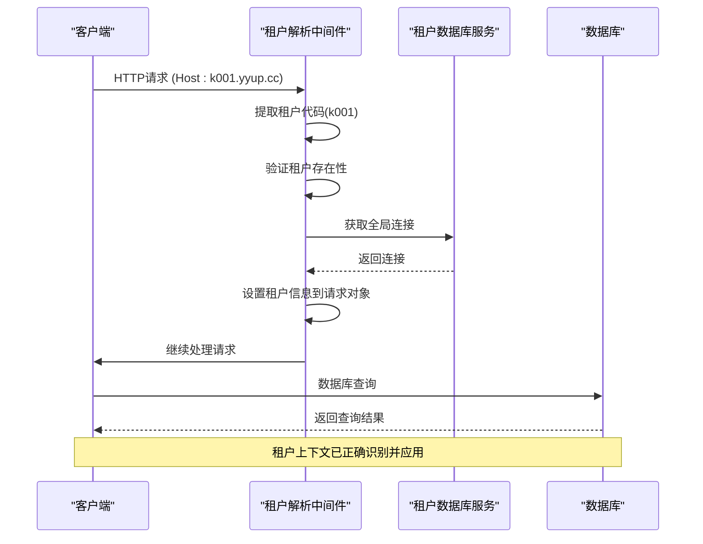
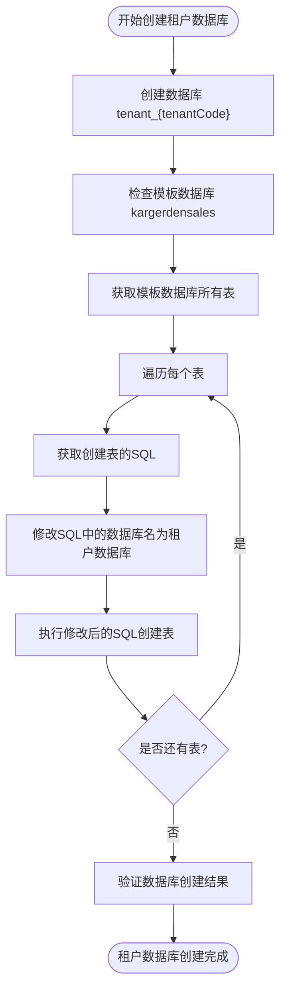
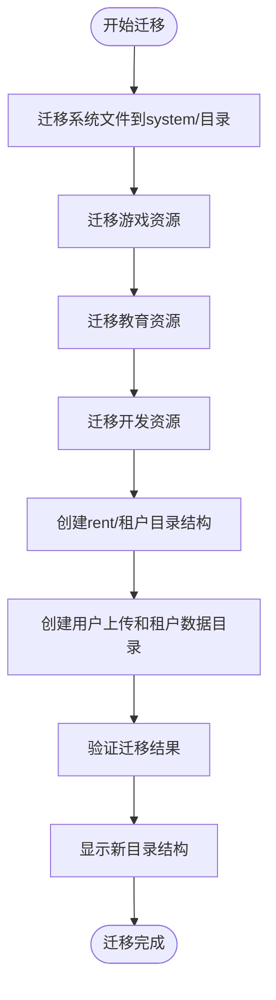
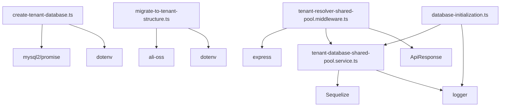

# 迁移策略

<cite>
**本文档引用的文件**
- [database-initialization.ts](file://database-initialization.ts)
- [tenant-database-shared-pool.service.ts](file://tenant-database-shared-pool.service.ts)
- [tenant-resolver-shared-pool.middleware.ts](file://tenant-resolver-shared-pool.middleware.ts)
- [create-tenant-database.ts](file://k.yyup.com/create-tenant-database.ts)
- [migrate-to-tenant-structure.ts](file://k.yyup.com/server/migrate-to-tenant-structure.ts)
- [add-analytics-center.sql](file://k.yyup.com/add-analytics-center.sql)
- [add-personnel-center.sql](file://k.yyup.com/add-personnel-center.sql)
- [add-student-management-permissions.sql](file://k.yyup.com/add-student-management-permissions.sql)
- [add-teacher-management-permissions.sql](file://k.yyup.com/add-teacher-management-permissions.sql)
</cite>

## 目录
1. [引言](#引言)
2. [项目结构](#项目结构)
3. [核心组件](#核心组件)
4. [架构概述](#架构概述)
5. [详细组件分析](#详细组件分析)
6. [依赖分析](#依赖分析)
7. [性能考虑](#性能考虑)
8. [故障排除指南](#故障排除指南)
9. [结论](#结论)

## 引言
本文档全面介绍k.yyupgame在多租户环境下的数据库迁移执行策略。详细说明如何确保每个租户的数据库结构同步更新，包括迁移脚本的版本控制、执行顺序管理和回滚机制。描述迁移工具如何识别当前租户上下文，并在正确的Schema或数据库中应用变更。解释在新增租户时如何自动应用最新的数据库结构，以及如何处理迁移过程中的数据兼容性问题。提供实际案例展示复杂的数据库变更（如跨Schema的外键约束）的迁移方案。为开发团队提供编写安全、可靠的多租户迁移脚本的最佳实践指南。

## 项目结构
k.yyupgame项目采用多租户架构设计，通过共享连接池和租户识别中间件实现高效的数据库管理。项目主要包含两个核心目录：k.yyup.com和unified-tenant-system，其中包含数据库初始化、租户解析和迁移相关的关键文件。

**图示来源**
- [database-initialization.ts](file://database-initialization.ts)
- [tenant-database-shared-pool.service.ts](file://tenant-database-shared-pool.service.ts)
- [tenant-resolver-shared-pool.middleware.ts](file://tenant-resolver-shared-pool.middleware.ts)

**本节来源**
- [database-initialization.ts](file://database-initialization.ts)
- [tenant-database-shared-pool.service.ts](file://tenant-database-shared-pool.service.ts)
- [tenant-resolver-shared-pool.middleware.ts](file://tenant-resolver-shared-pool.middleware.ts)

## 核心组件
k.yyupgame的核心组件包括数据库初始化模块、租户数据库共享池服务和租户解析中间件。这些组件共同协作，确保多租户环境下数据库的高效管理和安全访问。

**本节来源**
- [database-initialization.ts](file://database-initialization.ts#L1-L89)
- [tenant-database-shared-pool.service.ts](file://tenant-database-shared-pool.service.ts#L1-L177)
- [tenant-resolver-shared-pool.middleware.ts](file://tenant-resolver-shared-pool.middleware.ts#L1-L142)

## 架构概述
k.yyupgame采用共享连接池的多租户架构，所有租户共享一个全局数据库连接池，通过完整的表名（database.table）来访问不同租户的数据。这种架构既保证了资源的高效利用，又实现了租户间的数据隔离。

**图示来源**
- [tenant-database-shared-pool.service.ts](file://tenant-database-shared-pool.service.ts#L1-L177)
- [tenant-resolver-shared-pool.middleware.ts](file://tenant-resolver-shared-pool.middleware.ts#L1-L142)

## 详细组件分析
### 租户数据库共享池服务分析
租户数据库共享池服务是k.yyupgame多租户架构的核心组件，负责管理全局数据库连接池和租户数据库查询。

#### 类图

**图示来源**
- [tenant-database-shared-pool.service.ts](file://tenant-database-shared-pool.service.ts#L9-L177)

#### 租户解析中间件分析
租户解析中间件负责识别请求中的租户信息，并将其与相应的数据库连接关联。

**图示来源**
- [tenant-resolver-shared-pool.middleware.ts](file://tenant-resolver-shared-pool.middleware.ts#L26-L142)
- [tenant-database-shared-pool.service.ts](file://tenant-database-shared-pool.service.ts#L15-L56)

**本节来源**
- [tenant-database-shared-pool.service.ts](file://tenant-database-shared-pool.service.ts#L1-L177)
- [tenant-resolver-shared-pool.middleware.ts](file://tenant-resolver-shared-pool.middleware.ts#L1-L142)

### 数据库迁移策略分析
k.yyupgame的数据库迁移策略包括租户数据库创建、结构复制和权限配置等关键步骤。

#### 租户数据库创建流程

**图示来源**
- [create-tenant-database.ts](file://k.yyup.com/create-tenant-database.ts#L27-L165)

#### 多租户目录结构迁移

**图示来源**
- [migrate-to-tenant-structure.ts](file://k.yyup.com/server/migrate-to-tenant-structure.ts#L210-L288)

**本节来源**
- [create-tenant-database.ts](file://k.yyup.com/create-tenant-database.ts#L1-L165)
- [migrate-to-tenant-structure.ts](file://k.yyup.com/server/migrate-to-tenant-structure.ts#L1-L288)

## 依赖分析
k.yyupgame的多租户数据库迁移系统依赖于多个关键组件和服务，这些依赖关系确保了系统的稳定性和可维护性。

**图示来源**
- [create-tenant-database.ts](file://k.yyup.com/create-tenant-database.ts)
- [migrate-to-tenant-structure.ts](file://k.yyup.com/server/migrate-to-tenant-structure.ts)
- [tenant-database-shared-pool.service.ts](file://tenant-database-shared-pool.service.ts)
- [tenant-resolver-shared-pool.middleware.ts](file://tenant-resolver-shared-pool.middleware.ts)

**本节来源**
- [create-tenant-database.ts](file://k.yyup.com/create-tenant-database.ts#L1-L165)
- [migrate-to-tenant-structure.ts](file://k.yyup.com/server/migrate-to-tenant-structure.ts#L1-L288)
- [tenant-database-shared-pool.service.ts](file://tenant-database-shared-pool.service.ts#L1-L177)
- [tenant-resolver-shared-pool.middleware.ts](file://tenant-resolver-shared-pool.middleware.ts#L1-L142)

## 性能考虑
k.yyupgame的多租户数据库架构在性能方面进行了多项优化：

1. **连接池管理**：通过全局连接池减少数据库连接开销，配置了合理的最大和最小连接数。
2. **SQL预处理**：在查询租户数据库时，通过正则表达式自动为表名添加租户数据库前缀，避免了重复的字符串操作。
3. **健康检查**：定期执行数据库连接健康检查，确保连接池的稳定性。
4. **异步操作**：所有数据库操作都采用异步方式，避免阻塞主线程。

**本节来源**
- [tenant-database-shared-pool.service.ts](file://tenant-database-shared-pool.service.ts#L20-L36)
- [tenant-database-shared-pool.service.ts](file://tenant-database-shared-pool.service.ts#L71-L92)

## 故障排除指南
当遇到多租户数据库迁移问题时，可以按照以下步骤进行排查：

1. **检查环境变量**：确保DB_HOST、DB_PORT、DB_USER、DB_PASSWORD等数据库连接参数正确配置。
2. **验证连接池**：检查全局连接池是否成功初始化，可以通过healthCheck方法验证。
3. **检查租户代码**：确认域名中的租户代码格式正确（如k001.yyup.cc）。
4. **查看日志**：检查应用日志中的数据库连接和查询错误信息。
5. **验证数据库结构**：确认模板数据库kargerdensales存在且结构完整。

**本节来源**
- [database-initialization.ts](file://database-initialization.ts#L13-L40)
- [tenant-database-shared-pool.service.ts](file://tenant-database-shared-pool.service.ts#L15-L56)
- [tenant-resolver-shared-pool.middleware.ts](file://tenant-resolver-shared-pool.middleware.ts#L32-L69)

## 结论
k.yyupgame的多租户数据库迁移策略通过共享连接池和租户识别中间件实现了高效、安全的数据库管理。系统能够自动识别租户上下文并在正确的数据库中应用变更，确保了数据隔离和安全性。通过标准化的迁移脚本和权限配置，系统能够快速为新租户创建完整的数据库结构。这种架构设计既保证了资源的高效利用，又提供了良好的可扩展性和维护性，为多租户SaaS应用的数据库管理提供了可靠的解决方案。