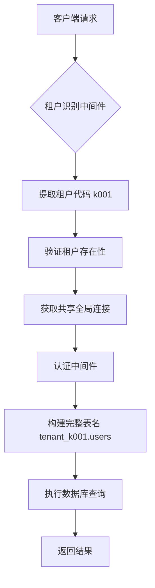
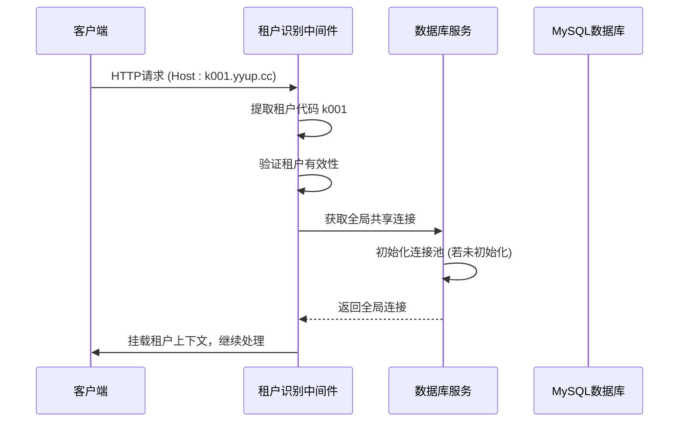
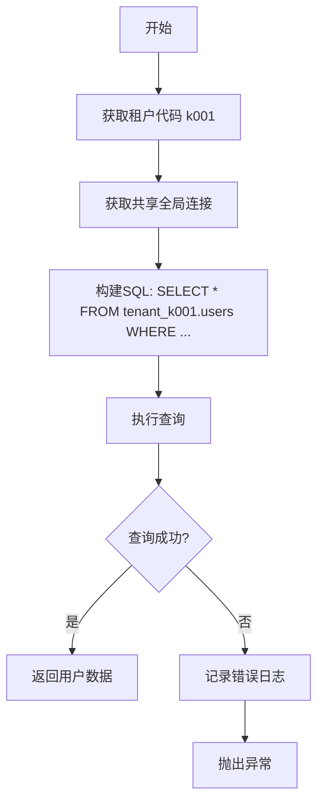

# 连接池管理

<cite>
**本文档引用的文件**
- [tenant-database-shared-pool.service.ts](file://tenant-database-shared-pool.service.ts)
- [tenant-resolver-shared-pool.middleware.ts](file://tenant-resolver-shared-pool.middleware.ts)
- [auth-shared-pool-example.middleware.ts](file://auth-shared-pool-example.middleware.ts)
- [database-initialization.ts](file://database-initialization.ts)
- [k.yyup.com/server/src/config/database-unified.ts](file://k.yyup.com/server/src/config/database-unified.ts)
- [k.yyup.com/server/src/services/tenant-database.service.ts](file://k.yyup.com/server/src/services/tenant-database.service.ts)
</cite>

## 目录
1. [引言](#引言)
2. [连接池架构概述](#连接池架构概述)
3. [连接池初始化与生命周期管理](#连接池初始化与生命周期管理)
4. [租户连接上下文的建立与销毁](#租户连接上下文的建立与销毁)
5. [连接池配置参数与优化策略](#连接池配置参数与优化策略)
6. [高并发下的弹性伸缩与监控机制](#高并发下的弹性伸缩与监控机制)
7. [租户感知的数据库操作流程](#租户感知的数据库操作流程)
8. [异常处理与重试机制](#异常处理与重试机制)
9. [运维调优建议](#运维调优建议)
10. [结论](#结论)

## 引言

k.yyupgame多租户系统采用共享连接池架构来高效管理数据库连接。该机制通过单一连接池服务所有租户，利用完整表名（如`tenant_k001.users`）实现租户数据隔离。这种设计在保证数据安全的同时，显著提升了资源利用率和系统性能。本文档深入解析该连接池管理机制，涵盖初始化、租户上下文管理、配置优化、高并发处理及运维调优等核心方面。

## 连接池架构概述

k.yyupgame系统采用“共享连接池+完整表名”的多租户数据库访问模式。所有租户共享一个全局数据库连接池，通过在SQL语句中动态添加租户数据库前缀（如`tenant_k001`）来访问各自的数据。这种架构避免了为每个租户维护独立连接池的资源开销，实现了连接资源的集中管理和高效复用。

**图表来源**
- [tenant-resolver-shared-pool.middleware.ts](file://tenant-resolver-shared-pool.middleware.ts#L26-L92)
- [auth-shared-pool-example.middleware.ts](file://auth-shared-pool-example.middleware.ts#L63-L77)

## 连接池初始化与生命周期管理

连接池的生命周期由`TenantDatabaseSharedPoolService`类统一管理。系统启动时，通过`initializeGlobalConnection`方法创建一个全局的Sequelize实例，并连接到MySQL系统数据库。此连接池作为单例存在，所有租户共享。

初始化过程包括：
1. 从环境变量读取连接池配置（最大/最小连接数等）。
2. 创建Sequelize实例并配置连接池参数。
3. 执行数据库认证，建立物理连接。
4. 设置连接事件监听器用于调试。

连接池的关闭通过`closeGlobalConnection`方法实现，该方法会在应用收到SIGTERM或SIGINT信号时被优雅关闭流程调用，确保连接被正确释放。

**章节来源**
- [tenant-database-shared-pool.service.ts](file://tenant-database-shared-pool.service.ts#L15-L55)
- [database-initialization.ts](file://database-initialization.ts#L13-L39)

## 租户连接上下文的建立与销毁

租户连接上下文的建立由`tenantResolverSharedPoolMiddleware`中间件负责。该中间件在每个请求的预处理阶段执行，其核心流程如下：

1. **租户识别**：从请求的`Host`头中提取租户代码（如`k001`）。
2. **租户验证**：调用统一认证系统验证租户的有效性和激活状态。
3. **上下文建立**：将租户信息（代码、数据库名）和共享的全局数据库连接挂载到请求对象（`req.tenant`和`req.tenantDb`）上。

此上下文在请求处理完成后自动销毁，无需显式关闭连接，因为连接属于共享池，由Sequelize框架自动管理其生命周期。

**图表来源**
- [tenant-resolver-shared-pool.middleware.ts](file://tenant-resolver-shared-pool.middleware.ts#L26-L92)
- [tenant-database-shared-pool.service.ts](file://tenant-database-shared-pool.service.ts#L15-L55)

## 连接池配置参数与优化策略

连接池的配置参数对系统性能至关重要，主要参数及其优化策略如下：

| 配置参数 | 默认值 | 说明 | 多租户优化策略 |
| :--- | :--- | :--- | :--- |
| `pool.max` | 30 | 连接池最大连接数 | 根据总租户数和并发量调整，避免过度消耗数据库资源 |
| `pool.min` | 5 | 连接池最小空闲连接数 | 保持一定数量的常驻连接，减少连接创建开销 |
| `pool.acquire` | 30000ms | 获取连接超时时间 | 设置合理超时，防止请求无限等待，避免雪崩 |
| `pool.idle` | 10000ms | 连接空闲超时时间 | 及时回收空闲连接，释放资源，但不宜过短以免频繁创建 |

这些参数通过环境变量（如`DB_POOL_MAX`）进行配置，实现了与代码的解耦，便于在不同环境（开发、测试、生产）中灵活调整。

**章节来源**
- [tenant-database-shared-pool.service.ts](file://tenant-database-shared-pool.service.ts#L20-L35)
- [k.yyup.com/server/src/config/database-unified.ts](file://k.yyup.com/server/src/config/database-unified.ts#L116-L120)

## 高并发下的弹性伸缩与监控机制

在高并发场景下，共享连接池通过其内置的连接池管理器实现弹性伸缩。当并发请求增多时，连接池会从空闲连接中分配连接；当连接不足时，新请求将排队等待，直到有连接被释放或达到`acquire`超时。

系统提供了完善的监控和诊断机制：
- **健康检查**：`healthCheck`方法可定期检查连接池的连通性。
- **统计信息**：`getPoolStats`方法返回连接池的当前状态（活跃/空闲连接数）。
- **日志记录**：详细的日志记录了连接的获取、释放和错误信息，便于诊断连接泄漏等问题。

通过监控`activeConnections`和`idleConnections`，运维人员可以判断连接池是否处于健康状态，是否存在连接泄漏（活跃连接数持续增长）或配置不当（空闲连接过多）。

**章节来源**
- [tenant-database-shared-pool.service.ts](file://tenant-database-shared-pool.service.ts#L128-L138)
- [tenant-database-shared-pool.service.ts](file://tenant-database-shared-pool.service.ts#L144-L153)

## 租户感知的数据库操作流程

租户感知的数据库操作是通过在SQL语句中动态插入租户数据库前缀来实现的。以用户认证为例，其流程如下：

1. 认证中间件从请求上下文中获取租户代码和共享数据库连接。
2. 构建SQL查询语句，将表名替换为完整表名（如`users` -> `tenant_k001.users`）。
3. 使用共享连接执行查询。

**图表来源**
- [auth-shared-pool-example.middleware.ts](file://auth-shared-pool-example.middleware.ts#L63-L77)
- [tenant-database-shared-pool.service.ts](file://tenant-database-shared-pool.service.ts#L71-L84)

## 异常处理与重试机制

系统实现了多层次的异常处理机制：
- **连接获取失败**：在`tenantResolverSharedPoolMiddleware`中捕获，返回`DB_CONNECTION_FAILED`错误。
- **SQL执行失败**：在`queryTenantDatabase`方法中捕获，记录详细错误日志（包括租户代码和SQL语句）后重新抛出。
- **认证失败**：在认证中间件中捕获，返回标准化的API错误响应。

对于暂时性错误（如网络抖动），系统依赖于Sequelize框架的底层重试机制。对于业务逻辑错误，则由上层服务进行处理，通常不进行自动重试。

**章节来源**
- [tenant-resolver-shared-pool.middleware.ts](file://tenant-resolver-shared-pool.middleware.ts#L86-L89)
- [tenant-database-shared-pool.service.ts](file://tenant-database-shared-pool.service.ts#L84-L91)

## 运维调优建议

为确保连接池性能最优，建议运维人员采取以下措施：
1. **监控连接池指标**：定期检查`activeConnections`和`idleConnections`，确保活跃连接数远小于`pool.max`。
2. **合理设置超时**：`acquire`超时不宜过长，避免请求堆积；`idle`超时不宜过短，避免连接频繁创建销毁。
3. **压力测试**：在生产部署前进行充分的压力测试，根据测试结果调整`pool.max`和`pool.min`。
4. **日志分析**：定期分析数据库日志，排查潜在的连接泄漏或慢查询。
5. **环境隔离**：开发和测试环境使用独立的数据库实例，避免影响生产环境。

## 结论

k.yyupgame的多租户数据库连接池管理机制通过共享连接池和完整表名的方式，实现了资源高效利用和数据安全隔离的完美平衡。该机制设计简洁、性能优越，能够有效支撑高并发场景下的稳定运行。通过合理的配置、监控和调优，可以确保系统长期稳定、高效地服务于所有租户。