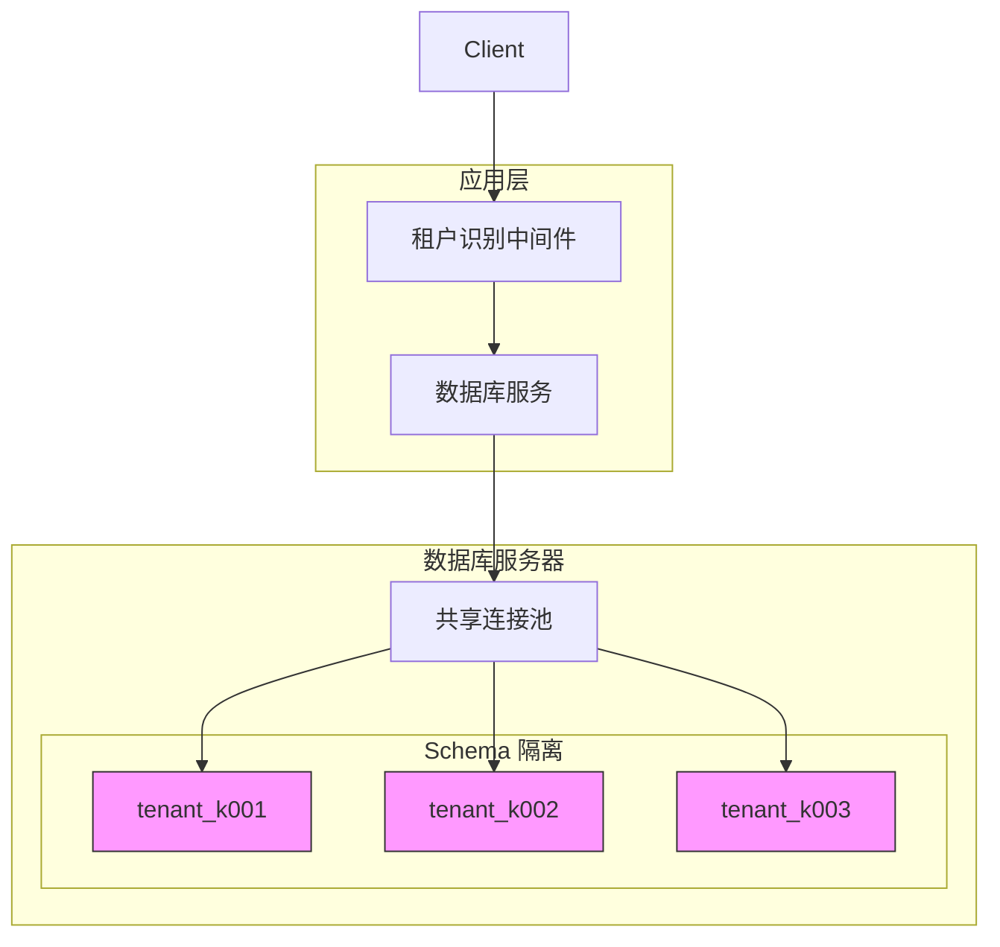
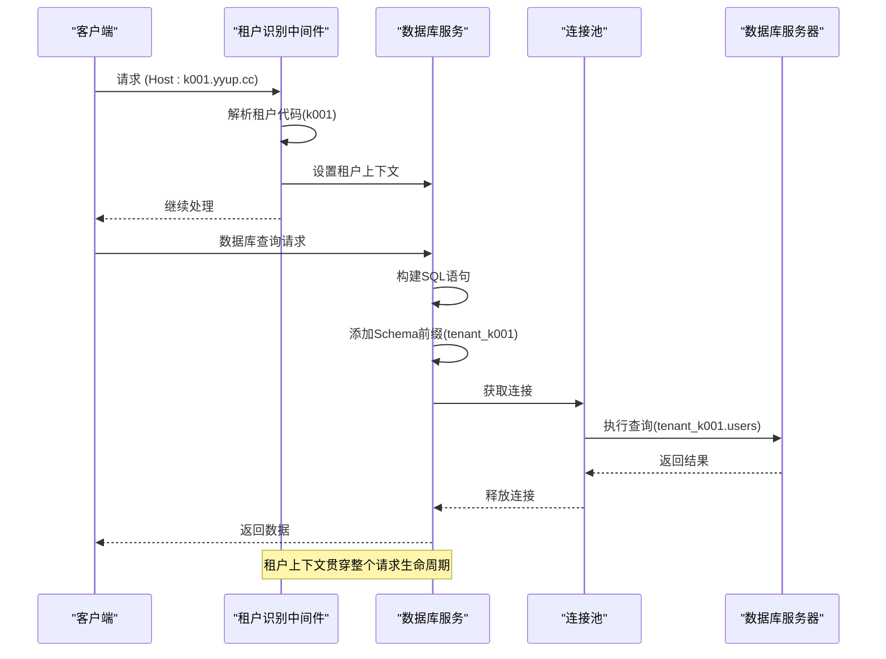
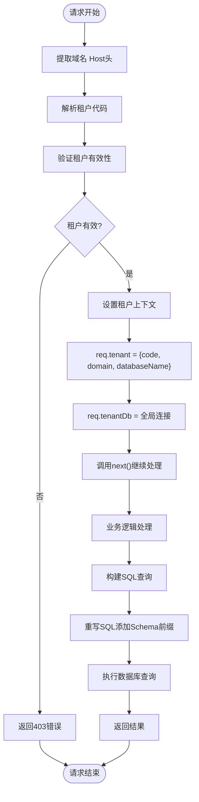
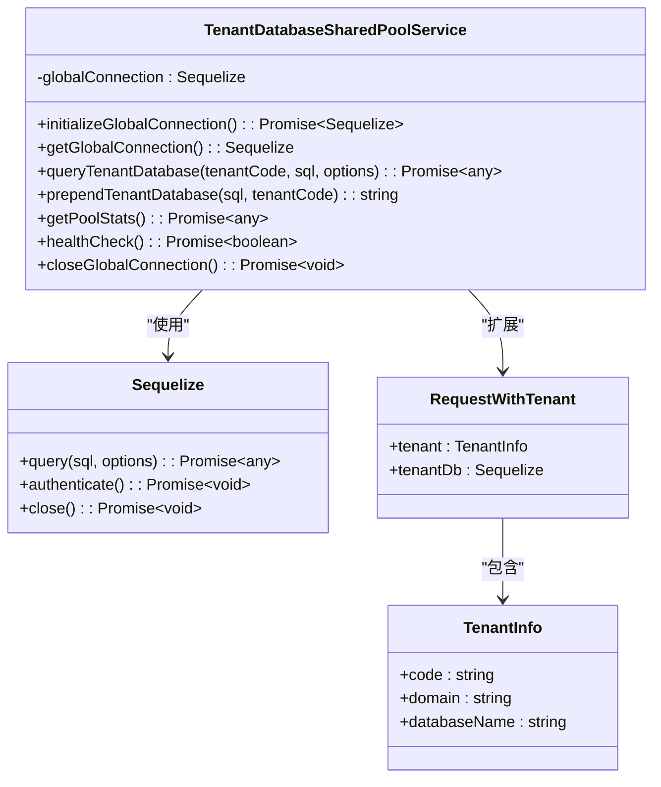
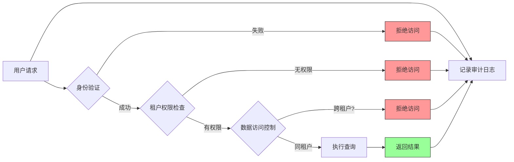

# 隔离模式设计

<cite>
**本文档引用的文件**
- [database-initialization.ts](file://database-initialization.ts)
- [tenant-database-shared-pool.service.ts](file://tenant-database-shared-pool.service.ts)
- [tenant-resolver-shared-pool.middleware.ts](file://tenant-resolver-shared-pool.middleware.ts)
- [auth-shared-pool-example.middleware.ts](file://auth-shared-pool-example.middleware.ts)
- [TENANT_DATABASE_ACCESS_MECHANISM.md](file://TENANT_DATABASE_ACCESS_MECHANISM.md)
- [SHARED_POOL_IMPLEMENTATION_SUMMARY.md](file://SHARED_POOL_IMPLEMENTATION_SUMMARY.md)
- [CONNECTION_POOL_OPTIMIZATION.md](file://CONNECTION_POOL_OPTIMIZATION.md)
</cite>

## 目录
1. [引言](#引言)
2. [多租户数据库隔离架构](#多租户数据库隔离架构)
3. [共享数据库-独立Schema实现方案](#共享数据库-独立schema实现方案)
4. [数据逻辑隔离机制](#数据逻辑隔离机制)
5. [数据库表结构设计原则](#数据库表结构设计原则)
6. [Sequelize ORM多Schema支持](#sequelize-orm多schema支持)
7. [租户感知的数据库查询实现](#租户感知的数据库查询实现)
8. [安全漏洞防护策略](#安全漏洞防护策略)
9. [开发者最佳实践](#开发者最佳实践)
10. [结论](#结论)

## 引言
k.yyupgame系统采用先进的多租户架构，为不同幼儿园实例提供数据隔离和安全性保障。本系统通过共享数据库-独立Schema的模式，实现了高效的数据隔离，确保各租户数据的独立性和安全性。该架构不仅提高了资源利用率，还简化了数据库管理和维护工作。

## 多租户数据库隔离架构
k.yyupgame系统采用共享数据库-独立Schema的多租户隔离模式。在这种架构中，所有租户共享同一个数据库服务器和连接池，但每个租户拥有独立的Schema（数据库）。这种设计平衡了资源利用率和数据隔离性，既避免了为每个租户创建独立数据库实例的资源浪费，又确保了不同租户之间的数据完全隔离。



**图示来源**
- [tenant-database-shared-pool.service.ts](file://tenant-database-shared-pool.service.ts#L6-L177)
- [tenant-resolver-shared-pool.middleware.ts](file://tenant-resolver-shared-pool.middleware.ts#L6-L142)

**本节来源**
- [tenant-database-shared-pool.service.ts](file://tenant-database-shared-pool.service.ts#L6-L177)
- [tenant-resolver-shared-pool.middleware.ts](file://tenant-resolver-shared-pool.middleware.ts#L6-L142)

## 共享数据库-独立Schema实现方案
系统通过租户ID前缀和独立Schema的组合来实现数据逻辑隔离。每个租户的Schema名称以"tenant_"为前缀，后接租户代码（如k001），形成唯一的Schema标识。这种命名约定确保了Schema名称的唯一性和可识别性。

核心实现方案包括：
1. **全局连接池初始化**：系统启动时创建共享的数据库连接池，所有租户共享该连接池。
2. **租户识别**：通过域名解析获取租户代码，如k001.yyup.cc对应租户k001。
3. **动态Schema路由**：在执行SQL查询时，自动将表名替换为"Schema.表名"的完整格式。



**图示来源**
- [database-initialization.ts](file://database-initialization.ts#L13-L89)
- [tenant-database-shared-pool.service.ts](file://tenant-database-shared-pool.service.ts#L71-L92)
- [tenant-resolver-shared-pool.middleware.ts](file://tenant-resolver-shared-pool.middleware.ts#L26-L97)

**本节来源**
- [database-initialization.ts](file://database-initialization.ts#L13-L89)
- [tenant-database-shared-pool.service.ts](file://tenant-database-shared-pool.service.ts#L71-L92)

## 数据逻辑隔离机制
系统通过多层次的机制确保不同幼儿园实例的数据安全性和独立性。核心隔离机制包括租户识别、上下文传递和查询重写。

### 租户识别流程
租户识别中间件从请求的Host头或域名中提取租户代码。系统支持多种域名格式：
- k001.yyup.cc → 租户k001
- kindergarten.kyyup.com → 租户kindergarten
- 自定义域名通过配置映射到租户代码

### 上下文传递机制
一旦识别出租户，系统将租户信息存储在请求对象中，贯穿整个请求处理生命周期。这确保了在业务逻辑的任何层级都能访问到正确的租户上下文。

### 查询重写策略
数据库服务在执行SQL查询前，会自动重写SQL语句，为所有表名添加Schema前缀。例如：
```
原始SQL: SELECT * FROM users WHERE status = 'active'
重写后: SELECT * FROM tenant_k001.users WHERE status = 'active'
```



**图示来源**
- [tenant-resolver-shared-pool.middleware.ts](file://tenant-resolver-shared-pool.middleware.ts#L26-L97)
- [tenant-database-shared-pool.service.ts](file://tenant-database-shared-pool.service.ts#L71-L123)

**本节来源**
- [tenant-resolver-shared-pool.middleware.ts](file://tenant-resolver-shared-pool.middleware.ts#L26-L97)
- [tenant-database-shared-pool.service.ts](file://tenant-database-shared-pool.service.ts#L71-L123)

## 数据库表结构设计原则
系统的数据库表结构设计遵循严格的多租户原则，确保数据的一致性和安全性。

### 租户标识字段统一添加
所有业务表都包含租户标识字段，通常命名为`tenant_code`或`tenant_id`。这些字段作为逻辑租户标识，与物理Schema隔离形成双重保障。

### 跨租户查询限制策略
系统严格禁止跨租户查询，通过以下机制实现：
1. **查询重写拦截**：所有查询必须通过数据库服务层，自动添加Schema限定。
2. **权限控制**：在应用层验证用户是否有权访问特定租户的数据。
3. **审计日志**：记录所有数据库访问，便于追踪和审计。

### 表结构设计示例
```sql
-- 用户表 (每个租户Schema中都有此表)
CREATE TABLE users (
    id BIGINT PRIMARY KEY AUTO_INCREMENT,
    tenant_code VARCHAR(20) NOT NULL, -- 租户代码
    username VARCHAR(50) NOT NULL,
    email VARCHAR(100) NOT NULL,
    password_hash VARCHAR(255) NOT NULL,
    role VARCHAR(20) NOT NULL,
    status ENUM('active', 'inactive', 'suspended') DEFAULT 'active',
    created_at TIMESTAMP DEFAULT CURRENT_TIMESTAMP,
    updated_at TIMESTAMP DEFAULT CURRENT_TIMESTAMP ON UPDATE CURRENT_TIMESTAMP,
    
    -- 索引
    INDEX idx_tenant_code (tenant_code),
    INDEX idx_email (email),
    UNIQUE KEY uk_tenant_username (tenant_code, username)
);

-- 班级表
CREATE TABLE classes (
    id BIGINT PRIMARY KEY AUTO_INCREMENT,
    tenant_code VARCHAR(20) NOT NULL,
    name VARCHAR(50) NOT NULL,
    grade VARCHAR(20) NOT NULL,
    teacher_id BIGINT NOT NULL,
    max_students INT NOT NULL DEFAULT 30,
    created_at TIMESTAMP DEFAULT CURRENT_TIMESTAMP,
    updated_at TIMESTAMP DEFAULT CURRENT_TIMESTAMP ON UPDATE CURRENT_TIMESTAMP,
    
    INDEX idx_tenant_code (tenant_code),
    INDEX idx_teacher_id (teacher_id)
);
```

**本节来源**
- [TENANT_DATABASE_ACCESS_MECHANISM.md](file://TENANT_DATABASE_ACCESS_MECHANISM.md#L40-L240)
- [SHARED_POOL_IMPLEMENTATION_SUMMARY.md](file://SHARED_POOL_IMPLEMENTATION_SUMMARY.md#L22-L106)

## Sequelize ORM多Schema支持
系统使用Sequelize ORM框架，并进行了定制化配置以支持多Schema操作。

### 动态Schema切换
通过全局连接池和查询重写机制，实现了动态Schema切换。Sequelize实例连接到MySQL系统数据库，然后在执行查询时动态指定目标Schema。



**图示来源**
- [tenant-database-shared-pool.service.ts](file://tenant-database-shared-pool.service.ts#L9-L177)
- [tenant-resolver-shared-pool.middleware.ts](file://tenant-resolver-shared-pool.middleware.ts#L14-L21)

**本节来源**
- [tenant-database-shared-pool.service.ts](file://tenant-database-shared-pool.service.ts#L9-L177)

### 查询构建器的租户Context处理
Sequelize查询构建器与租户上下文集成，确保所有生成的SQL语句都包含正确的Schema限定。系统通过中间件将租户信息注入到请求对象中，ORM层自动使用这些信息构建安全的查询。

## 租户感知的数据库查询实现
系统提供了完整的租户感知数据库查询实现，确保开发者能够安全地访问租户数据。

### 实际代码示例
```typescript
// 在控制器中使用租户感知查询
async function getUsers(req: RequestWithTenant, res: Response) {
    try {
        const { tenant, tenantDb } = req;
        
        // 安全的租户感知查询
        const users = await tenantDb.query(
            'SELECT id, username, email FROM users WHERE status = ?',
            {
                replacements: ['active'],
                type: Sequelize.QueryTypes.SELECT
            }
        );
        
        res.json({ users });
    } catch (error) {
        // 错误处理
        logger.error('获取用户列表失败', error);
        res.status(500).json({ error: '服务器内部错误' });
    }
}
```

### 查询执行流程
1. **请求到达**：HTTP请求到达应用服务器
2. **租户识别**：中间件解析域名获取租户代码
3. **上下文设置**：将租户信息和数据库连接存储在请求对象中
4. **业务处理**：控制器使用租户数据库连接执行查询
5. **查询重写**：数据库服务自动为SQL语句添加Schema前缀
6. **结果返回**：返回查询结果给客户端

**本节来源**
- [tenant-database-shared-pool.service.ts](file://tenant-database-shared-pool.service.ts#L71-L92)
- [auth-shared-pool-example.middleware.ts](file://auth-shared-pool-example.middleware.ts#L114)

## 安全漏洞防护策略
系统实施了多层次的安全策略，防止跨租户数据访问的安全漏洞。

### 输入验证和清理
所有用户输入都经过严格的验证和清理，防止SQL注入和其他攻击。系统使用参数化查询，避免直接拼接SQL语句。

### 权限验证
在访问敏感数据前，系统验证用户是否有权访问特定租户的数据。这包括：
- 身份验证：验证用户身份
- 授权检查：验证用户角色和权限
- 租户匹配：确保用户属于目标租户

### 审计和监控
系统记录所有数据库访问日志，包括：
- 访问时间
- 用户身份
- 租户代码
- 执行的SQL语句
- 操作结果

这些日志用于安全审计和异常检测。



**图示来源**
- [tenant-resolver-shared-pool.middleware.ts](file://tenant-resolver-shared-pool.middleware.ts#L64-L70)
- [TENANT_DATABASE_ACCESS_MECHANISM.md](file://TENANT_DATABASE_ACCESS_MECHANISM.md#L110-L179)

**本节来源**
- [tenant-resolver-shared-pool.middleware.ts](file://tenant-resolver-shared-pool.middleware.ts#L64-L70)
- [TENANT_DATABASE_ACCESS_MECHANISM.md](file://TENANT_DATABASE_ACCESS_MECHANISM.md#L110-L179)

## 开发者最佳实践
为确保正确处理租户上下文，开发者应遵循以下最佳实践：

### 正确使用租户上下文
1. **始终通过req.tenant访问租户信息**
2. **使用req.tenantDb进行数据库查询**
3. **不要直接创建数据库连接**

### 避免常见错误
1. **不要硬编码Schema名称**
2. **不要绕过租户识别中间件**
3. **不要在查询中直接拼接租户代码**

### 代码示例
```typescript
// ✅ 正确做法
async function getStudentCount(req: RequestWithTenant) {
    const { tenantDb, tenant } = req;
    const result = await tenantDb.query(
        'SELECT COUNT(*) as count FROM students',
        { type: Sequelize.QueryTypes.SELECT }
    );
    return result[0].count;
}

// ❌ 错误做法
async function getStudentCountWrong() {
    // 错误：直接创建连接，忽略租户上下文
    const connection = new Sequelize({...});
    const result = await connection.query('SELECT COUNT(*) FROM students');
    return result[0].count;
}
```

**本节来源**
- [auth-shared-pool-example.middleware.ts](file://auth-shared-pool-example.middleware.ts)
- [tenant-resolver-shared-pool.middleware.ts](file://tenant-resolver-shared-pool.middleware.ts#L26-L97)

## 结论
k.yyupgame系统的多租户数据库隔离模式通过共享数据库-独立Schema的架构，实现了高效的数据隔离和安全性保障。系统利用租户ID前缀和独立Schema的组合，确保不同幼儿园实例的数据独立性和安全性。通过Sequelize ORM的定制化配置，系统支持动态Schema切换和租户上下文感知的查询构建。严格的跨租户查询限制策略和安全漏洞防护机制，进一步增强了系统的安全性。开发者遵循最佳实践，可以确保在业务逻辑中正确处理租户上下文，维护系统的整体安全性和稳定性。