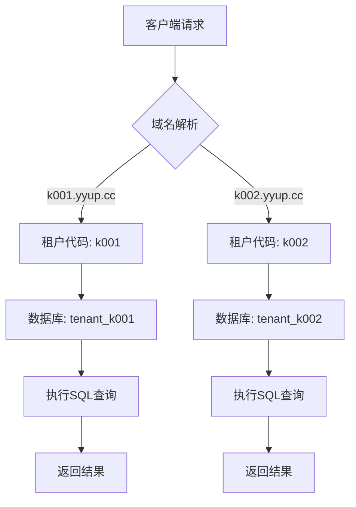
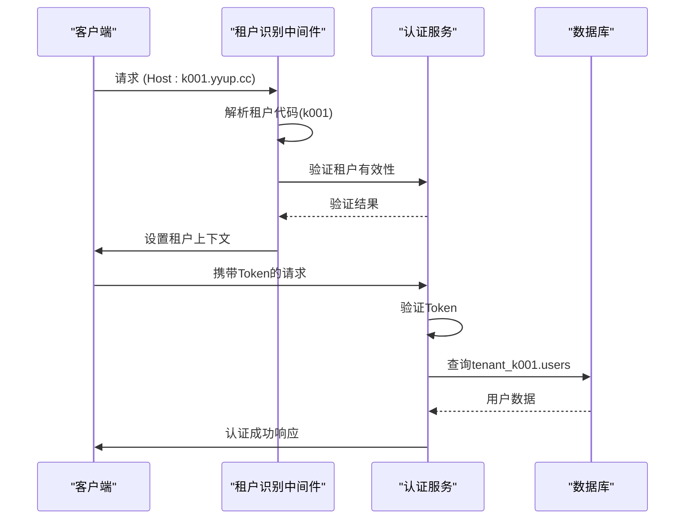
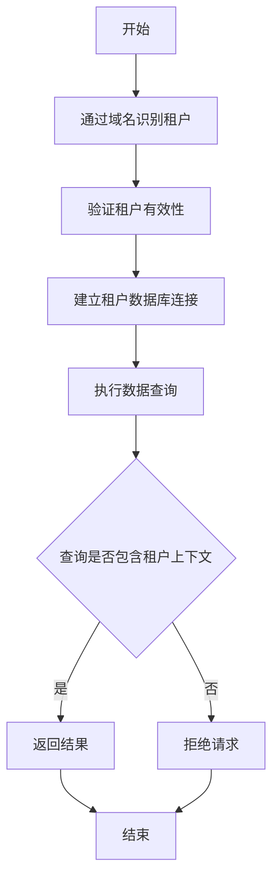

# 数据隔离机制

<cite>
**本文档引用的文件**
- [database-initialization.ts](file://database-initialization.ts)
- [tenant-database-shared-pool.service.ts](file://tenant-database-shared-pool.service.ts)
- [tenant-resolver-shared-pool.middleware.ts](file://tenant-resolver-shared-pool.middleware.ts)
- [auth-shared-pool-example.middleware.ts](file://auth-shared-pool-example.middleware.ts)
- [create-tenant-database.ts](file://k.yyup.com/create-tenant-database.ts)
- [check-tenant-databases.cjs](file://k.yyup.com/check-tenant-databases.cjs)
- [test-ai-isolation-complete.js](file://k.yyup.com/test-ai-isolation-complete.js)
- [ai-assistant-isolation-test.vue](file://k.yyup.com/client/src/pages/test/ai-assistant-isolation-test.vue)
</cite>

## 目录
1. [引言](#引言)
2. [数据库层面的数据隔离方案](#数据库层面的数据隔离方案)
3. [应用层面的数据访问控制](#应用层面的数据访问控制)
4. [数据备份与恢复策略](#数据备份与恢复策略)
5. [数据迁移与同步机制](#数据迁移与同步机制)
6. [开发者最佳实践](#开发者最佳实践)
7. [总结](#总结)

## 引言
k.yyupgame系统采用多租户架构，为不同幼儿园实例提供独立的数据环境。本系统通过数据库前缀隔离、共享连接池和完整的租户识别机制，确保各租户之间的数据完全隔离和安全。每个幼儿园实例都有独立的数据库，通过租户代码进行标识和访问控制，实现了高效且安全的数据隔离。

## 数据库层面的数据隔离方案
k.yyupgame系统采用基于数据库前缀的隔离策略，为每个幼儿园实例创建独立的数据库。所有租户数据库均以`tenant_`为前缀，后接租户代码（如`tenant_k001`），确保不同幼儿园实例之间的数据物理隔离。

系统使用共享连接池管理所有租户的数据库连接，全局连接池配置最大连接数为30，最小连接数为5，有效管理数据库资源。当请求到达时，系统通过域名识别租户，自动将SQL查询中的表名替换为完整的`数据库名.表名`格式，确保查询在正确的租户数据库中执行。

**图示来源**
- [tenant-resolver-shared-pool.middleware.ts](file://tenant-resolver-shared-pool.middleware.ts#L103-L119)
- [tenant-database-shared-pool.service.ts](file://tenant-database-shared-pool.service.ts#L98-L123)

**本节来源**
- [tenant-resolver-shared-pool.middleware.ts](file://tenant-resolver-shared-pool.middleware.ts)
- [tenant-database-shared-pool.service.ts](file://tenant-database-shared-pool.service.ts)

## 应用层面的数据访问控制
在应用层面，k.yyupgame通过租户识别中间件和认证中间件实现全面的数据访问控制。租户识别中间件根据请求域名自动解析租户代码，并验证租户的有效性。认证中间件在验证用户身份后，使用完整表名查询租户数据库，确保用户只能访问所属幼儿园的数据。

系统通过`tenantResolverSharedPoolMiddleware`中间件实现租户识别，该中间件从请求头中获取域名，提取租户代码（如k001），并验证租户是否存在。认证过程通过统一认证系统验证用户身份，然后在租户数据库中查询用户信息，确保跨租户数据访问被有效阻止。

**图示来源**
- [tenant-resolver-shared-pool.middleware.ts](file://tenant-resolver-shared-pool.middleware.ts)
- [auth-shared-pool-example.middleware.ts](file://auth-shared-pool-example.middleware.ts)

**本节来源**
- [tenant-resolver-shared-pool.middleware.ts](file://tenant-resolver-shared-pool.middleware.ts)
- [auth-shared-pool-example.middleware.ts](file://auth-shared-pool-example.middleware.ts)

## 数据备份与恢复策略
k.yyupgame系统为每个租户提供独立的数据备份和恢复能力。通过`create-tenant-database.ts`脚本，系统可以为新租户创建数据库并复制模板结构，确保新幼儿园实例的快速部署。备份策略基于租户数据库的独立性，可以对单个租户数据库进行独立备份和恢复，不影响其他租户的正常运行。

系统提供了`check-tenant-databases.cjs`脚本用于检查租户数据库的状态，包括数据库列表、表结构和数据记录数。这种独立的备份和恢复机制确保了单个幼儿园实例的数据安全，即使在数据丢失或损坏的情况下，也能快速恢复到正常状态，而不会影响其他幼儿园的运营。

**本节来源**
- [create-tenant-database.ts](file://k.yyup.com/create-tenant-database.ts)
- [check-tenant-databases.cjs](file://k.yyup.com/check-tenant-databases.cjs)

## 数据迁移与同步机制
k.yyupgame系统的数据迁移和同步机制基于租户数据库的独立性设计。由于每个幼儿园实例拥有独立的数据库，数据迁移可以通过数据库导出和导入的方式安全地进行。系统支持从模板数据库`kargerdensales`复制结构到新的租户数据库，确保新幼儿园实例具有一致的初始数据结构。

数据同步机制通过应用层的租户识别和数据访问控制实现，确保数据在不同环境（如开发、测试、生产）之间同步时，不会发生租户数据混淆。系统通过完整的表名引用（`tenant_k001.users`）确保数据操作的准确性，防止跨租户数据污染。

**本节来源**
- [create-tenant-database.ts](file://k.yyup.com/create-tenant-database.ts)
- [tenant-database-shared-pool.service.ts](file://tenant-database-shared-pool.service.ts)

## 开发者最佳实践
开发者在编写租户安全的查询时，应始终使用系统提供的数据库服务，避免直接编写SQL语句。系统通过`queryTenantDatabase`方法自动处理租户数据库的查询，确保表名被正确替换为完整格式。测试数据隔离的有效性时，可以使用`test-ai-isolation-complete.js`中的Playwright测试脚本，模拟多租户环境下的请求，验证数据隔离的正确性。

常见数据泄漏风险的防范措施包括：确保所有数据库查询都通过租户识别中间件处理，避免在日志中记录敏感数据，定期审查数据库权限设置。开发者应遵循"最小权限原则"，确保每个数据库用户只具有必要的访问权限。

**图示来源**
- [tenant-resolver-shared-pool.middleware.ts](file://tenant-resolver-shared-pool.middleware.ts)
- [tenant-database-shared-pool.service.ts](file://tenant-database-shared-pool.service.ts)

**本节来源**
- [test-ai-isolation-complete.js](file://k.yyup.com/test-ai-isolation-complete.js)
- [ai-assistant-isolation-test.vue](file://k.yyup.com/client/src/pages/test/ai-assistant-isolation-test.vue)

## 总结
k.yyupgame系统通过数据库前缀隔离、共享连接池和完整的租户识别机制，实现了高效且安全的多租户数据隔离。每个幼儿园实例拥有独立的数据库，确保数据的物理隔离和安全性。应用层面的租户识别和认证机制防止了跨租户数据访问，而独立的备份和恢复策略保证了数据的可靠性和可恢复性。这套综合的数据隔离机制为不同幼儿园实例提供了安全、独立的运行环境。