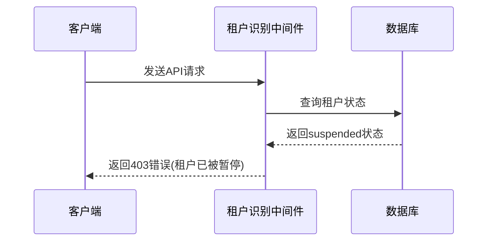
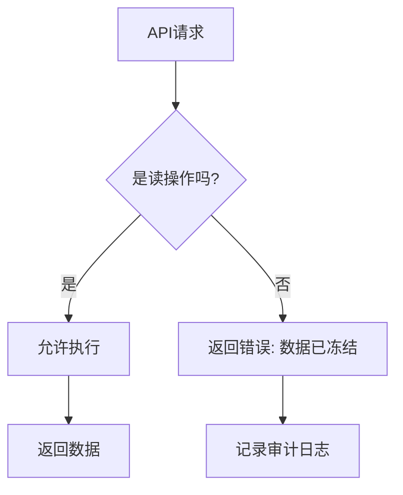
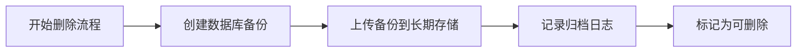
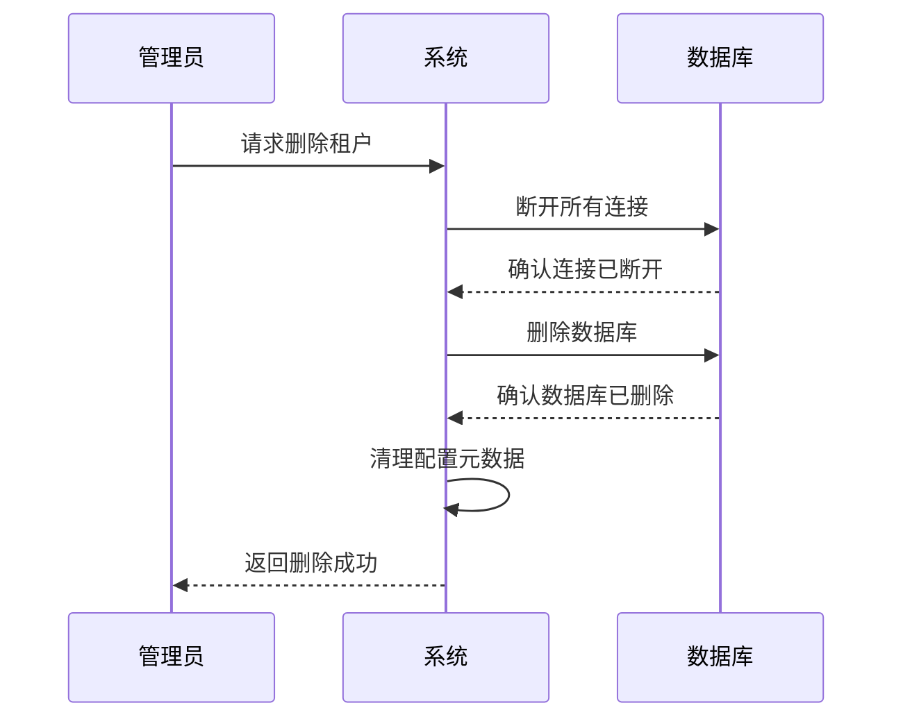
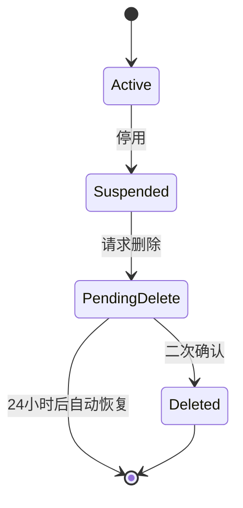
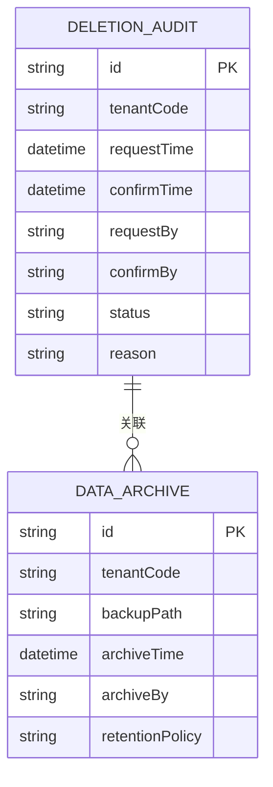
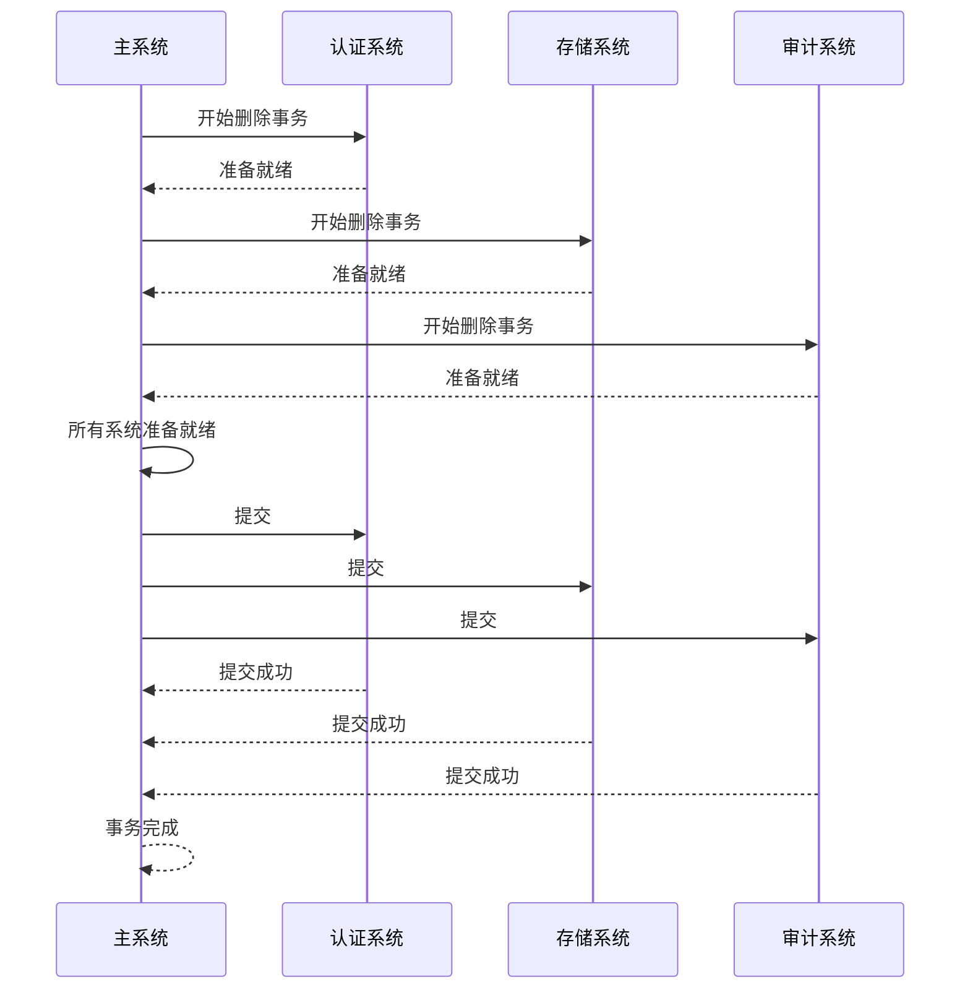
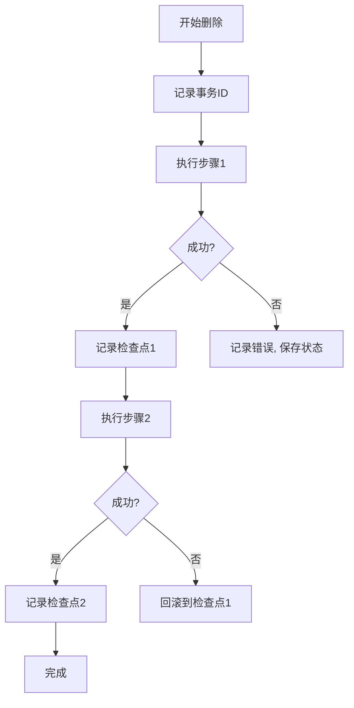
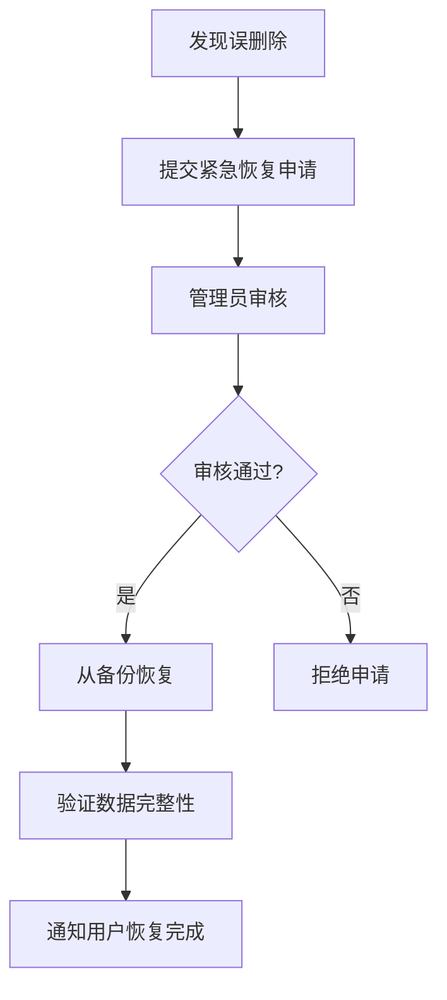

# 停用与删除

<cite>
**本文档引用的文件**
- [create-tenant-database.ts](file://k.yyup.com/create-tenant-database.ts)
- [check-tenant-databases.cjs](file://k.yyup.com/check-tenant-databases.cjs)
- [auth.test.ts](file://k.yyup.com/client/tests/unit/api/auth.test.ts)
- [08-tenant-management-api.md](file://docs/wiki/kindergarten-tenant-system/08-tenant-management-api.md)
- [tenant-database-shared-pool.service.ts](file://tenant-database-shared-pool.service.ts)
- [tenant-resolver-shared-pool.middleware.ts](file://tenant-resolver-shared-pool.middleware.ts)
</cite>

## 目录
1. [引言](#引言)
2. [租户停用机制](#租户停用机制)
3. [租户删除机制](#租户删除机制)
4. [数据安全与合规性](#数据安全与合规性)
5. [事务完整性保证](#事务完整性保证)
6. [最佳实践](#最佳实践)
7. [结论](#结论)

## 引言

本项目k.yyupgame采用多租户架构，为每个幼儿园提供独立的数据库实例。系统通过共享连接池架构实现高性能和资源利用率，同时确保数据隔离和安全性。本文档详细阐述了租户停用与删除的实现机制，包括服务暂停、访问限制、数据冻结、资源释放、数据安全处理和事务完整性保证。

**Section sources**
- [08-tenant-management-api.md](file://docs/wiki/kindergarten-tenant-system/08-tenant-management-api.md)

## 租户停用机制

租户停用是将租户状态从"active"变为"suspended"的过程，实现服务暂停和访问限制。

### 服务暂停与访问限制

当租户被停用时，系统通过租户识别中间件进行访问控制。中间件会检查租户状态，如果状态为"suspended"，则拒绝所有API请求。

**Diagram sources**
- [tenant-resolver-shared-pool.middleware.ts](file://tenant-resolver-shared-pool.middleware.ts)
- [08-tenant-management-api.md](file://docs/wiki/kindergarten-tenant-system/08-tenant-management-api.md)

### 数据冻结策略

停用期间，租户数据保持完整但被冻结，不允许任何修改操作。系统通过以下机制实现数据冻结：

1. 在数据库层面，所有写操作都会被中间件拦截
2. 租户数据库保持连接，但所有UPDATE、INSERT、DELETE操作返回错误
3. 数据保持只读状态，允许管理员进行数据导出和审计

**Diagram sources**
- [tenant-database-shared-pool.service.ts](file://tenant-database-shared-pool.service.ts)
- [08-tenant-management-api.md](file://docs/wiki/kindergarten-tenant-system/08-tenant-management-api.md)

**Section sources**
- [tenant-resolver-shared-pool.middleware.ts](file://tenant-resolver-shared-pool.middleware.ts)
- [tenant-database-shared-pool.service.ts](file://tenant-database-shared-pool.service.ts)

## 租户删除机制

租户删除是将租户状态从"suspended"变为"deleted"并最终从系统中移除的过程。

### 数据归档策略

在删除租户前，系统会自动执行数据归档：

1. 将租户数据库完整备份到长期存储
2. 记录所有关键业务数据的归档日志
3. 保留审计日志和操作记录

**Diagram sources**
- [create-tenant-database.ts](file://k.yyup.com/create-tenant-database.ts)

### 资源释放顺序

系统按照严格的顺序释放资源，确保数据一致性：

1. 首先断开所有活动连接
2. 然后删除数据库实例
3. 最后清理配置和元数据

**Diagram sources**
- [check-tenant-databases.cjs](file://k.yyup.com/check-tenant-databases.cjs)
- [create-tenant-database.ts](file://k.yyup.com/create-tenant-database.ts)

### 删除确认机制

系统采用双重确认机制防止误删除：

1. 首次请求将租户标记为"pending_delete"
2. 管理员必须在24小时内进行二次确认
3. 二次确认后才执行实际删除操作

**Diagram sources**
- [auth.test.ts](file://k.yyup.com/client/tests/unit/api/auth.test.ts)

**Section sources**
- [create-tenant-database.ts](file://k.yyup.com/create-tenant-database.ts)
- [check-tenant-databases.cjs](file://k.yyup.com/check-tenant-databases.cjs)

## 数据安全与合规性

### 敏感数据清除

系统确保敏感数据的彻底清除：

1. 数据库删除后，存储空间会被安全擦除
2. 所有备份和归档数据也会被加密删除
3. 使用符合GDPR和相关法规的删除标准

### 合规性要求

系统满足以下合规性要求：

- 数据保留策略符合法律法规
- 删除操作有完整的审计追踪
- 提供数据删除证明给相关方

**Diagram sources**
- [08-tenant-management-api.md](file://docs/wiki/kindergarten-tenant-system/08-tenant-management-api.md)

**Section sources**
- [08-tenant-management-api.md](file://docs/wiki/kindergarten-tenant-system/08-tenant-management-api.md)

## 事务完整性保证

### 多系统一致性

在多系统环境下，系统通过分布式事务保证数据一致性：

1. 使用两阶段提交协议
2. 所有相关系统必须确认才能完成删除
3. 任何系统失败都会触发回滚

**Diagram sources**
- [tenant-database-shared-pool.service.ts](file://tenant-database-shared-pool.service.ts)

### 错误处理与恢复

系统具备完善的错误处理和灾难恢复机制：

1. 每个删除操作都有唯一的事务ID
2. 失败时自动记录恢复点
3. 支持从任意恢复点重新开始

**Diagram sources**
- [tenant-database-shared-pool.service.ts](file://tenant-database-shared-pool.service.ts)

**Section sources**
- [tenant-database-shared-pool.service.ts](file://tenant-database-shared-pool.service.ts)

## 最佳实践

### 用户通知策略

1. 停用前7天发送预警通知
2. 停用当天发送确认通知
3. 删除前再次确认并提供恢复机会

### 审计日志记录

1. 记录所有停用和删除操作
2. 包含操作人、时间、原因等详细信息
3. 日志永久保存，不可篡改

### 灾难恢复方案

1. 保留最近30天的删除租户备份
2. 提供紧急恢复通道
3. 定期测试恢复流程

**Diagram sources**
- [08-tenant-management-api.md](file://docs/wiki/kindergarten-tenant-system/08-tenant-management-api.md)

**Section sources**
- [08-tenant-management-api.md](file://docs/wiki/kindergarten-tenant-system/08-tenant-management-api.md)

## 结论

k.yyupgame的租户停用与删除机制设计完善，通过状态管理、访问控制、数据归档、资源释放和事务完整性保证，确保了系统的安全性、可靠性和合规性。系统采用共享连接池架构，在保证高性能的同时实现了严格的多租户隔离。建议开发者遵循文档中的最佳实践，确保租户管理操作的安全和可靠。