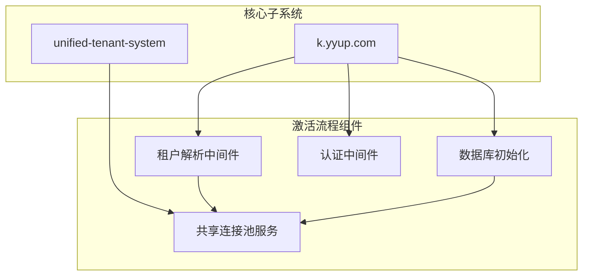
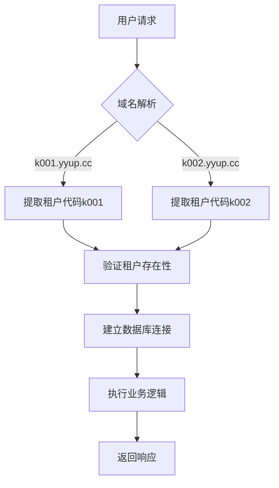
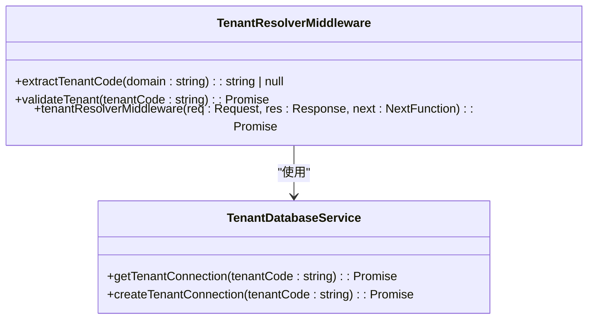
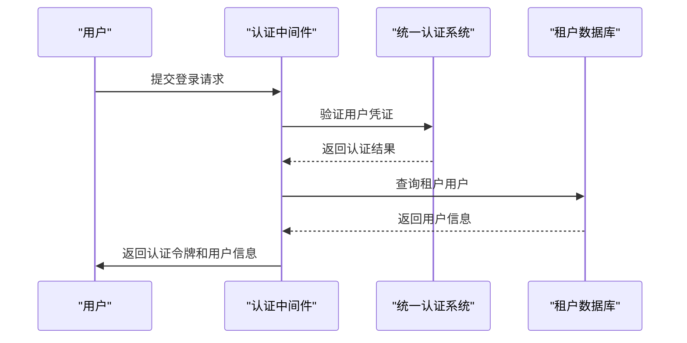
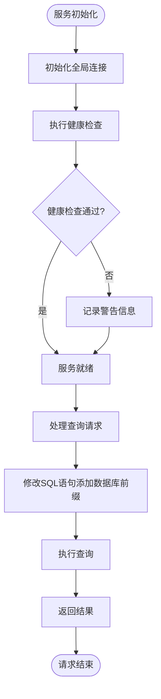
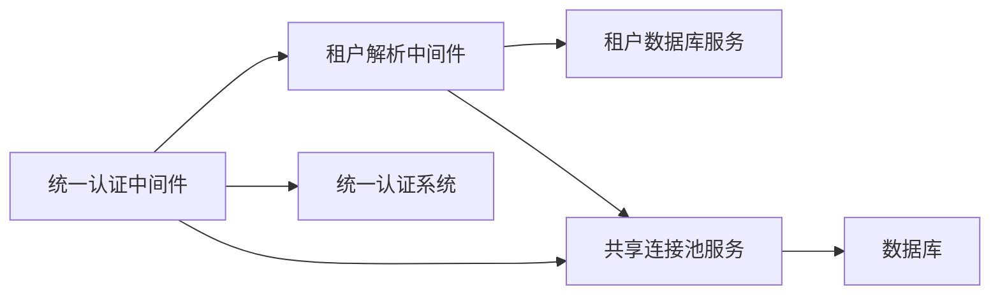

# 激活流程

<cite>
**本文档引用的文件**
- [TENANT_DATABASE_CODE_FLOW.md](file://TENANT_DATABASE_CODE_FLOW.md)
- [create-tenant-database.cjs](file://k.yyup.com/create-tenant-database.cjs)
- [database-initialization.ts](file://database-initialization.ts)
- [tenant-database-shared-pool.service.ts](file://tenant-database-shared-pool.service.ts)
- [tenant-resolver.middleware.ts](file://k.yyup.com/server/src/middlewares/tenant-resolver.middleware.ts)
- [auth.middleware.ts](file://k.yyup.com/server/src/middlewares/auth.middleware.ts)
</cite>

## 目录
1. [引言](#引言)
2. [项目结构](#项目结构)
3. [核心组件](#核心组件)
4. [架构概述](#架构概述)
5. [详细组件分析](#详细组件分析)
6. [依赖分析](#依赖分析)
7. [性能考虑](#性能考虑)
8. [故障排除指南](#故障排除指南)
9. [结论](#结论)
10. [附录](#附录)（如有必要）

## 引言
本文档详细介绍了k.yyupgame项目中租户从注册到完全激活的完整流程。重点阐述了激活码的生成、分发和验证机制，服务初始化步骤，用户引导流程，错误处理机制以及开发者最佳实践。通过本指南，开发者可以全面理解系统的激活机制，并能够有效地进行系统维护和优化。

## 项目结构
k.yyupgame项目的激活流程主要涉及两个核心子系统：`k.yyup.com`和`unified-tenant-system`。这两个系统共同协作完成租户的注册、激活和初始化过程。激活流程的关键文件分布在多个目录中，包括服务器中间件、数据库初始化脚本和服务工具。

**图示来源**
- [TENANT_DATABASE_CODE_FLOW.md](file://TENANT_DATABASE_CODE_FLOW.md#L5-L499)
- [tenant-resolver.middleware.ts](file://k.yyup.com/server/src/middlewares/tenant-resolver.middleware.ts)

**本节来源**
- [TENANT_DATABASE_CODE_FLOW.md](file://TENANT_DATABASE_CODE_FLOW.md#L5-L499)
- [k.yyup.com](file://k.yyup.com)
- [unified-tenant-system](file://unified-tenant-system)

## 核心组件
本项目的核心组件包括租户解析中间件、租户数据库服务、统一认证中间件和共享连接池服务。这些组件协同工作，确保租户能够顺利注册并激活。租户解析中间件负责从域名中提取租户代码并验证租户的存在性；租户数据库服务管理各个租户的数据库连接；统一认证中间件处理用户的登录和身份验证；共享连接池服务则优化数据库连接的使用效率。

**本节来源**
- [TENANT_DATABASE_CODE_FLOW.md](file://TENANT_DATABASE_CODE_FLOW.md#L5-L499)
- [tenant-database-shared-pool.service.ts](file://tenant-database-shared-pool.service.ts#L1-L177)

## 架构概述
系统的整体架构采用多租户模式，每个租户拥有独立的数据库实例。当用户访问特定租户的域名时，系统首先通过租户解析中间件识别租户代码，然后建立相应的数据库连接。认证过程由统一认证系统处理，确保用户身份的安全性。共享连接池服务进一步优化了数据库资源的使用，提高了系统的整体性能。

**图示来源**
- [TENANT_DATABASE_CODE_FLOW.md](file://TENANT_DATABASE_CODE_FLOW.md#L445-L458)
- [tenant-resolver.middleware.ts](file://k.yyup.com/server/src/middlewares/tenant-resolver.middleware.ts#L10-L58)

## 详细组件分析
### 租户解析中间件分析
租户解析中间件是激活流程的第一步，负责从HTTP请求头中提取租户信息。该中间件通过正则表达式解析域名，获取租户代码，并验证租户是否存在。如果租户不存在或未激活，将返回相应的错误信息。

#### 对于对象导向组件：

**图示来源**
- [TENANT_DATABASE_CODE_FLOW.md](file://TENANT_DATABASE_CODE_FLOW.md#L8-L58)
- [tenant-resolver.middleware.ts](file://k.yyup.com/server/src/middlewares/tenant-resolver.middleware.ts#L10-L58)

### 统一认证中间件分析
统一认证中间件处理用户的登录请求，通过调用统一认证系统验证用户身份。在验证成功后，该中间件会在租户数据库中查找或创建用户记录，并返回包含租户信息的认证令牌。

#### 对于API/服务组件：

**图示来源**
- [TENANT_DATABASE_CODE_FLOW.md](file://TENANT_DATABASE_CODE_FLOW.md#L174-L306)
- [auth.middleware.ts](file://k.yyup.com/server/src/middlewares/auth.middleware.ts#L174-L306)

### 共享连接池服务分析
共享连接池服务为所有租户提供统一的数据库连接管理。通过共享一个全局连接池，系统能够更高效地利用数据库资源，同时确保不同租户之间的数据隔离。

#### 对于复杂逻辑组件：

**图示来源**
- [tenant-database-shared-pool.service.ts](file://tenant-database-shared-pool.service.ts#L15-L154)
- [database-initialization.ts](file://database-initialization.ts#L13-L40)

**本节来源**
- [TENANT_DATABASE_CODE_FLOW.md](file://TENANT_DATABASE_CODE_FLOW.md#L5-L499)
- [tenant-resolver.middleware.ts](file://k.yyup.com/server/src/middlewares/tenant-resolver.middleware.ts#L10-L58)
- [auth.middleware.ts](file://k.yyup.com/server/src/middlewares/auth.middleware.ts#L174-L306)
- [tenant-database-shared-pool.service.ts](file://tenant-database-shared-pool.service.ts#L1-L177)

## 依赖分析
系统各组件之间存在明确的依赖关系。租户解析中间件依赖于租户数据库服务来建立数据库连接；统一认证中间件依赖于租户解析中间件提供的租户信息；共享连接池服务为所有数据库操作提供基础支持。这些依赖关系确保了激活流程的顺利进行。

**图示来源**
- [TENANT_DATABASE_CODE_FLOW.md](file://TENANT_DATABASE_CODE_FLOW.md#L445-L458)
- [tenant-resolver.middleware.ts](file://k.yyup.com/server/src/middlewares/tenant-resolver.middleware.ts#L10-L58)

**本节来源**
- [TENANT_DATABASE_CODE_FLOW.md](file://TENANT_DATABASE_CODE_FLOW.md#L5-L499)
- [tenant-resolver.middleware.ts](file://k.yyup.com/server/src/middlewares/tenant-resolver.middleware.ts#L10-L58)
- [auth.middleware.ts](file://k.yyup.com/server/src/middlewares/auth.middleware.ts#L174-L306)

## 性能考虑
在设计激活流程时，性能是一个重要的考虑因素。通过使用共享连接池，系统能够减少数据库连接的开销，提高响应速度。此外，租户解析和认证过程都经过优化，以确保即使在高并发情况下也能保持良好的性能表现。

## 故障排除指南
当激活流程出现问题时，可以从以下几个方面进行排查：检查租户域名是否正确配置，验证数据库连接是否正常，确认统一认证系统是否可用，以及检查共享连接池的状态。日志文件是诊断问题的重要工具，应仔细查看相关组件的日志输出。

**本节来源**
- [TENANT_DATABASE_CODE_FLOW.md](file://TENANT_DATABASE_CODE_FLOW.md#L480-L486)
- [database-initialization.ts](file://database-initialization.ts#L28-L34)

## 结论
k.yyupgame项目的激活流程设计合理，通过多租户架构和共享连接池技术实现了高效、安全的租户管理。开发者应遵循文档中的最佳实践，确保系统的稳定运行和持续优化。

## 附录
### 激活流程最佳实践
1. **流程自动化**：使用脚本自动化租户创建和数据库初始化过程。
2. **用户体验优化**：提供清晰的用户引导和错误提示。
3. **安全审计**：定期审查系统日志，确保没有异常活动。
4. **性能监控**：持续监控系统性能，及时发现和解决瓶颈问题。