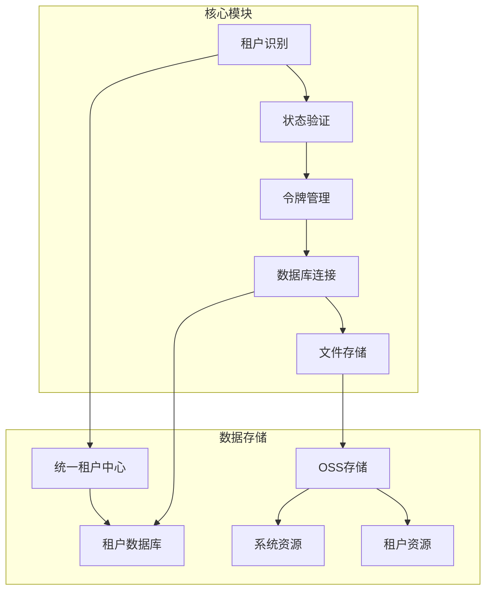
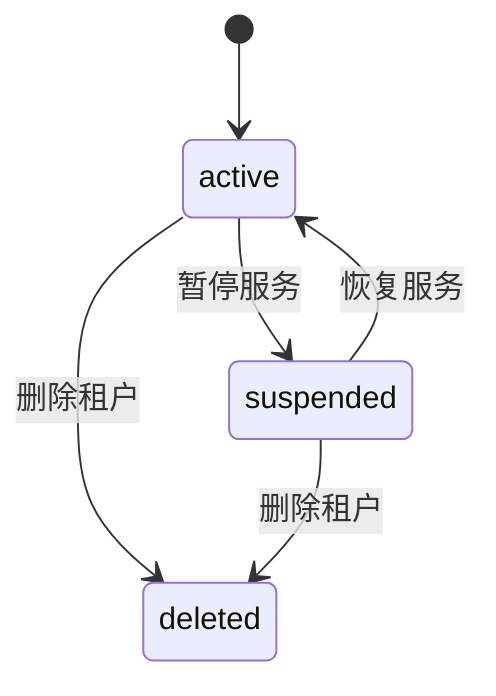
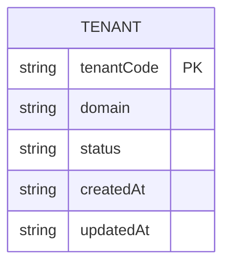
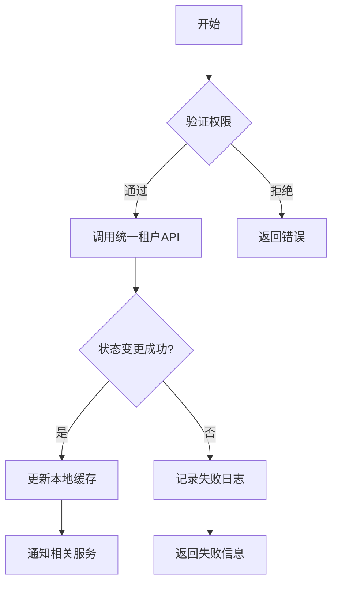
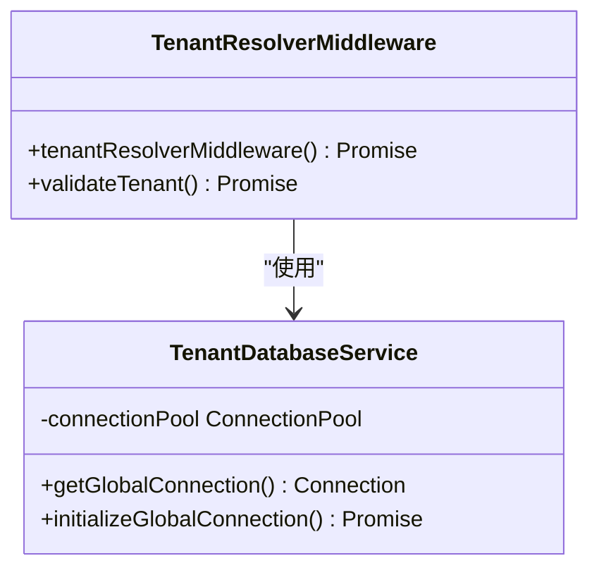

# 状态管理

<cite>
**本文档引用的文件**
- [create-tenant-database.ts](file://k.yyup.com/create-tenant-database.ts)
- [tenant-resolver.middleware.ts](file://k.yyup.com/server/src/middlewares/tenant-resolver.middleware.ts)
- [tenant-token.controller.ts](file://k.yyup.com/server/src/controllers/tenant-token.controller.ts)
- [migrate-to-tenant-structure.ts](file://k.yyup.com/server/migrate-to-tenant-structure.ts)
- [tenant-database.service.ts](file://k.yyup.com/server/src/services/tenant-database.service.ts)
- [tenant-token.service.ts](file://k.yyup.com/server/src/services/tenant-token.service.ts)
- [tenant.model.ts](file://unified-tenant-system/server/src/models/tenant.model.ts)
</cite>

## 目录
1. [项目结构](#项目结构)
2. [核心组件](#核心组件)
3. [租户状态定义与存储](#租户状态定义与存储)
4. [状态转换机制](#状态转换机制)
5. [状态一致性保证](#状态一致性保证)
6. [最佳实践](#最佳实践)

## 项目结构

本项目采用多租户架构设计，核心状态管理分布在多个模块中。系统通过独立的数据库实例和文件存储结构来隔离不同租户的数据。

**图示来源**
- [tenant-resolver.middleware.ts](file://k.yyup.com/server/src/middlewares/tenant-resolver.middleware.ts#L1-L224)
- [migrate-to-tenant-structure.ts](file://k.yyup.com/server/migrate-to-tenant-structure.ts#L1-L288)

**章节来源**
- [k.yyup.com/](file://k.yyup.com/)
- [unified-tenant-system/](file://unified-tenant-system/)

## 核心组件

系统的核心状态管理组件包括租户识别中间件、令牌服务和数据库连接服务。这些组件协同工作以确保租户状态的一致性和安全性。

**章节来源**
- [tenant-resolver.middleware.ts](file://k.yyup.com/server/src/middlewares/tenant-resolver.middleware.ts#L1-L224)
- [tenant-token.service.ts](file://k.yyup.com/server/src/services/tenant-token.service.ts)
- [tenant-database.service.ts](file://k.yyup.com/server/src/services/tenant-database.service.ts)

## 租户状态定义与存储

### 状态定义

租户状态主要包含三种基本状态：活跃（active）、暂停（suspended）和删除（deleted）。这些状态在系统中通过统一租户中心进行管理。

**图示来源**
- [tenant-resolver.middleware.ts](file://k.yyup.com/server/src/middlewares/tenant-resolver.middleware.ts#L144-L178)
- [tenant.model.ts](file://unified-tenant-system/server/src/models/tenant.model.ts)

### 数据模型设计

租户状态信息存储在统一租户中心的数据库中，每个租户有独立的数据库实例。状态字段作为租户基本信息的一部分进行存储。

**图示来源**
- [tenant.model.ts](file://unified-tenant-system/server/src/models/tenant.model.ts)
- [create-tenant-database.ts](file://k.yyup.com/create-tenant-database.ts#L1-L165)

## 状态转换机制

### 转换规则与条件

状态转换遵循严格的业务规则，只有经过授权的管理员才能触发状态变更。转换过程需要通过统一租户中心的API进行验证。

**图示来源**
- [tenant-resolver.middleware.ts](file://k.yyup.com/server/src/middlewares/tenant-resolver.middleware.ts#L154-L167)
- [tenant-token.controller.ts](file://k.yyup.com/server/src/controllers/tenant-token.controller.ts#L1-L310)

### 权限要求与审批流程

状态变更需要管理员权限，并且必须通过统一租户中心的认证。系统记录所有状态变更操作以便审计。

**章节来源**
- [tenant-resolver.middleware.ts](file://k.yyup.com/server/src/middlewares/tenant-resolver.middleware.ts#L153-L159)
- [tenant-token.controller.ts](file://k.yyup.com/server/src/controllers/tenant-token.controller.ts#L34-L89)

## 状态一致性保证

### 数据库约束

系统使用全局共享连接池来管理数据库连接，确保所有操作都在同一个事务上下文中执行。

**图示来源**
- [tenant-database.service.ts](file://k.yyup.com/server/src/services/tenant-database.service.ts)
- [tenant-resolver.middleware.ts](file://k.yyup.com/server/src/middlewares/tenant-resolver.middleware.ts#L1-L224)

### 事务管理

所有状态相关的操作都封装在事务中，确保数据的一致性。系统使用Promise机制来处理异步操作的原子性。

### 状态机模式

系统采用状态机模式来管理租户状态的生命周期，通过中间件链式调用来确保状态转换的正确性。

**章节来源**
- [tenant-database.service.ts](file://k.yyup.com/server/src/services/tenant-database.service.ts)
- [tenant-resolver.middleware.ts](file://k.yyup.com/server/src/middlewares/tenant-resolver.middleware.ts#L1-L224)

## 最佳实践

### 状态查询优化

建议使用缓存机制来优化频繁的状态查询操作，减少对统一租户中心API的直接调用。

### 状态变更日志记录

所有状态变更操作都应该被详细记录，包括操作人、时间戳和变更前后状态，以便后续审计和问题排查。

### 并发控制策略

在高并发场景下，应该使用分布式锁来防止多个请求同时修改同一个租户的状态。

**章节来源**
- [tenant-token.service.ts](file://k.yyup.com/server/src/services/tenant-token.service.ts)
- [tenant-resolver.middleware.ts](file://k.yyup.com/server/src/middlewares/tenant-resolver.middleware.ts#L1-L224)