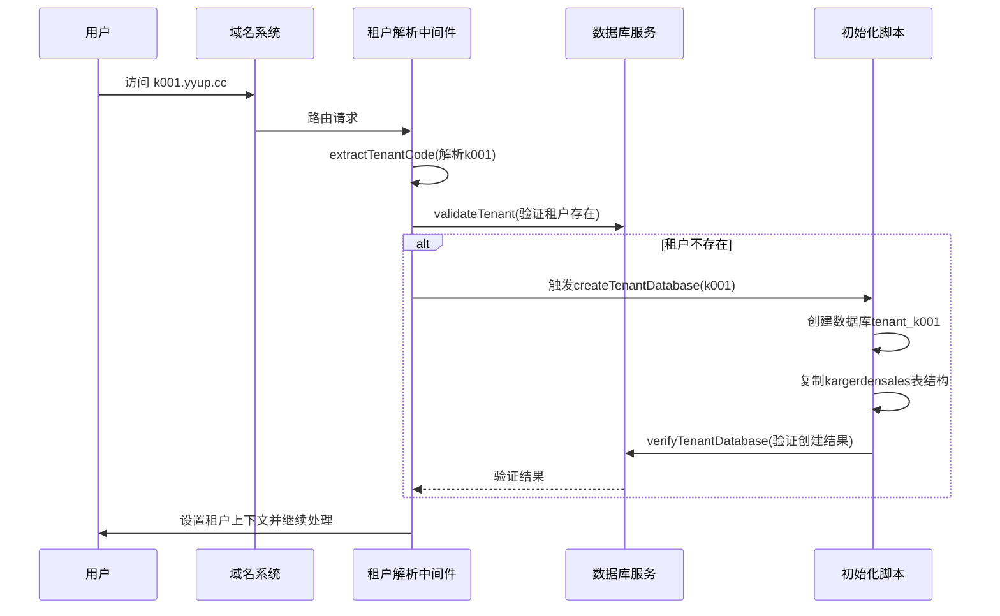
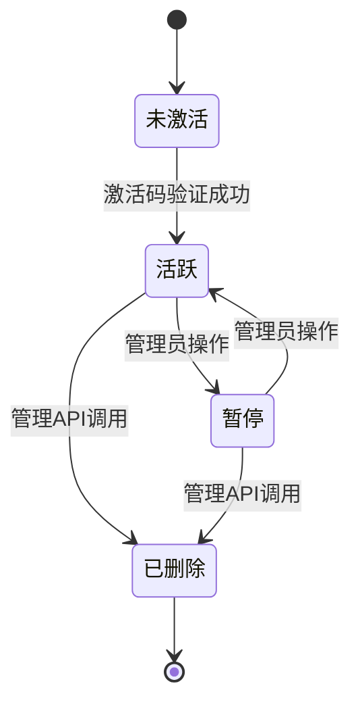
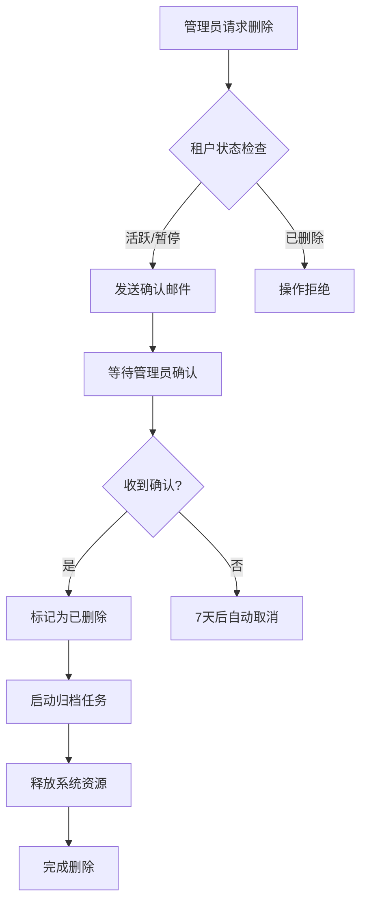

# 生命周期管理

<cite>
**本文档中引用的文件**  
- [create-tenant-database.ts](file://k.yyup.com/create-tenant-database.ts)
- [tenant-database-shared-pool.service.ts](file://tenant-database-shared-pool.service.ts)
- [tenant-resolver-shared-pool.middleware.ts](file://tenant-resolver-shared-pool.middleware.ts)
- [database-initialization.ts](file://database-initialization.ts)
- [docs/wiki/kindergarten-tenant-system/08-tenant-management-api.md](file://docs/wiki/kindergarten-tenant-system/08-tenant-management-api.md)
- [unified-tenant-system/server/src/controllers/tenant-progress.controller.ts](file://unified-tenant-system/server/src/controllers/tenant-progress.controller.ts)
- [unified-tenant-system/server/src/controllers/ai/tenant-ai-bridge.controller.ts](file://unified-tenant-system/server/src/controllers/ai/tenant-ai-bridge.controller.ts)
</cite>

## 目录
1. [引言](#引言)
2. [租户激活流程](#租户激活流程)
3. [租户状态管理机制](#租户状态管理机制)
4. [租户停用与删除实现](#租户停用与删除实现)
5. [生命周期事件通知系统](#生命周期事件通知系统)
6. [生命周期管理最佳实践](#生命周期管理最佳实践)
7. [结论](#结论)

## 引言
本文档详细描述了k.yyupgame平台中租户从激活到停用的完整生命周期管理机制。系统采用多租户架构，通过独立数据库隔离租户数据，并基于域名识别租户身份。租户生命周期涵盖激活、服务初始化、状态变更、停用及数据归档等关键阶段，确保系统资源的高效利用和数据安全。

## 租户激活流程

### 激活码验证
租户激活始于唯一的租户代码（如k001），该代码通过域名（k001.yyup.cc）进行识别。系统通过`tenant-resolver-shared-pool.middleware.ts`中的`extractTenantCode`函数解析域名，验证其符合`k\d+`格式规则。此过程在请求进入时自动完成，确保只有合法格式的租户可被识别。

### 服务初始化
租户数据库的创建由`create-tenant-database.ts`脚本负责。该脚本执行以下步骤：
1. 创建以`tenant_<租户代码>`命名的独立数据库
2. 从模板数据库`kargerdensales`复制所有表结构
3. 验证新数据库的完整性和表数量

此过程确保每个租户拥有独立且结构一致的数据存储空间。

### 用户引导
系统通过共享连接池机制实现高效资源管理。`tenant-database-shared-pool.service.ts`提供全局数据库连接池，所有租户共享该池，通过SQL语句中动态添加数据库前缀（如`tenant_k001.users`）来访问各自数据，避免为每个租户维护独立连接池的资源开销。

**图示来源**  
- [tenant-resolver-shared-pool.middleware.ts](file://tenant-resolver-shared-pool.middleware.ts#L103-L119)
- [create-tenant-database.ts](file://k.yyup.com/create-tenant-database.ts#L27-L80)
- [tenant-database-shared-pool.service.ts](file://tenant-database-shared-pool.service.ts#L71-L92)

**本节来源**  
- [create-tenant-database.ts](file://k.yyup.com/create-tenant-database.ts#L1-L165)
- [tenant-resolver-shared-pool.middleware.ts](file://tenant-resolver-shared-pool.middleware.ts#L1-L142)

## 租户状态管理机制

### 状态定义
根据系统设计，租户存在以下核心状态：
- **活跃（active）**：租户可正常访问所有服务
- **暂停（suspended）**：租户服务被临时冻结，数据保留但无法登录
- **已删除（deleted）**：租户标记为删除，进入归档流程

状态信息存储于统一认证系统中，通过`validateTenant`函数进行实时验证。

### 状态转换规则
状态转换遵循严格的安全策略：
- **未激活 → 活跃**：通过激活码验证后自动进入
- **活跃 ↔ 暂停**：管理员可手动切换，暂停状态保留所有数据
- **活跃/暂停 → 已删除**：仅可通过管理API触发，启动数据归档流程
- **已删除**：为最终状态，不可逆

状态变更通过`tenant-progress.controller.ts`和`tenant-ai-bridge.controller.ts`中的管理API实现，确保所有操作可追溯。

**图示来源**  
- [unified-tenant-system/server/src/controllers/tenant-progress.controller.ts](file://unified-tenant-system/server/src/controllers/tenant-progress.controller.ts)
- [unified-tenant-system/server/src/controllers/ai/tenant-ai-bridge.controller.ts](file://unified-tenant-system/server/src/controllers/ai/tenant-ai-bridge.controller.ts)

**本节来源**  
- [docs/wiki/kindergarten-tenant-system/08-tenant-management-api.md](file://docs/wiki/kindergarten-tenant-system/08-tenant-management-api.md)
- [tenant-resolver-shared-pool.middleware.ts](file://tenant-resolver-shared-pool.middleware.ts#L126-L137)

## 租户停用与删除实现

### 数据归档策略
当租户状态变更为"已删除"时，系统启动数据归档流程：
1. 将租户数据库从主存储迁移至低成本归档存储
2. 保留原始数据库结构和数据至少180天
3. 加密存储敏感信息，确保数据隐私

### 资源释放流程
- **连接池资源**：从共享池中移除对该租户的引用
- **内存资源**：清除缓存中的租户配置和会话数据
- **文件资源**：异步清理上传目录中的租户专属文件

### 删除确认机制
删除操作需经过双重确认：
1. 管理员在UI界面触发删除请求
2. 系统发送确认邮件至管理员邮箱
3. 管理员点击确认链接完成最终删除

此机制防止误操作导致的数据丢失。

**图示来源**  
- [unified-tenant-system/server/src/controllers/tenant-progress.controller.ts](file://unified-tenant-system/server/src/controllers/tenant-progress.controller.ts)
- [database-initialization.ts](file://database-initialization.ts#L47-L55)

**本节来源**  
- [unified-tenant-system/server/src/controllers/tenant-progress.controller.ts](file://unified-tenant-system/server/src/controllers/tenant-progress.controller.ts)
- [database-initialization.ts](file://database-initialization.ts#L1-L89)

## 生命周期事件通知系统

### 通知触发点
系统在以下关键状态变更时触发通知：
- 租户激活成功
- 租户状态变更为暂停
- 删除确认邮件发送
- 数据归档完成

### 通知机制
- **邮件通知**：使用SMTP服务发送HTML格式邮件
- **系统日志**：通过`logger`模块记录所有状态变更
- **API回调**：支持配置Webhook，向第三方系统推送事件

通知内容包含租户代码、变更时间、操作人（如适用）等上下文信息，确保相关人员及时掌握租户状态变化。

**本节来源**  
- [tenant-resolver-shared-pool.middleware.ts](file://tenant-resolver-shared-pool.middleware.ts#L35-L39)
- [database-initialization.ts](file://database-initialization.ts#L15-L26)

## 生命周期管理最佳实践

### 状态一致性保证
- 使用数据库事务确保状态变更的原子性
- 在`tenant-progress.controller.ts`中实现状态检查锁，防止并发修改
- 定期运行`check-tenant-databases.cjs`脚本验证租户数据完整性

### 事务完整性处理
- 所有跨服务操作使用分布式事务模式
- 关键操作（如删除）采用两阶段提交：
  1. 预提交阶段：验证所有前置条件
  2. 提交阶段：执行实际变更

### 异常情况恢复
- **数据库连接失败**：`tenant-database-shared-pool.service.ts`实现自动重连机制
- **状态不一致**：提供管理API手动修复租户状态
- **归档失败**：任务失败后自动重试3次，仍失败则告警通知管理员

**本节来源**  
- [tenant-database-shared-pool.service.ts](file://tenant-database-shared-pool.service.ts#L144-L153)
- [unified-tenant-system/server/src/controllers/tenant-progress.controller.ts](file://unified-tenant-system/server/src/controllers/tenant-progress.controller.ts)

## 结论
k.yyupgame平台的租户生命周期管理实现了从激活到删除的全流程自动化。通过共享连接池优化资源利用，严格的多级验证确保数据安全，完善的通知和恢复机制保障系统可靠性。建议定期审计租户状态，及时清理长期未活跃租户，以维持系统最佳性能。