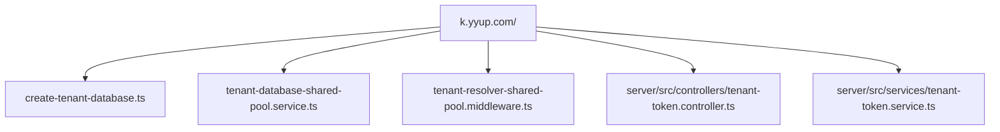
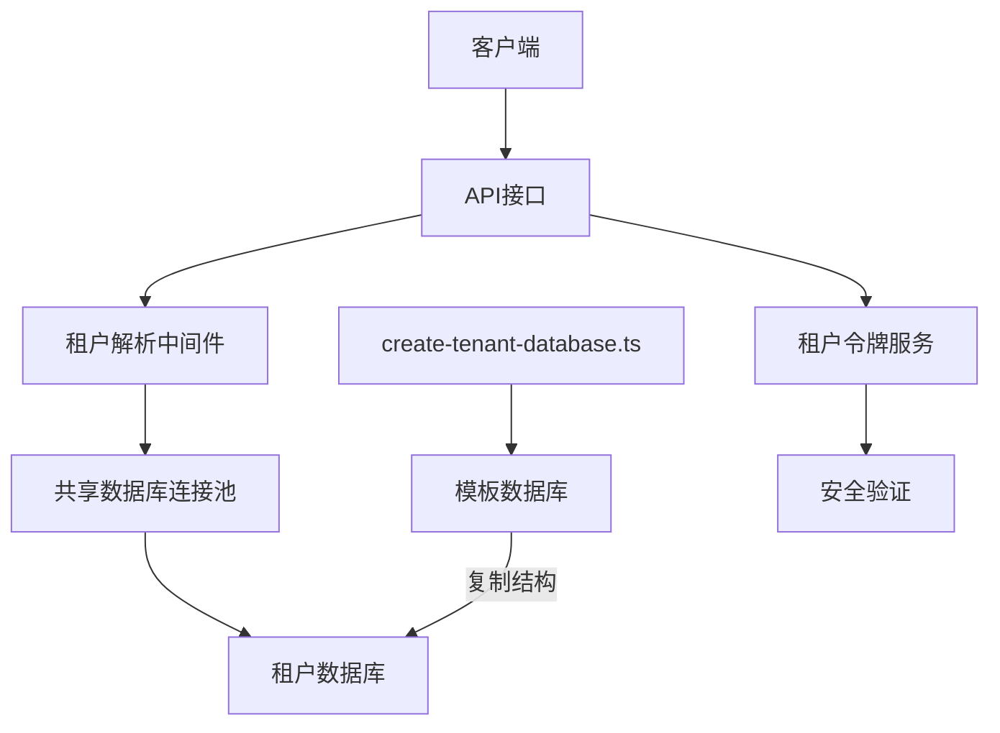
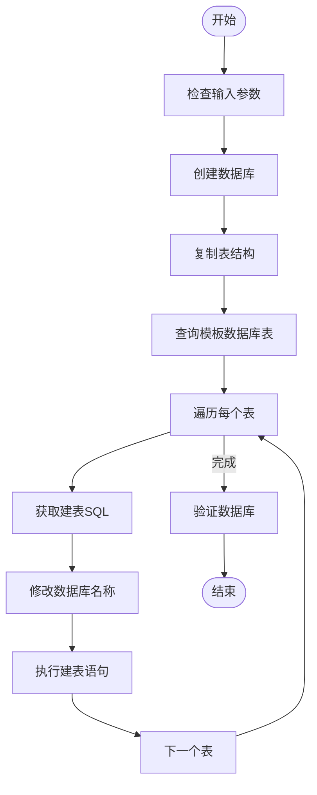
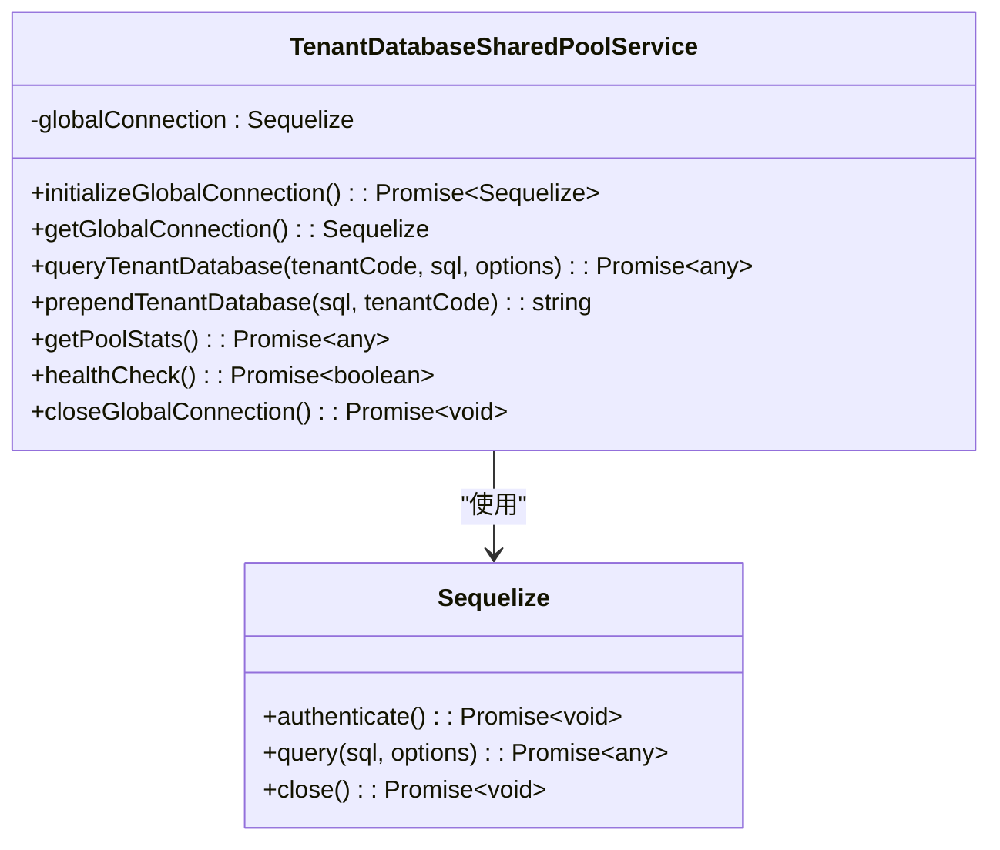
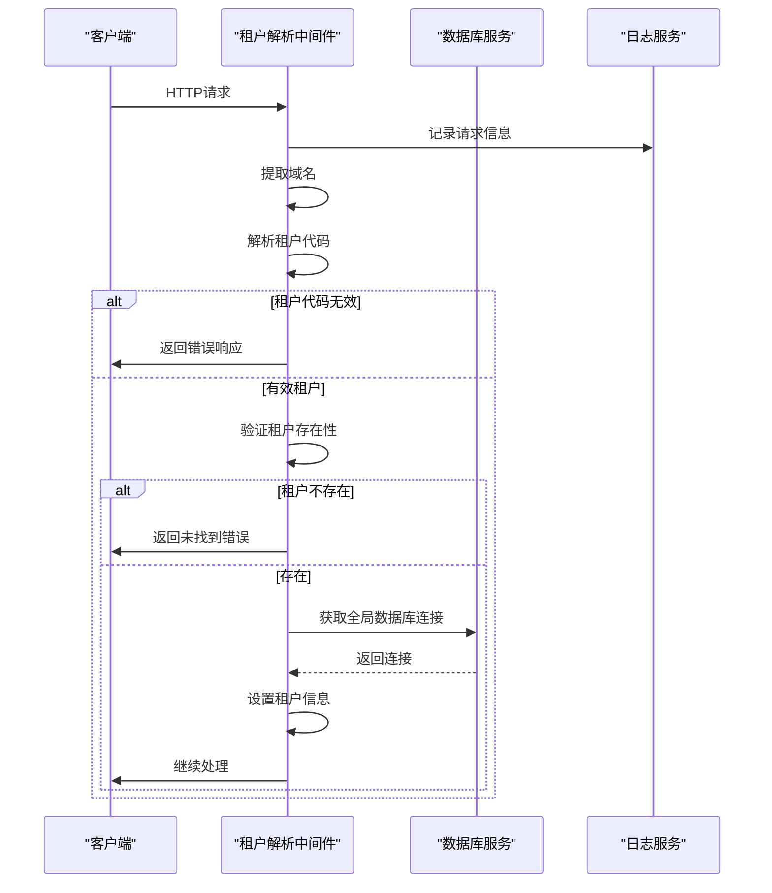
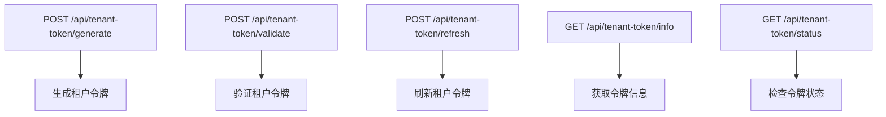
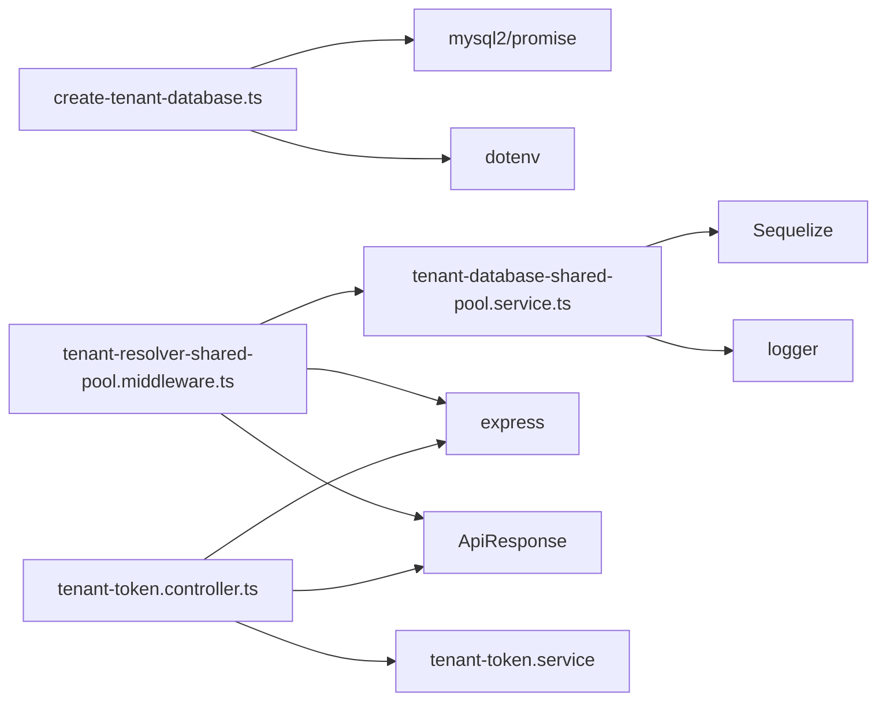

# 租户创建

<cite>
**本文档中引用的文件**  
- [create-tenant-database.ts](file://k.yyup.com/create-tenant-database.ts)
- [tenant-database-shared-pool.service.ts](file://tenant-database-shared-pool.service.ts)
- [tenant-resolver-shared-pool.middleware.ts](file://tenant-resolver-shared-pool.middleware.ts)
- [tenant-token.controller.ts](file://k.yyup.com/server/src/controllers/tenant-token.controller.ts)
</cite>

## 目录
1. [简介](#简介)
2. [项目结构](#项目结构)
3. [核心组件](#核心组件)
4. [架构概述](#架构概述)
5. [详细组件分析](#详细组件分析)
6. [依赖分析](#依赖分析)
7. [性能考虑](#性能考虑)
8. [故障排除指南](#故障排除指南)
9. [结论](#结论)

## 简介
本文档详细介绍了k.yyupgame项目中租户创建的完整流程。重点阐述了`create-tenant-database.ts`脚本的实现机制，包括数据库连接池的使用、Schema的动态创建以及事务处理。同时说明了租户服务中创建租户的核心逻辑，包括租户信息验证、唯一性检查和初始数据生成。此外，还阐述了控制器层的API接口设计，包括请求参数验证、错误处理和响应格式，并提供了数据库迁移的详细说明。最后为开发者提供了最佳实践建议。

## 项目结构



**图示来源**  
- [create-tenant-database.ts](file://k.yyup.com/create-tenant-database.ts)
- [tenant-database-shared-pool.service.ts](file://tenant-database-shared-pool.service.ts)
- [tenant-resolver-shared-pool.middleware.ts](file://tenant-resolver-shared-pool.middleware.ts)
- [tenant-token.controller.ts](file://k.yyup.com/server/src/controllers/tenant-token.controller.ts)

**本节来源**  
- [create-tenant-database.ts](file://k.yyup.com/create-tenant-database.ts)
- [tenant-database-shared-pool.service.ts](file://tenant-database-shared-pool.service.ts)

## 核心组件

本文档的核心组件包括：
- `create-tenant-database.ts`：用于创建租户数据库的脚本
- `tenant-database-shared-pool.service.ts`：管理共享数据库连接池的服务
- `tenant-resolver-shared-pool.middleware.ts`：解析租户信息的中间件
- `tenant-token.controller.ts`：处理租户令牌相关API请求的控制器

这些组件共同实现了租户创建、数据库初始化、连接管理和安全验证的完整流程。

**本节来源**  
- [create-tenant-database.ts](file://k.yyup.com/create-tenant-database.ts#L1-L165)
- [tenant-database-shared-pool.service.ts](file://tenant-database-shared-pool.service.ts#L1-L177)
- [tenant-resolver-shared-pool.middleware.ts](file://tenant-resolver-shared-pool.middleware.ts#L1-L142)
- [tenant-token.controller.ts](file://k.yyup.com/server/src/controllers/tenant-token.controller.ts#L1-L310)

## 架构概述



**图示来源**  
- [create-tenant-database.ts](file://k.yyup.com/create-tenant-database.ts#L1-L165)
- [tenant-database-shared-pool.service.ts](file://tenant-database-shared-pool.service.ts#L1-L177)
- [tenant-resolver-shared-pool.middleware.ts](file://tenant-resolver-shared-pool.middleware.ts#L1-L142)

## 详细组件分析

### create-tenant-database.ts 脚本分析

该脚本是租户创建流程的起点，负责创建新的租户数据库并复制模板数据库的结构。

#### 实现机制


**图示来源**  
- [create-tenant-database.ts](file://k.yyup.com/create-tenant-database.ts#L27-L80)

#### 数据库连接池使用
脚本使用mysql2/promise库创建数据库连接，但不使用连接池。每次执行脚本时都会创建新的连接，并在完成后关闭连接。这种设计适合一次性脚本执行，避免了连接池管理的复杂性。

#### Schema动态创建
脚本通过以下步骤动态创建Schema：
1. 从模板数据库`kargerdensales`中查询所有表
2. 使用`SHOW CREATE TABLE`获取每个表的创建语句
3. 将表名中的数据库前缀替换为新的租户数据库名
4. 执行修改后的创建语句

#### 事务处理
虽然脚本没有显式使用事务，但通过try-catch-finally结构确保了资源的正确释放。如果在创建过程中发生错误，连接会在finally块中被关闭，防止连接泄漏。

**本节来源**  
- [create-tenant-database.ts](file://k.yyup.com/create-tenant-database.ts#L27-L80)

### 租户数据库共享池服务分析

#### 类图


**图示来源**  
- [tenant-database-shared-pool.service.ts](file://tenant-database-shared-pool.service.ts#L9-L177)

#### 核心功能
该服务实现了共享连接池模式，所有租户共享一个全局的Sequelize连接池。主要特点包括：
- 单例模式：确保全局只有一个连接池实例
- 连接池配置：可配置最大和最小连接数
- SQL语句重写：自动为表名添加租户数据库前缀
- 健康检查：提供连接池健康状态检查功能

#### 连接池优势
- 资源复用：避免为每个租户创建独立连接池
- 性能优化：减少数据库连接创建和销毁的开销
- 统一管理：集中管理连接池配置和监控

**本节来源**  
- [tenant-database-shared-pool.service.ts](file://tenant-database-shared-pool.service.ts#L9-L177)

### 租户解析中间件分析

#### 处理流程


**图示来源**  
- [tenant-resolver-shared-pool.middleware.ts](file://tenant-resolver-shared-pool.middleware.ts#L26-L97)

#### 域名解析规则
中间件支持以下域名格式：
- `k001.yyup.cc` → 租户代码：k001
- `[a-zA-Z0-9]+.(kindergarten|kyyup).com` → 提取子域名作为租户代码

#### 开发环境特殊处理
在开发环境中，即使无法解析租户代码，也会使用默认配置（租户代码：dev），便于本地开发和测试。

**本节来源**  
- [tenant-resolver-shared-pool.middleware.ts](file://tenant-resolver-shared-pool.middleware.ts#L26-L142)

### 租户令牌控制器分析

#### API接口设计


**图示来源**  
- [tenant-token.controller.ts](file://k.yyup.com/server/src/controllers/tenant-token.controller.ts#L34-L310)

#### 请求参数验证
控制器对所有API端点都进行了严格的参数验证：
- 必填字段检查
- 数据类型验证
- 错误信息标准化
- 敏感信息脱敏记录

#### 响应格式
统一使用`ApiResponse`工具类返回标准化响应：
```json
{
  "success": true,
  "data": {
    "token": "abc123",
    "tenantCode": "k001",
    "expiresAt": "2024-01-01T00:00:00Z",
    "expiresIn": 3600
  },
  "message": "操作成功"
}
```

#### 错误处理
采用分层错误处理策略：
- 捕获所有异常，防止服务崩溃
- 记录详细的错误日志（含脱敏信息）
- 返回用户友好的错误消息
- 使用标准错误代码便于前端处理

**本节来源**  
- [tenant-token.controller.ts](file://k.yyup.com/server/src/controllers/tenant-token.controller.ts#L34-L310)

## 依赖分析



**图示来源**  
- [create-tenant-database.ts](file://k.yyup.com/create-tenant-database.ts#L8-L9)
- [tenant-database-shared-pool.service.ts](file://tenant-database-shared-pool.service.ts#L6-L7)
- [tenant-resolver-shared-pool.middleware.ts](file://tenant-resolver-shared-pool.middleware.ts#L6-L9)
- [tenant-token.controller.ts](file://k.yyup.com/server/src/controllers/tenant-token.controller.ts#L6-L9)

**本节来源**  
- [create-tenant-database.ts](file://k.yyup.com/create-tenant-database.ts#L8-L9)
- [tenant-database-shared-pool.service.ts](file://tenant-database-shared-pool.service.ts#L6-L7)
- [tenant-resolver-shared-pool.middleware.ts](file://tenant-resolver-shared-pool.middleware.ts#L6-L9)
- [tenant-token.controller.ts](file://k.yyup.com/server/src/controllers/tenant-token.controller.ts#L6-L9)

## 性能考虑

### 连接池配置
- 最大连接数：默认30，可通过`DB_POOL_MAX`环境变量配置
- 最小连接数：默认5，可通过`DB_POOL_MIN`环境变量配置
- 获取连接超时：30秒
- 空闲连接超时：10秒

### SQL语句重写优化
当前的SQL重写机制使用简单的正则表达式匹配，虽然能满足基本需求，但在复杂SQL场景下可能存在局限性。建议在生产环境中考虑使用更完善的SQL解析器。

### 日志级别控制
在开发环境中启用详细的数据库操作日志，在生产环境中关闭以减少I/O开销。

### 健康检查
提供定期的健康检查机制，确保数据库连接池始终处于可用状态。

## 故障排除指南

### 常见问题
1. **数据库连接失败**
   - 检查数据库主机、端口、用户名和密码配置
   - 确认数据库服务正在运行
   - 检查网络连接和防火墙设置

2. **租户创建脚本执行失败**
   - 确保提供了租户代码参数
   - 检查模板数据库`kargerdensales`是否存在且可访问
   - 查看详细的错误日志定位具体问题

3. **租户识别失败**
   - 确认请求域名符合预期格式
   - 检查租户代码是否有效
   - 验证租户是否已在系统中注册

4. **令牌生成或验证失败**
   - 检查请求参数是否完整
   - 确认租户信息正确
   - 查看令牌服务日志获取详细错误信息

### 调试建议
- 启用详细的日志记录
- 使用开发环境配置进行测试
- 逐步执行脚本并观察输出
- 检查数据库连接池状态

**本节来源**  
- [create-tenant-database.ts](file://k.yyup.com/create-tenant-database.ts)
- [tenant-database-shared-pool.service.ts](file://tenant-database-shared-pool.service.ts)
- [tenant-resolver-shared-pool.middleware.ts](file://tenant-resolver-shared-pool.middleware.ts)
- [tenant-token.controller.ts](file://k.yyup.com/server/src/controllers/tenant-token.controller.ts)

## 结论
本文档全面介绍了k.yyupgame项目中租户创建的完整流程。通过`create-tenant-database.ts`脚本实现租户数据库的自动化创建，利用共享连接池提高资源利用率，通过中间件实现租户识别，并提供完善的API接口进行租户令牌管理。整个系统设计考虑了性能、安全性和可维护性，为多租户架构提供了坚实的基础。建议开发者遵循文档中的最佳实践，确保系统的稳定运行。