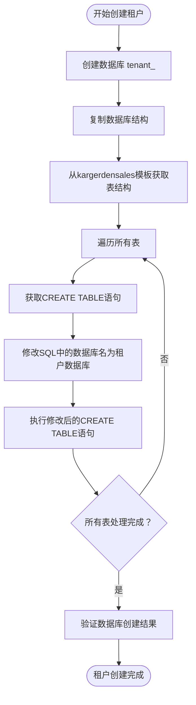
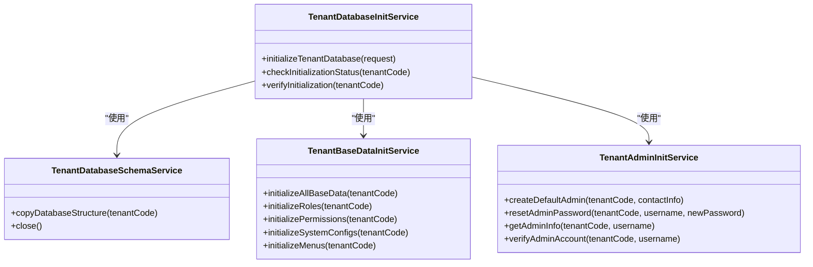
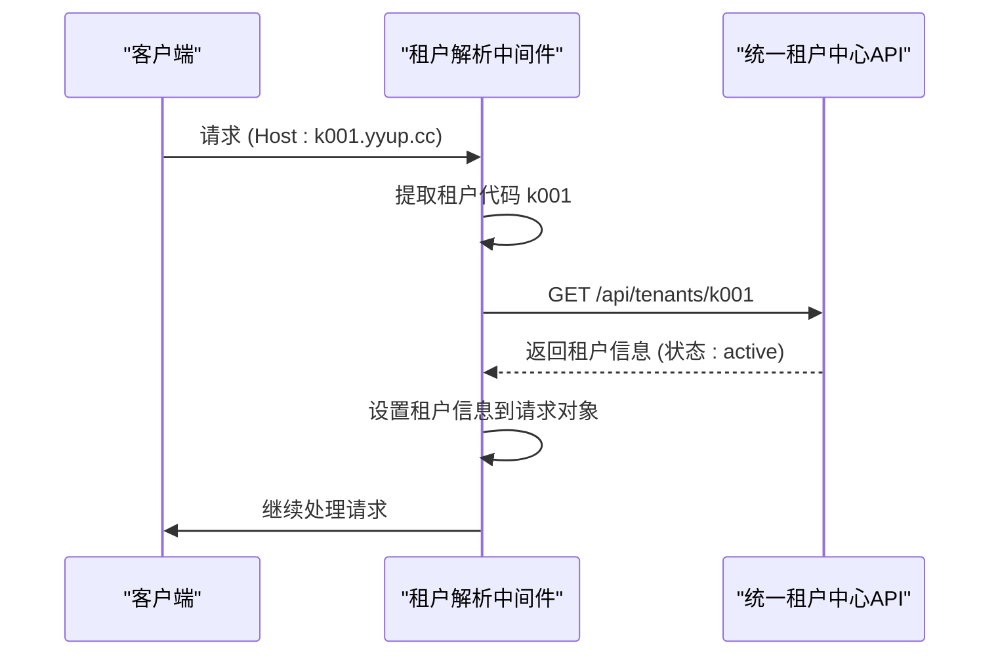
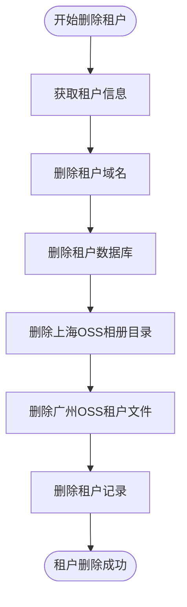

# 租户管理

<cite>
**本文档引用的文件**
- [create-tenant-database.ts](file://k.yyup.com/create-tenant-database.ts)
- [tenant-resolver.middleware.ts](file://k.yyup.com/server/src/middlewares/tenant-resolver.middleware.ts)
- [tenant-security.middleware.ts](file://k.yyup.com/server/src/middlewares/tenant-security.middleware.ts)
- [minimal-tenant-app.ts](file://k.yyup.com/server/src/minimal-tenant-app.ts)
- [tenant-database.service.ts](file://k.yyup.com/server/src/services/tenant-database.service.ts)
- [tenant-token.service.ts](file://k.yyup.com/server/src/services/tenant-token.service.ts)
- [tenant.service.ts](file://unified-tenant-system/server/src/services/tenant.service.ts)
- [tenant-database-init.service.ts](file://unified-tenant-system/server/src/services/tenant-database-init.service.ts)
</cite>

## 目录
1. [引言](#引言)
2. [租户创建流程](#租户创建流程)
3. [租户激活与配置](#租户激活与配置)
4. [租户停用与删除](#租户停用与删除)
5. [租户配置管理](#租户配置管理)
6. [租户管理API指南](#租户管理api指南)
7. [结论](#结论)

## 引言

本项目采用多租户架构，通过独立数据库模式实现租户隔离。每个租户拥有独立的数据库实例，通过域名识别和安全令牌机制确保数据隔离和访问安全。系统支持租户的全生命周期管理，包括创建、激活、配置、停用和删除等操作。

**Section sources**
- [minimal-tenant-app.ts](file://k.yyup.com/server/src/minimal-tenant-app.ts#L1-L209)

## 租户创建流程

租户创建流程包括数据库初始化、Schema创建、默认配置生成和初始数据填充四个主要步骤。

### 数据库初始化

租户数据库的创建通过`create-tenant-database.ts`脚本实现。该脚本连接到MySQL服务器，为指定租户代码创建独立的数据库实例。数据库命名遵循`tenant_<租户代码>`的格式，使用utf8mb4字符集和utf8mb4_unicode_ci排序规则。



**Diagram sources**
- [create-tenant-database.ts](file://k.yyup.com/create-tenant-database.ts#L1-L165)

**Section sources**
- [create-tenant-database.ts](file://k.yyup.com/create-tenant-database.ts#L1-L165)

### Schema创建

Schema创建过程从名为`kargerdensales`的模板数据库复制所有表结构。系统首先查询模板数据库中的所有基础表，然后逐个获取每个表的`SHOW CREATE TABLE`语句，修改其中的数据库名称为租户数据库名称，最后执行修改后的SQL语句在租户数据库中创建相应的表结构。

### 默认配置生成

在`TenantDatabaseInitService`中，系统通过`TenantBaseDataInitService`初始化基础数据，包括角色、权限、系统配置和菜单项等。这些基础数据为新租户提供了完整的系统功能框架。



**Diagram sources**
- [tenant-database-init.service.ts](file://unified-tenant-system/server/src/services/tenant-database-init.service.ts#L1-L348)

### 初始数据填充

初始数据填充包括创建管理员账户和填充基础业务数据。`TenantAdminInitService`负责创建默认的管理员账户，设置初始密码，并分配相应的角色和权限。同时，系统会根据租户的联系信息填充初始的组织信息。

**Section sources**
- [tenant-database-init.service.ts](file://unified-tenant-system/server/src/services/tenant-database-init.service.ts#L1-L348)

## 租户激活与配置

租户激活和配置流程通过统一的租户管理服务实现，允许设置租户特定的参数。

### 租户识别与解析

系统通过`tenant-resolver.middleware.ts`中间件根据域名识别租户。支持的域名格式包括`k001.yyup.cc`和`tenant1.kindergarten.com`等。中间件从Host头中提取租户代码，并验证租户是否存在且已激活。



**Diagram sources**
- [tenant-resolver.middleware.ts](file://k.yyup.com/server/src/middlewares/tenant-resolver.middleware.ts#L1-L224)

### 租户参数配置

租户参数配置包括名称、联系信息、主题风格和功能模块等。这些配置存储在统一租户中心的主数据库中，通过`TenantService`进行管理。系统支持通过API更新租户信息，包括：

- 租户名称
- 联系人姓名、邮箱、电话
- 地址和描述
- 状态（激活、暂停、删除）

**Section sources**
- [tenant-resolver.middleware.ts](file://k.yyup.com/server/src/middlewares/tenant-resolver.middleware.ts#L1-L224)
- [tenant.service.ts](file://unified-tenant-system/server/src/services/tenant.service.ts#L1-L726)

## 租户停用与删除

系统提供了完整的租户停用和删除机制，确保资源的正确释放和数据的安全处理。

### 租户停用

租户停用通过更新租户状态实现。`TenantService`提供了`updateTenantStatus`方法，可以将租户状态设置为'suspended'（暂停），从而限制对该租户的访问。

### 租户删除

租户删除是一个级联清理过程，立即物理删除所有相关资源：

1. 删除租户子域名（DNS记录）
2. 物理删除租户数据库
3. 删除上海OSS相册目录及所有文件
4. 删除广州OSS租户文件及所有文件
5. 物理删除租户记录



**Diagram sources**
- [tenant.service.ts](file://unified-tenant-system/server/src/services/tenant.service.ts#L1-L726)

**Section sources**
- [tenant.service.ts](file://unified-tenant-system/server/src/services/tenant.service.ts#L1-L726)

## 租户配置管理

租户配置管理涉及权限配置、界面定制和业务规则的存储与管理。

### 配置存储机制

租户特定的设置存储在各自的数据库实例中，通过共享连接池进行访问。`TenantDatabaseService`实现了共享连接池模式，所有租户共享一个数据库连接池，通过完整表名（如`tenant_k001.users`）访问不同租户的数据。

```mermaid
classDiagram
class TenantDatabaseService {
-globalConnection : Sequelize
-isInitialized : boolean
-initPromise : Promise<Sequelize>
+initializeGlobalConnection() : Promise<Sequelize>
+getGlobalConnection() : Sequelize
+getTenantConnection(tenantCode) : Promise<Sequelize>
+getFullTableName(tenantCode, tableName) : string
+closeGlobalConnection() : Promise<void>
+checkTenantDatabaseExists(tenantCode) : Promise<boolean>
+getTenantDatabaseStats(tenantCode) : Promise<any>
+healthCheck() : Promise<{healthy : boolean, details : any}>
}
class TenantTokenService {
-instance : TenantTokenService
+generateTenantToken(userPhone, tenantCode, tenantDomain, databaseName) : TenantTokenInfo
+validateTenantToken(token, currentTenantCode, currentDomain) : {isValid : boolean, tenantInfo? : TenantTokenInfo, error? : string}
+parseTokenInfo(token) : Partial<TenantTokenInfo> | null
+isTokenExpiringSoon(token) : boolean
+refreshTenantToken(tokenInfo) : TenantTokenInfo
+getTokenRemainingTime(token) : number
+batchValidateTokens(tokens) : {valid : string[], invalid : string[], errors : string[]}
+cleanExpiredTokens() : Promise<void>
}
class TenantSecurityMiddleware {
+tenantSecurityMiddleware(req, res, next)
+tenantDataAccessMiddleware(req, res, next)
+tenantAuditMiddleware(req, res, next)
}
TenantSecurityMiddleware --> TenantTokenService : "使用"
TenantSecurityMiddleware --> TenantDatabaseService : "使用"
```

**Diagram sources**
- [tenant-database.service.ts](file://k.yyup.com/server/src/services/tenant-database.service.ts#L1-L370)
- [tenant-token.service.ts](file://k.yyup.com/server/src/services/tenant-token.service.ts#L1-L353)
- [tenant-security.middleware.ts](file://k.yyup.com/server/src/middlewares/tenant-security.middleware.ts#L1-L270)

### 权限与安全配置

系统实现了多层次的安全机制：

- **MD5租户令牌验证**：基于用户手机号、租户代码、域名和时间戳生成MD5令牌，确保请求来源的合法性。
- **租户数据访问控制**：防止URL参数篡改导致的越权访问。
- **操作审计日志**：记录所有租户相关的操作，便于安全审计。

**Section sources**
- [tenant-database.service.ts](file://k.yyup.com/server/src/services/tenant-database.service.ts#L1-L370)
- [tenant-token.service.ts](file://k.yyup.com/server/src/services/tenant-token.service.ts#L1-L353)
- [tenant-security.middleware.ts](file://k.yyup.com/server/src/middlewares/tenant-security.middleware.ts#L1-L270)

## 租户管理API指南

为开发者提供了完整的租户管理API，用于创建、查询、更新和删除租户。

### 核心API接口

| 接口 | 方法 | 描述 | 参数 |
|------|------|------|------|
| `/api/tenants` | POST | 创建新租户 | 租户代码、名称、域名、联系信息 |
| `/api/tenants/{code}` | GET | 获取租户信息 | 租户代码 |
| `/api/tenants/{code}` | PUT | 更新租户信息 | 租户代码、更新字段 |
| `/api/tenants/{code}` | DELETE | 删除租户 | 租户代码 |
| `/api/tenants` | GET | 获取所有租户列表 | 无 |

### 异常处理

API操作中的异常处理遵循统一的响应格式：

```json
{
  "success": false,
  "message": "错误描述",
  "code": "错误代码"
}
```

常见的错误代码包括：
- `INVALID_TENANT_DOMAIN`：无法识别的租户域名
- `TENANT_NOT_FOUND`：租户不存在或未激活
- `DB_CONNECTION_FAILED`：数据库连接失败
- `TENANT_RESOLVER_ERROR`：租户解析失败

### 事务完整性

租户创建和删除操作使用数据库事务确保完整性。创建租户时，所有步骤（数据库创建、记录插入、初始化等）在同一个事务中执行，任何步骤失败都会回滚整个操作。

**Section sources**
- [tenant.service.ts](file://unified-tenant-system/server/src/services/tenant.service.ts#L1-L726)

## 结论

本项目的租户管理系统实现了完整的全生命周期管理，从创建到删除的每个环节都经过精心设计。系统采用独立数据库模式确保数据隔离，通过共享连接池优化资源利用，结合多层次的安全机制保障系统安全。API设计简洁明了，便于开发者集成和使用。