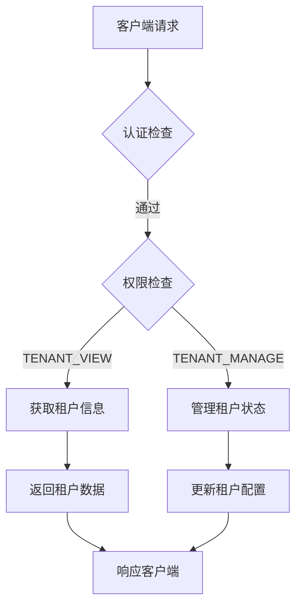
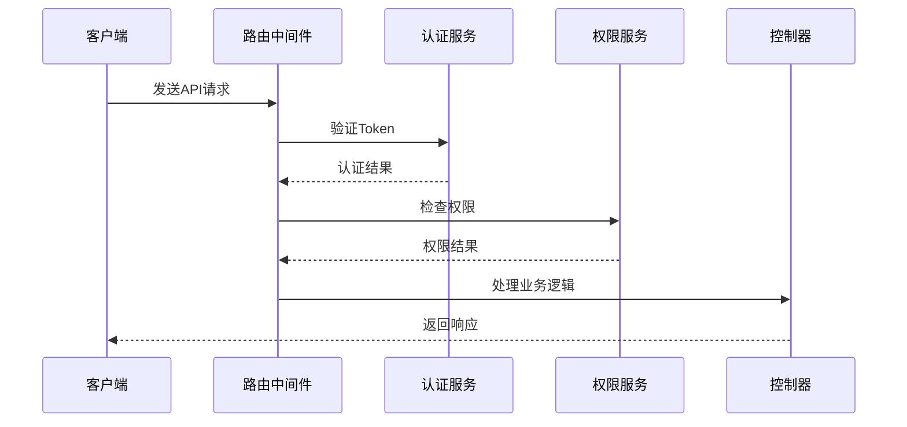
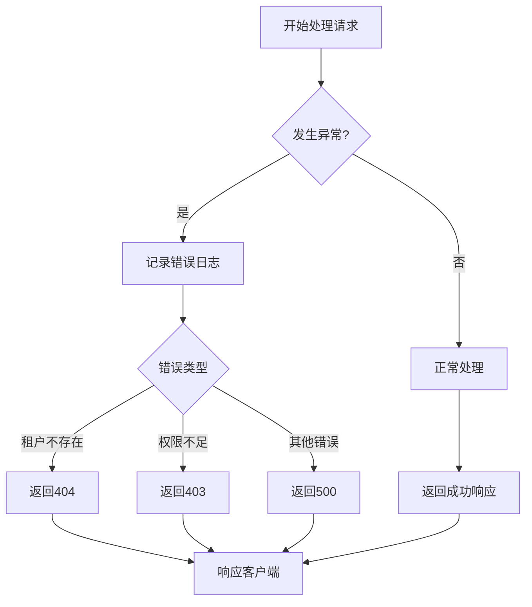
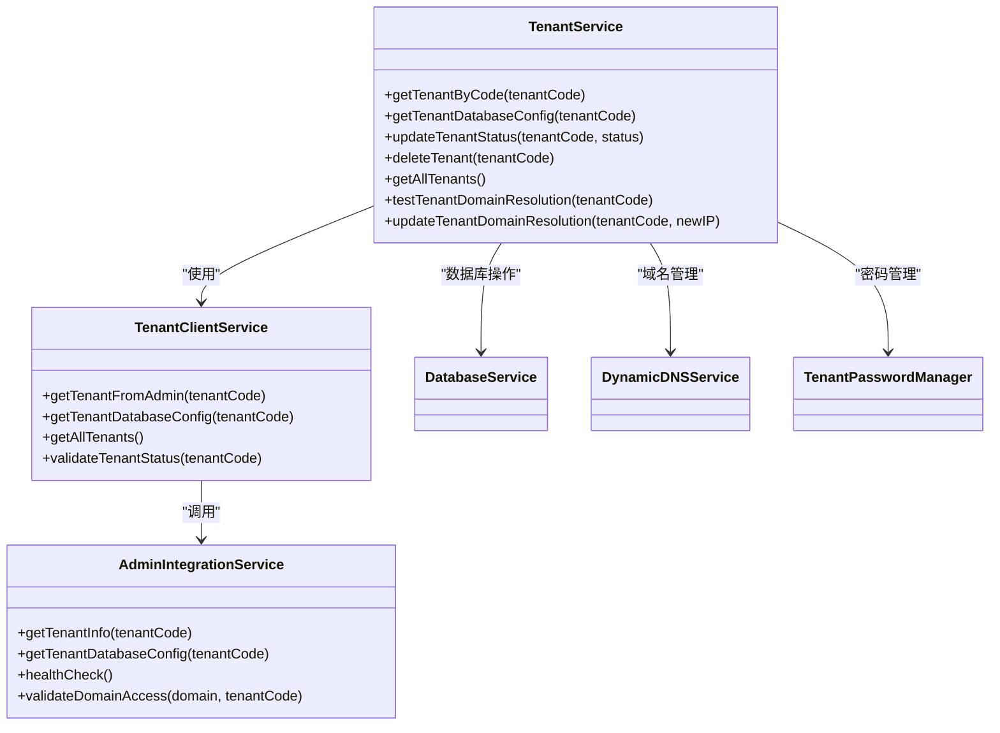
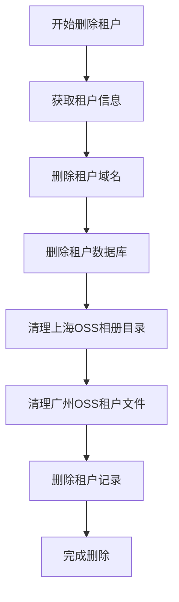

# API接口

<cite>
**本文档引用的文件**
- [tenant.routes.ts](file://unified-tenant-system/server/src/routes/tenant.routes.ts)
- [tenant.service.ts](file://unified-tenant-system/server/src/services/tenant.service.ts)
- [tenant-client.service.ts](file://unified-tenant-system/server/src/services/tenant-client.service.ts)
- [admin-integration.service.ts](file://unified-tenant-system/server/src/services/admin-integration.service.ts)
</cite>

## 目录
1. [引言](#引言)
2. [API端点定义](#api端点定义)
3. [请求处理逻辑](#请求处理逻辑)
4. [业务逻辑实现](#业务逻辑实现)
5. [API使用示例](#api使用示例)
6. [错误处理方案](#错误处理方案)

## 引言

本项目采用统一租户中心架构，所有租户配置管理操作均通过RESTful API进行。系统核心功能集中在`k.yyup.com`与`admin.yyup.cc`之间的交互，其中`k.yyup.com`作为客户端从统一租户中心获取租户信息和认证。本文档详细介绍了租户配置管理的API设计、请求处理流程和业务逻辑实现，为开发者提供完整的接口使用指南。

## API端点定义

租户配置管理API定义在`tenant.routes.ts`文件中，提供了一系列RESTful接口用于租户的全生命周期管理。所有API端点均需要身份认证，并根据权限进行访问控制。



**API端点列表**

| 端点 | HTTP方法 | 权限要求 | 功能描述 |
|------|--------|--------|--------|
| `/api/tenant/{tenantCode}` | GET | TENANT_VIEW | 获取指定租户信息 |
| `/api/tenant/list` | GET | TENANT_VIEW | 获取所有租户列表 |
| `/api/tenant/{tenantCode}/status` | PUT | TENANT_MANAGE | 更新租户状态 |
| `/api/tenant/{tenantCode}/database-config` | GET | TENANT_MANAGE | 获取租户数据库配置 |
| `/api/tenant/{tenantCode}/regenerate-password` | POST | TENANT_MANAGE | 重新生成租户密码 |
| `/api/tenant/{tenantCode}/domain/test` | POST | TENANT_MANAGE | 测试租户域名解析 |
| `/api/tenant/{tenantCode}/domain/update` | PUT | TENANT_MANAGE | 更新租户域名解析 |

**租户状态枚举**

租户状态包含以下几种值：
- `active`: 活跃状态，租户可正常使用
- `suspended`: 暂停状态，租户功能受限
- `deleted`: 已删除状态，租户资源被清理

**请求/响应格式**

所有API遵循统一的响应格式：
```json
{
  "success": true,
  "message": "操作成功",
  "data": { /* 响应数据 */ },
  "total": 1 // 列表接口包含总数
}
```

**状态码说明**

| 状态码 | 含义 | 说明 |
|-------|-----|-----|
| 200 | OK | 请求成功 |
| 201 | Created | 资源创建成功 |
| 400 | Bad Request | 请求参数错误 |
| 403 | Forbidden | 权限不足 |
| 404 | Not Found | 资源不存在 |
| 500 | Internal Server Error | 服务器内部错误 |

**Diagram sources**
- [tenant.routes.ts](file://unified-tenant-system/server/src/routes/tenant.routes.ts#L22-L647)

**Section sources**
- [tenant.routes.ts](file://unified-tenant-system/server/src/routes/tenant.routes.ts#L1-L648)

## 请求处理逻辑

租户API的请求处理逻辑实现了完整的输入验证、权限检查和错误响应机制，确保系统的安全性和稳定性。

### 认证与权限检查

所有租户API端点都应用了两层中间件：
1. `verifyToken`: 验证JWT令牌的有效性
2. `checkPermission`: 检查用户是否具有相应权限



### 输入验证

系统使用`express-validator`进行请求参数验证，确保输入数据的完整性和正确性。验证规则包括：

- **租户代码格式**: 必须符合`k\d{3,}`正则表达式（如k001, k002）
- **必填字段检查**: 租户名称、联系人姓名、邮箱等字段不能为空
- **格式验证**: 邮箱格式、手机号格式、域名格式等
- **长度限制**: 各字段有明确的长度限制

当验证失败时，系统返回400状态码，并包含详细的错误信息数组。

### 错误处理

系统实现了统一的错误处理机制，捕获所有异常并返回标准化的错误响应：



错误响应包含以下信息：
- `success`: 布尔值，表示操作是否成功
- `message`: 错误描述信息
- `error`: 具体的错误详情（仅在开发环境返回）

**Diagram sources**
- [tenant.routes.ts](file://unified-tenant-system/server/src/routes/tenant.routes.ts#L131-L158)

**Section sources**
- [tenant.routes.ts](file://unified-tenant-system/server/src/routes/tenant.routes.ts#L131-L158)

## 业务逻辑实现

租户管理的业务逻辑主要封装在`tenant.service.ts`文件中，通过服务层实现核心功能。

### 服务架构

系统采用分层架构，各服务职责明确：



### 核心业务逻辑

#### 租户信息获取

`TenantClientService`负责从`admin.yyup.cc`统一租户中心获取租户信息：

1. 调用`adminIntegrationService.getTenantInfo()`获取租户数据
2. 转换为本地租户信息格式
3. 返回给调用方

#### 数据库配置管理

租户数据库配置通过以下流程获取：
1. 验证租户代码格式
2. 从主数据库查询租户记录
3. 解密存储的数据库密码
4. 构造完整的数据库连接配置

#### 租户状态管理

更新租户状态的流程：
1. 验证权限和参数
2. 更新数据库中的状态字段
3. 记录操作日志
4. 返回成功响应

#### 租户删除流程

租户删除是级联清理过程，包括：
1. 删除租户域名记录
2. 物理删除租户数据库
3. 清理OSS存储中的相关文件
4. 删除租户记录



### 版本管理与审计日志

系统通过以下机制实现配置变更的追踪：
- **操作日志**: 所有关键操作都记录到日志系统
- **状态变更记录**: 租户状态变更都有时间戳记录
- **审计追踪**: 记录操作用户ID和变更详情

### 配置同步机制

租户配置同步采用客户端-服务器模式：
1. `k.yyup.com`作为客户端定期与`admin.yyup.cc`同步
2. 使用HTTP请求获取最新租户信息
3. 本地缓存租户配置以提高性能
4. 健康检查确保连接正常

**Diagram sources**
- [tenant.service.ts](file://unified-tenant-system/server/src/services/tenant.service.ts#L72-L725)
- [tenant-client.service.ts](file://unified-tenant-system/server/src/services/tenant-client.service.ts#L14-L232)
- [admin-integration.service.ts](file://unified-tenant-system/server/src/services/admin-integration.service.ts#L73-L724)

**Section sources**
- [tenant.service.ts](file://unified-tenant-system/server/src/services/tenant.service.ts#L72-L725)

## API使用示例

### curl命令示例

**获取租户信息**
```bash
curl -X GET "http://k.yyup.com/api/tenant/k001" \
  -H "Authorization: Bearer your-jwt-token" \
  -H "Content-Type: application/json"
```

**更新租户状态**
```bash
curl -X PUT "http://k.yyup.com/api/tenant/k001/status" \
  -H "Authorization: Bearer your-jwt-token" \
  -H "Content-Type: application/json" \
  -d '{"status": "suspended"}'
```

**测试域名解析**
```bash
curl -X POST "http://k.yyup.com/api/tenant/k001/domain/test" \
  -H "Authorization: Bearer your-jwt-token" \
  -H "Content-Type: application/json"
```

### JavaScript客户端调用

```javascript
// 创建API客户端
class TenantApiClient {
  constructor(baseUrl, token) {
    this.baseUrl = baseUrl;
    this.token = token;
  }

  async request(endpoint, options = {}) {
    const url = `${this.baseUrl}/api/tenant${endpoint}`;
    const config = {
      method: 'GET',
      headers: {
        'Authorization': `Bearer ${this.token}`,
        'Content-Type': 'application/json'
      },
      ...options
    };

    try {
      const response = await fetch(url, config);
      const data = await response.json();
      
      if (!data.success) {
        throw new Error(data.message);
      }
      
      return data;
    } catch (error) {
      console.error('API请求失败:', error.message);
      throw error;
    }
  }

  // 获取租户信息
  async getTenant(tenantCode) {
    return this.request(`/${tenantCode}`);
  }

  // 获取所有租户
  async getAllTenants() {
    return this.request('/list');
  }

  // 更新租户状态
  async updateStatus(tenantCode, status) {
    return this.request(`/${tenantCode}/status`, {
      method: 'PUT',
      body: JSON.stringify({ status })
    });
  }

  // 测试域名解析
  async testDomain(tenantCode) {
    return this.request(`/${tenantCode}/domain/test`, {
      method: 'POST'
    });
  }
}

// 使用示例
const client = new TenantApiClient('http://k.yyup.com', 'your-jwt-token');

// 获取租户信息
client.getTenant('k001')
  .then(data => console.log('租户信息:', data))
  .catch(error => console.error('错误:', error.message));

// 更新租户状态
client.updateStatus('k001', 'suspended')
  .then(data => console.log('状态更新成功:', data))
  .catch(error => console.error('错误:', error.message));
```

**Section sources**
- [tenant.routes.ts](file://unified-tenant-system/server/src/routes/tenant.routes.ts#L183-L228)
- [tenant.service.ts](file://unified-tenant-system/server/src/services/tenant.service.ts#L149-L187)

## 错误处理方案

### 常见错误类型

| 错误类型 | 原因 | 解决方案 |
|--------|-----|--------|
| 参数验证失败 | 请求参数格式不正确 | 检查参数格式和必填字段 |
| 租户不存在 | 提供的租户代码无效 | 确认租户代码是否正确 |
| 权限不足 | 用户没有相应权限 | 检查用户角色和权限配置 |
| 服务异常 | 服务器内部错误 | 检查服务日志并重试 |

### 错误响应示例

**参数验证失败**
```json
{
  "success": false,
  "message": "参数验证失败",
  "errors": [
    {
      "value": "invalid-code",
      "msg": "租户代码格式不正确，应为 k001, k002 等格式",
      "param": "tenantCode",
      "location": "params"
    }
  ]
}
```

**租户不存在**
```json
{
  "success": false,
  "message": "租户不存在"
}
```

**权限不足**
```json
{
  "success": false,
  "message": "租户创建功能已迁移到admin.yyup.cc统一租户中心，请联系管理员"
}
```

### 重试策略

对于临时性错误（如网络问题），建议采用指数退避重试策略：

```javascript
async function retryRequest(requestFn, maxRetries = 3) {
  for (let i = 0; i < maxRetries; i++) {
    try {
      return await requestFn();
    } catch (error) {
      if (i === maxRetries - 1) throw error;
      
      // 指数退避：1s, 2s, 4s...
      const delay = Math.pow(2, i) * 1000;
      await new Promise(resolve => setTimeout(resolve, delay));
    }
  }
}
```

### 监控与告警

系统通过以下方式监控API健康状况：
- **健康检查端点**: 定期检查与`admin.yyup.cc`的连接
- **日志记录**: 记录所有API请求和错误
- **性能监控**: 跟踪API响应时间
- **异常告警**: 对频繁错误发送告警通知

**Section sources**
- [tenant.routes.ts](file://unified-tenant-system/server/src/routes/tenant.routes.ts#L133-L158)
- [tenant.service.ts](file://unified-tenant-system/server/src/services/tenant.service.ts#L136-L143)