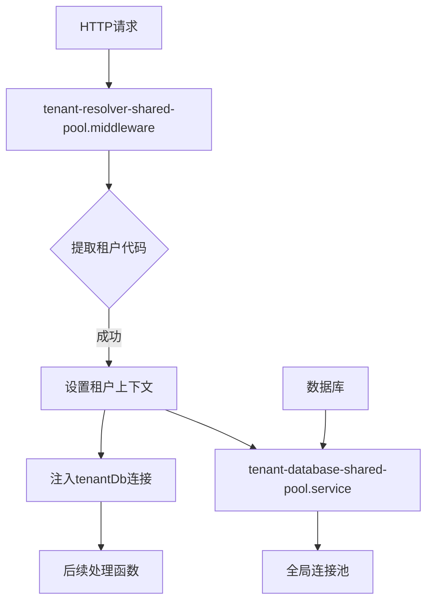
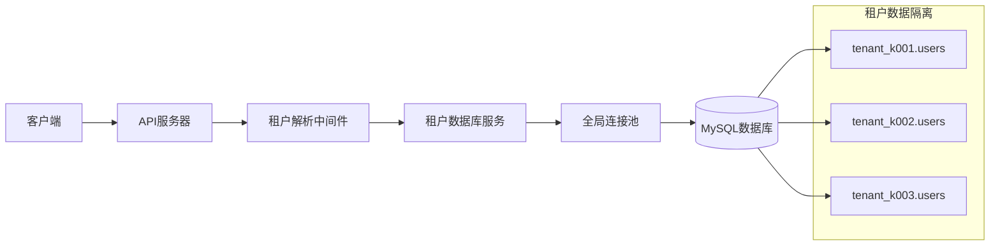
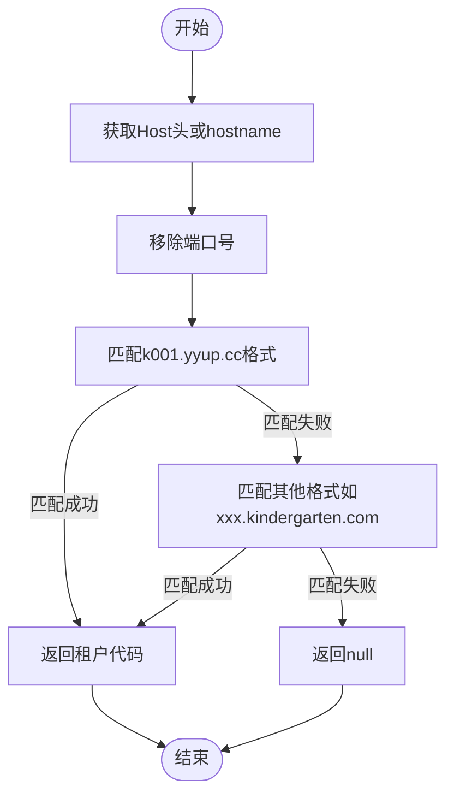
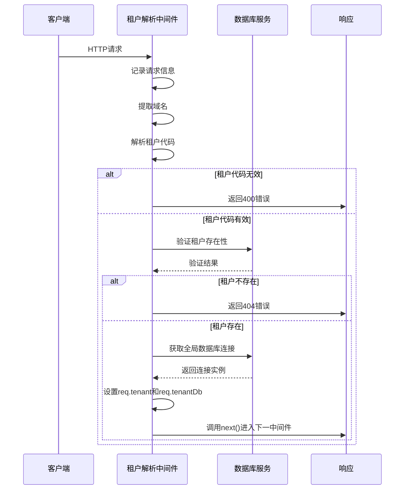
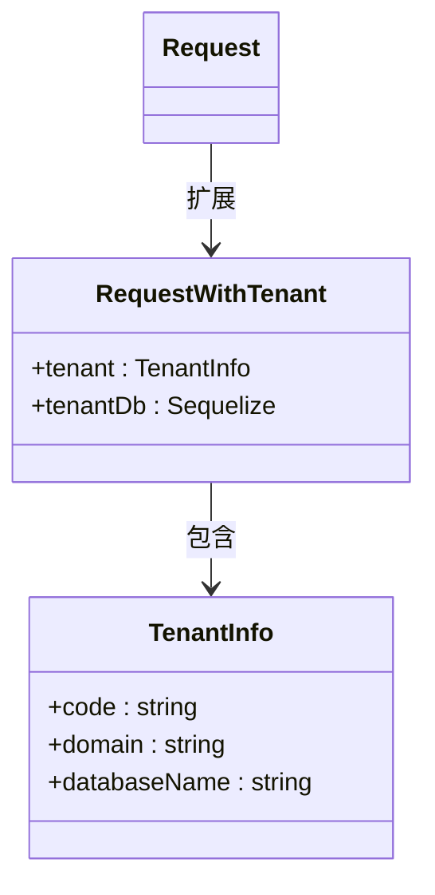
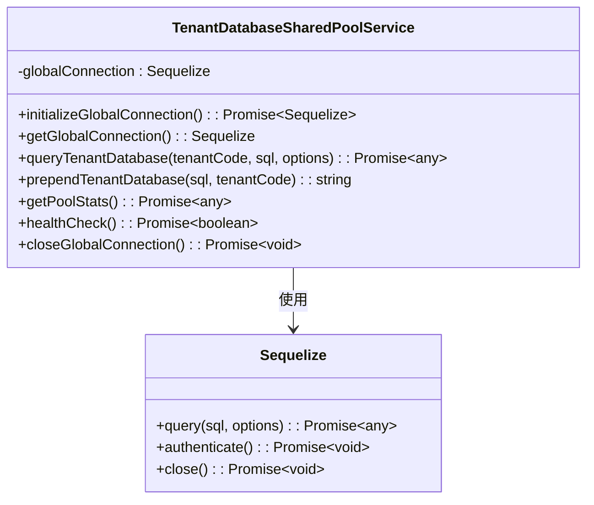
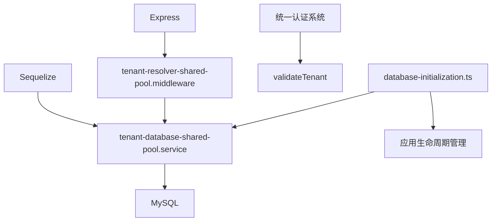

# 上下文管理

<cite>
**本文档引用的文件**  
- [tenant-resolver-shared-pool.middleware.ts](file://tenant-resolver-shared-pool.middleware.ts)
- [tenant-database-shared-pool.service.ts](file://tenant-database-shared-pool.service.ts)
- [auth-shared-pool-example.middleware.ts](file://auth-shared-pool-example.middleware.ts)
- [database-initialization.ts](file://database-initialization.ts)
</cite>

## 目录
1. [引言](#引言)
2. [项目结构](#项目结构)
3. [核心组件](#核心组件)
4. [架构概述](#架构概述)
5. [详细组件分析](#详细组件分析)
6. [依赖分析](#依赖分析)
7. [性能考虑](#性能考虑)
8. [故障排除指南](#故障排除指南)
9. [结论](#结论)

## 引言
本文档详细描述了k.yyupgame项目中租户上下文的解析与传播机制。重点介绍`tenant-resolver-shared-pool.middleware.ts`中间件在HTTP请求生命周期中的作用，包括如何从请求头、子域名或JWT令牌中提取租户标识，并将租户上下文注入到请求对象中，确保后续处理函数能够访问正确的租户数据源。同时阐述上下文传播的一致性保证，特别是在异步操作和微服务调用中的传递机制，并为开发者提供上下文管理的最佳实践。

## 项目结构
项目采用模块化设计，核心上下文管理功能集中在根目录下的中间件和服务文件中。租户识别逻辑通过中间件实现，数据库连接通过共享池服务统一管理，确保多租户环境下的资源高效利用和隔离。

**Diagram sources**
- [tenant-resolver-shared-pool.middleware.ts](file://tenant-resolver-shared-pool.middleware.ts#L26-L96)
- [tenant-database-shared-pool.service.ts](file://tenant-database-shared-pool.service.ts#L9-L177)

**Section sources**
- [tenant-resolver-shared-pool.middleware.ts](file://tenant-resolver-shared-pool.middleware.ts#L1-L142)
- [tenant-database-shared-pool.service.ts](file://tenant-database-shared-pool.service.ts#L1-L177)

## 核心组件
本项目的核心是基于共享连接池的多租户上下文管理机制。通过`tenant-resolver-shared-pool.middleware`中间件解析租户信息，并利用`tenant-database-shared-pool.service`提供的全局数据库连接池实现高效的数据访问。该设计避免了为每个租户创建独立连接池的资源浪费，同时通过SQL语句重写机制确保数据隔离。

**Section sources**
- [tenant-resolver-shared-pool.middleware.ts](file://tenant-resolver-shared-pool.middleware.ts#L26-L96)
- [tenant-database-shared-pool.service.ts](file://tenant-database-shared-pool.service.ts#L9-L177)

## 架构概述
系统采用共享连接池架构，所有租户共用一个Sequelize连接池，通过动态修改SQL语句中的表名为`tenant_{code}.table_name`格式实现数据隔离。这种设计显著降低了数据库连接数，提高了资源利用率。

**Diagram sources**
- [tenant-resolver-shared-pool.middleware.ts](file://tenant-resolver-shared-pool.middleware.ts#L26-L96)
- [tenant-database-shared-pool.service.ts](file://tenant-database-shared-pool.service.ts#L9-L177)

## 详细组件分析

### 租户解析中间件分析
`tenant-resolver-shared-pool.middleware`负责在请求生命周期早期解析租户信息，是整个上下文管理的核心。

#### 租户代码提取机制

**Diagram sources**
- [tenant-resolver-shared-pool.middleware.ts](file://tenant-resolver-shared-pool.middleware.ts#L103-L119)

#### HTTP请求生命周期中的作用

**Diagram sources**
- [tenant-resolver-shared-pool.middleware.ts](file://tenant-resolver-shared-pool.middleware.ts#L31-L92)

**Section sources**
- [tenant-resolver-shared-pool.middleware.ts](file://tenant-resolver-shared-pool.middleware.ts#L1-L142)

### 上下文注入与传播机制
中间件通过扩展Express的Request接口，将租户信息和数据库连接注入到请求对象中，供后续处理函数使用。

#### 请求对象扩展

**Diagram sources**
- [tenant-resolver-shared-pool.middleware.ts](file://tenant-resolver-shared-pool.middleware.ts#L14-L21)

#### 数据库连接共享机制

**Diagram sources**
- [tenant-database-shared-pool.service.ts](file://tenant-database-shared-pool.service.ts#L9-L177)

## 依赖分析
系统依赖于Express框架进行HTTP处理，Sequelize作为ORM工具，以及统一认证系统进行租户验证。数据库连接池的初始化和关闭通过`database-initialization.ts`进行管理，确保应用生命周期内的资源正确分配和释放。

**Diagram sources**
- [tenant-resolver-shared-pool.middleware.ts](file://tenant-resolver-shared-pool.middleware.ts#L6-L9)
- [tenant-database-shared-pool.service.ts](file://tenant-database-shared-pool.service.ts#L6-L8)
- [database-initialization.ts](file://database-initialization.ts#L6-L8)

**Section sources**
- [tenant-resolver-shared-pool.middleware.ts](file://tenant-resolver-shared-pool.middleware.ts#L1-L142)
- [tenant-database-shared-pool.service.ts](file://tenant-database-shared-pool.service.ts#L1-L177)
- [database-initialization.ts](file://database-initialization.ts#L1-L89)

## 性能考虑
共享连接池架构显著提升了系统性能和资源利用率。通过配置可调的连接池大小（默认最小5个，最大30个连接），系统能够在高并发场景下保持稳定。SQL语句重写机制虽然引入了轻微的处理开销，但相比为每个租户维护独立连接池的方案，整体性能更优。

**Section sources**
- [tenant-database-shared-pool.service.ts](file://tenant-database-shared-pool.service.ts#L20-L36)
- [database-initialization.ts](file://database-initialization.ts#L18-L26)

## 故障排除指南
当遇到租户上下文相关问题时，可按照以下步骤进行排查：

1. 检查请求的Host头是否符合租户域名格式（如k001.yyup.cc）
2. 查看日志中是否有"[租户识别] 无法解析租户代码"的警告信息
3. 确认数据库连接池是否成功初始化，检查是否有"全局数据库连接成功"的日志
4. 验证租户数据库是否存在且可访问
5. 检查SQL语句重写是否正确，确保表名前缀被正确添加

**Section sources**
- [tenant-resolver-shared-pool.middleware.ts](file://tenant-resolver-shared-pool.middleware.ts#L44-L49)
- [tenant-database-shared-pool.service.ts](file://tenant-database-shared-pool.service.ts#L44-L54)
- [database-initialization.ts](file://database-initialization.ts#L15-L39)

## 结论
k.yyupgame项目的上下文管理机制通过共享连接池设计实现了高效的多租户支持。`tenant-resolver-shared-pool.middleware`中间件在请求生命周期中扮演关键角色，准确解析租户信息并注入上下文，确保了数据隔离和安全性。该方案在性能、可维护性和扩展性方面表现出色，为大规模多租户应用提供了可靠的基础设施支持。