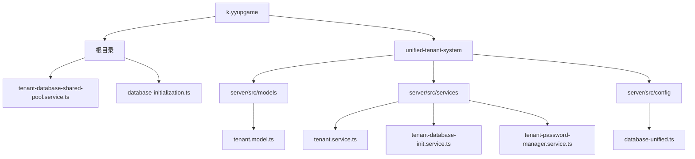
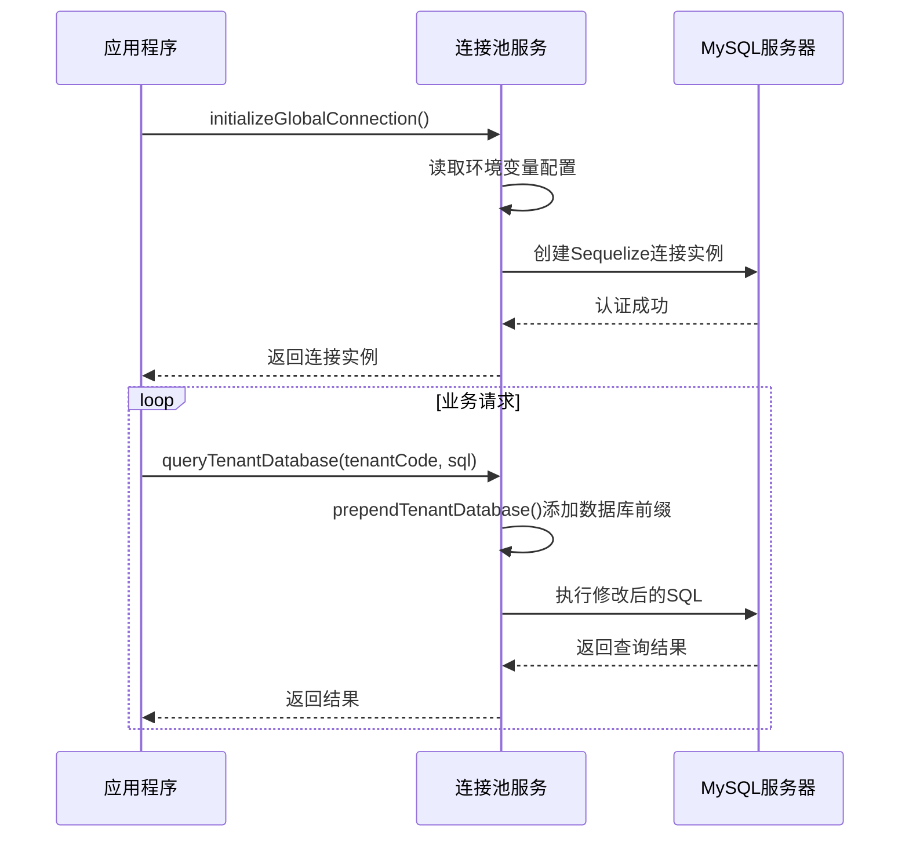
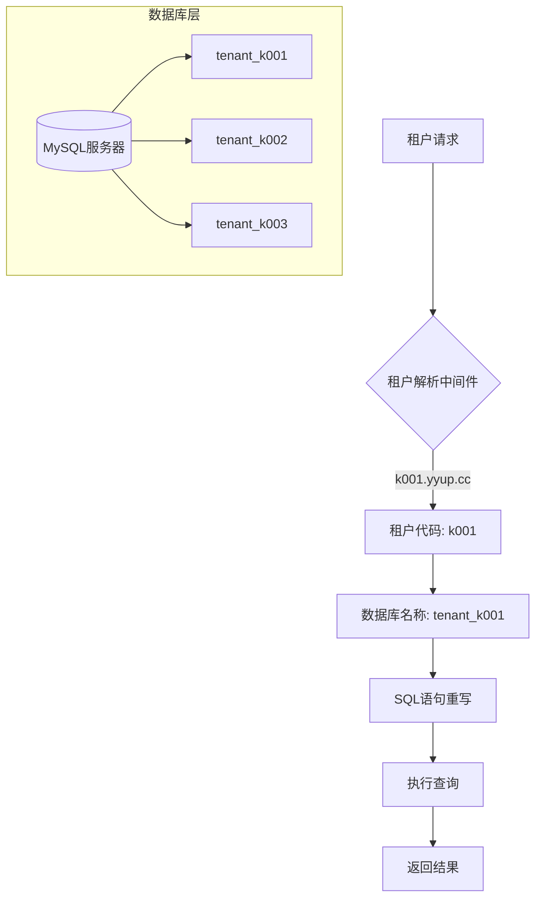
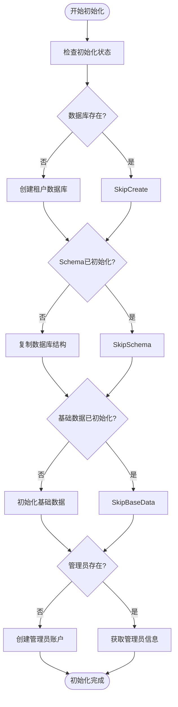
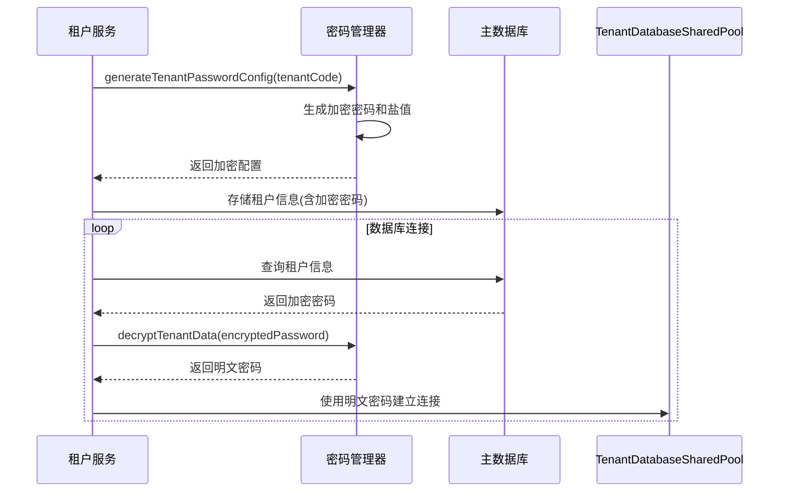

# 配置存储

<cite>
**本文档引用的文件**
- [tenant-database-shared-pool.service.ts](file://tenant-database-shared-pool.service.ts)
- [tenant.model.ts](file://unified-tenant-system/server/src/models/tenant.model.ts)
- [tenant.service.ts](file://unified-tenant-system/server/src/services/tenant.service.ts)
- [tenant-database-init.service.ts](file://unified-tenant-system/server/src/services/tenant-database-init.service.ts)
- [tenant-password-manager.service.ts](file://unified-tenant-system/server/src/services/tenant-password-manager.service.ts)
- [database-initialization.ts](file://database-initialization.ts)
- [database-unified.ts](file://k.yyup.com/server/src/config/database-unified.ts)
- [tenant-resolver-shared-pool.middleware.ts](file://tenant-resolver-shared-pool.middleware.ts)
</cite>

## 目录
1. [项目结构](#项目结构)
2. [核心组件](#核心组件)
3. [数据库连接池共享策略](#数据库连接池共享策略)
4. [租户数据隔离实现](#租户数据隔离实现)
5. [租户模型设计](#租户模型设计)
6. [数据迁移与初始化](#数据迁移与初始化)
7. [配置数据加密存储](#配置数据加密存储)
8. [最佳实践](#最佳实践)

## 项目结构

本项目采用微服务架构，配置存储相关的核心文件分布在根目录和`unified-tenant-system`子系统中。主要目录结构如下：



**Diagram sources**
- [tenant-database-shared-pool.service.ts](file://tenant-database-shared-pool.service.ts)
- [unified-tenant-system/server/src/models/tenant.model.ts)
- [unified-tenant-system/server/src/services/tenant.service.ts)
- [unified-tenant-system/server/src/services/tenant-database-init.service.ts)
- [unified-tenant-system/server/src/services/tenant-password-manager.service.ts)
- [k.yyup.com/server/src/config/database-unified.ts)

**Section sources**
- [tenant-database-shared-pool.service.ts](file://tenant-database-shared-pool.service.ts)
- [unified-tenant-system/server/src/models/tenant.model.ts)
- [unified-tenant-system/server/src/services/tenant.service.ts)

## 核心组件

本项目的配置存储系统由多个核心组件构成，包括租户数据库共享池服务、租户模型、租户管理服务、数据库初始化服务和密码管理服务。这些组件协同工作，实现了多租户环境下的配置数据持久化和安全管理。

**Section sources**
- [tenant-database-shared-pool.service.ts](file://tenant-database-shared-pool.service.ts#L1-L177)
- [tenant.model.ts](file://unified-tenant-system/server/src/models/tenant.model.ts#L1-L83)
- [tenant.service.ts](file://unified-tenant-system/server/src/services/tenant.service.ts#L1-L726)

## 数据库连接池共享策略

### 连接池配置

`TenantDatabaseSharedPoolService` 类实现了全局共享的数据库连接池策略。所有租户共享同一个连接池，通过连接到MySQL系统数据库来管理多个租户数据库。

连接池的关键配置参数包括：
- **最大连接数**：由环境变量 `DB_POOL_MAX` 控制，默认值为30
- **最小连接数**：由环境变量 `DB_POOL_MIN` 控制，默认值为5
- **获取连接超时**：30秒
- **空闲连接超时**：10秒



**Diagram sources**
- [tenant-database-shared-pool.service.ts](file://tenant-database-shared-pool.service.ts#L15-L55)
- [database-unified.ts](file://k.yyup.com/server/src/config/database-unified.ts#L94-L122)

**Section sources**
- [tenant-database-shared-pool.service.ts](file://tenant-database-shared-pool.service.ts#L1-L177)
- [database-unified.ts](file://k.yyup.com/server/src/config/database-unified.ts#L47-L131)

## 租户数据隔离实现

### Schema隔离机制

本系统采用基于数据库Schema的隔离策略，每个租户拥有独立的数据库实例，通过数据库名称前缀 `tenant_` 进行区分。这种隔离方式提供了良好的数据安全性和性能隔离。

当执行租户数据库查询时，系统会自动将SQL语句中的表名替换为完整的 `数据库名.表名` 格式。例如：
- 原始SQL: `SELECT * FROM users`
- 修改后: `SELECT * FROM tenant_k001.users`



**Diagram sources**
- [tenant-database-shared-pool.service.ts](file://tenant-database-shared-pool.service.ts#L71-L123)
- [tenant-resolver-shared-pool.middleware.ts](file://tenant-resolver-shared-pool.middleware.ts#L26-L92)

**Section sources**
- [tenant-database-shared-pool.service.ts](file://tenant-database-shared-pool.service.ts#L71-L123)
- [tenant-resolver-shared-pool.middleware.ts](file://tenant-resolver-shared-pool.middleware.ts#L1-L142)

## 租户模型设计

### 字段设计

`Tenant` 模型定义了租户的核心属性，包括租户ID、数据库连接信息和配置元数据等。

```mermaid
classDiagram
class Tenant {
+id : number
+code : string
+name : string
+domain? : string
+databaseName : string
+isActive : boolean
+expiresAt? : Date
+createdAt : Date
+updatedAt : Date
}
Tenant : +id : number 主键，自增
Tenant : +code : string 租户代码，唯一
Tenant : +name : string 租户名称
Tenant : +domain? : string 租户域名
Tenant : +databaseName : string 数据库名称
Tenant : +isActive : boolean 是否激活
Tenant : +expiresAt? : Date 过期时间
Tenant : +createdAt : Date 创建时间
Tenant : +updatedAt : Date 更新时间
```

关键字段说明：
- **code**: 租户代码，遵循 `k001`, `k002` 等格式，用于标识租户
- **databaseName**: 数据库名称，格式为 `tenant_{code}`，实现Schema隔离
- **isActive**: 租户状态标志，控制租户的激活状态
- **expiresAt**: 租户有效期，支持租户生命周期管理

**Diagram sources**
- [tenant.model.ts](file://unified-tenant-system/server/src/models/tenant.model.ts#L7-L83)

**Section sources**
- [tenant.model.ts](file://unified-tenant-system/server/src/models/tenant.model.ts#L7-L83)

## 数据迁移与初始化

### 初始化流程

租户数据库的初始化通过 `TenantDatabaseInitService` 完成，包含以下步骤：

1. **创建租户数据库**: 为新租户创建独立的数据库实例
2. **复制数据库结构**: 从模板数据库复制表结构
3. **初始化基础数据**: 插入角色、权限等基础配置
4. **创建管理员账户**: 为租户创建初始管理员



**Diagram sources**
- [tenant-database-init.service.ts](file://unified-tenant-system/server/src/services/tenant-database-init.service.ts#L207-L307)
- [tenant.service.ts](file://unified-tenant-system/server/src/services/tenant.service.ts#L382-L423)

**Section sources**
- [tenant-database-init.service.ts](file://unified-tenant-system/server/src/services/tenant-database-init.service.ts#L1-L348)
- [tenant.service.ts](file://unified-tenant-system/server/src/services/tenant.service.ts#L82-L135)

## 配置数据加密存储

### 敏感信息保护机制

系统通过 `TenantPasswordManagerService` 实现敏感信息的加密存储，特别是数据库密码等关键配置。

加密存储流程如下：
1. **密码生成**: 为每个租户生成唯一的加密密码
2. **数据加密**: 使用AES-256-GCM算法加密敏感数据
3. **安全存储**: 将加密后的数据存储在主数据库中
4. **按需解密**: 在需要时解密数据用于数据库连接



**Diagram sources**
- [tenant-password-manager.service.ts](file://unified-tenant-system/server/src/services/tenant-password-manager.service.ts#L18-L89)
- [tenant.service.ts](file://unified-tenant-system/server/src/services/tenant.service.ts#L102-L103)

**Section sources**
- [tenant-password-manager.service.ts](file://unified-tenant-system/server/src/services/tenant-password-manager.service.ts#L1-L223)
- [tenant.service.ts](file://unified-tenant-system/server/src/services/tenant.service.ts#L162-L173)

## 最佳实践

### 连接池调优

1. **合理设置连接池大小**:
   - 根据并发用户数和业务复杂度调整 `DB_POOL_MAX` 和 `DB_POOL_MIN`
   - 生产环境建议设置最大连接数为CPU核心数的2-4倍

2. **监控连接池状态**:
   - 定期调用 `getPoolStats()` 获取连接池统计信息
   - 监控活跃连接数和空闲连接数，及时发现连接泄漏

3. **优雅关闭连接**:
   - 应用关闭时调用 `closeGlobalConnection()` 确保连接正确释放
   - 处理SIGTERM和SIGINT信号，实现优雅关闭

### 数据备份策略

1. **定期备份**:
   - 实施每日增量备份和每周全量备份策略
   - 备份文件应存储在独立的存储系统中

2. **多地域备份**:
   - 在不同地理位置保存备份副本
   - 防止因地域性灾难导致数据丢失

3. **备份验证**:
   - 定期验证备份文件的完整性和可恢复性
   - 模拟灾难恢复场景进行演练

### 故障恢复方案

1. **健康检查机制**:
   - 定期执行 `healthCheck()` 确保数据库连接正常
   - 集成到监控系统，及时发现和报警

2. **自动重连**:
   - 在连接失败时实现指数退避重试机制
   - 避免因短暂网络波动导致服务中断

3. **灾难恢复**:
   - 建立详细的灾难恢复计划(RTO/RPO)
   - 定期进行恢复演练，确保方案有效性

**Section sources**
- [tenant-database-shared-pool.service.ts](file://tenant-database-shared-pool.service.ts#L128-L153)
- [database-initialization.ts](file://database-initialization.ts#L57-L88)
- [tenant.service.ts](file://unified-tenant-system/server/src/services/tenant.service.ts#L463-L595)