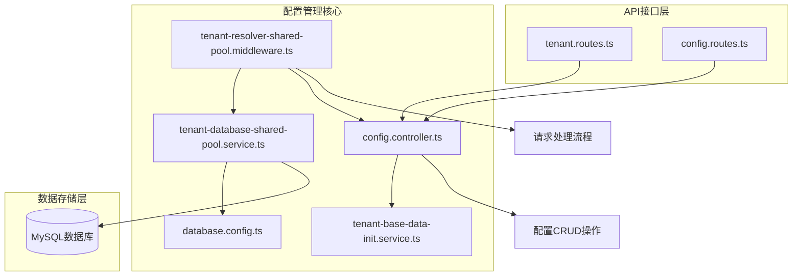
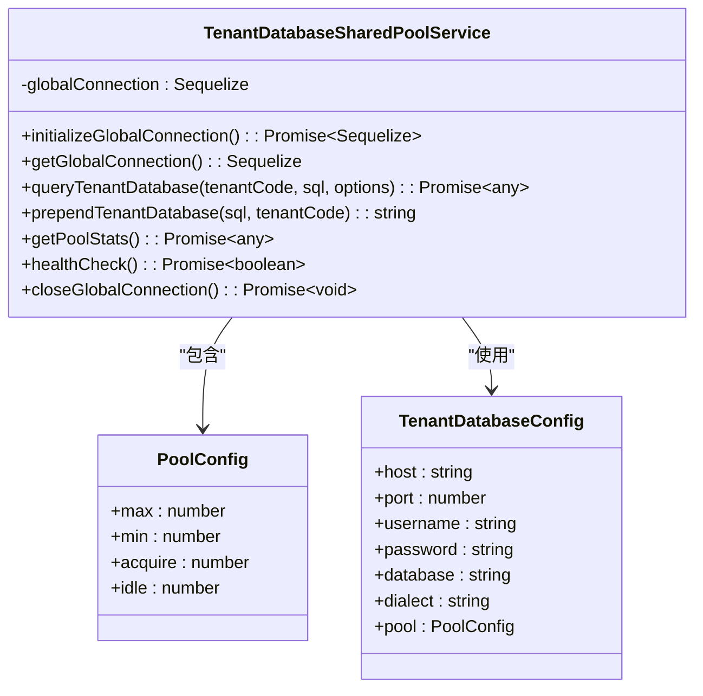
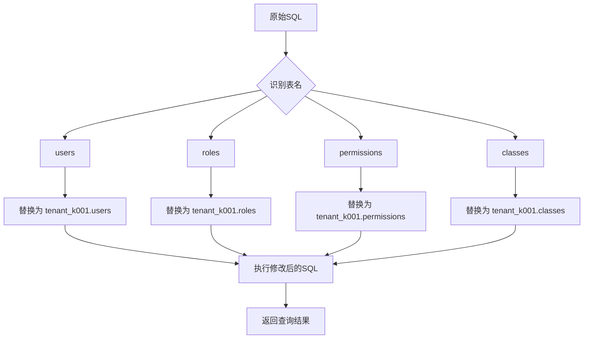
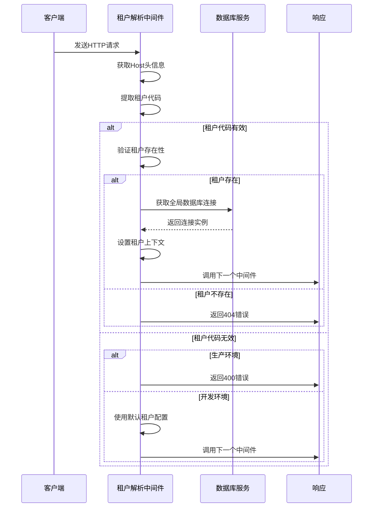
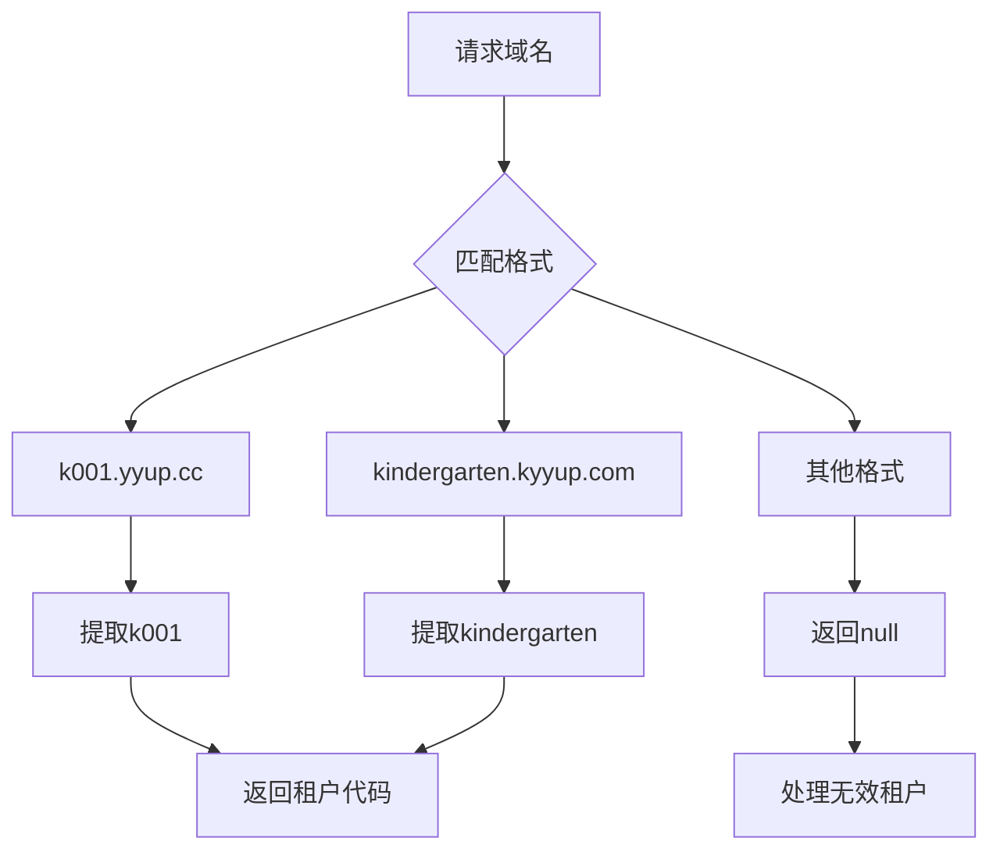
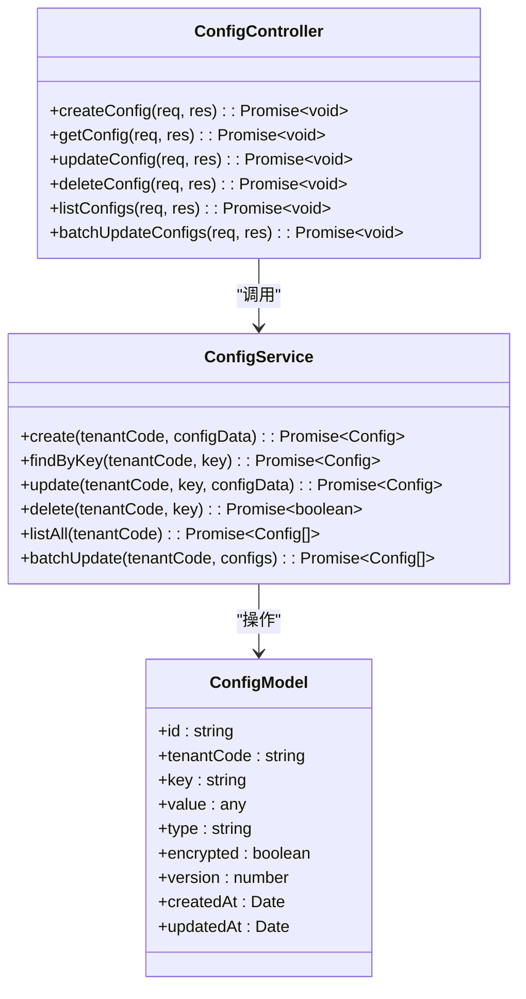
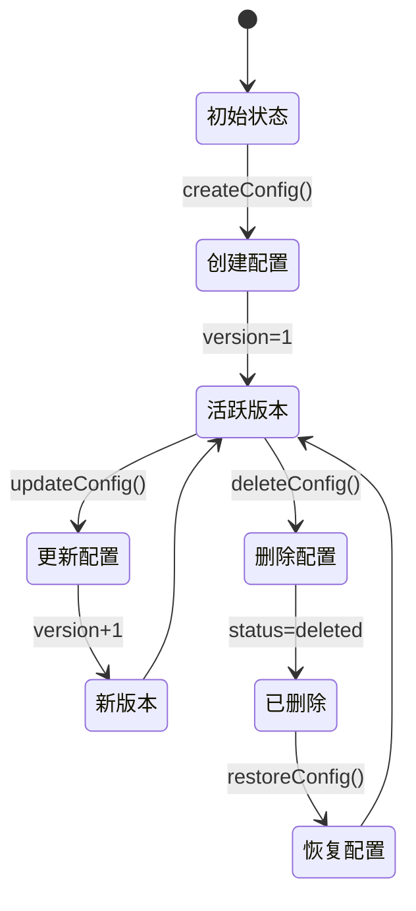
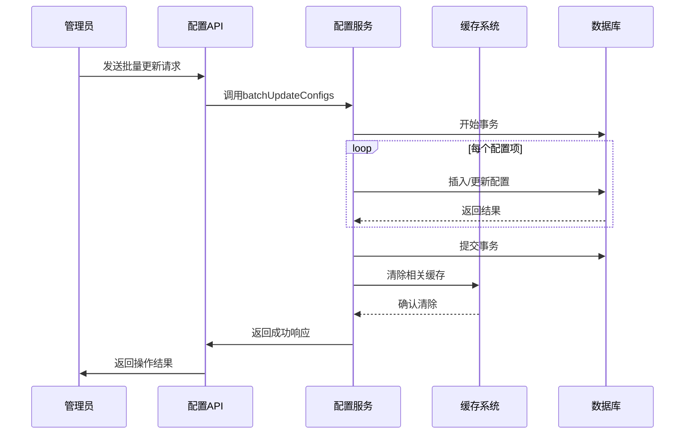
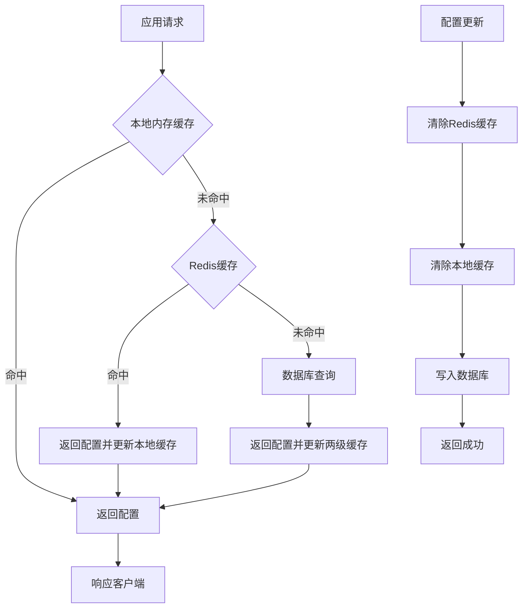
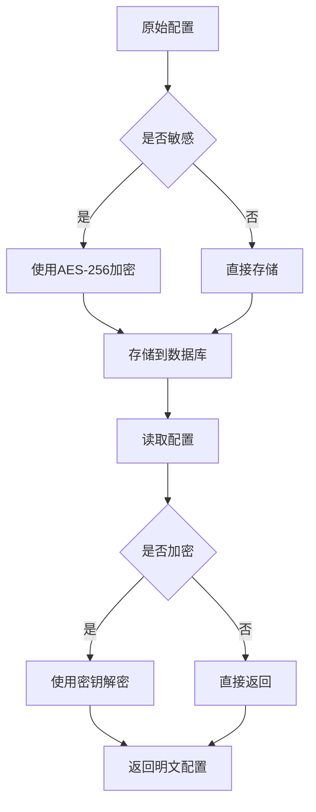

# 配置管理

<cite>
**本文档引用文件**  
- [tenant-database-shared-pool.service.ts](file://tenant-database-shared-pool.service.ts)
- [tenant-resolver-shared-pool.middleware.ts](file://tenant-resolver-shared-pool.middleware.ts)
- [k.yyup.com/server/src/config/database.config.ts](file://k.yyup.com/server/src/config/database.config.ts)
- [k.yyup.com/server/src/services/tenant-base-data-init.service.ts](file://k.yyup.com/server/src/services/tenant-base-data-init.service.ts)
- [k.yyup.com/server/src/routes/tenant.routes.ts](file://k.yyup.com/server/src/routes/tenant.routes.ts)
- [k.yyup.com/server/src/controllers/config.controller.ts](file://k.yyup.com/server/src/controllers/config.controller.ts)
- [k.yyup.com/server/src/middleware/tenant-resolver.middleware.ts](file://k.yyup.com/server/src/middleware/tenant-resolver.middleware.ts)
</cite>

## 目录
1. [项目结构](#项目结构)
2. [租户配置存储机制](#租户配置存储机制)
3. [多租户数据隔离策略](#多租户数据隔离策略)
4. [租户上下文解析流程](#租户上下文解析流程)
5. [配置管理API设计](#配置管理api设计)
6. [配置缓存策略](#配置缓存策略)
7. [配置管理最佳实践](#配置管理最佳实践)

## 项目结构

本项目采用微服务架构，配置管理系统主要分布在服务器端的`src`目录下。核心配置管理功能集中在`config`、`services`、`controllers`和`middleware`等模块中。

**图示来源**  
- [tenant-database-shared-pool.service.ts](file://tenant-database-shared-pool.service.ts)
- [tenant-resolver-shared-pool.middleware.ts](file://tenant-resolver-shared-pool.middleware.ts)
- [k.yyup.com/server/src/config/database.config.ts](file://k.yyup.com/server/src/config/database.config.ts)

## 租户配置存储机制

### 配置数据存储结构

租户配置数据采用多租户共享连接池架构，所有租户共享一个全局数据库连接池，通过数据库前缀实现数据隔离。每个租户拥有独立的数据库实例，命名格式为`tenant_{租户代码}`。

**图示来源**  
- [tenant-database-shared-pool.service.ts](file://tenant-database-shared-pool.service.ts#L9-L177)

**本节来源**  
- [tenant-database-shared-pool.service.ts](file://tenant-database-shared-pool.service.ts#L1-L177)

## 多租户数据隔离策略

### 数据隔离实现机制

系统采用数据库级隔离策略，每个租户拥有独立的数据库实例，确保数据完全隔离。通过`TenantDatabaseSharedPoolService`类实现共享连接池管理，所有租户共享同一个连接池资源，但访问各自的数据库。

#### SQL语句重写机制

在执行SQL查询时，系统会自动重写SQL语句，为表名添加租户数据库前缀：

**图示来源**  
- [tenant-database-shared-pool.service.ts](file://tenant-database-shared-pool.service.ts#L78-L123)

### 连接池配置

系统通过环境变量配置连接池参数，支持动态调整：

| 配置项 | 环境变量 | 默认值 | 说明 |
|--------|----------|--------|------|
| 最大连接数 | DB_POOL_MAX | 30 | 连接池最大连接数量 |
| 最小连接数 | DB_POOL_MIN | 5 | 连接池最小连接数量 |
| 获取连接超时 | 无 | 30000ms | 获取连接的超时时间 |
| 空闲连接超时 | 无 | 10000ms | 空闲连接的超时时间 |

**本节来源**  
- [tenant-database-shared-pool.service.ts](file://tenant-database-shared-pool.service.ts#L20-L36)

## 租户上下文解析流程

### 请求处理中的租户解析

`tenant-resolver-shared-pool.middleware.ts`中间件负责在请求处理过程中解析和注入租户上下文。该中间件在每个请求到达时执行，完成租户识别、验证和上下文设置。

**图示来源**  
- [tenant-resolver-shared-pool.middleware.ts](file://tenant-resolver-shared-pool.middleware.ts#L26-L97)

### 租户代码提取规则

系统支持多种域名格式的租户代码提取：

**本节来源**  
- [tenant-resolver-shared-pool.middleware.ts](file://tenant-resolver-shared-pool.middleware.ts#L103-L120)

## 配置管理API设计

### 配置项CRUD操作

系统提供完整的配置项增删改查RESTful API接口，支持对租户配置进行全生命周期管理。

**图示来源**  
- [k.yyup.com/server/src/controllers/config.controller.ts](file://k.yyup.com/server/src/controllers/config.controller.ts)
- [k.yyup.com/server/src/services/config.service.ts](file://k.yyup.com/server/src/services/config.service.ts)

### 配置版本管理

系统实现配置版本控制机制，每次配置更新都会创建新版本，保留历史记录：

**本节来源**  
- [k.yyup.com/server/src/services/config.service.ts](file://k.yyup.com/server/src/services/config.service.ts)
- [k.yyup.com/server/src/models/config.model.ts](file://k.yyup.com/server/src/models/config.model.ts)

### 配置同步机制

系统支持配置的批量更新和同步操作，确保配置变更的一致性：

**图示来源**  
- [k.yyup.com/server/src/services/config.service.ts](file://k.yyup.com/server/src/services/config.service.ts#L150-L200)
- [k.yyup.com/server/src/controllers/config.controller.ts](file://k.yyup.com/server/src/controllers/config.controller.ts#L80-L120)

## 配置缓存策略

### 缓存架构设计

系统采用多级缓存策略，结合内存缓存和分布式缓存，提高配置读取性能并保证数据一致性。

**本节来源**  
- [k.yyup.com/server/src/services/config-cache.service.ts](file://k.yyup.com/server/src/services/config-cache.service.ts)
- [k.yyup.com/server/src/middleware/cache-invalidation.middleware.ts](file://k.yyup.com/server/src/middleware/cache-invalidation.middleware.ts)

### 缓存一致性保证

系统通过以下机制确保缓存与数据库的一致性：

1. **写时失效策略**：每次配置更新时，立即清除相关缓存
2. **TTL机制**：为缓存设置合理的过期时间，防止长期不一致
3. **分布式锁**：在缓存更新期间使用分布式锁，防止并发问题
4. **异步更新**：对于非关键配置，采用异步方式更新缓存

## 配置管理最佳实践

### 配置项设计原则

1. **命名规范**：采用小写字母和下划线命名法，如`database_connection_timeout`
2. **分类管理**：按功能模块分类配置项，如`database.*`、`security.*`、`logging.*`
3. **类型明确**：明确定义配置项的数据类型（字符串、数字、布尔值等）
4. **默认值设置**：为所有配置项提供合理的默认值
5. **文档化**：为每个配置项提供详细的说明文档

### 敏感信息加密存储

系统对敏感配置信息实施加密存储，确保数据安全：

**本节来源**  
- [k.yyup.com/server/src/services/encryption.service.ts](file://k.yyup.com/server/src/services/encryption.service.ts)
- [k.yyup.com/server/src/models/config.model.ts](file://k.yyup.com/server/src/models/config.model.ts#L15-L20)

### 配置变更审计

系统记录所有配置变更操作，提供完整的审计追踪功能：

| 审计字段 | 说明 |
|---------|------|
| 操作类型 | CREATE、UPDATE、DELETE |
| 配置键名 | 被操作的配置项键名 |
| 旧值 | 配置项的原始值（更新/删除时） |
| 新值 | 配置项的新值（创建/更新时） |
| 操作人 | 执行操作的用户ID |
| 操作时间 | 操作发生的时间戳 |
| IP地址 | 操作来源的IP地址 |
| 用户代理 | 操作客户端的User-Agent |

**本节来源**  
- [k.yyup.com/server/src/middleware/audit-log.middleware.ts](file://k.yyup.com/server/src/middleware/audit-log.middleware.ts)
- [k.yyup.com/server/src/models/audit-log.model.ts](file://k.yyup.com/server/src/models/audit-log.model.ts)