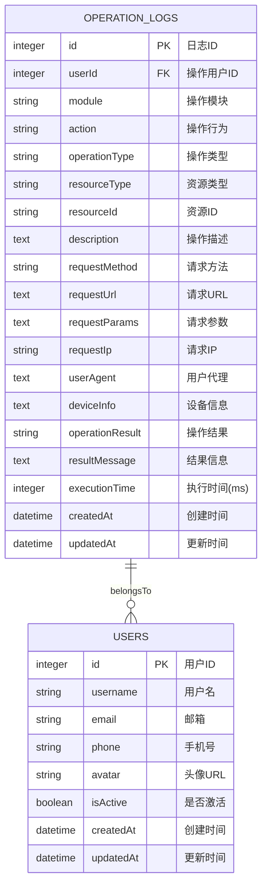
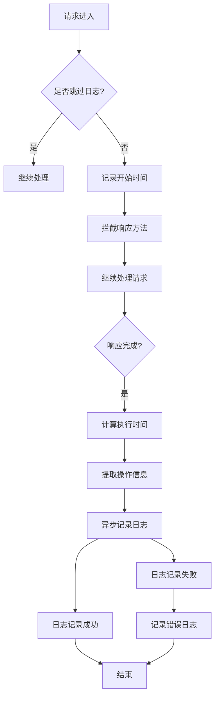
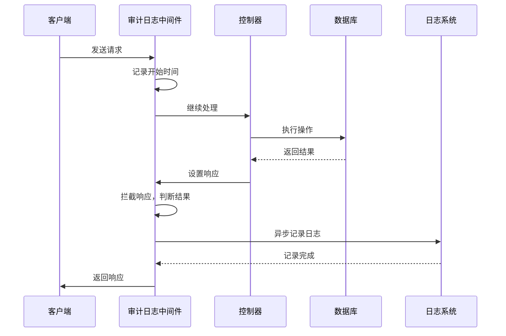
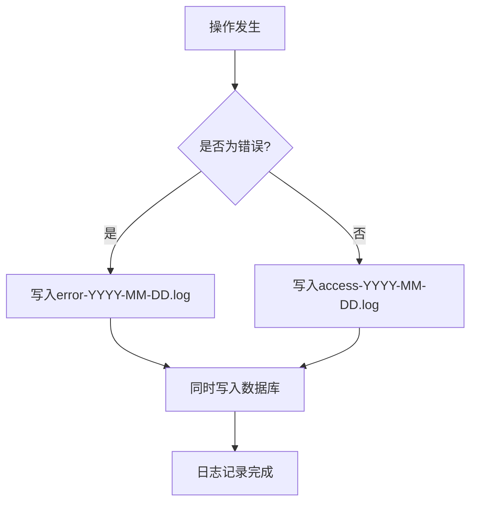
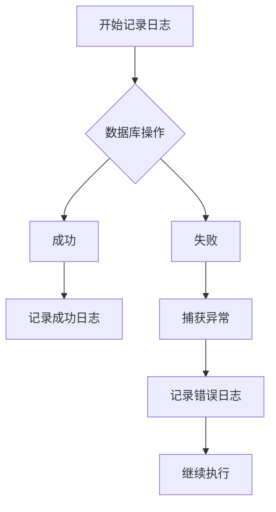

# 审计日志

<cite>
**本文档引用的文件**
- [audit-log.middleware.ts](file://k.yyup.com/server/src/middlewares/audit-log.middleware.ts)
- [operation-log.model.ts](file://k.yyup.com/server/src/models/operation-log.model.ts)
- [logger.ts](file://k.yyup.com/server/src/utils/logger.ts)
- [migration.routes.ts](file://k.yyup.com/server/src/routes/migration.routes.ts)
</cite>

## 目录
1. [介绍](#介绍)
2. [数据模型](#数据模型)
3. [日志记录机制](#日志记录机制)
4. [日志分类体系](#日志分类体系)
5. [存储策略](#存储策略)
6. [完整性保护](#完整性保护)
7. [查询API使用示例](#查询api使用示例)

## 介绍
k.yyupgame的审计日志系统是一个全面的安全监控机制，用于记录系统中所有关键操作的详细信息。该系统通过中间件自动拦截请求，生成结构化的审计日志，支持对用户行为的全面追踪和分析。审计日志系统不仅记录操作的基本信息，还包含详细的请求参数、执行时间和结果状态，为系统的安全审计和故障排查提供了重要支持。

**Section sources**
- [audit-log.middleware.ts](file://k.yyup.com/server/src/middlewares/audit-log.middleware.ts#L1-L186)
- [operation-log.model.ts](file://k.yyup.com/server/src/models/operation-log.model.ts#L1-L179)

## 数据模型
审计日志的数据模型定义了日志记录的核心结构和字段。每个审计日志条目包含以下关键字段：

| 字段名称 | 类型 | 必填 | 描述 |
|---------|------|------|------|
| id | INTEGER | 是 | 日志ID，主键，自增 |
| userId | INTEGER | 否 | 操作用户ID，外键关联用户表 |
| module | STRING(50) | 是 | 操作模块，如"学生管理"、"家长管理"等 |
| action | STRING(50) | 是 | 操作行为，如"create"、"update"等 |
| operationType | STRING(20) | 是 | 操作类型：create, read, update, delete, login, logout, other |
| resourceType | STRING(50) | 否 | 资源类型，如"student"、"parent"等 |
| resourceId | STRING(50) | 否 | 资源ID，从URL路径中提取的数字ID |
| description | TEXT | 否 | 操作描述，自动生成的可读描述 |
| requestMethod | STRING(10) | 否 | 请求方法：GET, POST, PUT, DELETE等 |
| requestUrl | TEXT | 否 | 请求URL，包含查询参数 |
| requestParams | TEXT | 否 | 请求参数，JSON格式存储query、body和params |
| requestIp | STRING(50) | 否 | 请求IP地址 |
| userAgent | TEXT | 否 | 用户代理字符串 |
| deviceInfo | TEXT | 否 | 设备信息，目前与userAgent相同 |
| operationResult | STRING(10) | 否 | 操作结果：success, failed |
| resultMessage | TEXT | 否 | 结果信息，失败时的错误消息 |
| executionTime | INTEGER | 否 | 执行时间（毫秒） |
| createdAt | DATE | 是 | 创建时间 |
| updatedAt | DATE | 是 | 更新时间 |

此外，系统定义了两个重要的枚举类型：

**操作类型（OperationType）枚举：**
- CREATE: 创建
- READ: 查询
- UPDATE: 更新
- DELETE: 删除
- LOGIN: 登录
- LOGOUT: 注销
- OTHER: 其他

**操作结果（OperationResult）枚举：**
- SUCCESS: 成功
- FAILED: 失败



**Diagram sources**
- [operation-log.model.ts](file://k.yyup.com/server/src/models/operation-log.model.ts#L34-L179)

**Section sources**
- [operation-log.model.ts](file://k.yyup.com/server/src/models/operation-log.model.ts#L15-L179)

## 日志记录机制
审计日志的记录机制基于Express中间件实现，通过拦截HTTP请求和响应来自动收集操作信息。系统采用工厂函数模式创建可配置的中间件，确保灵活性和可重用性。

### 中间件工作流程


**Diagram sources**
- [audit-log.middleware.ts](file://k.yyup.com/server/src/middlewares/audit-log.middleware.ts#L68-L167)

### 核心功能实现
1. **HTTP方法映射**：将HTTP方法映射到操作类型
   - POST → CREATE
   - GET → READ  
   - PUT/PATCH → UPDATE
   - DELETE → DELETE

2. **资源ID提取**：从URL路径中提取数字ID
   - `/api/users/123` → resourceId: "123"
   - `/api/students/456/profile` → resourceId: "456"

3. **操作描述生成**：自动生成可读的操作描述
   - "创建ID为123的用户管理"
   - "查询学生管理"

4. **响应拦截**：通过重写res.send和res.json方法，捕获响应数据和状态码，判断操作结果。

5. **异步记录**：使用setImmediate确保日志记录不会阻塞主请求流程，提高系统性能。



**Diagram sources**
- [audit-log.middleware.ts](file://k.yyup.com/server/src/middlewares/audit-log.middleware.ts#L68-L167)

**Section sources**
- [audit-log.middleware.ts](file://k.yyup.com/server/src/middlewares/audit-log.middleware.ts#L10-L186)

## 日志分类体系
审计日志系统通过模块化设计实现了完善的日志分类体系，将日志按功能模块和操作类型进行分类管理。

### 预设分类
系统提供了多个预设的审计日志中间件，覆盖主要业务模块：

```mermaid
classDiagram
class AuditLogPresets {
+student : auditLog({module : '学生管理'})
+parent : auditLog({module : '家长管理'})
+teacher : auditLog({module : '教师管理'})
+user : auditLog({module : '用户管理'})
+role : auditLog({module : '角色管理'})
+permission : auditLog({module : '权限管理'})
+enrollment : auditLog({module : '招生管理'})
+activity : auditLog({module : '活动管理'})
+class : auditLog({module : '班级管理'})
+system : auditLog({module : '系统管理'})
+dataImport : auditLog({module : '数据导入'})
}
```

**Diagram sources**
- [audit-log.middleware.ts](file://k.yyup.com/server/src/middlewares/audit-log.middleware.ts#L173-L185)

### 分类标准
1. **按模块分类**：
   - 学生管理
   - 家长管理
   - 教师管理
   - 用户管理
   - 角色管理
   - 权限管理
   - 招生管理
   - 活动管理
   - 班级管理
   - 系统管理
   - 数据导入

2. **按操作类型分类**：
   - 创建（CREATE）
   - 查询（READ）
   - 更新（UPDATE）
   - 删除（DELETE）
   - 登录（LOGIN）
   - 注销（LOGOUT）
   - 其他（OTHER）

3. **按操作结果分类**：
   - 成功（SUCCESS）
   - 失败（FAILED）

**Section sources**
- [audit-log.middleware.ts](file://k.yyup.com/server/src/middlewares/audit-log.middleware.ts#L173-L185)
- [operation-log.model.ts](file://k.yyup.com/server/src/models/operation-log.model.ts#L15-L31)

## 存储策略
审计日志的存储策略结合了数据库持久化和文件日志两种方式，确保日志数据的可靠性和可访问性。

### 数据库存储
审计日志主要存储在名为`operation_logs`的数据库表中，采用以下存储策略：

1. **表结构设计**：使用Sequelize ORM定义表结构，包含18个字段，涵盖操作的各个方面。
2. **软删除**：启用paranoid模式，删除操作实际是标记删除，保留历史数据。
3. **时间戳**：自动维护createdAt和updatedAt字段，记录日志的创建和更新时间。
4. **索引优化**：在常用查询字段（如userId、module、operationType）上建立索引，提高查询性能。

### 文件日志
系统同时将日志输出到文件，采用以下策略：

1. **日志轮转**：按天轮转日志文件，每天生成独立的访问日志和错误日志。
   - 访问日志：`access-YYYY-MM-DD.log`
   - 错误日志：`error-YYYY-MM-DD.log`

2. **目录结构**：在项目根目录下创建logs目录，集中管理所有日志文件。

3. **异步写入**：使用fs.appendFile异步写入日志，避免阻塞主线程。



**Diagram sources**
- [audit-log.middleware.ts](file://k.yyup.com/server/src/middlewares/audit-log.middleware.ts#L120-L144)
- [logger.ts](file://k.yyup.com/server/src/utils/logger.ts#L1-L129)

**Section sources**
- [audit-log.middleware.ts](file://k.yyup.com/server/src/middlewares/audit-log.middleware.ts#L120-L167)
- [logger.ts](file://k.yyup.com/server/src/utils/logger.ts#L1-L129)

## 完整性保护
审计日志系统通过多层次的保护机制确保日志数据的完整性和不可篡改性。

### 错误处理机制
系统实现了完善的错误处理机制，确保即使在日志记录失败的情况下也能保持系统的稳定性：

1. **异常捕获**：在日志记录的关键路径上使用try-catch捕获异常。
2. **异步处理**：使用setImmediate将日志记录放入事件循环的下一个阶段，避免阻塞主请求流程。
3. **降级策略**：当日志记录失败时，系统会记录错误日志但不影响主业务流程。



**Diagram sources**
- [audit-log.middleware.ts](file://k.yyup.com/server/src/middlewares/audit-log.middleware.ts#L120-L159)

### 数据验证
系统在记录日志前对关键数据进行验证和清理：

1. **空值处理**：对可能为空的字段（如userId、requestIp）进行null检查。
2. **数据序列化**：将复杂对象（如请求参数）序列化为JSON字符串存储。
3. **长度限制**：对字符串字段设置合理的长度限制，防止数据溢出。

### 监控与告警
虽然当前代码中未直接实现区块链技术，但系统具备良好的扩展性，可以通过以下方式增强完整性保护：

1. **定期审计**：通过数据库迁移脚本定期检查日志数据的完整性。
2. **外部备份**：将日志数据同步到外部存储系统，实现多副本备份。
3. **未来扩展**：可以集成区块链技术，将关键日志的哈希值上链，确保不可篡改。

**Section sources**
- [audit-log.middleware.ts](file://k.yyup.com/server/src/middlewares/audit-log.middleware.ts#L120-L159)
- [operation-log.model.ts](file://k.yyup.com/server/src/models/operation-log.model.ts#L62-L171)

## 查询API使用示例
虽然当前代码中未直接提供审计日志的查询API，但基于数据模型和系统架构，可以推断出合理的查询接口设计和使用方式。

### 推荐的查询API设计
```typescript
// GET /api/audit-logs
// 查询审计日志列表

// 请求参数
interface QueryParams {
  page?: number;           // 页码，默认1
  pageSize?: number;       // 每页数量，默认20
  startTime?: string;      // 开始时间，ISO格式
  endTime?: string;        // 结束时间，ISO格式
  userId?: number;         // 用户ID
  module?: string;         // 模块名称
  operationType?: string;  // 操作类型
  operationResult?: string; // 操作结果
  keyword?: string;        // 关键词搜索（在描述中搜索）
}

// 响应结构
interface Response {
  success: boolean;
  data: {
    list: OperationLog[];
    total: number;
    page: number;
    pageSize: number;
  };
  message: string;
}
```

### 使用示例
```javascript
// 按时间范围查询日志
const getLogsByTimeRange = async (startTime, endTime) => {
  const response = await fetch(`/api/audit-logs?startTime=${startTime}&endTime=${endTime}`);
  return response.json();
};

// 按用户查询日志
const getLogsByUser = async (userId) => {
  const response = await fetch(`/api/audit-logs?userId=${userId}`);
  return response.json();
};

// 按操作类型查询日志
const getLogsByOperationType = async (operationType) => {
  const response = await fetch(`/api/audit-logs?operationType=${operationType}`);
  return response.json();
};

// 组合条件查询
const getComplexQuery = async () => {
  const params = new URLSearchParams({
    startTime: '2024-01-01T00:00:00Z',
    endTime: '2024-01-31T23:59:59Z',
    module: '用户管理',
    operationResult: 'failed',
    page: '1',
    pageSize: '50'
  });
  
  const response = await fetch(`/api/audit-logs?${params}`);
  return response.json();
};
```

### 查询性能优化建议
1. **索引优化**：在常用查询字段上建立复合索引，如(userId, createdAt)、(module, operationType, createdAt)等。
2. **分页查询**：使用limit和offset实现分页，避免一次性查询大量数据。
3. **缓存机制**：对频繁查询的热点数据使用Redis缓存，提高查询性能。
4. **归档策略**：对历史日志进行归档处理，将超过一定时间的日志转移到冷存储，保持主表的查询性能。

**Section sources**
- [operation-log.model.ts](file://k.yyup.com/server/src/models/operation-log.model.ts#L34-L179)
- [audit-log.middleware.ts](file://k.yyup.com/server/src/middlewares/audit-log.middleware.ts#L120-L144)