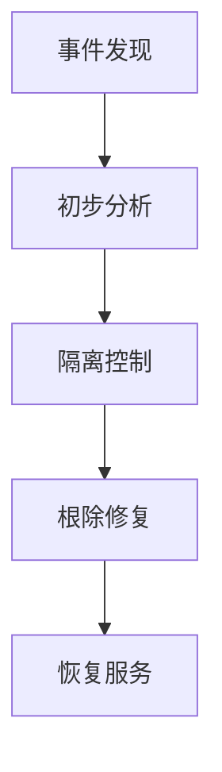

# 应急响应

<cite>
**本文档引用文件**  
- [08-security-best-practices.md](file://docs/wiki/system-architecture-and-deployment/08-security-best-practices.md)
- [security.json](file://k.yyup.com/config/security.json)
- [security.ts](file://k.yyup.com/client/src/api/security.ts)
</cite>

## 目录
1. [引言](#引言)
2. [事件分级标准](#事件分级标准)
3. [应急响应团队组成与职责](#应急响应团队组成与职责)
4. [安全事件处置流程](#安全事件处置流程)
5. [事后复盘机制](#事后复盘机制)
6. [典型安全事件处理案例](#典型安全事件处理案例)
7. [结论](#结论)

## 引言

k.yyupgame项目采用多层次安全防护体系，确保系统和数据的完整性、机密性和可用性。该系统遵循纵深防御、最小权限、零信任等安全原则，并建立了完善的应急响应机制。本文档详细描述了该项目的安全事件处理机制，包括事件分级、响应流程、团队职责、处置步骤以及事后复盘等内容，旨在为安全事件的快速响应和有效处理提供指导。

**Section sources**
- [08-security-best-practices.md](file://docs/wiki/system-architecture-and-deployment/08-security-best-practices.md#安全架构概述)

## 事件分级标准

根据安全事件的严重程度和影响范围，k.yyupgame将安全事件分为四个等级：低、中、高、严重。每个等级对应不同的响应策略和处理优先级。

### 低风险事件
- **定义**：对系统影响较小，不会导致数据泄露或服务中断的事件。
- **示例**：单次登录失败、非关键接口的轻微异常访问。
- **响应要求**：记录事件日志，定期汇总分析。

### 中风险事件
- **定义**：可能影响部分功能或存在潜在安全威胁的事件。
- **示例**：多次登录失败、可疑的API调用模式。
- **响应要求**：立即通知安全团队，进行初步分析并采取预防措施。

### 高风险事件
- **定义**：可能导致数据泄露或服务部分中断的事件。
- **示例**：检测到SQL注入尝试、异常的大规模数据查询。
- **响应要求**：启动应急响应流程，隔离受影响系统，通知相关负责人。

### 严重风险事件
- **定义**：已确认的数据泄露、系统被入侵或服务全面中断的事件。
- **示例**：账户盗用、核心数据库被非法访问。
- **响应要求**：立即启动最高级别响应，通知管理层，协调多方资源进行处置。

**Section sources**
- [08-security-best-practices.md](file://docs/wiki/system-architecture-and-deployment/08-security-best-practices.md#安全监控和审计)

## 应急响应团队组成与职责

应急响应团队由多个角色组成，各司其职，协同处理安全事件。

### 安全工程师
- **职责**：负责安全事件的检测、分析和响应。
- **具体任务**：监控安全告警、分析攻击模式、制定防御策略、执行应急响应。

### 运维人员
- **职责**：保障系统的稳定运行，执行隔离和恢复操作。
- **具体任务**：隔离受影响的服务器、恢复备份数据、调整防火墙规则。

### 开发人员
- **职责**：修复安全漏洞，优化系统安全性。
- **具体任务**：分析代码漏洞、修复安全缺陷、更新安全配置。

### 管理层
- **职责**：决策重大事项，协调资源。
- **具体任务**：批准应急响应方案、对外发布声明、协调外部资源。

**Section sources**
- [08-security-best-practices.md](file://docs/wiki/system-architecture-and-deployment/08-security-best-practices.md#安全监控和审计)

## 安全事件处置流程

安全事件处置流程包括事件发现、初步分析、隔离控制和根除修复四个阶段。

### 事件发现
通过安全监控系统实时检测异常行为，如异常登录、可疑API调用等。一旦发现潜在威胁，系统会自动记录日志并触发告警。

### 初步分析
安全工程师对告警信息进行初步分析，确认事件的性质和影响范围。利用日志审计和行为分析工具，追溯攻击路径。

### 隔离控制
对于高风险和严重风险事件，立即采取隔离措施，防止威胁扩散。运维人员负责执行网络隔离、关闭受影响服务等操作。

### 根除修复
开发人员根据分析结果修复安全漏洞，清除恶意代码。安全工程师验证修复效果，确保系统恢复正常。

**Diagram sources**
- [08-security-best-practices.md](file://docs/wiki/system-architecture-and-deployment/08-security-best-practices.md#安全监控和审计)

**Section sources**
- [08-security-best-practices.md](file://docs/wiki/system-architecture-and-deployment/08-security-best-practices.md#安全监控和审计)

## 事后复盘机制

每次安全事件处理完成后，必须进行事后复盘，以总结经验教训，改进安全体系。

### 根本原因分析
通过日志分析和代码审查，确定事件的根本原因。使用鱼骨图或5 Why分析法深入挖掘问题根源。

### 改进措施制定
根据复盘结果，制定具体的改进措施。包括修复代码漏洞、优化安全配置、加强员工培训等。

### 措施执行与验证
将改进措施纳入开发计划，定期跟踪执行进度。通过安全测试验证措施的有效性。

**Section sources**
- [08-security-best-practices.md](file://docs/wiki/system-architecture-and-deployment/08-security-best-practices.md#安全监控和审计)

## 典型安全事件处理案例

### 账户盗用
- **场景**：检测到用户账户在异常IP地址登录。
- **响应流程**：
  1. 立即锁定账户。
  2. 通知用户并重置密码。
  3. 分析登录日志，追溯攻击路径。
  4. 加强多因素认证策略。

### 数据泄露
- **场景**：发现敏感数据被非法访问。
- **响应流程**：
  1. 隔离受影响的数据库。
  2. 检查访问日志，确定泄露范围。
  3. 修复漏洞并更新加密策略。
  4. 向监管机构报告事件。

**Section sources**
- [08-security-best-practices.md](file://docs/wiki/system-architecture-and-deployment/08-security-best-practices.md#安全监控和审计)

## 结论

k.yyupgame项目的应急响应机制涵盖了事件分级、团队协作、处置流程和事后复盘等多个方面，形成了完整的安全事件处理闭环。通过持续优化该机制，可以有效提升系统的安全防护能力，降低安全风险。