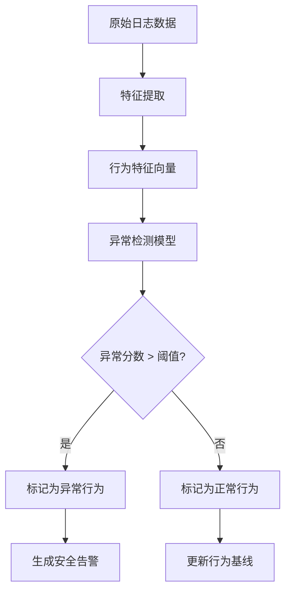

# 监控与告警

<cite>
**本文档引用的文件**  
- [06-monitoring-and-logging.md](file://docs/wiki/system-architecture-and-deployment/06-monitoring-and-logging.md)
- [add-ai-performance-monitor-permission.sql](file://k.yyup.com/add-ai-performance-monitor-permission.sql)
- [auto-fix-config.json](file://k.yyup.com/auto-fix-config.json)
- [batch-import-keywords-config.json](file://k.yyup.com/batch-import-keywords-config.json)
</cite>

## 目录
1. [监控体系概述](#监控体系概述)  
2. [安全监控指标体系](#安全监控指标体系)  
3. [告警规则配置](#告警规则配置)  
4. [告警通知机制](#告警通知机制)  
5. [实时监控面板](#实时监控面板)  
6. [行为分析算法](#行为分析算法)  
7. [自定义告警策略配置示例](#自定义告警策略配置示例)  

## 监控体系概述

k.yyupgame系统采用多层次、全方位的监控体系，涵盖基础设施、应用性能、业务指标和安全监控等多个维度。该体系基于Prometheus、Grafana、Fluentd、Loki等开源工具构建，实现了从数据采集、存储、分析到告警的完整闭环。

整个监控架构分为数据源层、收集层、存储层、分析层和告警层。系统通过Grafana Agent、Prometheus Exporter等组件采集各类指标，并通过Fluentd和Elastic Agent收集日志数据。所有数据被分类存储于Prometheus TSDB、Loki、Elasticsearch等专用存储系统中，最终通过Grafana、Kibana等可视化工具进行展示，并由AlertManager统一管理告警触发与通知。

**Section sources**  
- [06-monitoring-and-logging.md](file://docs/wiki/system-architecture-and-deployment/06-monitoring-and-logging.md#L1-L80)

## 安全监控指标体系

k.yyupgame的安全监控系统定义了一套完整的风险指标体系，用于识别潜在的安全威胁和异常行为。核心安全指标包括：

### 异常登录尝试
- **登录失败次数**: 统计单位时间内同一账户的连续登录失败次数
- **IP异常登录**: 检测来自非常用IP地址或地理位置的登录尝试
- **高频登录尝试**: 监控短时间内大量登录请求，识别暴力破解行为

### 权限变更监控
- **频繁权限变更**: 检测用户角色或权限在短时间内被多次修改
- **高危权限分配**: 监控敏感权限（如管理员权限）的分配和回收
- **越权操作尝试**: 记录并告警未经授权的资源访问尝试

### 数据安全监控
- **大规模数据导出**: 监控单次或短时间内大量数据的导出操作
- **敏感数据访问**: 跟踪对包含个人信息、财务数据等敏感信息的访问
- **异常数据修改**: 检测批量或非正常模式的数据更新、删除操作

这些指标通过Prometheus的自定义指标系统进行收集，并与业务系统深度集成，确保能够实时捕捉到潜在的安全风险。

**Section sources**  
- [06-monitoring-and-logging.md](file://docs/wiki/system-architecture-and-deployment/06-monitoring-and-logging.md#L18-L91)
- [add-ai-performance-monitor-permission.sql](file://k.yyup.com/add-ai-performance-monitor-permission.sql#L1-L99)

## 告警规则配置

告警规则通过Prometheus的Rule Files进行配置，支持灵活的阈值设置和条件组合。系统采用分层告警策略，根据风险等级设置不同的触发条件。

### 告警规则示例
```yaml
# rules/security-alerts.yml
groups:
  - name: security-alerts
    rules:
      # 异常登录告警
      - alert: FrequentLoginFailures
        expr: sum by (user_id) (rate(http_requests_total{route="/api/auth/login", status_code="401"}[5m])) > 5
        for: 2m
        labels:
          severity: warning
        annotations:
          summary: "用户登录失败次数过多"
          description: "用户 {{ $labels.user_id }} 在5分钟内登录失败超过5次"

      # 大规模数据导出告警
      - alert: LargeDataExport
        expr: http_request_duration_seconds{route="/api/data/export"} > 30
        for: 1m
        labels:
          severity: critical
        annotations:
          summary: "检测到大规模数据导出"
          description: "数据导出操作耗时超过30秒，可能存在数据泄露风险"

      # 高频权限变更告警
      - alert: FrequentPermissionChange
        expr: rate(http_requests_total{route="/api/permissions", method="PUT"}[10m]) > 10
        for: 5m
        labels:
          severity: warning
        annotations:
          summary: "频繁权限变更"
          description: "10分钟内权限变更操作超过10次"
```

告警规则支持`for`字段定义持续时间，确保只有持续存在的异常才会触发告警，减少误报。

**Section sources**  
- [06-monitoring-and-logging.md](file://docs/wiki/system-architecture-and-deployment/06-monitoring-and-logging.md#L492-L594)

## 告警通知机制

系统通过AlertManager实现告警通知的统一管理，支持多种通知渠道，确保告警信息能够及时送达相关人员。

### 支持的通知渠道
- **邮件通知**: 发送详细的告警邮件，包含告警摘要、描述、触发时间等信息
- **短信通知**: 对关键告警发送短信提醒，确保紧急情况下的及时响应
- **企业微信**: 集成企业微信机器人，将告警信息推送到指定群组
- **Webhook**: 支持自定义Webhook，可与其他系统（如工单系统）集成

### 通知策略配置
```yaml
# alertmanager/config.yml
route:
  group_by: ['alertname', 'cluster']
  group_wait: 30s
  group_interval: 5m
  repeat_interval: 3h
  receiver: 'default-receiver'

receivers:
  - name: 'default-receiver'
    email_configs:
      - to: 'admin@k.yyup.com'
        send_resolved: true
    webhook_configs:
      - url: 'https://qyapi.weixin.qq.com/cgi-bin/webhook/send?key=xxx'
        send_resolved: true
    sms_configs:
      - phone_numbers:
          - '13800138000'
        send_resolved: true
```

通知策略支持分组、抑制和静默功能，避免告警风暴，确保运维人员能够专注于真正重要的问题。

**Section sources**  
- [06-monitoring-and-logging.md](file://docs/wiki/system-architecture-and-deployment/06-monitoring-and-logging.md#L50-L59)

## 实时监控面板

系统提供基于Grafana的实时监控面板，可视化展示安全态势和风险趋势。监控面板分为多个视图，满足不同角色的需求。

### 安全总览面板
- **安全事件时间线**: 展示近期所有安全事件的时间分布
- **风险等级分布**: 以饼图展示不同风险等级告警的比例
- **TOP风险用户**: 列出近期触发最多安全告警的用户
- **安全趋势分析**: 展示每日/每周安全事件数量的变化趋势

### 详细监控面板
- **登录行为分析**: 可视化展示登录成功/失败的地理分布、时间分布
- **权限变更审计**: 展示权限变更操作的时间线和操作者分布
- **数据访问热力图**: 显示敏感数据的访问频率和访问者分布

所有面板支持下钻分析，用户可以点击图表中的任意数据点，查看详细的原始日志和上下文信息。

**Section sources**  
- [06-monitoring-and-logging.md](file://docs/wiki/system-architecture-and-deployment/06-monitoring-and-logging.md#L48-L52)

## 行为分析算法

系统采用机器学习算法识别异常用户行为，通过分析用户的历史行为模式，建立正常行为基线，从而检测偏离正常模式的异常行为。

### 行为特征提取
- **时间特征**: 登录时间、操作时间分布
- **频率特征**: 操作频率、请求密度
- **地理特征**: 登录IP地理位置、移动轨迹
- **资源特征**: 访问的资源类型、数据量大小

### 异常检测模型
系统采用无监督学习算法（如Isolation Forest、One-Class SVM）进行异常检测。模型定期使用最新的用户行为数据进行重新训练，确保能够适应正常行为模式的自然演变。



**Diagram sources**  
- [06-monitoring-and-logging.md](file://docs/wiki/system-architecture-and-deployment/06-monitoring-and-logging.md#L136-L190)

**Section sources**  
- [06-monitoring-and-logging.md](file://docs/wiki/system-architecture-and-deployment/06-monitoring-and-logging.md#L136-L190)

## 自定义告警策略配置示例

系统支持用户根据自身需求配置自定义告警策略。以下是一个针对不同风险等级设置相应告警响应的配置示例：

### 配置文件示例
```json
{
  "security_policies": {
    "low_risk": {
      "name": "低风险策略",
      "rules": [
        {
          "metric": "login_failure_count",
          "condition": ">", 
          "threshold": 3,
          "duration": "5m",
          "alert_level": "warning",
          "notification": ["email"]
        }
      ]
    },
    "medium_risk": {
      "name": "中风险策略",
      "rules": [
        {
          "metric": "permission_change_frequency",
          "condition": ">",
          "threshold": 5,
          "duration": "10m",
          "alert_level": "warning",
          "notification": ["email", "wechat"]
        },
        {
          "metric": "data_export_size",
          "condition": ">",
          "threshold": "100MB",
          "duration": "1m",
          "alert_level": "warning",
          "notification": ["email", "wechat"]
        }
      ]
    },
    "high_risk": {
      "name": "高风险策略",
      "rules": [
        {
          "metric": "sensitive_data_access",
          "condition": "=",
          "threshold": "true",
          "duration": "1m",
          "alert_level": "critical",
          "notification": ["email", "wechat", "sms"]
        },
        {
          "metric": "admin_permission_grant",
          "condition": "=",
          "threshold": "true",
          "duration": "1m",
          "alert_level": "critical",
          "notification": ["email", "wechat", "sms"]
        }
      ]
    }
  }
}
```

该配置示例展示了如何针对低、中、高三种风险等级设置不同的告警规则和通知策略，实现了精细化的安全管理。

**Section sources**  
- [auto-fix-config.json](file://k.yyup.com/auto-fix-config.json#L1-L89)
- [batch-import-keywords-config.json](file://k.yyup.com/batch-import-keywords-config.json#L1-L137)