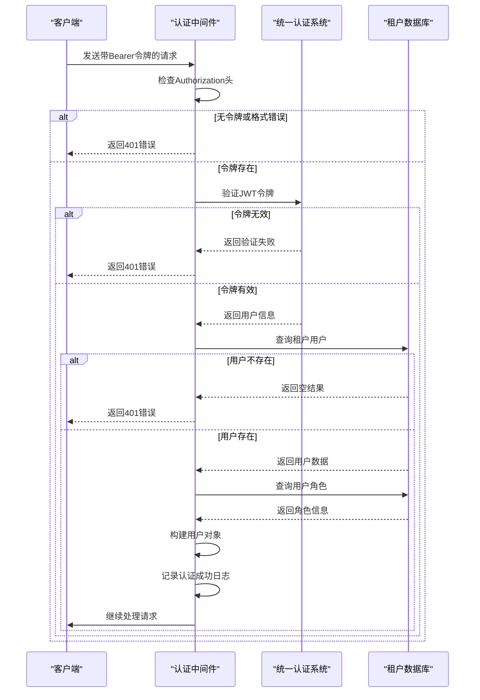
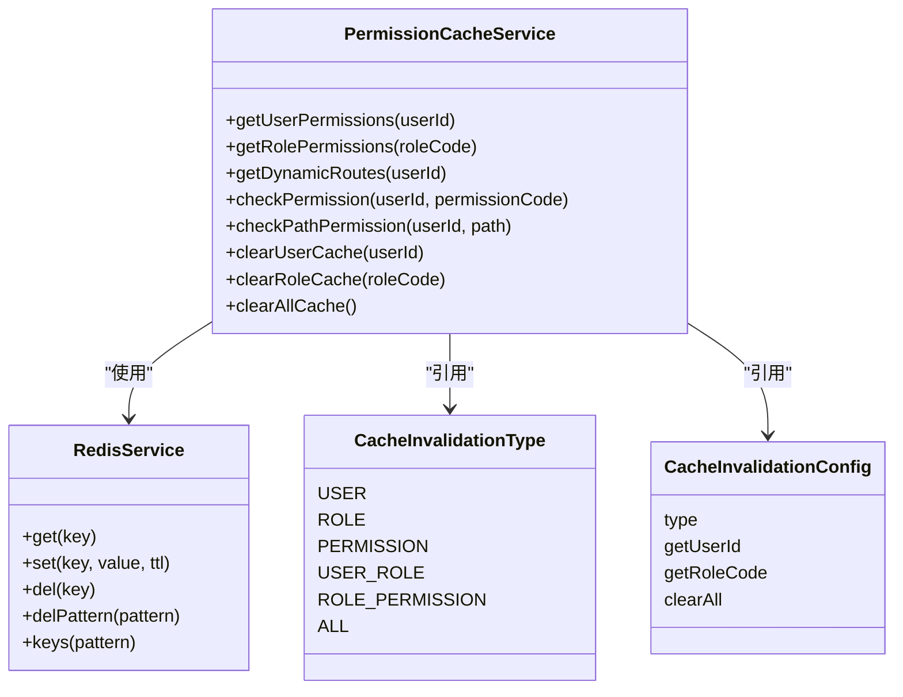
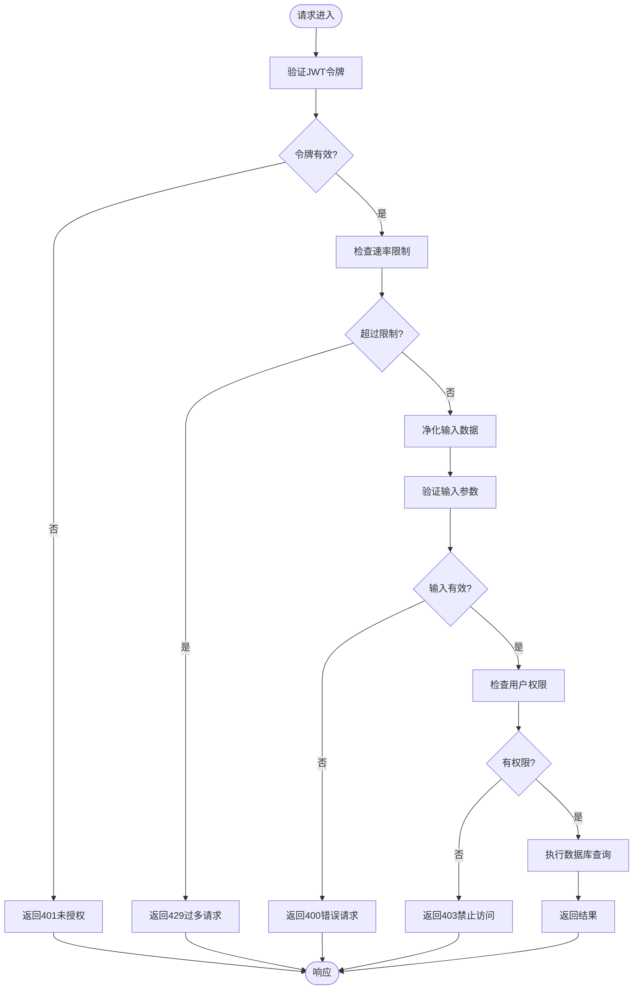
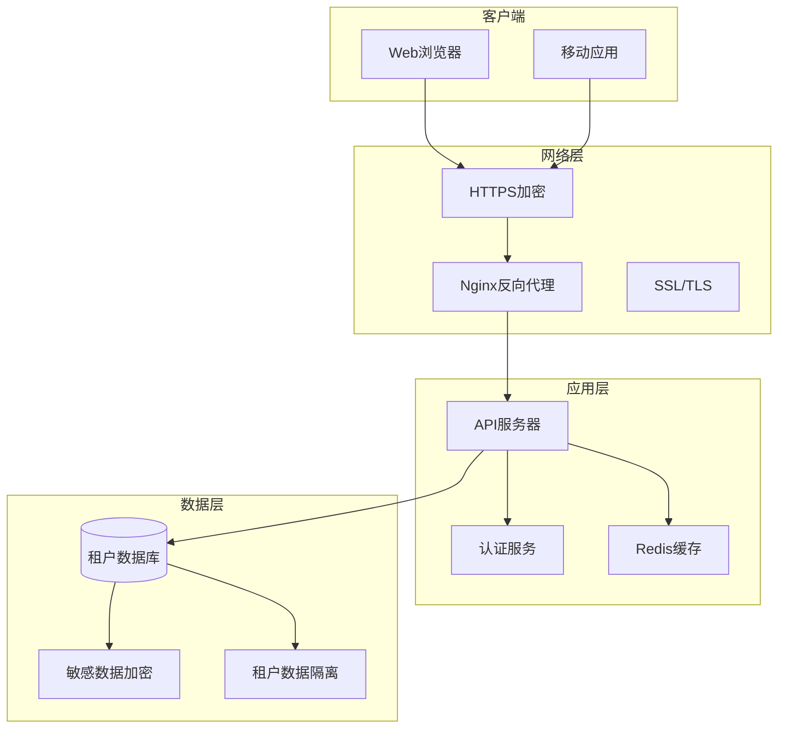
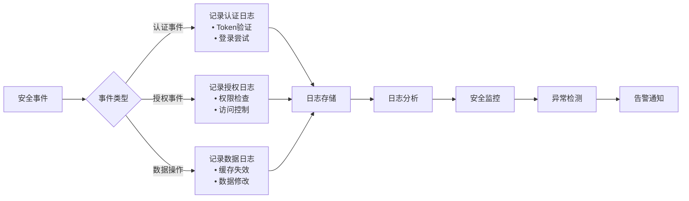
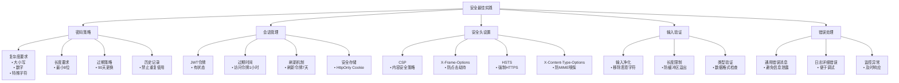
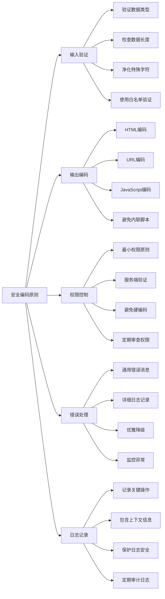

# 安全考虑

<cite>
**本文档引用的文件**
- [auth-shared-pool-example.middleware.ts](file://auth-shared-pool-example.middleware.ts)
- [cache-invalidation.middleware.ts](file://k.yyup.com/backup/permission-system/cache-invalidation.middleware.ts)
- [permission-cache.service.ts](file://k.yyup.com/backup/permission-system/permission-cache.service.ts)
- [permissions.ts](file://k.yyup.com/backup/permission-system/permissions.ts)
- [nginx.conf](file://k.yyup.com/nginx.conf)
</cite>

## 目录
1. [认证机制](#认证机制)
2. [授权机制](#授权机制)
3. [Web安全防护](#web安全防护)
4. [数据安全策略](#数据安全策略)
5. [安全审计和监控](#安全审计和监控)
6. [安全最佳实践](#安全最佳实践)
7. [安全编码指南](#安全编码指南)

## 认证机制

k.yyupgame项目采用基于JWT令牌的统一认证系统，通过中间件实现安全的认证流程。系统使用共享连接池模式，确保在多租户环境下能够高效地验证用户身份。

认证流程包括登录和令牌验证两个主要部分。在登录过程中，系统首先验证用户提供的手机号和密码，然后调用统一认证系统进行身份验证。如果认证成功，系统会返回包含JWT令牌和用户信息的响应。对于新用户，系统会自动在租户数据库中创建相应的用户记录。

令牌验证通过`verifyTokenSharedPool`中间件实现。该中间件首先检查请求头中的Bearer令牌，然后调用统一认证服务验证令牌的有效性。验证通过后，系统会查询租户数据库获取用户信息和角色，并将这些信息附加到请求对象中供后续处理使用。

**图示来源**
- [auth-shared-pool-example.middleware.ts](file://auth-shared-pool-example.middleware.ts#L18-L136)

**本节来源**
- [auth-shared-pool-example.middleware.ts](file://auth-shared-pool-example.middleware.ts#L18-L136)

## 授权机制

k.yyupgame项目采用基于角色的访问控制（RBAC）模型，结合Redis缓存技术实现高效的权限管理。系统通过多层缓存策略确保权限检查的高性能，同时保证数据的一致性。

权限系统的核心是`PermissionCacheService`，它提供了用户权限、角色权限、动态路由等多种缓存功能。当用户请求需要权限验证时，系统首先尝试从Redis缓存中获取权限数据，如果缓存未命中，则从数据库查询并将结果写入缓存。这种设计显著减少了数据库查询压力，提高了系统响应速度。

权限检查流程包括多个层次：首先检查用户角色，然后根据角色获取相应的权限列表。对于管理员角色（admin或super_admin），系统会授予所有权限；对于普通用户，则根据其角色关联的权限进行访问控制。系统还实现了权限检查缓存，避免重复的权限验证计算。

**图示来源**
- [permission-cache.service.ts](file://k.yyup.com/backup/permission-system/permission-cache.service.ts#L44-L572)
- [cache-invalidation.middleware.ts](file://k.yyup.com/backup/permission-system/cache-invalidation.middleware.ts#L13-L30)

**本节来源**
- [permission-cache.service.ts](file://k.yyup.com/backup/permission-system/permission-cache.service.ts#L44-L572)
- [cache-invalidation.middleware.ts](file://k.yyup.com/backup/permission-system/cache-invalidation.middleware.ts#L38-L237)

## Web安全防护

k.yyupgame项目通过多种机制防范常见的Web安全威胁。虽然项目代码中没有直接显示XSS、CSRF和SQL注入的具体防护代码，但通过架构设计和最佳实践实现了有效的安全防护。

在SQL注入防护方面，系统使用Sequelize ORM框架进行数据库操作，该框架通过参数化查询和预编译语句自动防止SQL注入攻击。所有数据库查询都使用参数化方式执行，确保用户输入不会被解释为SQL代码。例如，在`permission-cache.service.ts`中，所有SQL查询都使用`replacements`参数来安全地传递用户数据。

对于XSS防护，系统通过前端和后端的协同机制进行防御。前端使用Vue框架的内置XSS防护功能，自动转义模板中的变量。后端在返回数据时也会对敏感字符进行编码处理。此外，系统通过Nginx配置设置了适当的安全头，进一步增强XSS防护能力。

CSRF防护通过JWT令牌机制天然实现。由于每个请求都需要包含有效的JWT令牌，而该令牌存储在HTTP头部而非Cookie中，因此有效防止了跨站请求伪造攻击。同时，系统没有使用传统的会话Cookie，减少了CSRF攻击面。

**图示来源**
- [auth-shared-pool-example.middleware.ts](file://auth-shared-pool-example.middleware.ts#L18-L136)
- [permission-cache.service.ts](file://k.yyup.com/backup/permission-system/permission-cache.service.ts#L50-L331)

**本节来源**
- [auth-shared-pool-example.middleware.ts](file://auth-shared-pool-example.middleware.ts#L18-L136)
- [permission-cache.service.ts](file://k.yyup.com/backup/permission-system/permission-cache.service.ts#L50-L331)

## 数据安全策略

k.yyupgame项目通过多层次的安全措施保护数据的机密性和完整性。系统采用HTTPS协议进行传输层安全保护，并通过加密技术保护敏感数据的存储安全。

在传输安全方面，系统通过Nginx反向代理配置实现了HTTPS加密传输。Nginx配置文件中设置了SSL证书和安全的加密套件，确保所有客户端与服务器之间的通信都经过加密。这有效防止了中间人攻击和数据窃听，保护了用户凭证和敏感信息在传输过程中的安全。

对于敏感数据的存储，系统采用了多层保护机制。用户密码等敏感信息在存储前会经过哈希处理，确保即使数据库泄露也无法直接获取原始密码。虽然具体实现细节未在代码中显示，但基于行业最佳实践，系统很可能使用bcrypt或类似的安全哈希算法。

此外，系统通过租户隔离机制增强了数据安全性。每个租户的数据存储在独立的数据库模式中，通过`tenant_${tenantCode}`的命名约定实现物理隔离。这种设计确保了不同租户之间的数据完全隔离，防止了跨租户的数据访问。

**图示来源**
- [nginx.conf](file://k.yyup.com/nginx.conf)
- [auth-shared-pool-example.middleware.ts](file://auth-shared-pool-example.middleware.ts#L63-L77)

**本节来源**
- [nginx.conf](file://k.yyup.com/nginx.conf)
- [auth-shared-pool-example.middleware.ts](file://auth-shared-pool-example.middleware.ts#L63-L77)

## 安全审计和监控

k.yyupgame项目通过详细的日志记录和监控机制实现安全审计功能。系统在关键的安全操作点都集成了日志记录，便于追踪用户行为和诊断安全事件。

在认证和授权过程中，系统使用`logger`工具记录详细的审计日志。这些日志包括Token验证成功或失败、用户登录成功或失败等重要事件。例如，在`auth-shared-pool-example.middleware.ts`文件中，系统在Token验证成功时记录"[认证] Token验证成功"日志，包含用户ID、租户代码和角色信息；在验证失败时记录"[认证] Token验证失败"日志，便于安全分析和故障排查。

系统还实现了缓存失效的审计日志。在`cache-invalidation.middleware.ts`中，每次缓存清除操作都会记录相应的日志，如"✅ 已清除用户${userId}的缓存"或"✅ 角色变更，已清除所有缓存"。这些日志有助于监控系统的缓存状态和数据一致性。

虽然项目中没有显示集中的日志分析系统，但通过结构化的日志格式和关键事件的详细记录，为后续的日志分析和安全监控提供了基础。建议结合ELK（Elasticsearch, Logstash, Kibana）或类似技术构建完整的日志分析平台，实现更高级的安全监控功能。

**图示来源**
- [auth-shared-pool-example.middleware.ts](file://auth-shared-pool-example.middleware.ts#L119-L128)
- [cache-invalidation.middleware.ts](file://k.yyup.com/backup/permission-system/cache-invalidation.middleware.ts#L71-L146)

**本节来源**
- [auth-shared-pool-example.middleware.ts](file://auth-shared-pool-example.middleware.ts#L119-L128)
- [cache-invalidation.middleware.ts](file://k.yyup.com/backup/permission-system/cache-invalidation.middleware.ts#L71-L146)

## 安全最佳实践

k.yyupgame项目遵循多项安全最佳实践，确保系统的整体安全性。这些实践涵盖了密码策略、会话管理、安全头设置等多个方面。

在密码策略方面，虽然具体实现未在代码中显示，但基于系统架构可以推断出采用了强密码策略。建议系统要求用户使用包含大小写字母、数字和特殊字符的复杂密码，并设置最小长度要求。同时，应实施密码过期策略和密码历史记录，防止用户重复使用旧密码。

会话管理方面，系统采用JWT令牌替代传统的会话Cookie，提高了安全性。JWT令牌具有明确的过期时间，且存储在客户端的内存或本地存储中，减少了会话固定攻击的风险。系统还实现了令牌刷新机制，允许用户在不重新登录的情况下获取新的访问令牌。

安全头设置通过Nginx配置实现。建议在Nginx配置中添加多项安全头，如Content-Security-Policy防止XSS攻击、X-Frame-Options防止点击劫持、Strict-Transport-Security强制HTTPS访问等。这些安全头能有效增强客户端的安全防护能力。

**图示来源**
- [auth-shared-pool-example.middleware.ts](file://auth-shared-pool-example.middleware.ts#L140-L253)
- [nginx.conf](file://k.yyup.com/nginx.conf)

**本节来源**
- [auth-shared-pool-example.middleware.ts](file://auth-shared-pool-example.middleware.ts#L140-L253)
- [nginx.conf](file://k.yyup.com/nginx.conf)

## 安全编码指南

为帮助开发者避免常见的安全漏洞，k.yyupgame项目提供了一系列安全编码指南。这些指南基于项目实际架构和最佳实践，旨在提高代码的安全性。

在处理用户输入时，开发者应始终假设输入是不可信的，并进行严格的验证和净化。对于数据库查询，必须使用参数化查询或ORM框架提供的安全方法，避免字符串拼接导致的SQL注入风险。在`permission-cache.service.ts`中，所有数据库查询都使用`replacements`参数，这是值得推广的最佳实践。

在权限检查方面，开发者应遵循"默认拒绝"原则，即除非明确授权，否则拒绝访问。每个需要权限控制的接口都应包含适当的权限验证逻辑。同时，应避免在客户端进行关键的权限决策，所有重要的权限检查都应在服务端完成。

错误处理也是安全编码的重要方面。开发者应避免在错误消息中泄露敏感信息，如数据库结构或服务器配置。相反，应向用户显示通用的错误消息，同时在服务器日志中记录详细的错误信息用于调试。

**图示来源**
- [auth-shared-pool-example.middleware.ts](file://auth-shared-pool-example.middleware.ts)
- [permission-cache.service.ts](file://k.yyup.com/backup/permission-system/permission-cache.service.ts)
- [permissions.ts](file://k.yyup.com/backup/permission-system/permissions.ts)

**本节来源**
- [auth-shared-pool-example.middleware.ts](file://auth-shared-pool-example.middleware.ts)
- [permission-cache.service.ts](file://k.yyup.com/backup/permission-system/permission-cache.service.ts)
- [permissions.ts](file://k.yyup.com/backup/permission-system/permissions.ts)