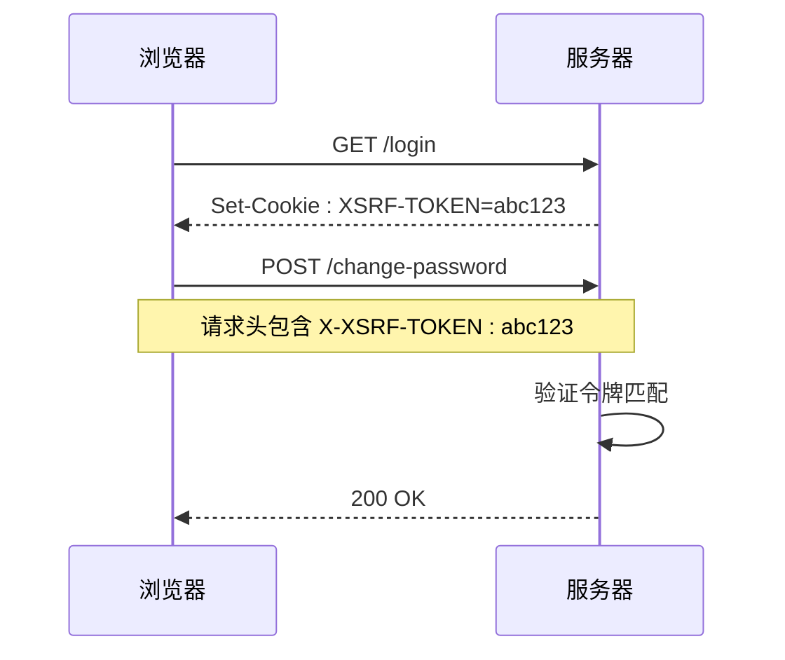
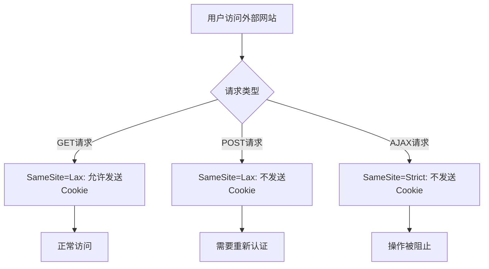
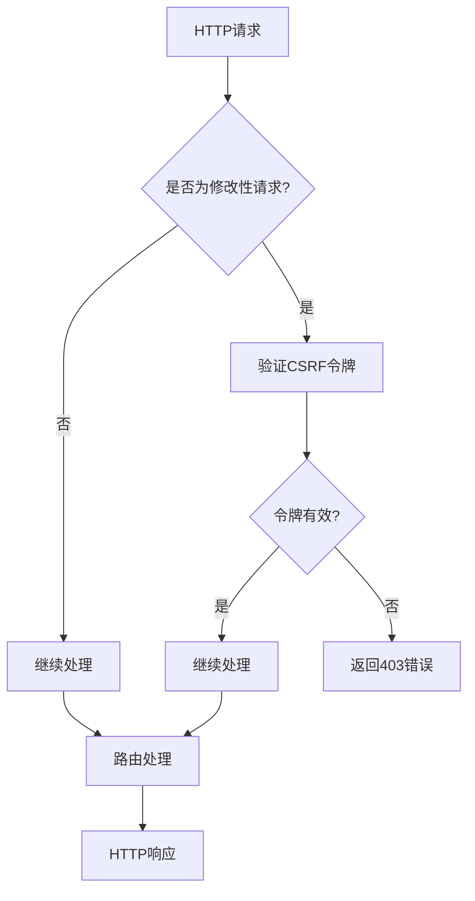
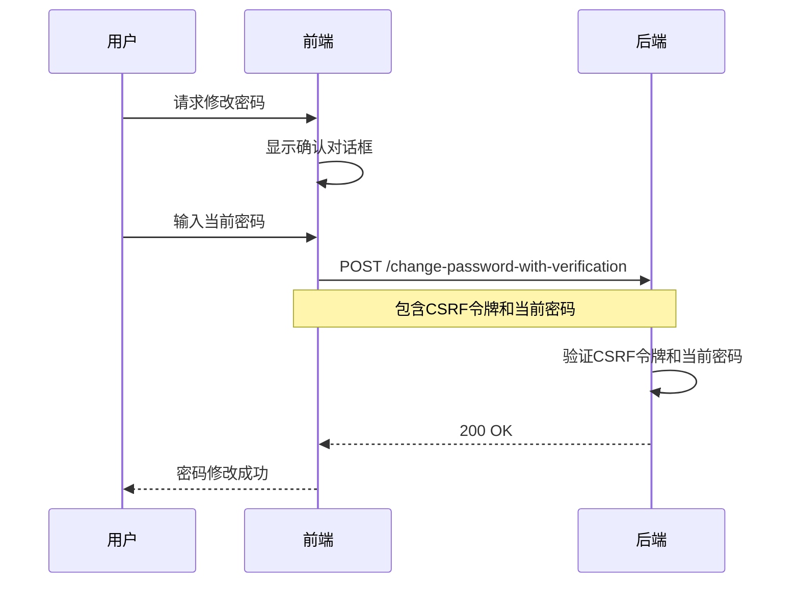
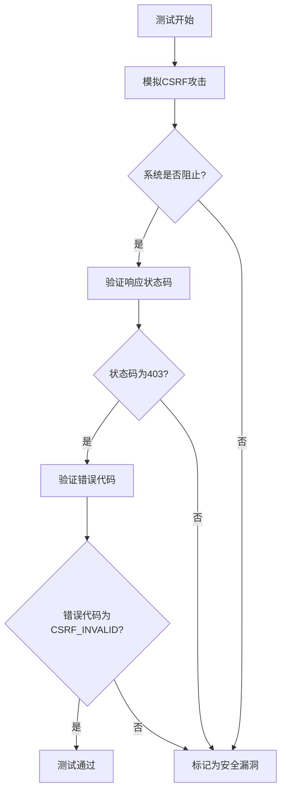

# CSRF防护

<cite>
**本文档中引用的文件**
- [TC-032-CSRF-token-validation.test.ts](file://k.yyup.com/client/src/tests/mobile/security/TC-032-CSRF-token-validation.test.ts)
- [security.middleware.ts](file://k.yyup.com/server/src/middlewares/security.middleware.ts)
- [auth.middleware.ts](file://k.yyup.com/server/src/middlewares/auth.middleware.ts)
- [axios/index.d.ts](file://k.yyup.com/client/node_modules/axios/index.d.ts)
- [app.ts](file://k.yyup.com/server/src/app.ts)
</cite>

## 目录
1. [引言](#引言)
2. [CSRF令牌机制](#csrf令牌机制)
3. [双提交Cookie模式实现](#双提交cookie模式实现)
4. [SameSite Cookie属性配置](#samesite-cookie属性配置)
5. [CSRF中间件实现](#csrf中间件实现)
6. [敏感操作的额外防护](#敏感操作的额外防护)
7. [CSRF防护测试方法](#csrf防护测试方法)
8. [结论](#结论)

## 引言
k.yyupgame系统实现了全面的跨站请求伪造（CSRF）防护机制，通过多层次的安全策略保护用户账户和数据安全。本系统采用CSRF令牌、双提交Cookie模式和SameSite Cookie属性等现代Web安全技术，有效防止恶意网站利用用户身份执行未经授权的操作。

**Section sources**
- [TC-032-CSRF-token-validation.test.ts](file://k.yyup.com/client/src/tests/mobile/security/TC-032-CSRF-token-validation.test.ts)

## CSRF令牌机制

### 令牌生成与存储
系统在用户会话建立时生成唯一的CSRF令牌，该令牌通过安全的加密算法创建，确保不可预测性。令牌存储在HttpOnly Cookie中，名称为"XSRF-TOKEN"，防止JavaScript访问，降低XSS攻击风险。

### 令牌验证流程
每次敏感操作请求时，服务器会验证请求头中的CSRF令牌与Cookie中存储的令牌是否匹配。验证过程包括：
1. 从请求头中提取CSRF令牌
2. 从Cookie中读取XSRF-TOKEN
3. 比较两个令牌的值
4. 验证令牌格式和有效期

### 加密算法与有效期
CSRF令牌使用高强度加密算法生成，包含时间戳和随机数，确保每个令牌的唯一性和时效性。令牌有效期与用户会话保持一致，过期后需要重新认证。

**Section sources**
- [TC-032-CSRF-token-validation.test.ts](file://k.yyup.com/client/src/tests/mobile/security/TC-032-CSRF-token-validation.test.ts)
- [security.middleware.ts](file://k.yyup.com/server/src/middlewares/security.middleware.ts)

## 双提交Cookie模式实现

### 实现原理
双提交Cookie模式要求客户端在请求中同时提供Cookie中的CSRF令牌和请求头中的相同令牌。由于同源策略的限制，攻击者无法读取目标网站的Cookie内容，因此无法构造包含正确CSRF令牌的请求头。

### 表单与请求头同步
在表单提交场景中，前端框架自动将CSRF令牌从Cookie提取并添加到请求头中。对于AJAX请求，系统配置了axios的xsrfHeaderName和xsrfCookieName选项，实现自动同步。

**Diagram sources**
- [TC-032-CSRF-token-validation.test.ts](file://k.yyup.com/client/src/tests/mobile/security/TC-032-CSRF-token-validation.test.ts)
- [axios/index.d.ts](file://k.yyup.com/client/node_modules/axios/index.d.ts)

**Section sources**
- [TC-032-CSRF-token-validation.test.ts](file://k.yyup.com/client/src/tests/mobile/security/TC-032-CSRF-token-validation.test.ts)
- [axios/index.d.ts](file://k.yyup.com/client/node_modules/axios/index.d.ts)

## SameSite Cookie属性配置

### 配置策略
系统对所有身份验证相关的Cookie配置了SameSite属性，采用Lax模式平衡安全性和用户体验。关键Cookie的SameSite配置如下：
- 认证Cookie: SameSite=Lax
- CSRF令牌Cookie: SameSite=None; Secure
- 会话Cookie: SameSite=Strict

### Strict与Lax模式应用
- **Strict模式**: 用于最高敏感度的操作，如修改密码、删除账户等，完全阻止跨站请求
- **Lax模式**: 用于常规操作，允许安全的跨站GET请求，如导航到网站链接

**Diagram sources**
- [security.middleware.ts](file://k.yyup.com/server/src/middlewares/security.middleware.ts)

**Section sources**
- [security.middleware.ts](file://k.yyup.com/server/src/middlewares/security.middleware.ts)

## CSRF中间件实现

### 中间件架构
CSRF防护通过Express中间件实现，集成在应用的请求处理管道中。中间件在路由处理之前执行，对所有POST、PUT、DELETE等修改性请求进行防护检查。

### 代码实现细节
中间件实现包括令牌生成、注入和验证三个核心功能：
1. 在响应中自动注入CSRF令牌到Cookie
2. 拦截修改性请求并验证CSRF令牌
3. 提供错误处理机制，返回标准化的CSRF错误响应

**Diagram sources**
- [security.middleware.ts](file://k.yyup.com/server/src/middlewares/security.middleware.ts)
- [app.ts](file://k.yyup.com/server/src/app.ts)

**Section sources**
- [security.middleware.ts](file://k.yyup.com/server/src/middlewares/security.middleware.ts)
- [app.ts](file://k.yyup.com/server/src/app.ts)

## 敏感操作的额外防护

### 二次验证机制
对于密码修改、资金转账等高风险操作，系统实施二次验证：
- 要求用户重新输入当前密码
- 发送一次性验证码到注册邮箱或手机
- 使用生物识别验证（如指纹、面部识别）

### 操作确认流程
在执行敏感操作前，系统会显示确认对话框，要求用户明确确认。确认流程包括：
1. 显示操作详情和潜在影响
2. 要求用户勾选确认复选框
3. 点击确认按钮完成操作

**Diagram sources**
- [auth.middleware.ts](file://k.yyup.com/server/src/middlewares/auth.middleware.ts)

**Section sources**
- [auth.middleware.ts](file://k.yyup.com/server/src/middlewares/auth.middleware.ts)

## CSRF防护测试方法

### 模拟攻击场景
系统通过自动化测试验证CSRF防护效果，包括：
- 缺少CSRF令牌的请求
- 无效CSRF令牌的请求
- 过期CSRF令牌的请求
- 伪造CSRF令牌的请求

### 防护效果验证
测试用例验证系统在各种攻击场景下的响应：
- 返回403 Forbidden状态码
- 返回CSRF_INVALID错误代码
- 不执行任何数据修改操作
- 记录安全审计日志

**Diagram sources**
- [TC-032-CSRF-token-validation.test.ts](file://k.yyup.com/client/src/tests/mobile/security/TC-032-CSRF-token-validation.test.ts)

**Section sources**
- [TC-032-CSRF-token-validation.test.ts](file://k.yyup.com/client/src/tests/mobile/security/TC-032-CSRF-token-validation.test.ts)

## 结论
k.yyupgame系统的CSRF防护机制通过多层防御策略，有效保护用户免受跨站请求伪造攻击。结合CSRF令牌、双提交Cookie模式、SameSite属性和二次验证，系统在安全性和用户体验之间取得了良好平衡。持续的自动化测试确保防护机制的有效性，为用户提供安全可靠的服务。