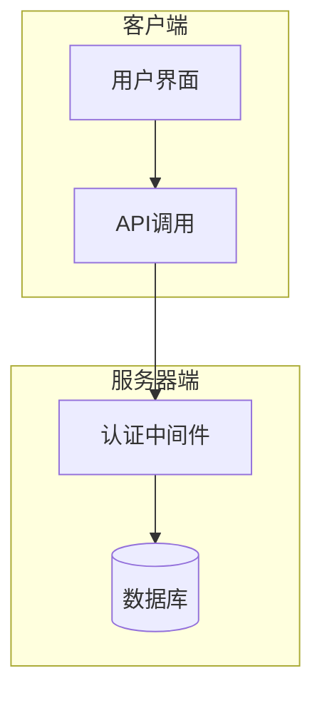
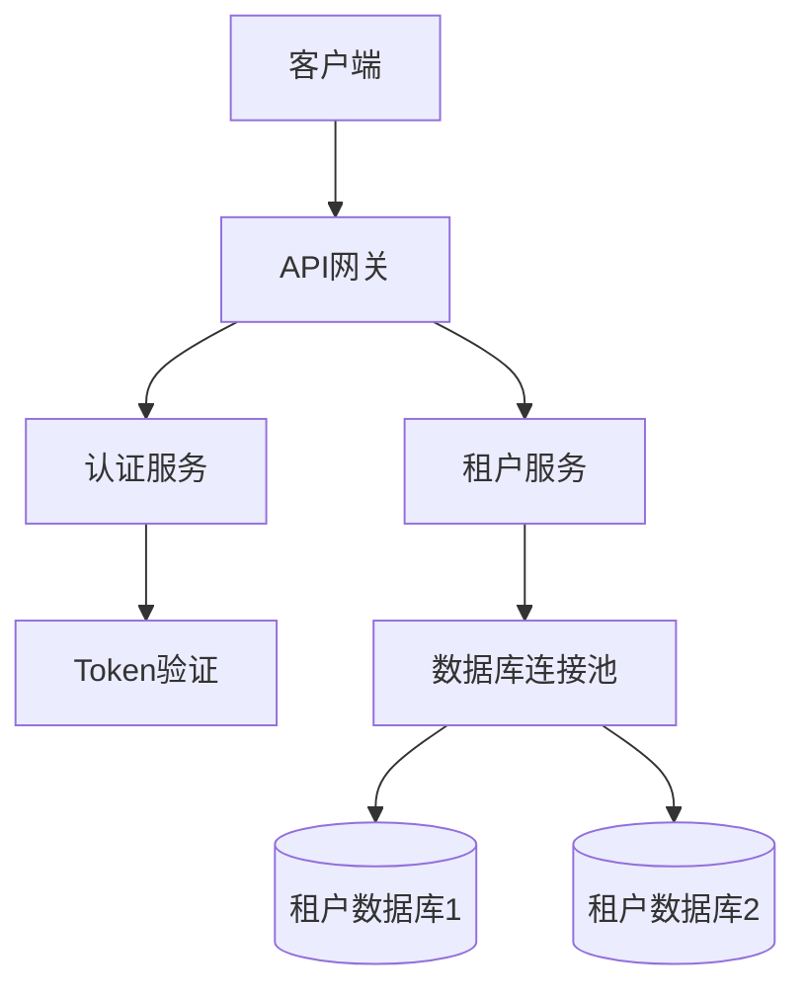
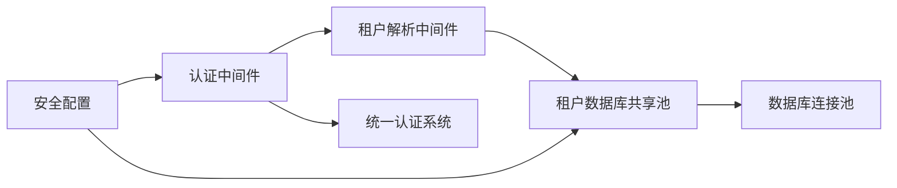

# Web安全防护

<cite>
**本文档引用的文件**
- [security.json](file://k.yyup.com/config/security.json)
- [auth-shared-pool-example.middleware.ts](file://auth-shared-pool-example.middleware.ts)
- [tenant-database-shared-pool.service.ts](file://tenant-database-shared-pool.service.ts)
- [tenant-resolver-shared-pool.middleware.ts](file://tenant-resolver-shared-pool.middleware.ts)
</cite>

## 目录
1. [介绍](#介绍)
2. [项目结构](#项目结构)
3. [核心组件](#核心组件)
4. [架构概述](#架构概述)
5. [详细组件分析](#详细组件分析)
6. [依赖分析](#依赖分析)
7. [性能考虑](#性能考虑)
8. [故障排除指南](#故障排除指南)
9. [结论](#结论)

## 介绍
k.yyupgame 是一个基于多租户架构的Web应用系统，专注于教育领域的综合管理。该系统通过统一的认证机制、严格的权限控制和全面的安全策略来保障用户数据的安全性。本文档详细阐述了k.yyupgame在Web安全防护方面的设计与实现，重点包括XSS（跨站脚本）攻击防范、CSRF（跨站请求伪造）防护、SQL注入防护以及HTTP安全头配置等关键安全机制。

## 项目结构
k.yyupgame项目采用模块化设计，主要分为客户端（client）、服务器端（server）和配置文件（config）三大部分。其中，安全相关的配置主要集中在`config/security.json`中，而认证和授权逻辑则分布在`auth-shared-pool-example.middleware.ts`等中间件文件中。整个项目遵循清晰的分层架构，确保了代码的可维护性和扩展性。



**Diagram sources**
- [security.json](file://k.yyup.com/config/security.json)
- [auth-shared-pool-example.middleware.ts](file://auth-shared-pool-example.middleware.ts)

**Section sources**
- [security.json](file://k.yyup.com/config/security.json)
- [auth-shared-pool-example.middleware.ts](file://auth-shared-pool-example.middleware.ts)

## 核心组件
k.yyupgame的核心安全组件主要包括认证中间件、租户数据库共享池服务和安全配置管理。这些组件协同工作，确保系统的安全性。认证中间件负责处理用户的登录和Token验证，租户数据库共享池服务实现了多租户环境下的数据隔离，而安全配置管理则通过JSON文件定义了各种安全策略。

**Section sources**
- [auth-shared-pool-example.middleware.ts](file://auth-shared-pool-example.middleware.ts)
- [tenant-database-shared-pool.service.ts](file://tenant-database-shared-pool.service.ts)
- [security.json](file://k.yyup.com/config/security.json)

## 架构概述
k.yyupgame采用微服务架构，结合多租户模式，实现了高效且安全的应用部署。系统通过统一的认证服务进行身份验证，并利用共享连接池技术优化数据库访问性能。每个租户的数据存储在独立的数据库中，通过动态SQL查询实现数据隔离，从而有效防止了跨租户的数据泄露风险。



**Diagram sources**
- [auth-shared-pool-example.middleware.ts](file://auth-shared-pool-example.middleware.ts)
- [tenant-database-shared-pool.service.ts](file://tenant-database-shared-pool.service.ts)

## 详细组件分析

### 认证中间件分析
认证中间件是k.yyupgame安全体系的核心，负责处理用户的登录和Token验证。它通过调用统一认证系统验证用户凭据，并在成功后创建会话。中间件还实现了自动创建租户用户的功能，当用户首次登录时，如果在当前租户数据库中未找到对应记录，则会自动创建一个新的用户条目。

#### 对象导向组件：
```mermaid
classDiagram
class RequestWithUser {
+user : any
+tenant : { code : string }
+tenantDb : any
}
class verifyTokenSharedPool {
+req : RequestWithUser
+res : Response
+next : NextFunction
+Promise~void~
}
class loginSharedPool {
+req : RequestWithUser
+res : Response
+next : NextFunction
+Promise~void~
}
RequestWithUser <|-- verifyTokenSharedPool
RequestWithUser <|-- loginSharedPool
```

**Diagram sources**
- [auth-shared-pool-example.middleware.ts](file://auth-shared-pool-example.middleware.ts)

### 安全配置分析
安全配置文件`security.json`定义了系统运行时的各种安全策略，包括输入验证、输出净化、速率限制和日志记录等。这些配置项可以灵活调整，以适应不同的安全需求和业务场景。

| 配置项 | 描述 | 默认值 |
| --- | --- | --- |
| enable_input_validation | 是否启用输入验证 | true |
| max_input_length | 最大输入长度 | 10000 |
| blocked_patterns | 阻止的正则模式 | ["eval\\(", "Function\\(", "setTimeout\\(", "setInterval\\("] |
| enable_output_sanitization | 是否启用输出净化 | true |
| rate_limiting.enabled | 是否启用速率限制 | true |
| logging.log_security_events | 是否记录安全事件 | true |

**Section sources**
- [security.json](file://k.yyup.com/config/security.json)

## 依赖分析
k.yyupgame的各个组件之间存在紧密的依赖关系。认证中间件依赖于租户解析中间件提供的租户信息，而租户数据库共享池服务则依赖于底层的数据库连接池。此外，所有安全相关的功能都依赖于统一认证系统的正常运行。



**Diagram sources**
- [auth-shared-pool-example.middleware.ts](file://auth-shared-pool-example.middleware.ts)
- [tenant-resolver-shared-pool.middleware.ts](file://tenant-resolver-shared-pool.middleware.ts)
- [tenant-database-shared-pool.service.ts](file://tenant-database-shared-pool.service.ts)

**Section sources**
- [auth-shared-pool-example.middleware.ts](file://auth-shared-pool-example.middleware.ts)
- [tenant-resolver-shared-pool.middleware.ts](file://tenant-resolver-shared-pool.middleware.ts)
- [tenant-database-shared-pool.service.ts](file://tenant-database-shared-pool.service.ts)

## 性能考虑
为了保证系统的高性能，k.yyupgame在多个层面进行了优化。首先，通过使用共享数据库连接池减少了数据库连接的开销；其次，启用了缓存机制，将频繁访问的数据存储在内存中；最后，通过合理的速率限制策略，防止了恶意请求对系统资源的过度消耗。

## 故障排除指南
当遇到安全相关的问题时，应首先检查日志文件中的安全事件记录。常见的问题包括认证失败、权限不足和SQL查询错误等。对于认证失败的情况，需要确认Token的有效性和租户信息的正确性；对于权限不足的问题，应检查用户角色和权限配置；而对于SQL查询错误，则需验证动态表名的生成逻辑是否正确。

**Section sources**
- [auth-shared-pool-example.middleware.ts](file://auth-shared-pool-example.middleware.ts)
- [tenant-database-shared-pool.service.ts](file://tenant-database-shared-pool.service.ts)

## 结论
k.yyupgame通过一系列精心设计的安全机制，构建了一个坚固的Web应用防护体系。从输入验证到输出净化，从认证授权到数据隔离，每一个环节都体现了对安全性的高度重视。未来，随着技术的发展和威胁的变化，系统将继续演进，不断引入新的安全措施，以应对日益复杂的网络安全挑战。