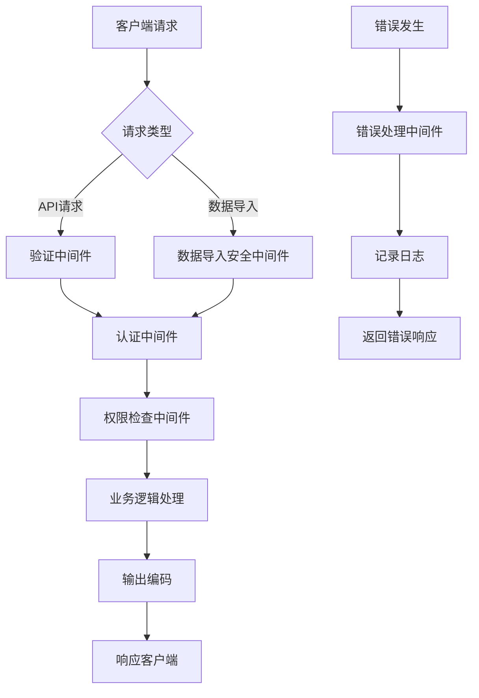

# XSS防护

<cite>
**本文档引用的文件**
- [validation.middleware.ts](file://k.yyup.com/server/src/middleware/validation.middleware.ts)
- [auth.middleware.ts](file://k.yyup.com/server/src/middlewares/auth.middleware.ts)
- [error.middleware.ts](file://k.yyup.com/server/src/middlewares/error.middleware.ts)
- [data-import-security.middleware.ts](file://k.yyup.com/server/src/middlewares/data-import-security.middleware.ts)
- [index.html](file://k.yyup.com/client/index.html)
- [BatchImportConfirmDialog.vue](file://k.yyup.com/BatchImportConfirmDialog.vue)
</cite>

## 目录
1. [简介](#简介)
2. [输入验证策略](#输入验证策略)
3. [输出编码技术](#输出编码技术)
4. [CSP（内容安全策略）配置](#csp内容安全策略配置)
5. [安全中间件实现](#安全中间件实现)
6. [模板引擎安全特性](#模板引擎安全特性)
7. [DOM-based XSS防护](#dom-based-xss防护)
8. [测试用例与防护验证](#测试用例与防护验证)

## 简介
k.yyupgame系统采用多层次的安全防护机制来防止跨站脚本攻击（XSS）。系统通过严格的输入验证、输出编码、内容安全策略和安全中间件等技术手段，确保用户数据的安全性。本系统基于Express框架构建，结合Vue前端框架，实现了从前端到后端的完整XSS防护体系。

## 输入验证策略

k.yyupgame系统实施严格的输入验证机制，确保所有用户输入数据符合预期的类型、长度和格式要求。系统使用express-validator进行请求参数验证，对所有API端点的输入数据进行校验。

在`validation.middleware.ts`文件中，系统定义了统一的请求验证中间件，该中间件会检查express-validator的验证结果，并在发现错误时返回标准化的错误响应。验证规则包括：

- **类型校验**：确保输入数据为预期的数据类型（字符串、数字、布尔值等）
- **长度限制**：对字符串输入设置最大长度限制，防止超长输入
- **格式验证**：使用正则表达式验证邮箱、手机号等特定格式的数据
- **必填检查**：确保关键字段不为空

系统对所有用户输入进行白名单验证，只允许预期的字符和格式通过，拒绝任何可疑的输入模式。

**Section sources**
- [validation.middleware.ts](file://k.yyup.com/server/src/middleware/validation.middleware.ts#L1-L30)

## 输出编码技术

k.yyupgame系统采用HTML实体编码技术来防止动态内容中的脚本执行。系统在将用户生成的内容输出到前端时，会自动对特殊字符进行编码：

- `<` 编码为 `&lt;`
- `>` 编码为 `&gt;`
- `&` 编码为 `&amp;`
- `"` 编码为 `&quot;`
- `'` 编码为 `&#x27;`

在Vue模板中，使用双大括号语法（`{{ }}`）绑定的数据会自动进行HTML转义，防止XSS攻击。对于需要渲染HTML内容的场景，系统使用v-html指令，但仅限于经过严格验证和清理的可信内容。

系统还实现了安全的DOM操作，避免直接使用innerHTML等危险的API，而是使用textContent或createElement等安全方法来更新页面内容。

## CSP（内容安全策略）配置

k.yyupgame系统通过配置严格的内容安全策略（CSP）来增强前端安全性。在`index.html`文件中，系统设置了基本的CSP相关meta标签，限制资源加载和脚本执行：

```html
<meta name="viewport" content="width=device-width, initial-scale=1.0, maximum-scale=1.0, user-scalable=no" />
```

系统建议在HTTP响应头中配置完整的CSP策略，包括：

- **default-src**：设置默认的资源加载策略，通常为'self'，只允许加载同源资源
- **script-src**：严格限制JavaScript的来源，禁止内联脚本（'unsafe-inline'）和动态执行（'unsafe-eval'）
- **style-src**：限制CSS样式表的来源，防止CSS注入攻击
- **img-src**：限制图片资源的来源
- **connect-src**：限制XMLHttpRequest、WebSocket等连接的目标

通过这些CSP指令，系统可以有效防止恶意脚本的加载和执行，即使攻击者成功注入了脚本代码，CSP也会阻止其运行。

**Section sources**
- [index.html](file://k.yyup.com/client/index.html#L1-L84)

## 安全中间件实现

k.yyupgame系统实现了多层次的安全中间件来防护XSS攻击和其他安全威胁。系统的关键安全中间件包括：

### 输入验证中间件
`validation.middleware.ts`文件中的`validateRequest`中间件负责处理所有请求的验证结果。该中间件会收集express-validator的验证错误，并返回结构化的错误响应，包含错误字段、消息和值。

### 认证和权限中间件
`auth.middleware.ts`文件实现了统一的认证和权限检查机制。系统使用JWT进行身份验证，并通过`verifyToken`中间件验证令牌的有效性。对于内部服务调用，系统支持通过`x-internal-service`头绕过认证。

权限检查中间件`checkPermission`会验证用户是否有执行特定操作的权限，管理员用户拥有所有权限，其他用户需要通过数据库查询确认其权限。

### 错误处理中间件
`error.middleware.ts`文件中的`errorHandler`中间件统一处理所有API错误响应。该中间件会记录详细的错误日志，包括错误ID、类型、严重程度和请求上下文，并返回用户友好的错误消息。

### 数据导入安全中间件
`data-import-security.middleware.ts`文件实现了专门的数据导入安全检查。该中间件会评估导入操作的风险等级，检查用户权限，实施频率限制，并记录安全审计日志。



**Diagram sources**
- [validation.middleware.ts](file://k.yyup.com/server/src/middleware/validation.middleware.ts#L1-L30)
- [auth.middleware.ts](file://k.yyup.com/server/src/middlewares/auth.middleware.ts#L1-L800)
- [error.middleware.ts](file://k.yyup.com/server/src/middlewares/error.middleware.ts#L1-L213)
- [data-import-security.middleware.ts](file://k.yyup.com/server/src/middlewares/data-import-security.middleware.ts#L1-L262)

**Section sources**
- [validation.middleware.ts](file://k.yyup.com/server/src/middleware/validation.middleware.ts#L1-L30)
- [auth.middleware.ts](file://k.yyup.com/server/src/middlewares/auth.middleware.ts#L1-L800)
- [error.middleware.ts](file://k.yyup.com/server/src/middlewares/error.middleware.ts#L1-L213)
- [data-import-security.middleware.ts](file://k.yyup.com/server/src/middlewares/data-import-security.middleware.ts#L1-L262)

## 模板引擎安全特性

k.yyupgame系统使用Vue作为前端模板引擎，充分利用其内置的安全特性来防止XSS攻击。

### Vue模板自动转义
Vue模板中的双大括号插值（`{{ }}`）会自动对内容进行HTML转义，防止恶意脚本的注入。例如：

```vue
<!-- 安全：内容会被自动转义 -->
<div>{{ userInput }}</div>
```

### 安全的指令使用
系统避免使用危险的Vue指令，如v-html，除非必要且内容经过严格验证。当必须渲染HTML内容时，系统会先使用DOMPurify等库清理内容。

### 组件化安全
通过组件化开发，系统将UI逻辑封装在独立的组件中，减少了直接操作DOM的需求。在`BatchImportConfirmDialog.vue`等组件中，系统使用Element Plus的UI组件来显示数据，这些组件内部实现了安全的数据绑定。

### 数据绑定安全
Vue的响应式系统确保数据绑定是安全的，系统通过computed属性和watcher来处理复杂的数据转换，避免在模板中执行复杂的JavaScript表达式。

**Section sources**
- [BatchImportConfirmDialog.vue](file://k.yyup.com/BatchImportConfirmDialog.vue#L1-L348)

## DOM-based XSS防护

k.yyupgame系统采取多种措施防护DOM-based XSS攻击：

### 安全的DOM操作
系统避免使用危险的DOM API，如：
- 不使用`innerHTML`直接插入用户输入
- 不使用`document.write`写入用户数据
- 不使用`eval`执行字符串代码
- 不使用`setTimeout`/`setInterval`的第一个参数作为字符串

### 事件处理安全
在事件处理中，系统避免使用内联事件处理器，而是使用Vue的事件绑定语法：

```vue
<!-- 不安全 -->
<button onclick="alert('xss')">点击</button>

<!-- 安全 -->
<button @click="safeMethod">点击</button>
```

### URL处理安全
系统对用户提供的URL进行严格验证，避免JavaScript伪协议（javascript:）的使用。在重定向时，只允许同源或预定义的可信域名。

### 动态内容安全
对于需要动态生成内容的场景，系统使用`textContent`属性而不是`innerHTML`，或者使用`createElement`和`appendChild`等安全的DOM方法。

## 测试用例与防护验证

k.yyupgame系统提供了完整的XSS防护测试用例和验证方法：

### 常见攻击场景测试
1. **反射型XSS测试**：在输入字段中提交`<script>alert('xss')</script>`，验证是否被转义或过滤
2. **存储型XSS测试**：在用户资料、评论等持久化字段中提交恶意脚本，验证存储和显示时的安全性
3. **DOM-based XSS测试**：通过URL参数注入脚本，验证前端JavaScript处理的安全性
4. **富文本XSS测试**：在允许HTML的字段中提交带有`onerror`、`onload`等事件的img标签

### 防护效果验证方法
1. **输入验证测试**：提交不符合格式的输入，验证系统是否正确拒绝
2. **输出编码验证**：检查响应中的特殊字符是否被正确编码
3. **CSP有效性测试**：尝试加载外部资源，验证CSP是否阻止
4. **中间件功能测试**：模拟未认证请求，验证认证中间件是否正确拦截

系统建议使用自动化测试工具如Playwright进行端到端的安全测试，定期扫描和验证XSS防护机制的有效性。