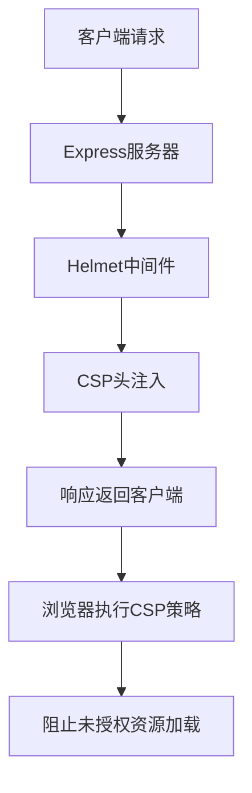
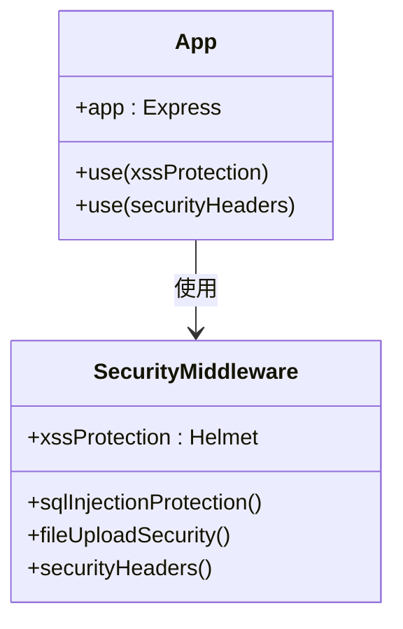

# CSP配置

<cite>
**本文档引用的文件**
- [security.middleware.ts](file://k.yyup.com/server/src/middlewares/security.middleware.ts)
- [app.ts](file://k.yyup.com/server/src/app.ts)
</cite>

## 目录
1. [简介](#简介)
2. [CSP策略配置](#csp策略配置)
3. [内联脚本安全机制](#内联脚本安全机制)
4. [CSP报告机制](#csp报告机制)
5. [中间件实现](#中间件实现)
6. [策略测试方法](#策略测试方法)

## 简介
内容安全策略（CSP）是k.yyupgame系统中重要的安全防护措施，用于防范跨站脚本（XSS）攻击。通过限制资源加载来源，CSP确保只有可信的资源才能被加载和执行。本系统使用Helmet库实现CSP头的配置，通过安全中间件对所有响应进行保护。

**Section sources**
- [security.middleware.ts](file://k.yyup.com/server/src/middlewares/security.middleware.ts#L124-L137)

## CSP策略配置
k.yyupgame系统的CSP策略通过`xssProtection`中间件配置，具体指令如下：

- **default-src**: `'self'` - 默认只允许从同源加载资源
- **script-src**: `'self'`, `'unsafe-inline'`, `'unsafe-eval'` - 允许同源脚本，内联脚本和eval执行
- **style-src**: `'self'`, `'unsafe-inline'` - 允许同源样式表和内联样式
- **img-src**: `'self'`, `data:`, `https:` - 允许同源图片、data URI和HTTPS来源的图片
- **connect-src**: `'self'` - 只允许同源的AJAX、WebSocket等连接
- **font-src**: `'self'` - 只允许同源字体
- **object-src**: `'none'` - 禁止插件对象（如Flash）
- **media-src**: `'self'` - 只允许同源音视频
- **frame-src**: `'none'` - 禁止嵌入框架

这些策略通过Helmet中间件在应用启动时全局应用，有效限制了恶意脚本的执行。

**Diagram sources**
- [security.middleware.ts](file://k.yyup.com/server/src/middlewares/security.middleware.ts#L124-L137)
- [app.ts](file://k.yyup.com/server/src/app.ts#L113)

**Section sources**
- [security.middleware.ts](file://k.yyup.com/server/src/middlewares/security.middleware.ts#L124-L137)

## 内联脚本安全机制
虽然当前配置允许`'unsafe-inline'`，但系统设计支持更安全的nonce或hash机制来管理内联脚本：

1. **Nonce机制**：为每个页面请求生成唯一的随机数，只允许带有匹配nonce属性的脚本执行
2. **Hash机制**：计算内联脚本的哈希值并加入白名单，只有匹配哈希的脚本才能执行

这些机制可以替代`'unsafe-inline'`指令，提供更精细的控制。当启用这些机制时，需要在HTML中相应地设置`nonce`属性或`sha256`哈希值。

**Section sources**
- [security.middleware.ts](file://k.yyup.com/server/src/middlewares/security.middleware.ts#L128-L129)

## CSP报告机制
系统配置了HSTS（HTTP Strict Transport Security）策略，但未显式配置CSP报告端点。标准的CSP报告机制通常包括：

1. **report-uri**：指定一个端点来接收违反CSP策略的报告
2. **report-to**：现代浏览器使用的报告组配置

这些报告可以帮助开发团队监控潜在的安全攻击并调整策略。建议添加报告机制以增强安全监控能力。

**Section sources**
- [security.middleware.ts](file://k.yyup.com/server/src/middlewares/security.middleware.ts#L138-L143)

## 中间件实现
CSP策略通过`security.middleware.ts`文件中的`xssProtection`中间件实现，并在`app.ts`中全局应用：

**Diagram sources**
- [security.middleware.ts](file://k.yyup.com/server/src/middlewares/security.middleware.ts)
- [app.ts](file://k.yyup.com/server/src/app.ts#L113)

**Section sources**
- [security.middleware.ts](file://k.yyup.com/server/src/middlewares/security.middleware.ts)
- [app.ts](file://k.yyup.com/server/src/app.ts#L113)

## 策略测试方法
测试CSP策略有效性的方法包括：

1. **浏览器开发者工具**：检查网络请求和控制台，验证CSP头是否存在及是否阻止了违规资源
2. **自动化测试**：使用Playwright等工具模拟违反CSP的行为
3. **安全扫描**：使用专业安全工具扫描CSP配置的完整性
4. **手动测试**：尝试注入内联脚本验证是否被阻止

通过这些测试方法，可以确保CSP策略正确实施并有效防护XSS攻击。

**Section sources**
- [security.middleware.ts](file://k.yyup.com/server/src/middlewares/security.middleware.ts)
- [app.ts](file://k.yyup.com/server/src/app.ts)