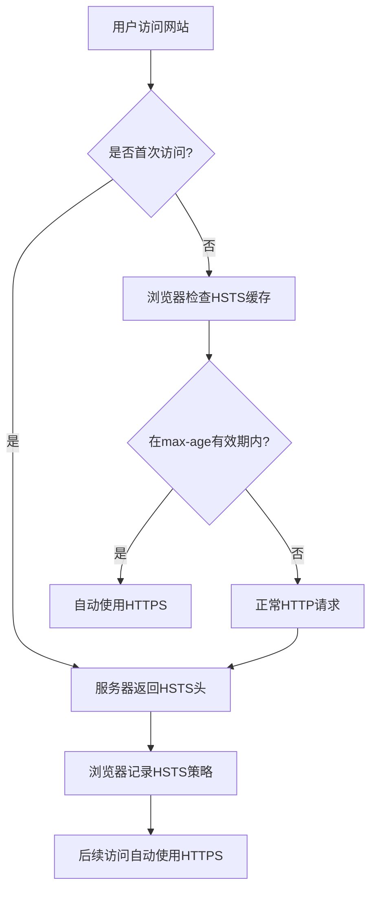

# HSTS配置

<cite>
**本文档引用的文件**   
- [security.middleware.ts](file://k.yyup.com/server/src/middlewares/security.middleware.ts)
- [nginx.conf](file://k.yyup.com/nginx.conf)
- [08-security-best-practices.md](file://docs/wiki/system-architecture-and-deployment/08-security-best-practices.md)
- [TC-034-sensitive-data-encryption.test.ts](file://k.yyup.com/client/src/tests/mobile/security/TC-034-sensitive-data-encryption.test.ts)
</cite>

## 目录
1. [HSTS头配置概述](#hsts头配置概述)
2. [max-age参数详解](#max-age参数详解)
3. [includeSubDomains指令说明](#includesubdomains指令说明)
4. [preload指令配置](#preload指令配置)
5. [生产环境配置示例](#生产环境配置示例)
6. [HSTS安全机制](#hsts安全机制)
7. [配置有效性测试](#配置有效性测试)

## HSTS头配置概述

在k.yyupgame系统中，HSTS（HTTP Strict Transport Security）头通过`security.middleware.ts`中间件进行配置，使用了`helmet`安全库来实现。HSTS头的配置确保了浏览器强制使用HTTPS连接，防止SSL剥离攻击。该配置在系统的所有API端点中生效，为用户提供了端到端的安全通信保障。

**Section sources**
- [security.middleware.ts](file://k.yyup.com/server/src/middlewares/security.middleware.ts#L139-L143)

## max-age参数详解

HSTS配置中的`max-age`参数设置为31536000秒（即1年）。这个值表示浏览器在收到HSTS头后，将在接下来的一年内强制使用HTTPS连接访问该域名，即使用户手动输入HTTP地址也会被自动重定向到HTTPS。这个较长的有效期确保了用户在长时间内都能享受到安全的加密连接，减少了中间人攻击的风险。



**Diagram sources **
- [security.middleware.ts](file://k.yyup.com/server/src/middlewares/security.middleware.ts#L140)

**Section sources**
- [security.middleware.ts](file://k.yyup.com/server/src/middlewares/security.middleware.ts#L140)

## includeSubDomains指令说明

`includeSubDomains`指令在k.yyupgame系统的HSTS配置中被启用（设置为true）。这意味着HSTS策略不仅适用于主域名（k.yyup.cc），还适用于其所有子域名（如api.k.yyup.cc、admin.k.yyup.cc等）。这一配置增强了整个域名体系的安全性，确保所有子域名的通信都受到HTTPS保护，防止攻击者通过子域名进行SSL剥离攻击或中间人攻击。

**Section sources**
- [security.middleware.ts](file://k.yyup.com/server/src/middlewares/security.middleware.ts#L141)

## preload指令配置

`preload`指令在HSTS配置中被设置为true，表示系统有意将域名提交到浏览器的HSTS预加载列表中。预加载列表是浏览器内置的HSTS域名列表，即使用户从未访问过该网站，浏览器也会强制使用HTTPS连接。这一配置提高了安全性，但需要在[Chrome HSTS Preload List](https://hstspreload.org/)等服务中正式提交域名才能生效。启用preload指令表明系统对安全性的高度重视。

**Section sources**
- [security.middleware.ts](file://k.yyup.com/server/src/middlewares/security.middleware.ts#L142)

## 生产环境配置示例

在k.yyupgame系统的生产环境中，HSTS头通过`security.middleware.ts`中间件设置：

```typescript
export const xssProtection = helmet({
  contentSecurityPolicy: {
    directives: {
      defaultSrc: ["'self'"],
      scriptSrc: ["'self'", "'unsafe-inline'", "'unsafe-eval'"],
      styleSrc: ["'self'", "'unsafe-inline'"],
      imgSrc: ["'self'", "data:", "https:"],
      connectSrc: ["'self'"],
      fontSrc: ["'self'"],
      objectSrc: ["'none'"],
      mediaSrc: ["'self'"],
      frameSrc: ["'none'"],
    },
  },
  crossOriginEmbedderPolicy: false,
  hsts: {
    maxAge: 31536000,
    includeSubDomains: true,
    preload: true
  }
});
```

此外，Nginx反向代理配置中也设置了HSTS头，作为额外的安全层：

```
add_header Strict-Transport-Security "max-age=31536000; includeSubDomains" always;
```

这种双重配置确保了即使应用层出现问题，网络层仍然能提供HSTS保护。

**Section sources**
- [security.middleware.ts](file://k.yyup.com/server/src/middlewares/security.middleware.ts#L139-L143)
- [nginx.conf](file://k.yyup.com/nginx.conf#L117)

## HSTS安全机制

HSTS头通过强制浏览器使用HTTPS连接来防止SSL剥离攻击。当浏览器首次收到HSTS头后，会将该策略存储在本地缓存中。在`max-age`指定的有效期内，所有对该域名的访问都会自动转换为HTTPS请求，即使用户手动输入HTTP地址或点击HTTP链接。这有效地阻止了攻击者通过降级到HTTP来窃取敏感信息的尝试。

HSTS的工作流程如下：
1. 用户首次访问网站（HTTP或HTTPS）
2. 服务器在响应头中包含HSTS策略
3. 浏览器解析并存储HSTS策略
4. 后续访问中，浏览器自动将HTTP请求转换为HTTPS
5. 如果证书无效，连接将被终止，而不是提示用户继续

这种机制确保了通信的机密性和完整性，是现代Web安全的重要组成部分。

**Section sources**
- [security.middleware.ts](file://k.yyup.com/server/src/middlewares/security.middleware.ts#L139-L143)
- [TC-034-sensitive-data-encryption.test.ts](file://k.yyup.com/client/src/tests/mobile/security/TC-034-sensitive-data-encryption.test.ts#L100-L104)

## 配置有效性测试

可以通过以下方法测试HSTS配置的有效性：

### 使用curl命令测试
```bash
curl -I https://k.yyup.cc
```
检查响应头中是否包含：
```
Strict-Transport-Security: max-age=31536000; includeSubDomains; preload
```

### 使用浏览器开发者工具
1. 打开浏览器开发者工具（F12）
2. 访问k.yyup.cc
3. 在"Network"标签页中查看任意请求的响应头
4. 确认"Strict-Transport-Security"头的存在和正确性

### 自动化测试验证
系统中的自动化测试也验证了HSTS配置：
```typescript
const securityHeaders = {
  'Strict-Transport-Security': 'max-age=31536000; includeSubDomains',
  'X-Content-Type-Options': 'nosniff',
  'X-Frame-Options': 'DENY',
  'X-XSS-Protection': '1; mode=block',
  'Content-Security-Policy': "default-src 'self'"
};
```

这些测试确保了HSTS配置的正确性和持续有效性。

**Section sources**
- [TC-034-sensitive-data-encryption.test.ts](file://k.yyup.com/client/src/tests/mobile/security/TC-034-sensitive-data-encryption.test.ts#L100-L104)
- [nginx.conf](file://k.yyup.com/nginx.conf#L117)