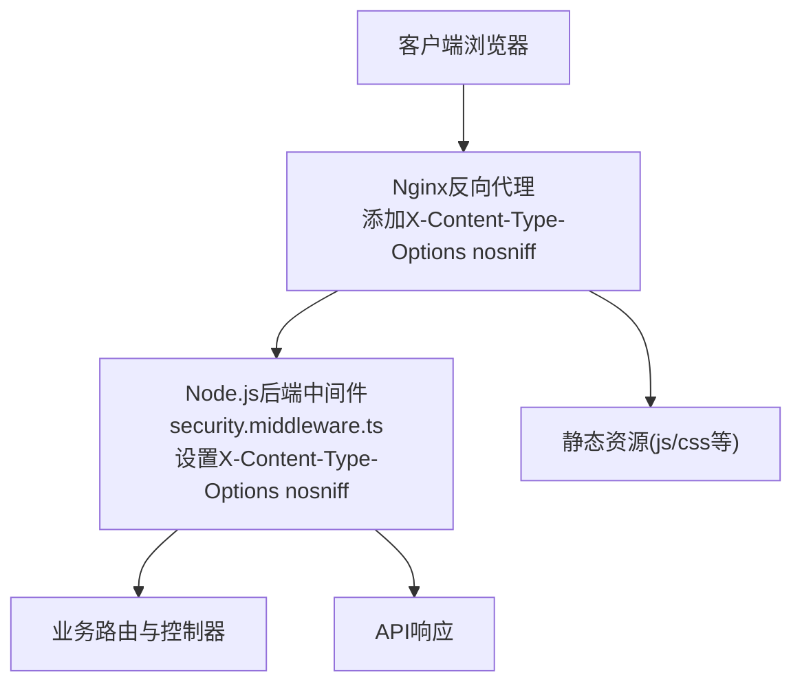
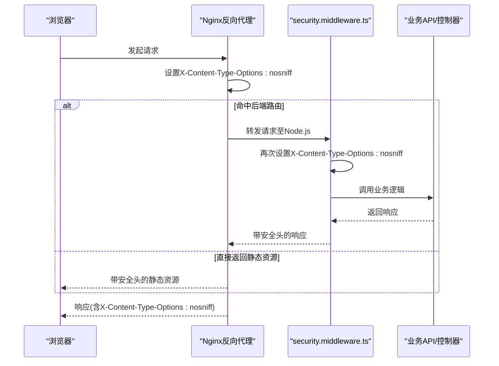
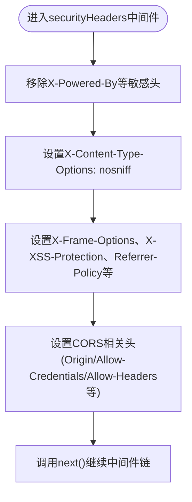
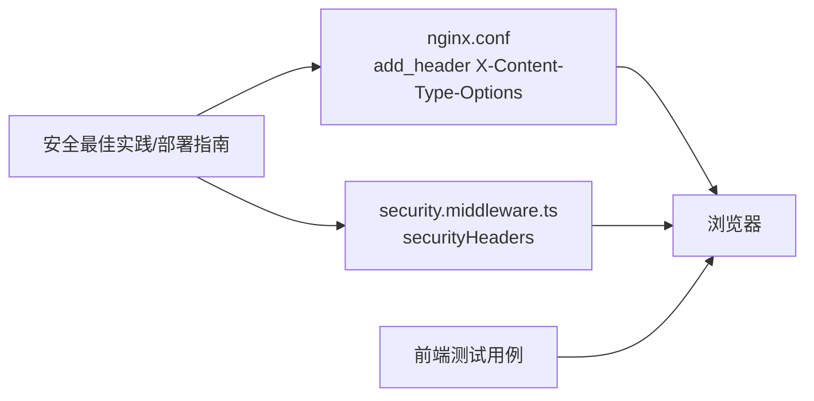

# X-Content-Type-Options配置

<cite>
**本文引用的文件**
- [security.middleware.ts](file://k.yyup.com/server/src/middlewares/security.middleware.ts)
- [nginx.conf](file://k.yyup.com/nginx.conf)
- [08-security-best-practices.md](file://docs/wiki/system-architecture-and-deployment/08-security-best-practices.md)
- [19-deployment-guide.md](file://docs/wiki/kindergarten-tenant-system/19-deployment-guide.md)
- [TC-034-sensitive-data-encryption.test.ts](file://k.yyup.com/client/src/tests/mobile/security/TC-034-sensitive-data-encryption.test.ts)
</cite>

## 目录
1. [简介](#简介)
2. [项目结构](#项目结构)
3. [核心组件](#核心组件)
4. [架构总览](#架构总览)
5. [详细组件分析](#详细组件分析)
6. [依赖关系分析](#依赖关系分析)
7. [性能考量](#性能考量)
8. [故障排查指南](#故障排查指南)
9. [结论](#结论)
10. [附录](#附录)

## 简介
本文件围绕k.yyupgame系统中X-Content-Type-Options安全头的实现与作用展开，重点说明nosniff指令如何防止浏览器进行MIME类型嗅探攻击，确保资源按声明的Content-Type解析；同时给出该头在security.middleware.ts中的设置位置、对CSS、JavaScript等资源加载的影响、以及增强浏览器安全策略的方式，并提供验证配置是否生效的测试方法。

## 项目结构
k.yyupgame系统在多处设置了X-Content-Type-Options nosniff，包括：
- Nginx反向代理层：在server块中为所有响应添加安全头，覆盖静态资源与API响应。
- Node.js后端中间件：在security.middleware.ts中统一设置安全头，保障API响应一致性。
- 文档与测试：官方部署与安全最佳实践文档中明确该头的必要性；前端测试用例中也包含对该头的断言，用于验证配置是否生效。

图表来源
- [nginx.conf](file://k.yyup.com/nginx.conf#L112-L119)
- [security.middleware.ts](file://k.yyup.com/server/src/middlewares/security.middleware.ts#L287-L314)

章节来源
- [nginx.conf](file://k.yyup.com/nginx.conf#L112-L119)
- [security.middleware.ts](file://k.yyup.com/server/src/middlewares/security.middleware.ts#L287-L314)

## 核心组件
- X-Content-Type-Options nosniff：指示浏览器不要对响应的Content-Type进行嗅探，严格遵循服务器声明的MIME类型。这能有效避免某些浏览器对HTML/CSS/JS等资源进行误解析，降低跨站脚本与协议混淆攻击的风险。
- Nginx层安全头：在nginx.conf中为所有响应添加X-Content-Type-Options nosniff，确保静态资源与API响应均受保护。
- 后端安全中间件：在security.middleware.ts中设置X-Content-Type-Options nosniff，保证API响应的一致性与可追溯性。

章节来源
- [nginx.conf](file://k.yyup.com/nginx.conf#L112-L119)
- [security.middleware.ts](file://k.yyup.com/server/src/middlewares/security.middleware.ts#L287-L314)

## 架构总览
X-Content-Type-Options nosniff在系统中的生效路径如下：
- 客户端发起请求，Nginx作为反向代理接收请求。
- Nginx根据配置为响应添加X-Content-Type-Options nosniff。
- 若请求命中后端路由，Node.js中间件再次设置X-Content-Type-Options nosniff，确保最终响应具备该安全头。
- 浏览器收到响应后，严格依据Content-Type加载资源，避免MIME嗅探带来的风险。

图表来源
- [nginx.conf](file://k.yyup.com/nginx.conf#L112-L119)
- [security.middleware.ts](file://k.yyup.com/server/src/middlewares/security.middleware.ts#L287-L314)

## 详细组件分析

### Nginx层X-Content-Type-Options配置
- 配置位置：nginx.conf的server块中，使用add_header为所有响应添加X-Content-Type-Options nosniff，并标记always以确保即使在代理场景下也能稳定生效。
- 影响范围：静态资源(js/css/png等)与API响应均受保护，避免浏览器对资源类型进行嗅探。

章节来源
- [nginx.conf](file://k.yyup.com/nginx.conf#L112-L119)

### Node.js中间件层X-Content-Type-Options配置
- 配置位置：security.middleware.ts中的securityHeaders中间件，统一设置X-Content-Type-Options nosniff。
- 控制流：中间件在每次响应前设置安全头，随后继续后续中间件链路，保证API响应一致受保护。
- 与其他安全头协同：中间件还设置X-Frame-Options、X-XSS-Protection、Referrer-Policy等，形成综合安全策略。

图表来源
- [security.middleware.ts](file://k.yyup.com/server/src/middlewares/security.middleware.ts#L287-L314)

章节来源
- [security.middleware.ts](file://k.yyup.com/server/src/middlewares/security.middleware.ts#L287-L314)

### nosniff指令的作用机制与安全影响
- 作用机制：nosniff禁止浏览器对响应的Content-Type进行嗅探，强制按照服务器声明的MIME类型解析资源。
- 对CSS/JS等资源加载的影响：
  - 当服务器正确声明Content-Type为text/css或application/javascript时，浏览器将按此类型解析，避免被误判为text/html导致脚本执行风险。
  - 若服务器未正确声明类型，浏览器将拒绝加载，从而降低MIME混淆攻击的风险。
- 对安全策略的增强：结合X-Frame-Options、Referrer-Policy等，形成“最小权限+严格类型约束”的安全基线，减少跨站脚本与点击劫持等攻击面。

章节来源
- [08-security-best-practices.md](file://docs/wiki/system-architecture-and-deployment/08-security-best-practices.md#L670-L690)
- [19-deployment-guide.md](file://docs/wiki/kindergarten-tenant-system/19-deployment-guide.md#L260-L270)

### 验证配置是否生效的测试方法
- 前端测试断言：在移动端安全测试用例中，显式断言响应头包含X-Content-Type-Options: nosniff，确保配置在不同环境下均生效。
- 建议的验证步骤：
  - 使用浏览器开发者工具Network面板查看响应头，确认存在X-Content-Type-Options: nosniff。
  - 使用curl或Postman发送请求，检查响应头是否包含该字段。
  - 在CI中增加自动化断言，确保每次构建都校验该安全头的存在。

章节来源
- [TC-034-sensitive-data-encryption.test.ts](file://k.yyup.com/client/src/tests/mobile/security/TC-034-sensitive-data-encryption.test.ts#L498-L504)

## 依赖关系分析
- 组件耦合：
  - Nginx与后端中间件共同负责安全头设置，形成“网关层+应用层”的双重保障。
  - 中间件依赖Express Response对象设置头部，确保在所有API响应上生效。
- 外部依赖：
  - 文档与测试用例作为配置正确性的参考与验证手段，确保安全头在生产与测试环境中一致生效。

图表来源
- [nginx.conf](file://k.yyup.com/nginx.conf#L112-L119)
- [security.middleware.ts](file://k.yyup.com/server/src/middlewares/security.middleware.ts#L287-L314)
- [08-security-best-practices.md](file://docs/wiki/system-architecture-and-deployment/08-security-best-practices.md#L670-L690)
- [19-deployment-guide.md](file://docs/wiki/kindergarten-tenant-system/19-deployment-guide.md#L260-L270)
- [TC-034-sensitive-data-encryption.test.ts](file://k.yyup.com/client/src/tests/mobile/security/TC-034-sensitive-data-encryption.test.ts#L498-L504)

## 性能考量
- 设置成本极低：仅在响应头层面添加一个字段，几乎不影响性能。
- 生效范围广：Nginx与后端中间件双重设置，确保静态资源与API响应均受保护，避免遗漏。
- 与缓存策略配合：静态资源通常由Nginx缓存，安全头设置不会改变缓存行为，仅增加少量头部开销。

## 故障排查指南
- 现象：浏览器仍出现资源被误解析或脚本未执行。
  - 排查要点：
    - 确认Nginx配置中已添加X-Content-Type-Options nosniff。
    - 确认后端中间件已启用并处于中间件链靠前位置。
    - 检查是否存在自定义响应头覆盖或代理转发导致的丢失。
- 验证方法：
  - 使用浏览器Network面板查看响应头。
  - 使用curl命令行请求接口，检查响应头。
  - 在CI中加入断言，确保X-Content-Type-Options: nosniff始终存在。

章节来源
- [nginx.conf](file://k.yyup.com/nginx.conf#L112-L119)
- [security.middleware.ts](file://k.yyup.com/server/src/middlewares/security.middleware.ts#L287-L314)
- [TC-034-sensitive-data-encryption.test.ts](file://k.yyup.com/client/src/tests/mobile/security/TC-034-sensitive-data-encryption.test.ts#L498-L504)

## 结论
k.yyupgame系统通过Nginx与Node.js中间件双层设置X-Content-Type-Options nosniff，有效防止浏览器对资源进行MIME类型嗅探，确保CSS、JavaScript等资源按声明的Content-Type解析，显著降低跨站脚本与协议混淆攻击风险。结合其他安全头与测试验证，形成了完整的安全基线，建议在生产与测试环境中持续校验该头的存在与正确性。

## 附录
- 相关文档与部署指南中明确提及X-Content-Type-Options nosniff的必要性与配置方式，可作为实施与审计的参考依据。

章节来源
- [08-security-best-practices.md](file://docs/wiki/system-architecture-and-deployment/08-security-best-practices.md#L670-L690)
- [19-deployment-guide.md](file://docs/wiki/kindergarten-tenant-system/19-deployment-guide.md#L260-L270)