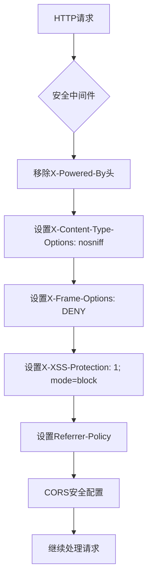
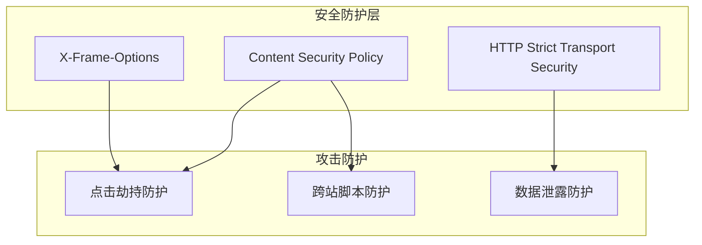

# X-Frame-Options配置

<cite>
**本文档引用文件**  
- [security.middleware.ts](file://k.yyup.com/server/src/middlewares/security.middleware.ts)
- [08-security-best-practices.md](file://docs/wiki/system-architecture-and-deployment/08-security-best-practices.md)
- [19-deployment-guide.md](file://docs/wiki/kindergarten-tenant-system/19-deployment-guide.md)
</cite>

## 目录
1. [X-Frame-Options指令详解](#x-frame-options指令详解)
2. [点击劫持防护原理](#点击劫持防护原理)
3. [k.yyupgame系统中的实现](#kyyupgame系统中的实现)
4. [与其他防御机制的关系](#与其他防御机制的关系)
5. [配置有效性验证方法](#配置有效性验证方法)

## X-Frame-Options指令详解

X-Frame-Options是一个HTTP响应头，用于控制页面是否可以被嵌入到iframe中。在k.yyupgame系统中，主要使用以下指令：

- **DENY**: 完全禁止页面被嵌入到任何框架中，这是最严格的安全策略
- **SAMEORIGIN**: 允许页面被同源的框架嵌入，但不允许跨域嵌入
- **ALLOW-FROM uri**: 允许页面被指定来源的框架嵌入（现代浏览器已弃用）

在k.yyupgame系统中，默认采用DENY策略，以最大程度地防止点击劫持攻击。该策略确保即使攻击者创建了恶意网站，也无法通过iframe将k.yyupgame的页面嵌入其中进行伪装。

**Section sources**
- [security.middleware.ts](file://k.yyup.com/server/src/middlewares/security.middleware.ts#L293)
- [08-security-best-practices.md](file://docs/wiki/system-architecture-and-deployment/08-security-best-practices.md#L680)

## 点击劫持防护原理

点击劫持（Clickjacking）是一种界面伪装攻击，攻击者通过透明或半透明的iframe层覆盖在合法页面上，诱使用户在不知情的情况下点击恶意内容。X-Frame-Options通过以下机制进行防护：

当浏览器接收到带有X-Frame-Options头的响应时，会根据指定的指令决定是否允许页面被嵌入框架。如果服务器设置了X-Frame-Options: DENY，浏览器将完全阻止页面在iframe中显示，从而有效防止点击劫持攻击。

这种防护机制在用户登录、支付确认等敏感操作场景中尤为重要，可以防止攻击者诱导用户在看似正常的界面中执行非预期的操作。

**Section sources**
- [08-security-best-practices.md](file://docs/wiki/system-architecture-and-deployment/08-security-best-practices.md#L679)
- [security.middleware.ts](file://k.yyup.com/server/src/middlewares/security.middleware.ts#L293)

## k.yyupgame系统中的实现

在k.yyupgame系统中，X-Frame-Options头通过安全中间件进行配置。具体实现位于`security.middleware.ts`文件中，通过`securityHeaders`中间件统一设置多个安全头。



**Diagram sources**
- [security.middleware.ts](file://k.yyup.com/server/src/middlewares/security.middleware.ts#L287-L314)

该中间件在请求处理流程的早期阶段执行，确保所有响应都包含必要的安全头。X-Frame-Options设置为DENY，与其他安全头如X-Content-Type-Options、X-XSS-Protection等共同构建多层防护体系。

此外，系统还在Nginx反向代理层配置了相同的X-Frame-Options头，形成双重防护机制。这种分层安全策略确保即使应用层配置出现问题，基础设施层仍能提供基本的安全保护。

**Section sources**
- [security.middleware.ts](file://k.yyup.com/server/src/middlewares/security.middleware.ts#L287-L314)
- [19-deployment-guide.md](file://docs/wiki/kindergarten-tenant-system/19-deployment-guide.md#L261)

## 与其他防御机制的关系

X-Frame-Options与内容安全策略（CSP）中的frame-ancestors指令具有相似的功能，但存在重要区别：

- **X-Frame-Options**: 传统防护机制，兼容性好，但功能有限
- **CSP frame-ancestors**: 现代防护机制，功能更强大，支持更精细的来源控制

在k.yyupgame系统中，同时采用了这两种机制以确保最佳兼容性和安全性。系统通过Helmet中间件配置了CSP策略，其中`frameSrc: ["'none'"]`指令与X-Frame-Options: DENY协同工作，提供双重框架嵌入防护。



**Diagram sources**
- [security.middleware.ts](file://k.yyup.com/server/src/middlewares/security.middleware.ts#L125-L135)
- [08-security-best-practices.md](file://docs/wiki/system-architecture-and-deployment/08-security-best-practices.md#L683)

这种多层防御策略遵循纵深防御原则，即使某一层防护被绕过，其他层仍能提供保护。X-Frame-Options作为基础防护，CSP作为增强防护，共同构建了强大的安全屏障。

**Section sources**
- [security.middleware.ts](file://k.yyup.com/server/src/middlewares/security.middleware.ts#L124-L137)
- [08-security-best-practices.md](file://docs/wiki/system-architecture-and-deployment/08-security-best-practices.md#L679-L684)

## 配置有效性验证方法

验证X-Frame-Options配置有效性的方法包括：

1. **浏览器开发者工具检查**：
   - 打开浏览器开发者工具
   - 查看网络请求的响应头
   - 确认存在`X-Frame-Options: DENY`头

2. **手动测试**：
   创建测试HTML文件，尝试通过iframe嵌入k.yyupgame页面：
   ```html
   <iframe src="https://k.yyupgame.com"></iframe>
   ```
   浏览器应阻止加载并显示安全错误。

3. **自动化测试**：
   使用Playwright等工具编写自动化测试脚本，验证安全头的存在和正确性。

4. **安全扫描工具**：
   使用OWASP ZAP、Burp Suite等安全扫描工具进行系统性检测。

5. **Nginx配置验证**：
   检查Nginx配置文件，确认在server块中正确配置了安全头：
   ```
   add_header X-Frame-Options DENY;
   ```

定期验证配置有效性是确保安全策略持续有效的关键步骤，建议将其纳入持续集成/持续部署（CI/CD）流程中。

**Section sources**
- [19-deployment-guide.md](file://docs/wiki/kindergarten-tenant-system/19-deployment-guide.md#L261)
- [security.middleware.ts](file://k.yyup.com/server/src/middlewares/security.middleware.ts#L293)