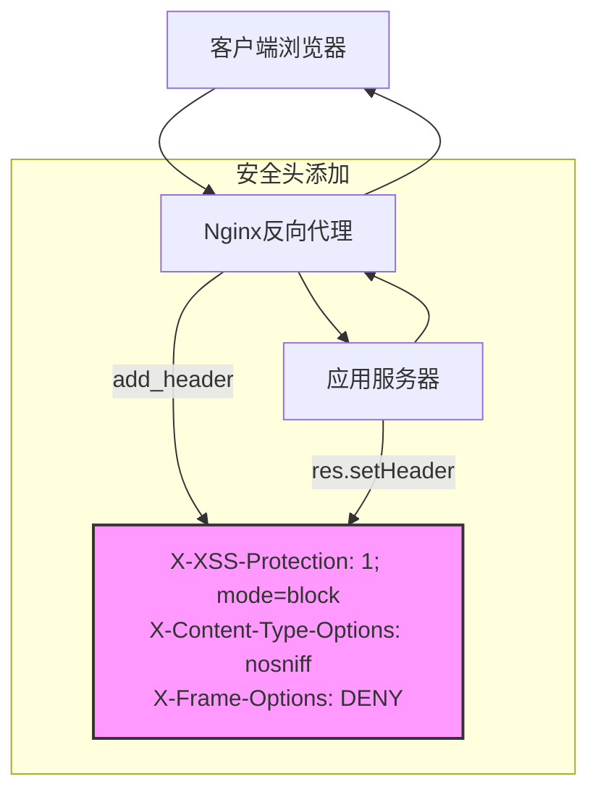
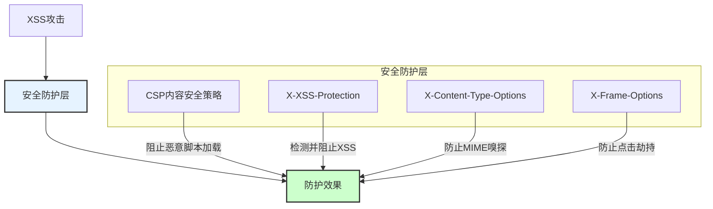
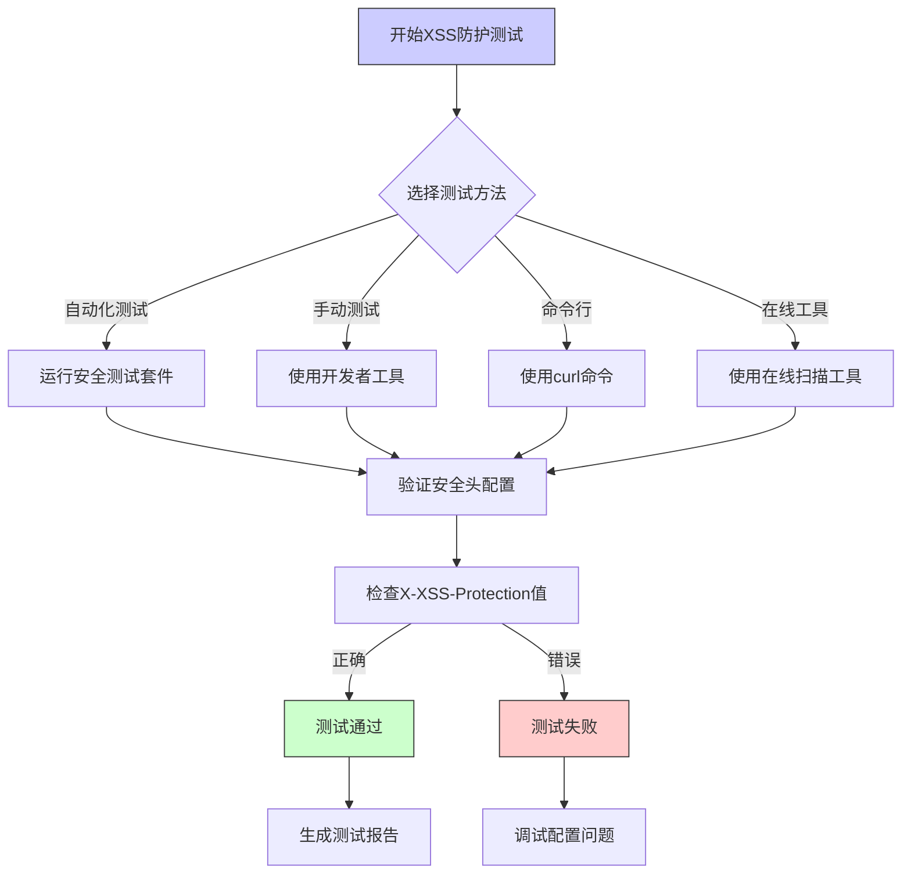

# X-XSS-Protection配置

<cite>
**本文档引用文件**   
- [security.middleware.ts](file://k.yyup.com/server/src/middlewares/security.middleware.ts)
- [nginx.conf](file://k.yyup.com/nginx.conf)
- [08-security-best-practices.md](file://docs/wiki/system-architecture-and-deployment/08-security-best-practices.md)
- [19-deployment-guide.md](file://docs/wiki/kindergarten-tenant-system/19-deployment-guide.md)
- [TC-034-sensitive-data-encryption.test.ts](file://k.yyup.com/client/src/tests/mobile/security/TC-034-sensitive-data-encryption.test.ts)
</cite>

## 目录
1. [X-XSS-Protection头概述](#x-xss-protection头概述)
2. [1; mode=block指令详解](#1-modeblock指令详解)
3. [k.yyupgame系统中的实现](#kyyupgame系统中的实现)
4. [与其他安全机制的协同作用](#与其他安全机制的协同作用)
5. [浏览器兼容性情况](#浏览器兼容性情况)
6. [测试XSS防护功能](#测试xss防护功能)
7. [总结](#总结)

## X-XSS-Protection头概述

X-XSS-Protection是一个HTTP响应头，用于控制浏览器内置的跨站脚本（XSS）过滤器的行为。该头部最初由Internet Explorer引入，后来被其他浏览器采用，旨在帮助防御反射型XSS攻击。

在k.yyupgame系统中，X-XSS-Protection头被配置为`1; mode=block`，这表示启用浏览器的XSS过滤器，并在检测到XSS攻击时阻止页面渲染，而不是尝试清理恶意脚本。

**Section sources**
- [security.middleware.ts](file://k.yyup.com/server/src/middlewares/security.middleware.ts#L294)
- [nginx.conf](file://k.yyup.com/nginx.conf#L117)

## 1; mode=block指令详解

`1; mode=block`指令包含两个部分：

1. **1**：启用浏览器的XSS过滤器。当浏览器检测到潜在的XSS攻击时，会尝试阻止恶意脚本的执行。

2. **mode=block**：指定过滤器的行为模式。当设置为`block`时，如果检测到XSS攻击，浏览器将阻止整个页面的渲染，而不是尝试清理或修改页面内容。

这种配置相比默认的`sanitize`模式更加安全，因为它完全阻止了可疑页面的显示，防止了可能的绕过攻击。当浏览器检测到XSS攻击时，用户通常会看到一个空白页面或浏览器的默认阻止页面，而不是被篡改的内容。

**Section sources**
- [security.middleware.ts](file://k.yyup.com/server/src/middlewares/security.middleware.ts#L294)
- [nginx.conf](file://k.yyup.com/nginx.conf#L117)

## k.yyupgame系统中的实现

在k.yyupgame系统中，X-XSS-Protection头通过两种方式实现：应用层中间件和Nginx反向代理配置。

### 应用层实现

在`security.middleware.ts`文件中，通过`securityHeaders`中间件设置X-XSS-Protection头：

```typescript
export const securityHeaders = (req: Request, res: Response, next: NextFunction): void => {
  // 移除敏感的服务器信息
  res.removeHeader('X-Powered-By');
  
  // 添加安全头
  res.setHeader('X-Content-Type-Options', 'nosniff');
  res.setHeader('X-Frame-Options', 'DENY');
  res.setHeader('X-XSS-Protection', '1; mode=block');
  res.setHeader('Referrer-Policy', 'strict-origin-when-cross-origin');
  
  // ... 其他安全头配置
  next();
};
```

该中间件作为安全防护的一部分，与其他安全头（如X-Content-Type-Options、X-Frame-Options等）一起应用，形成多层次的安全防护体系。

### Nginx层实现

在`nginx.conf`配置文件中，也设置了X-XSS-Protection头：

```nginx
# 安全头
add_header X-Frame-Options "SAMEORIGIN" always;
add_header X-Content-Type-Options "nosniff" always;
add_header X-XSS-Protection "1; mode=block" always;
add_header Strict-Transport-Security "max-age=31536000; includeSubDomains" always;
```

使用`always`参数确保该头部在所有响应中都存在，包括错误页面。这种双重配置提供了冗余保护，即使应用层配置出现问题，Nginx层的安全头仍然可以提供基本的防护。



**Diagram sources **
- [security.middleware.ts](file://k.yyup.com/server/src/middlewares/security.middleware.ts#L287-L314)
- [nginx.conf](file://k.yyup.com/nginx.conf#L114-L118)

**Section sources**
- [security.middleware.ts](file://k.yyup.com/server/src/middlewares/security.middleware.ts#L287-L314)
- [nginx.conf](file://k.yyup.com/nginx.conf#L114-L118)

## 与其他安全机制的协同作用

X-XSS-Protection头在k.yyupgame系统中与其他安全机制协同工作，形成纵深防御体系。

### 与内容安全策略（CSP）的协同

虽然X-XSS-Protection是一个有用的防护措施，但它不能替代内容安全策略（CSP）。在k.yyupgame系统中，CSP和X-XSS-Protection共同提供多层次的XSS防护：

- **CSP**：作为第一道防线，通过白名单机制严格控制页面可以加载的资源，从根本上防止XSS攻击。
- **X-XSS-Protection**：作为第二道防线，在CSP可能被绕过或配置不当时提供额外的保护。

在`security.middleware.ts`中，虽然没有直接配置CSP，但通过Helmet库的`xssProtection`配置，间接影响了CSP的设置：

```typescript
export const xssProtection = helmet({
  contentSecurityPolicy: {
    directives: {
      defaultSrc: ["'self'"],
      scriptSrc: ["'self'", "'unsafe-inline'", "'unsafe-eval'"],
      styleSrc: ["'self'", "'unsafe-inline'"],
      // ... 其他指令
    },
  },
  // ... 其他配置
});
```

### 与其它安全头的协同

X-XSS-Protection与系统中的其他安全头协同工作：

- **X-Content-Type-Options: nosniff**：防止MIME类型嗅探攻击，确保资源按声明的类型处理。
- **X-Frame-Options: DENY**：防止点击劫持攻击，阻止页面被嵌入到iframe中。
- **Referrer-Policy: strict-origin-when-cross-origin**：控制Referer头的信息泄露。

这些安全头共同构成了一个完整的安全防护体系，每个头负责不同的安全方面，相互补充。



**Diagram sources **
- [security.middleware.ts](file://k.yyup.com/server/src/middlewares/security.middleware.ts#L124-L144)
- [security.middleware.ts](file://k.yyup.com/server/src/middlewares/security.middleware.ts#L292-L295)

**Section sources**
- [security.middleware.ts](file://k.yyup.com/server/src/middlewares/security.middleware.ts#L124-L144)
- [security.middleware.ts](file://k.yyup.com/server/src/middlewares/security.middleware.ts#L292-L295)

## 浏览器兼容性情况

X-XSS-Protection头的浏览器兼容性情况如下：

### 支持的浏览器

- **Google Chrome**：从版本4开始支持，但在Chrome 78+版本中已默认禁用，并计划在未来版本中完全移除。
- **Mozilla Firefox**：从不支持此头部。
- **Safari**：从版本4开始支持，但在较新版本中已逐渐弃用。
- **Microsoft Edge**：基于Chromium的Edge浏览器继承了Chrome的行为，已默认禁用。
- **Internet Explorer**：从IE8开始支持，是该头部的最初实现者。

### 兼容性现状

尽管X-XSS-Protection在现代浏览器中逐渐被弃用，但在k.yyupgame系统中仍然保留该配置，原因如下：

1. **向后兼容**：确保在使用旧版浏览器的用户仍然受到保护。
2. **纵深防御**：作为多层安全策略的一部分，即使主要防护机制失效，仍能提供基本保护。
3. **安全最佳实践**：遵循"安全头应尽可能全面"的原则，不因部分浏览器不支持而放弃配置。

根据系统文档，k.yyupgame系统推荐使用现代浏览器，但考虑到教育机构中可能存在旧设备和浏览器，保留X-XSS-Protection配置是一种谨慎的安全措施。

**Section sources**
- [08-security-best-practices.md](file://docs/wiki/system-architecture-and-deployment/08-security-best-practices.md)
- [19-deployment-guide.md](file://docs/wiki/kindergarten-tenant-system/19-deployment-guide.md)

## 测试XSS防护功能

在k.yyupgame系统中，有多种方法可以测试XSS防护功能是否启用。

### 自动化测试

系统包含专门的测试用例来验证安全头的配置，如`TC-034-sensitive-data-encryption.test.ts`中的测试：

```typescript
it('应该验证SSL/TLS配置', async () => {
  const securityHeaders = {
    'Strict-Transport-Security': 'max-age=31536000; includeSubDomains',
    'X-Content-Type-Options': 'nosniff',
    'X-Frame-Options': 'DENY',
    'X-XSS-Protection': '1; mode=block',
    'Content-Security-Policy': "default-src 'self'"
  };

  Object.entries(securityHeaders).forEach(([header, value]) => {
    expect(value).toBeTruthy();
    if (header === 'X-XSS-Protection') {
      expect(value).toBe('1; mode=block');
    }
  });
});
```

该测试验证了包括X-XSS-Protection在内的所有安全头是否正确设置。

### 手动测试方法

1. **使用浏览器开发者工具**：
   - 打开浏览器开发者工具（F12）
   - 切换到"Network"标签页
   - 刷新页面并选择任意请求
   - 在"Response Headers"中查找`X-XSS-Protection`头

2. **使用curl命令**：
   ```bash
   curl -I https://k.yyup.cc
   ```
   查看响应头中是否包含`X-XSS-Protection: 1; mode=block`。

3. **使用在线安全扫描工具**：
   - 使用securityheaders.com等在线工具扫描域名
   - 验证X-XSS-Protection头的评分

### 实际XSS攻击测试

在测试环境中，可以通过以下方式验证防护效果：

1. **构造XSS测试URL**：
   ```
   https://k.yyup.cc/search?q=<script>alert('xss')</script>
   ```

2. **观察浏览器行为**：
   - 如果X-XSS-Protection正常工作，浏览器应阻止页面渲染或清理恶意脚本
   - 页面不应弹出alert对话框

3. **检查浏览器控制台**：
   - 查看是否有XSS过滤器触发的日志信息
   - 检查网络请求是否被阻止



**Diagram sources **
- [TC-034-sensitive-data-encryption.test.ts](file://k.yyup.com/client/src/tests/mobile/security/TC-034-sensitive-data-encryption.test.ts#L98-L117)
- [security.middleware.ts](file://k.yyup.com/server/src/middlewares/security.middleware.ts#L294)

**Section sources**
- [TC-034-sensitive-data-encryption.test.ts](file://k.yyup.com/client/src/tests/mobile/security/TC-034-sensitive-data-encryption.test.ts#L98-L117)
- [security.middleware.ts](file://k.yyup.com/server/src/middlewares/security.middleware.ts#L294)

## 总结

X-XSS-Protection头在k.yyupgame系统中被配置为`1; mode=block`，通过应用层中间件和Nginx反向代理双重实现，确保了该安全头的可靠应用。

尽管现代浏览器逐渐弃用X-XSS-Protection，但在k.yyupgame系统中保留此配置体现了纵深防御的安全理念。该头部与CSP、X-Content-Type-Options等其他安全机制协同工作，形成了多层次的安全防护体系。

通过自动化测试和手动验证，可以确保X-XSS-Protection头正确配置并生效。建议在保持现有配置的同时，重点关注CSP等更现代的安全机制，以应对不断演变的安全威胁。

**Section sources**
- [security.middleware.ts](file://k.yyup.com/server/src/middlewares/security.middleware.ts)
- [nginx.conf](file://k.yyup.com/nginx.conf)
- [08-security-best-practices.md](file://docs/wiki/system-architecture-and-deployment/08-security-best-practices.md)