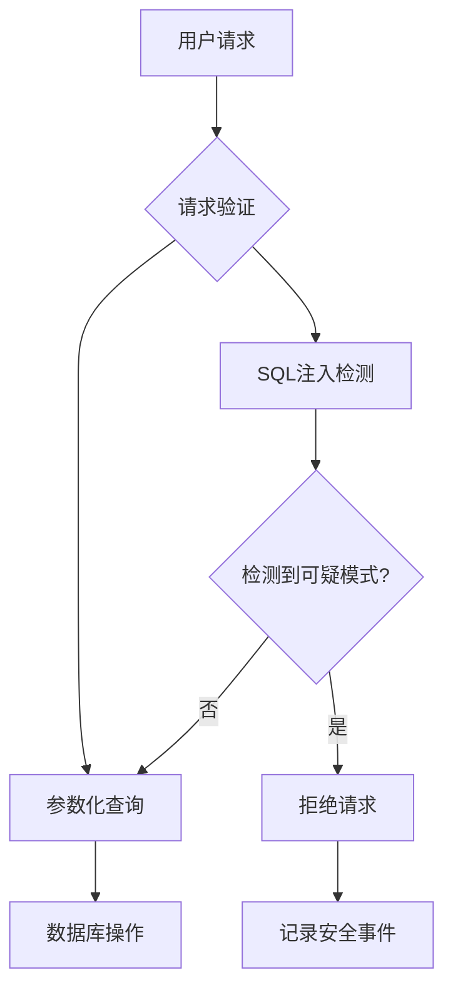
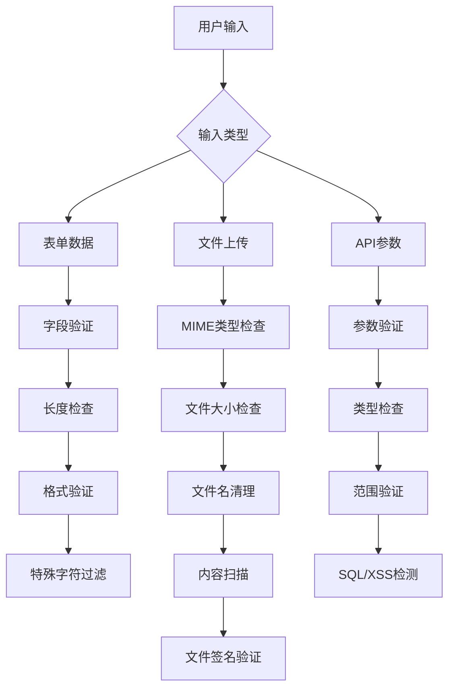

# 安全防护

<cite>
**本文档引用的文件**  
- [security.middleware.ts](file://k.yyup.com/server/src/middlewares/security.middleware.ts)
- [security.service.ts](file://k.yyup.com/server/src/services/security.service.ts)
- [data-import-security.middleware.ts](file://k.yyup.com/server/src/middlewares/data-import-security.middleware.ts)
- [oss-security.middleware.ts](file://k.yyup.com/server/src/middlewares/oss-security.middleware.ts)
- [tenant-security.middleware.ts](file://k.yyup.com/server/src/middlewares/tenant-security.middleware.ts)
- [file-security.ts](file://k.yyup.com/server/src/utils/file-security.ts)
</cite>

## 目录
1. [XSS攻击防范策略](#xss攻击防范策略)
2. [CSRF防护机制](#csrf防护机制)
3. [SQL注入防护](#sql注入防护)
4. [安全头设置](#安全头设置)
5. [输入验证和过滤机制](#输入验证和过滤机制)
6. [安全漏洞扫描报告解读](#安全漏洞扫描报告解读)

## XSS攻击防范策略

k.yyupgame项目通过多层防护机制来防止跨站脚本（XSS）攻击。系统使用Helmet库配置内容安全策略（CSP），限制资源加载来源，防止恶意脚本执行。CSP策略规定默认资源只能从同源加载，脚本只能从同源和内联执行，样式表只能从同源和内联加载，图片可以从同源、data URI和HTTPS来源加载。

在输入验证方面，系统对所有用户输入进行严格的验证和清理。使用express-validator库对请求体、查询参数和路径参数进行验证，对字符串输入进行转义处理，防止HTML和JavaScript代码注入。对于文件上传，系统检查文件的MIME类型和扩展名，只允许安全的文件类型上传。

输出编码方面，系统在渲染用户生成内容时自动进行HTML实体编码，确保特殊字符如<、>、&等被正确转义。此外，系统设置了X-XSS-Protection头，启用浏览器的XSS过滤功能，进一步增强防护能力。

**Section sources**
- [security.middleware.ts](file://k.yyup.com/server/src/middlewares/security.middleware.ts#L124-L144)

## CSRF防护机制

k.yyupgame项目采用多种机制来防止跨站请求伪造（CSRF）攻击。系统通过在关键操作中使用CSRF令牌来验证请求的合法性。每个用户会话都会生成唯一的CSRF令牌，该令牌需要包含在敏感操作的请求中。

对于API请求，系统使用基于JWT的认证机制，其中包含防CSRF的声明。同时，系统设置了严格的CORS策略，只允许受信任的前端域名访问API，防止第三方网站发起跨域请求。在表单提交场景中，系统要求包含CSRF令牌作为隐藏字段，服务器端会验证该令牌的有效性。

此外，系统还实现了自定义的租户安全中间件，通过验证租户令牌（x-tenant-token）来确保请求来自合法的租户上下文。这种基于MD5的租户令牌机制为多租户环境提供了额外的保护层，防止跨租户的CSRF攻击。

**Section sources**
- [security.middleware.ts](file://k.yyup.com/server/src/middlewares/security.middleware.ts#L15-L59)
- [tenant-security.middleware.ts](file://k.yyup.com/server/src/middlewares/tenant-security.middleware.ts#L67-L99)

## SQL注入防护

项目采用多层次的SQL注入防护策略。首先，系统使用Sequelize ORM框架进行数据库操作，该框架自动对查询参数进行参数化处理，从根本上防止SQL注入。所有数据库查询都通过ORM的方法调用，而不是直接拼接SQL字符串。

其次，系统实现了专门的SQL注入检测中间件，该中间件会检查请求中的危险模式，如SQL关键字（SELECT、INSERT、UPDATE、DELETE等）、逻辑操作符（AND、OR）以及常见的注入技术。当检测到可疑模式时，系统会立即拒绝请求并记录安全事件。

在输入验证层面，系统对所有用户输入进行清理和验证，对字符串输入进行转义处理。对于动态查询，系统使用白名单机制限制可查询的字段和操作类型，避免用户能够控制查询结构。此外，数据库连接使用最小权限原则，每个应用账户只拥有完成其功能所需的最低权限。

**Diagram sources**
- [security.middleware.ts](file://k.yyup.com/server/src/middlewares/security.middleware.ts#L149-L196)
- [security.service.ts](file://k.yyup.com/server/src/services/security.service.ts#L6-L11)

**Section sources**
- [security.middleware.ts](file://k.yyup.com/server/src/middlewares/security.middleware.ts#L149-L196)

## 安全头设置

k.yyupgame项目配置了全面的HTTP安全头来增强Web应用的安全性。系统使用Helmet库自动设置多个安全头，并通过自定义中间件添加额外的安全配置。

Strict-Transport-Security（HSTS）头设置为31536000秒（1年），并包含子域名，强制浏览器使用HTTPS连接，防止SSL剥离攻击。X-Content-Type-Options头设置为nosniff，防止MIME类型嗅探攻击，确保浏览器严格按照声明的MIME类型处理内容。

X-Frame-Options头设置为DENY，防止页面被嵌入到iframe中，抵御点击劫持攻击。X-XSS-Protection头启用浏览器的XSS过滤功能。Referrer-Policy设置为strict-origin-when-cross-origin，平衡隐私保护和功能需求。

此外，系统还设置了CORS头，严格控制跨域请求的来源、方法和头部，只允许预定义的前端域名访问API。服务器信息头（X-Powered-By）被移除，减少攻击者可获取的系统信息。

**Section sources**
- [security.middleware.ts](file://k.yyup.com/server/src/middlewares/security.middleware.ts#L287-L314)

## 输入验证和过滤机制

项目建立了完善的输入验证和过滤机制来防止恶意数据输入。系统使用express-validator库对所有API端点的输入进行验证，包括请求体、查询参数和路径参数。验证规则包括数据类型检查、长度限制、格式验证（如邮箱格式）和范围检查。

对于文件上传，系统实现了多层安全检查。首先检查文件的MIME类型和扩展名，只允许预定义的安全类型。然后检查文件大小，限制单个文件不超过10MB。文件名会被清理，移除潜在危险的字符，防止路径遍历攻击。

系统还实现了专门的数据导入安全中间件，对批量数据导入操作进行风险评估和权限检查。根据导入数据的数量和类型评估风险等级，高风险操作需要管理员权限。同时实施频率限制，防止滥用。

在内容安全方面，FileSecurityChecker工具类会对上传文件进行深度检查，包括文件签名分析、恶意代码模式扫描和哈希值计算。这种综合性的检查机制确保了上传文件的安全性。

**Diagram sources**
- [security.middleware.ts](file://k.yyup.com/server/src/middlewares/security.middleware.ts#L79-L98)
- [file-security.ts](file://k.yyup.com/server/src/utils/file-security.ts#L8-L256)
- [data-import-security.middleware.ts](file://k.yyup.com/server/src/middlewares/data-import-security.middleware.ts#L17-L262)

**Section sources**
- [security.middleware.ts](file://k.yyup.com/server/src/middlewares/security.middleware.ts#L79-L98)
- [file-security.ts](file://k.yyup.com/server/src/utils/file-security.ts#L8-L256)

## 安全漏洞扫描报告解读

k.yyupgame项目内置了安全监控和漏洞扫描功能，通过SecurityService类提供全面的安全状态评估。安全漏洞扫描报告包含多个关键指标，帮助开发者理解系统的安全状况。

报告中的安全概览部分显示了整体安全评分（0-100分）、威胁等级（低、中、高、严重）和活跃威胁数量。安全评分基于活跃威胁和未修复漏洞的数量计算，每发现一个威胁扣10分，每个漏洞扣2分。威胁等级根据威胁和漏洞的数量确定，5个以上威胁或20个以上漏洞为"严重"等级。

漏洞列表详细记录了所有已发现的安全漏洞，包括漏洞类型、严重程度、状态（开放、确认、修复中、已修复）和发现时间。开发者应优先处理严重程度为"高"或"严重"的漏洞。系统会根据当前安全状态生成修复建议，如处理活跃威胁、修复系统漏洞、加强安全配置等。

对于扫描结果的解读，建议开发者重点关注：
1. 活跃威胁：立即调查和处理，防止攻击扩大
2. 高风险漏洞：优先修复，减少攻击面
3. 频繁出现的攻击模式：分析根本原因，加强相应防护
4. 安全建议：实施推荐的安全改进措施

系统还提供了安全建议功能，基于当前安全状态生成具体的改进措施，包括启用多因素认证、加强密码策略等，帮助开发者持续提升系统安全性。

**Section sources**
- [security.service.ts](file://k.yyup.com/server/src/services/security.service.ts#L13-L437)