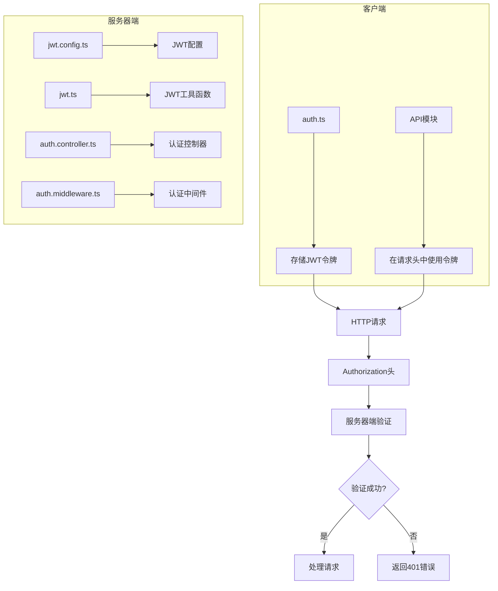
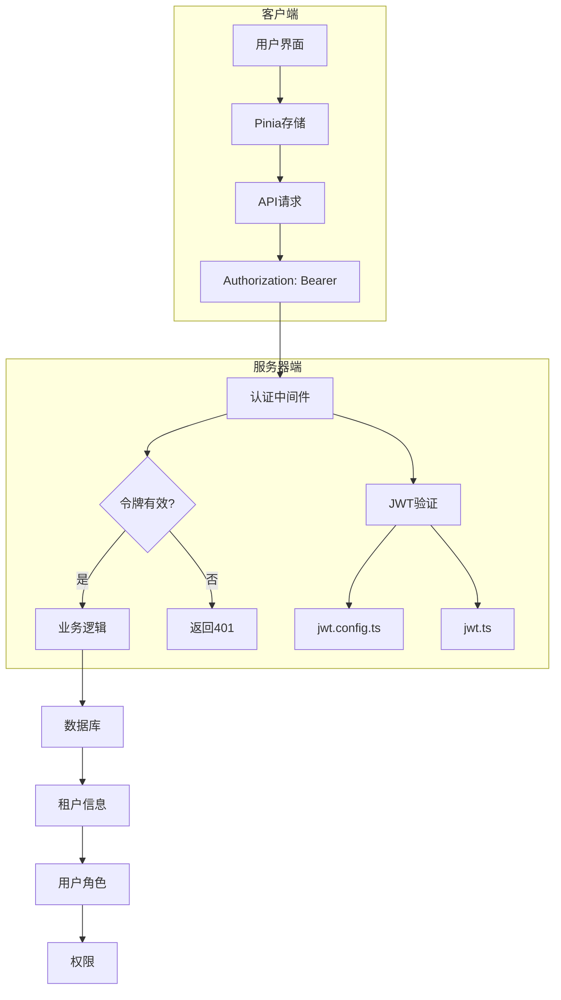
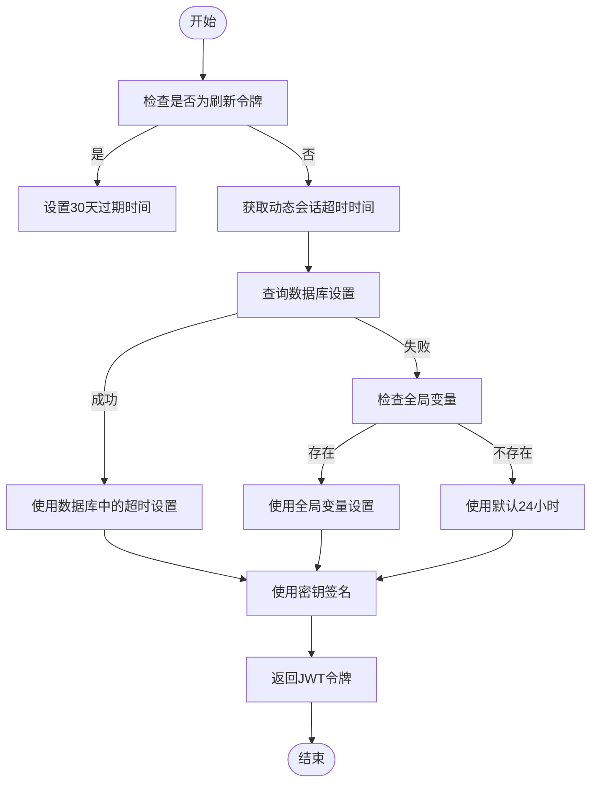
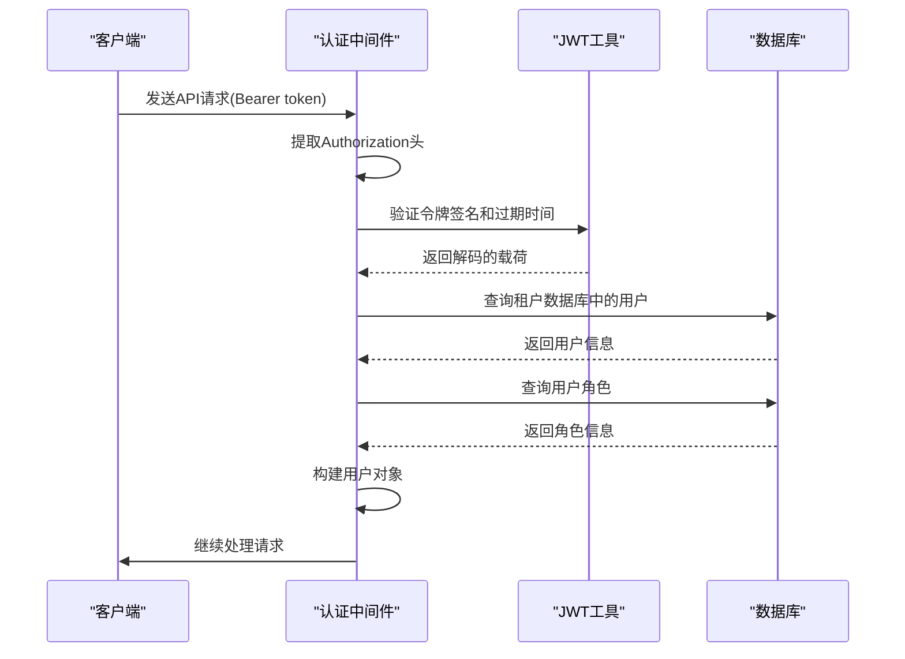
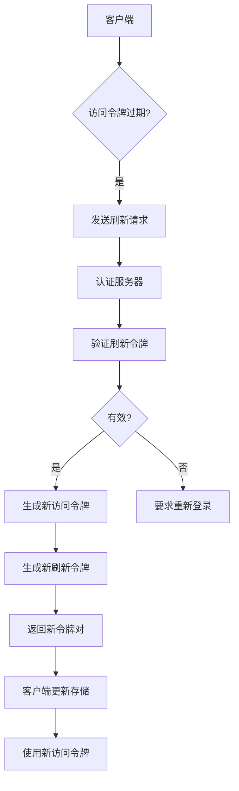
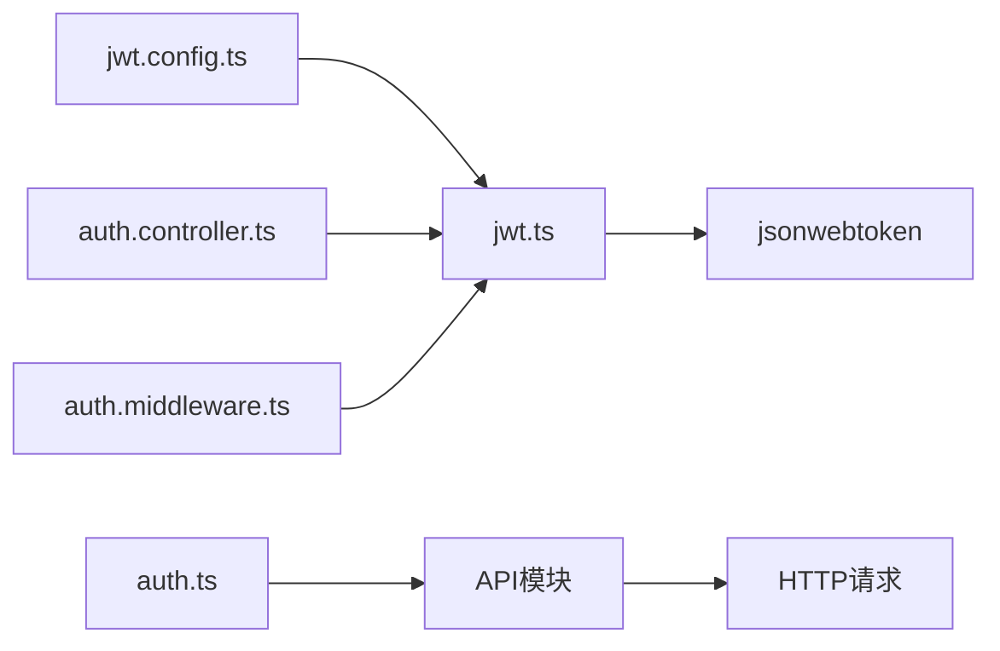

# JWT安全

<cite>
**本文档引用的文件**
- [jwt.config.ts](file://k.yyup.com/server/src/config/jwt.config.ts)
- [jwt.ts](file://k.yyup.com/server/src/utils/jwt.ts)
- [auth.controller.ts](file://k.yyup.com/server/src/controllers/auth.controller.ts)
- [auth.controller.orm.ts](file://k.yyup.com/server/controllers/sql-backup/auth.controller.orm.ts)
- [auth.ts](file://k.yyup.com/client/src/store/modules/auth.ts)
- [auth-shared-pool-example.middleware.ts](file://auth-shared-pool-example.middleware.ts)
</cite>

## 目录
1. [简介](#简介)
2. [项目结构](#项目结构)
3. [核心组件](#核心组件)
4. [架构概述](#架构概述)
5. [详细组件分析](#详细组件分析)
6. [依赖分析](#依赖分析)
7. [性能考虑](#性能考虑)
8. [故障排除指南](#故障排除指南)
9. [结论](#结论)
10. [附录](#附录)（如有必要）

## 简介
本文档详细介绍了k.yyupgame项目中JWT令牌的安全实现机制。文档涵盖了JWT令牌的生成、验证、刷新策略、密钥管理以及防止令牌劫持的安全措施。通过分析服务器端和客户端的实现，展示了完整的JWT安全架构，包括访问令牌和刷新令牌的处理、动态会话超时配置、租户系统集成以及最佳安全实践。

## 项目结构
k.yyupgame项目的JWT实现主要分布在服务器端的`src/utils`和`src/config`目录中，以及客户端的`src/store/modules`目录中。服务器端负责JWT令牌的生成和验证，而客户端负责存储和使用这些令牌。项目采用TypeScript编写，使用Express框架处理HTTP请求，并通过Pinia进行客户端状态管理。

**图表来源**
- [jwt.config.ts](file://k.yyup.com/server/src/config/jwt.config.ts)
- [jwt.ts](file://k.yyup.com/server/src/utils/jwt.ts)
- [auth.ts](file://k.yyup.com/client/src/store/modules/auth.ts)

**本节来源**
- [jwt.config.ts](file://k.yyup.com/server/src/config/jwt.config.ts)
- [jwt.ts](file://k.yyup.com/server/src/utils/jwt.ts)
- [auth.ts](file://k.yyup.com/client/src/store/modules/auth.ts)

## 核心组件
k.yyupgame项目中的JWT安全实现包含几个核心组件：JWT配置管理、令牌生成与验证工具、认证控制器和中间件、以及客户端令牌存储。这些组件协同工作，确保用户会话的安全性和可靠性。服务器端使用`jsonwebtoken`库生成和验证JWT令牌，而客户端使用Pinia存储库在浏览器中安全地存储令牌。

**本节来源**
- [jwt.config.ts](file://k.yyup.com/server/src/config/jwt.config.ts)
- [jwt.ts](file://k.yyup.com/server/src/utils/jwt.ts)
- [auth.controller.ts](file://k.yyup.com/server/src/controllers/auth.controller.ts)
- [auth.ts](file://k.yyup.com/client/src/store/modules/auth.ts)

## 架构概述
k.yyupgame的JWT安全架构采用分层设计，将配置、工具函数、业务逻辑和客户端存储分离。服务器端负责生成和验证JWT令牌，而客户端负责存储和在API请求中使用这些令牌。该架构支持动态会话超时配置，允许管理员通过系统设置调整会话超时时间。此外，系统还实现了刷新令牌机制，以提供长期的用户会话而无需频繁重新登录。

**图表来源**
- [jwt.config.ts](file://k.yyup.com/server/src/config/jwt.config.ts)
- [jwt.ts](file://k.yyup.com/server/src/utils/jwt.ts)
- [auth.controller.ts](file://k.yyup.com/server/src/controllers/auth.controller.ts)
- [auth.ts](file://k.yyup.com/client/src/store/modules/auth.ts)

## 详细组件分析
### JWT令牌生成
k.yyupgame项目中的JWT令牌生成过程遵循标准的JWT规范，包含头部、载荷和签名三个部分。服务器端使用`jsonwebtoken`库生成令牌，其中头部指定算法为HS256，载荷包含用户ID、用户名等信息，签名使用预定义的密钥进行HMAC SHA256加密。

#### 令牌生成流程

**图表来源**
- [jwt.config.ts](file://k.yyup.com/server/src/config/jwt.config.ts)
- [jwt.ts](file://k.yyup.com/server/src/utils/jwt.ts)

**本节来源**
- [jwt.config.ts](file://k.yyup.com/server/src/config/jwt.config.ts)
- [jwt.ts](file://k.yyup.com/server/src/utils/jwt.ts)

### 令牌验证流程
令牌验证流程是k.yyupgame安全架构的核心部分。当客户端发送带有JWT令牌的请求时，服务器端的认证中间件会提取并验证该令牌。验证过程包括检查签名的有效性、确认令牌未过期，并在多租户环境中验证用户与租户的关联。

#### 令牌验证流程

**图表来源**
- [auth-shared-pool-example.middleware.ts](file://auth-shared-pool-example.middleware.ts)
- [jwt.ts](file://k.yyup.com/server/src/utils/jwt.ts)

**本节来源**
- [auth-shared-pool-example.middleware.ts](file://auth-shared-pool-example.middleware.ts)
- [jwt.ts](file://k.yyup.com/server/src/utils/jwt.ts)

### 令牌刷新策略
k.yyupgame实现了安全的令牌刷新机制，使用独立的刷新令牌来获取新的访问令牌。刷新令牌的有效期为30天，比访问令牌长得多，允许用户在长时间内保持登录状态而无需重新输入凭据。

#### 令牌刷新流程

**图表来源**
- [auth.controller.orm.ts](file://k.yyup.com/server/controllers/sql-backup/auth.controller.orm.ts)
- [auth.ts](file://k.yyup.com/client/src/api/modules/auth.ts)

**本节来源**
- [auth.controller.orm.ts](file://k.yyup.com/server/controllers/sql-backup/auth.controller.orm.ts)
- [auth.ts](file://k.yyup.com/client/src/api/modules/auth.ts)

### JWT密钥管理
k.yyupgame项目采用环境变量来管理JWT密钥，确保密钥不会硬编码在源代码中。系统首先尝试从环境变量`JWT_SECRET`获取密钥，如果未设置则使用默认值。这种设计允许在不同环境中使用不同的密钥，提高了安全性。

#### 密钥管理最佳实践
- **环境变量存储**：JWT密钥通过环境变量配置，避免在代码中暴露
- **默认值保护**：即使没有配置环境变量，系统也有安全的默认值
- **密钥轮换**：通过重启服务并更新环境变量实现密钥轮换
- **安全存储**：生产环境中使用密钥管理服务存储密钥

**本节来源**
- [jwt.config.ts](file://k.yyup.com/server/src/config/jwt.config.ts)

### 防止令牌劫持
k.yyupgame实施了多项措施来防止JWT令牌被劫持，包括强制使用HTTPS、设置HttpOnly Cookie以及CSRF保护。这些措施共同作用，最大限度地降低了令牌被窃取的风险。

#### 安全措施
- **HTTPS强制使用**：所有API端点都要求通过HTTPS访问
- **HttpOnly Cookie**：在可能的情况下，将令牌存储在HttpOnly Cookie中，防止JavaScript访问
- **CSRF保护**：对于关键操作，使用CSRF令牌进行额外验证
- **短有效期**：访问令牌的有效期限制为24小时，减少泄露后的风险窗口

**本节来源**
- [auth-shared-pool-example.middleware.ts](file://auth-shared-pool-example.middleware.ts)
- [auth.ts](file://k.yyup.com/client/src/store/modules/auth.ts)

### 安全漏洞防范
k.yyupgame项目采取了多种措施来防范常见的JWT相关安全漏洞，如算法混淆攻击和密钥泄露。

#### 算法混淆防范
系统在验证JWT令牌时明确指定了允许的算法，防止攻击者将算法从HS256更改为none。通过在验证函数中固定使用HS256算法，确保了即使令牌头部声明使用其他算法，系统也会坚持使用预定义的算法进行验证。

#### 密钥泄露防范
通过使用环境变量存储密钥、定期轮换密钥以及限制密钥的访问权限，系统有效防范了密钥泄露的风险。此外，系统还实现了动态会话超时功能，允许管理员根据安全策略调整会话持续时间。

**本节来源**
- [jwt.config.ts](file://k.yyup.com/server/src/config/jwt.config.ts)
- [jwt.ts](file://k.yyup.com/server/src/utils/jwt.ts)

## 依赖分析
k.yyupgame的JWT实现依赖于几个关键的外部库和内部模块。主要依赖包括`jsonwebtoken`库用于JWT的生成和验证，`express`框架用于HTTP请求处理，以及`pinia`用于客户端状态管理。这些依赖关系通过项目的`package.json`文件进行管理，确保了版本的一致性和可重复性。

**图表来源**
- [package.json](file://k.yyup.com/package.json)
- [jwt.config.ts](file://k.yyup.com/server/src/config/jwt.config.ts)

**本节来源**
- [package.json](file://k.yyup.com/package.json)
- [jwt.config.ts](file://k.yyup.com/server/src/config/jwt.config.ts)

## 性能考虑
k.yyupgame的JWT实现考虑了性能因素，特别是在令牌验证方面。通过使用对称加密算法HS256而不是非对称算法，系统实现了快速的签名验证，减少了CPU开销。此外，系统避免了在每次请求时查询数据库验证令牌，而是依赖JWT的自包含特性，只有在需要获取用户详细信息时才查询数据库。

对于多租户环境，系统使用共享连接池来提高数据库查询效率，减少了建立新连接的开销。动态会话超时功能虽然需要查询数据库，但通过合理的缓存策略可以减少对性能的影响。

## 故障排除指南
当遇到JWT相关问题时，可以按照以下步骤进行排查：

1. **检查令牌格式**：确保Authorization头的格式为`Bearer <token>`，且令牌由三部分组成，用点号分隔
2. **验证密钥配置**：确认环境变量`JWT_SECRET`已正确设置，且服务器端和客户端使用相同的密钥
3. **检查过期时间**：确认令牌未过期，可以通过解码令牌查看`exp`声明
4. **验证算法**：确保生成和验证使用相同的算法（HS256）
5. **检查租户配置**：在多租户环境中，确认用户已正确绑定到租户

**本节来源**
- [jwt.config.ts](file://k.yyup.com/server/src/config/jwt.config.ts)
- [jwt.ts](file://k.yyup.com/server/src/utils/jwt.ts)
- [auth-shared-pool-example.middleware.ts](file://auth-shared-pool-example.middleware.ts)

## 结论
k.yyupgame项目实现了全面的JWT安全机制，涵盖了令牌的生成、验证、刷新和保护。通过合理的架构设计和安全实践，系统提供了安全可靠的用户认证功能。动态会话超时配置和多租户支持使得系统既灵活又安全。建议定期轮换JWT密钥，监控异常登录尝试，并持续关注JWT安全的最佳实践，以应对不断变化的安全威胁。

## 附录
### JWT配置参数
| 参数 | 描述 | 默认值 |
|------|------|--------|
| JWT_SECRET | JWT签名密钥 | kindergarten-enrollment-secret |
| TOKEN_EXPIRE | 访问令牌过期时间 | 24h |
| REFRESH_TOKEN_EXPIRE | 刷新令牌过期时间 | 30d |
| TOKEN_TYPES | 令牌类型定义 | access, refresh, reset-password |

**本节来源**
- [jwt.config.ts](file://k.yyup.com/server/src/config/jwt.config.ts)