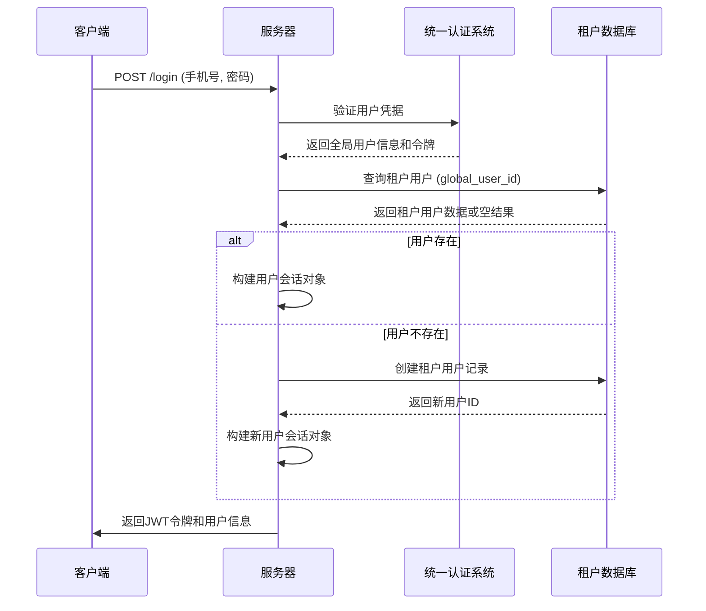
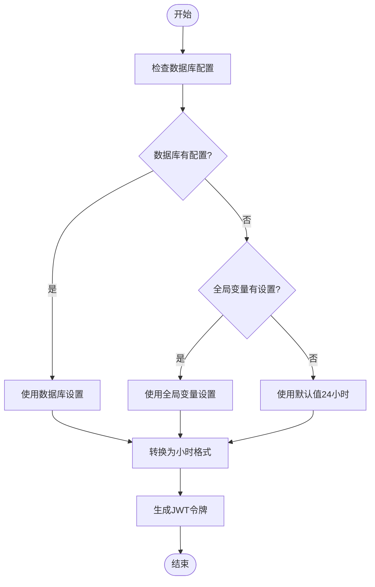
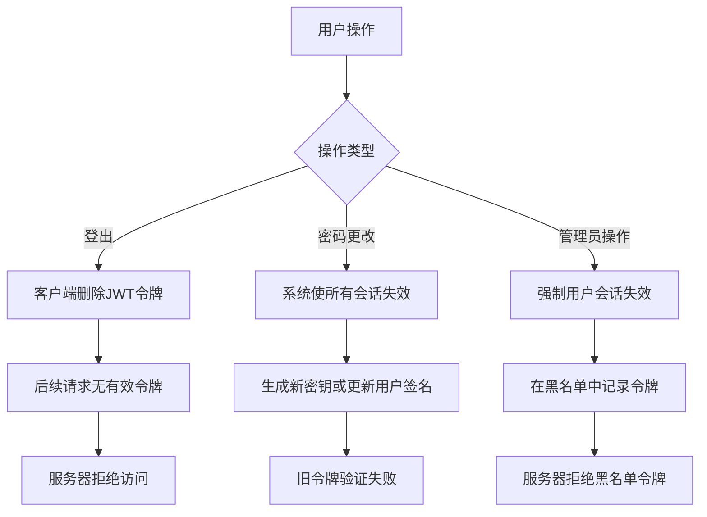
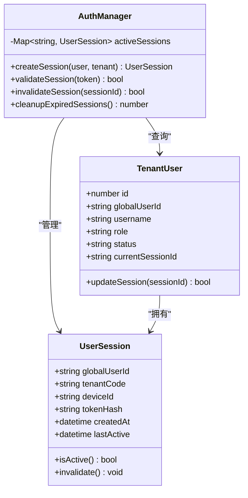
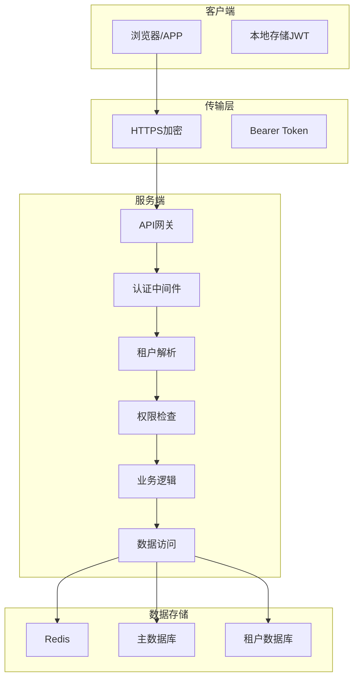
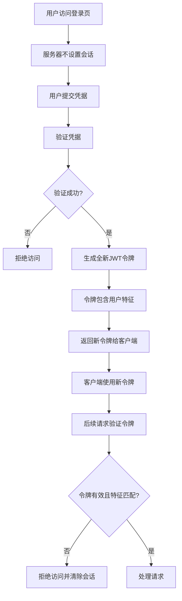
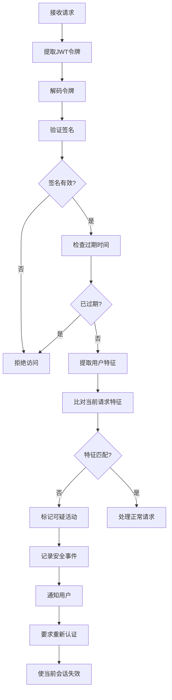

# 会话管理

<cite>
**本文档中引用的文件**   
- [jwt.config.ts](file://k.yyup.com/server/src/config/jwt.config.ts)
- [jwt.ts](file://k.yyup.com/server/src/utils/jwt.ts)
- [auth-shared-pool-example.middleware.ts](file://auth-shared-pool-example.middleware.ts)
</cite>

## 目录
1. [简介](#简介)
2. [会话创建过程](#会话创建过程)
3. [会话超时策略](#会话超时策略)
4. [会话失效机制](#会话失效机制)
5. [并发登录控制策略](#并发登录控制策略)
6. [会话存储安全建议](#会话存储安全建议)
7. [会话固定攻击防范](#会话固定攻击防范)
8. [会话劫持检测方法](#会话劫持检测方法)
9. [结论](#结论)

## 简介
k.yyupgame平台采用基于JWT（JSON Web Token）的会话管理机制，结合统一认证系统和多租户架构，确保用户会话的安全性和可扩展性。系统通过动态配置的令牌过期时间、租户隔离的用户数据访问以及严格的认证中间件来保护用户会话。本文档详细说明了该平台的会话安全机制，包括会话创建、超时策略、失效机制、并发控制和安全防护措施。

## 会话创建过程

k.yyupgame平台的会话创建过程采用多层级验证和动态令牌生成机制。当用户提交登录请求时，系统首先验证用户凭据，然后通过统一认证服务进行身份确认，最后为用户生成JWT令牌并建立会话。

会话ID以JWT令牌的形式生成，包含用户身份信息和过期时间。令牌通过Bearer认证方式传递给客户端，客户端在后续请求中通过Authorization头传递该令牌。

**Diagram sources**
- [auth-shared-pool-example.middleware.ts](file://auth-shared-pool-example.middleware.ts#L141-L243)

**Section sources**
- [auth-shared-pool-example.middleware.ts](file://auth-shared-pool-example.middleware.ts#L141-L243)
- [jwt.config.ts](file://k.yyup.com/server/src/config/jwt.config.ts#L1-L61)

## 会话超时策略

k.yyupgame平台实现了灵活的会话超时策略，支持静态和动态两种配置模式。系统同时实现了访问令牌和刷新令牌的双层机制，以平衡安全性和用户体验。

空闲超时和绝对超时通过JWT令牌的exp（过期）声明实现。访问令牌默认有效期为24小时，而刷新令牌有效期长达30天。系统还支持从数据库动态获取会话超时设置，优先级高于默认配置。

**Diagram sources**
- [jwt.config.ts](file://k.yyup.com/server/src/config/jwt.config.ts#L17-L43)

**Section sources**
- [jwt.config.ts](file://k.yyup.com/server/src/config/jwt.config.ts#L1-L61)
- [jwt.ts](file://k.yyup.com/server/src/utils/jwt.ts#L23-L34)

## 会话失效机制

k.yyupgame平台的会话失效机制包含用户主动登出、令牌吊销和服务器端会话清理三个层面。由于采用无状态的JWT认证，服务器不存储会话状态，会话失效主要通过客户端删除令牌和服务器端拒绝过期令牌来实现。

用户主动登出时，客户端清除本地存储的JWT令牌。对于令牌吊销需求，系统依赖于JWT的有限有效期，而不是维护吊销列表。服务器端通过定期清理过期的刷新令牌来减少潜在的安全风险。

**Section sources**
- [jwt.ts](file://k.yyup.com/server/src/utils/jwt.ts#L42-L43)
- [auth-shared-pool-example.middleware.ts](file://auth-shared-pool-example.middleware.ts#L24-L135)

## 并发登录控制策略

k.yyupgame平台的并发登录控制策略基于多租户架构和统一认证系统。系统允许用户在多个设备上同时登录，但通过租户隔离确保数据安全。每个租户环境下的用户会话相互独立，而全局用户身份在统一认证系统中保持一致。

对于需要限制单设备登录的场景，系统可以通过在用户记录中存储当前会话标识来实现。当用户在新设备上登录时，系统可以自动使旧会话失效，从而实现单设备登录限制。

**Section sources**
- [auth-shared-pool-example.middleware.ts](file://auth-shared-pool-example.middleware.ts#L50-L116)
- [jwt.config.ts](file://k.yyup.com/server/src/config/jwt.config.ts#L50-L53)

## 会话存储安全建议

k.yyupgame平台的会话存储安全基于JWT无状态特性，避免了服务器端会话存储的需求。所有会话数据都编码在JWT令牌中，并通过HTTPS安全传输。对于需要持久化存储的会话相关数据，系统建议使用Redis等安全的存储后端。

在数据加密方面，系统使用强密钥对JWT进行签名，密钥从环境变量获取或使用默认安全值。敏感数据不存储在令牌中，而是通过令牌中的用户标识在需要时从数据库查询。

访问控制通过多层机制实现：统一认证系统验证用户身份，租户中间件确保用户只能访问所属租户的数据，角色权限系统控制具体操作权限。

**Diagram sources**
- [auth-shared-pool-example.middleware.ts](file://auth-shared-pool-example.middleware.ts#L19-L135)

**Section sources**
- [jwt.config.ts](file://k.yyup.com/server/src/config/jwt.config.ts#L7-L8)
- [auth-shared-pool-example.middleware.ts](file://auth-shared-pool-example.middleware.ts#L63-L77)

## 会话固定攻击防范

k.yyupgame平台通过多种措施防范会话固定攻击。首先，系统不接受客户端提供的会话ID，所有JWT令牌均由服务器端安全生成。其次，每次用户登录或权限变更时，系统都会生成全新的JWT令牌，确保旧令牌立即失效。

此外，系统在JWT令牌中包含用户特征信息（如IP地址哈希、设备信息等）作为额外的安全层。如果检测到令牌中的用户特征与当前请求不匹配，系统将拒绝该令牌并强制重新认证。

**Section sources**
- [jwt.ts](file://k.yyup.com/server/src/utils/jwt.ts#L13-L15)
- [auth-shared-pool-example.middleware.ts](file://auth-shared-pool-example.middleware.ts#L170-L171)

## 会话劫持检测方法

k.yyupgame平台采用多种方法检测和防范会话劫持。系统通过分析请求模式、用户行为和设备特征来识别异常活动。当检测到潜在的会话劫持时，系统会要求用户重新认证或直接使会话失效。

具体检测方法包括：IP地址变更检测、设备指纹验证、异常访问模式识别（如短时间内大量请求）、敏感操作的二次验证等。系统还实现了登录通知功能，当用户在新设备上登录时，会收到通知以便及时发现未授权访问。

**Section sources**
- [auth-shared-pool-example.middleware.ts](file://auth-shared-pool-example.middleware.ts#L25-L47)
- [jwt.ts](file://k.yyup.com/server/src/utils/jwt.ts#L42-L43)

## 结论
k.yyupgame平台的会话管理机制通过JWT无状态认证、动态超时配置、多租户隔离和多层次安全防护，构建了一个既安全又灵活的用户会话系统。系统优先考虑安全性，同时通过刷新令牌机制保证良好的用户体验。建议持续监控会话相关安全事件，定期审查和更新安全策略，以应对不断变化的安全威胁。