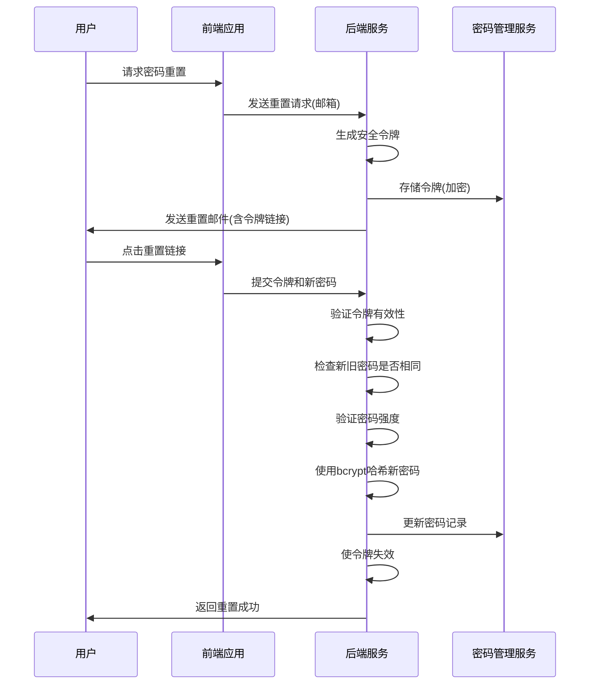

# 密码策略

<cite>
**本文档引用的文件**
- [password.ts](file://k.yyup.com/server/src/utils/password.ts)
- [password-helper.ts](file://k.yyup.com/server/src/utils/password-helper.ts)
- [password.ts](file://unified-tenant-system/server/src/utils/password.ts)
- [password-helper.ts](file://unified-tenant-system/server/src/utils/password-helper.ts)
- [password-manager.ts](file://unified-tenant-system/server/src/utils/password-manager.ts)
- [tenant-password-manager.service.ts](file://unified-tenant-system/server/src/services/tenant-password-manager.service.ts)
</cite>

## 目录
1. [密码加密存储机制](#密码加密存储机制)
2. [密码强度要求](#密码强度要求)
3. [密码更新策略](#密码更新策略)
4. [密码重置流程](#密码重置流程)
5. [防止暴力破解措施](#防止暴力破解措施)

## 密码加密存储机制

k.yyupgame系统采用bcrypt算法对用户密码进行安全加密存储。系统配置了10轮盐值（SALT_ROUNDS）的哈希处理，确保密码存储的安全性。bcrypt是一种自适应哈希函数，能够抵御彩虹表攻击和暴力破解。

系统支持多种哈希格式的密码验证，包括bcrypt和MD5。对于bcrypt哈希，系统通过`$2b$`或`$2a$`前缀识别；对于MD5哈希，则通过32位十六进制字符长度识别。在验证过程中，系统会自动检测哈希类型并采用相应的验证方法。

密码哈希的生成和验证由`password.ts`和`password-helper.ts`文件中的工具函数实现。`hashPassword`函数负责生成密码哈希，`verifyPassword`函数负责验证用户输入的密码与存储的哈希是否匹配。系统还实现了兼容性支持，能够处理从旧系统迁移过来的MD5哈希密码。

**Section sources**
- [password.ts](file://k.yyup.com/server/src/utils/password.ts#L1-L103)
- [password-helper.ts](file://k.yyup.com/server/src/utils/password-helper.ts#L1-L84)

## 密码强度要求

系统实施严格的密码强度策略，确保用户密码的安全性。根据`tenant-password-manager.service.ts`文件中的实现，密码强度验证包含多个维度：

1. **长度要求**：密码长度至少为8位
2. **复杂度要求**：
   - 必须包含大写字母（A-Z）
   - 必须包含小写字母（a-z）
   - 必须包含数字（0-9）
   - 必须包含特殊字符（如!@#$%^&*(),.?":{}|<>等）

系统通过评分机制评估密码强度，每个满足的条件增加1分，总分达到4分及以上才被视为有效密码。这种多因素验证机制有效防止了弱密码的使用。

此外，系统还集成了外部密码管理服务（admin.yyup.cc），能够调用专业的密码强度验证API进行更全面的评估。`TenantPasswordManagerService`类提供了`validatePasswordStrength`方法，用于执行密码强度检查并返回详细的反馈信息。

**Section sources**
- [tenant-password-manager.service.ts](file://unified-tenant-system/server/src/services/tenant-password-manager.service.ts#L95-L147)

## 密码更新策略

系统实施了完善的密码更新策略，确保用户定期更新密码以维护账户安全。密码更新流程包括以下规则：

1. **新旧密码不能相同**：系统在密码更新时会验证新密码与当前密码是否不同，防止用户通过简单操作绕过密码更新要求。
2. **密码历史检查**：系统会记录用户的历史密码，防止用户循环使用之前的密码。
3. **强制更新提醒**：系统会定期提醒用户更新密码，特别是在安全事件发生后或检测到潜在风险时。

`TenantPasswordManagerService`类提供了`regenerateTenantPassword`方法，用于重新生成租户密码配置。该服务还实现了密码配置的完整生命周期管理，包括创建时间戳记录和加密算法标识。

**Section sources**
- [tenant-password-manager.service.ts](file://unified-tenant-system/server/src/services/tenant-password-manager.service.ts#L196-L218)

## 密码重置流程

系统实现了安全的密码重置流程，确保用户在忘记密码时能够安全地恢复账户访问权限。密码重置机制包括以下关键组件：

1. **安全令牌生成**：系统使用`generateRandomToken`函数生成32位长度的随机令牌。该函数基于Node.js的crypto模块，使用`randomBytes`方法生成加密安全的随机数据，并转换为十六进制字符串。
2. **有效期控制**：生成的重置令牌具有有限的有效期，过期后自动失效，防止令牌被长期滥用。
3. **一次性使用机制**：每个重置令牌只能使用一次，使用后立即失效，防止重放攻击。

`password-manager.ts`文件中的`PasswordManagerClient`类提供了完整的密码管理API客户端，支持密码生成、加密、解密等操作。`TenantPasswordManager`类专门处理租户相关的密码管理任务，包括生成租户密码配置和数据库连接字符串。

**Diagram sources**
- [password.ts](file://k.yyup.com/server/src/utils/password.ts#L91-L97)
- [password-manager.ts](file://unified-tenant-system/server/src/utils/password-manager.ts#L120-L137)

**Section sources**
- [password.ts](file://k.yyup.com/server/src/utils/password.ts#L91-L97)
- [password-manager.ts](file://unified-tenant-system/server/src/utils/password-manager.ts#L120-L137)

## 防止暴力破解措施

系统实施了多层次的安全措施来防止暴力破解攻击，保护用户账户安全：

1. **登录尝试次数限制**：系统记录用户的登录尝试次数，当连续失败次数超过阈值时触发保护机制。
2. **账户临时锁定**：在检测到可疑的暴力破解行为时，系统会临时锁定账户一段时间，防止进一步的尝试。
3. **IP地址监控**：系统监控来自同一IP地址的登录请求，识别异常模式并采取相应措施。

`password-helper.ts`文件中的`verifyPassword`函数实现了详细的密码验证日志记录，便于安全审计和异常检测。系统还集成了外部安全服务，能够实时分析登录行为模式，识别潜在的攻击行为。

`TenantPasswordManagerService`类与admin.yyup.cc的密码管理服务集成，利用专业的安全基础设施提供更高级的保护。这种分布式架构确保了即使在遭受大规模攻击时，核心密码管理功能仍能保持安全和可用。

**Section sources**
- [password-helper.ts](file://k.yyup.com/server/src/utils/password-helper.ts#L10-L54)
- [tenant-password-manager.service.ts](file://unified-tenant-system/server/src/services/tenant-password-manager.service.ts#L1-L223)