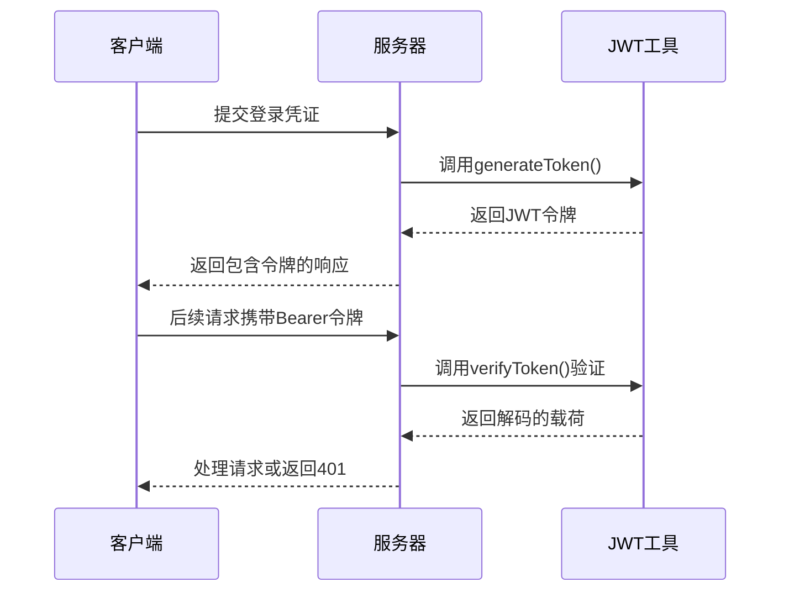
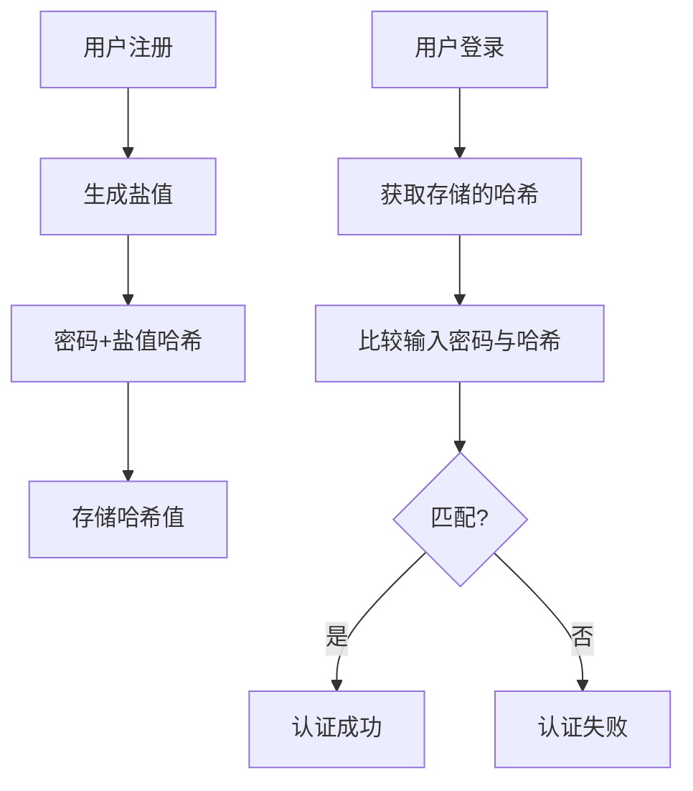

# 认证安全

<cite>
**本文档引用的文件**  
- [jwt.config.ts](file://k.yyup.com/server/src/config/jwt.config.ts)
- [jwt.ts](file://k.yyup.com/server/src/utils/jwt.ts)
- [bcrypt.d.ts](file://k.yyup.com/server/src/types/bcrypt.d.ts)
- [auth-shared-pool-example.middleware.ts](file://auth-shared-pool-example.middleware.ts)
- [11-user-permission-management.md](file://docs/wiki/kindergarten-tenant-system/11-user-permission-management.md)
- [06-modules/user-management.md](file://docs/wiki/unified-auth-management-system/06-modules/user-management.md)
- [系统架构-完整说明.md](file://docs/统一系统架构说明/系统架构-完整说明.md)
- [统一认证标准实现.md](file://docs/统一系统架构说明/统一认证标准实现.md)
- [TENANT_DATABASE_ACCESS_MECHANISM.md](file://TENANT_DATABASE_ACCESS_MECHANISM.md)
</cite>

## 目录
1. [简介](#简介)
2. [JWT令牌机制](#jwt令牌机制)
3. [密码加密存储方案](#密码加密存储方案)
4. [会话管理机制](#会话管理机制)
5. [认证中间件实现](#认证中间件实现)
6. [防暴力破解策略](#防暴力破解策略)
7. [安全配置建议](#安全配置建议)

## 简介
k.yyupgame平台采用多层次的安全认证机制，确保用户身份验证的安全性和可靠性。系统基于JWT（JSON Web Token）实现无状态认证，结合bcrypt哈希算法保护用户密码，并通过统一的认证中间件管理会话生命周期。本文档详细说明平台的认证安全架构和实现细节。

## JWT令牌机制

### 令牌生成与验证流程
系统使用jsonwebtoken库实现JWT令牌的生成和验证。令牌生成时包含用户身份信息和过期时间，使用HS256算法进行签名。



**Diagram sources**
- [jwt.ts](file://k.yyup.com/server/src/utils/jwt.ts#L13-L35)
- [jwt.config.ts](file://k.yyup.com/server/src/config/jwt.config.ts#L7-L11)

### 令牌类型与过期策略
系统定义了多种令牌类型，每种类型有不同的过期策略：

| 令牌类型 | 过期时间 | 用途 |
|---------|--------|------|
| 访问令牌 | 24小时（可动态配置） | 日常API请求认证 |
| 刷新令牌 | 30天 | 令牌刷新机制 |
| 重置密码令牌 | 动态配置 | 密码重置流程 |

动态会话超时时间优先从数据库获取，若未设置则使用默认值24小时。

**Section sources**
- [jwt.config.ts](file://k.yyup.com/server/src/config/jwt.config.ts#L9-L43)
- [jwt.ts](file://k.yyup.com/server/src/utils/jwt.ts#L23-L34)

## 密码加密存储方案

### bcrypt哈希算法实现
系统采用bcrypt算法对用户密码进行单向哈希存储，确保即使数据库泄露也无法直接获取明文密码。



**Diagram sources**
- [bcrypt.d.ts](file://k.yyup.com/server/src/types/bcrypt.d.ts#L1-L36)
- [11-user-permission-management.md](file://docs/wiki/kindergarten-tenant-system/11-user-permission-management.md#L1398)

### 安全参数配置
- **盐轮数（SALT_ROUNDS）**: 默认为10轮，平衡安全性和性能
- **异步哈希**: 使用Promise-based API避免阻塞事件循环
- **内存保护**: bcrypt算法设计可抵御彩虹表攻击

```typescript
// 密码哈希示例
const hashPassword = async (password: string): Promise<string> => {
  return bcrypt.hash(password, 10);
};

// 密码验证示例
const verifyPassword = async (password: string, hash: string): Promise<boolean> => {
  return bcrypt.compare(password, hash);
};
```

**Section sources**
- [06-modules/user-management.md](file://docs/wiki/unified-auth-management-system/06-modules/user-management.md#L1986)
- [系统架构-完整说明.md](file://docs/统一系统架构说明/系统架构-完整说明.md#L533)

## 会话管理机制

### 会话超时与令牌失效
系统实现多层会话管理机制：

1. **访问令牌超时**: 24小时自动失效（可配置）
2. **刷新令牌机制**: 30天内可刷新访问令牌
3. **强制登出**: 服务端可主动使令牌失效
4. **并发登录控制**: 同一用户只能在一个设备保持活跃会话

### 动态会话超时
会话超时时间支持动态配置，优先级如下：
1. 数据库系统设置
2. 全局变量配置
3. 默认值（24小时）

```mermaid
flowchart LR
A[请求到达] --> B{是否有Token?}
B --> |否| C[返回401]
B --> |是| D[验证Token签名]
D --> E{Token有效?}
E --> |否| F[返回401]
E --> |是| G{已过期?}
G --> |是| H[返回401]
G --> |否| I[附加用户信息]
I --> J[调用next()继续处理]
```

**Section sources**
- [jwt.config.ts](file://k.yyup.com/server/src/config/jwt.config.ts#L17-L43)
- [TENANT_DATABASE_ACCESS_MECHANISM.md](file://TENANT_DATABASE_ACCESS_MECHANISM.md#L141)

## 认证中间件实现

### 统一认证中间件
系统提供标准化的认证中间件，集成租户识别和用户权限验证：

```typescript
export const verifyTokenSharedPool = async (
  req: RequestWithUser,
  res: Response,
  next: NextFunction
): Promise<void> => {
  // 1. 提取Bearer令牌
  // 2. 验证令牌有效性
  // 3. 查询租户数据库获取用户信息
  // 4. 构建用户上下文
  // 5. 附加到请求对象
  next();
};
```

### 中间件使用示例
```typescript
// 在路由中使用
router.get('/api/users', verifyTokenSharedPool, usersController.list);
router.post('/api/students', verifyTokenSharedPool, studentsController.create);
```

**Section sources**
- [auth-shared-pool-example.middleware.ts](file://auth-shared-pool-example.middleware.ts#L19-L136)
- [统一认证标准实现.md](file://docs/统一系统架构说明/统一认证标准实现.md#L22)

## 防暴力破解策略

### 登录尝试限制
系统实施严格的登录安全策略：

- **失败次数限制**: 5次失败尝试后触发保护
- **账户锁定**: 连续失败10次后锁定账户15分钟
- **IP限制**: 单个IP地址每小时最多100次登录尝试
- **验证码机制**: 失败3次后需要验证码验证

### 安全监控
- **登录日志记录**: 记录所有登录尝试（成功/失败）
- **异常行为检测**: 监控短时间内大量失败尝试
- **实时告警**: 异常登录模式触发安全告警

**Section sources**
- [系统架构-完整说明.md](file://docs/统一系统架构说明/系统架构-完整说明.md#L492)
- [TENANT_DATABASE_ACCESS_MECHANISM.md](file://TENANT_DATABASE_ACCESS_MECHANISM.md#L151)

## 安全配置建议

### JWT安全最佳实践
1. **密钥管理**: 使用环境变量存储JWT_SECRET，生产环境使用强随机密钥
2. **HTTPS强制**: 所有认证相关API必须通过HTTPS访问
3. **令牌最小化**: 令牌载荷只包含必要信息
4. **定期轮换**: 建议每90天轮换一次JWT密钥

### 系统配置建议
```env
# 生产环境配置示例
JWT_SECRET=your_strong_random_secret_here
NODE_ENV=production
SECURITY_HEADER_ENABLED=true
RATE_LIMIT_WINDOW=900000 # 15分钟
MAX_LOGIN_ATTEMPTS=5
```

### 多因素认证（MFA）
虽然当前系统主要依赖密码认证，但架构支持扩展MFA功能：
- 可集成短信验证码
- 支持TOTP（基于时间的一次性密码）
- 可添加生物识别验证

**Section sources**
- [jwt.config.ts](file://k.yyup.com/server/src/config/jwt.config.ts#L7)
- [系统架构-完整说明.md](file://docs/统一系统架构说明/系统架构-完整说明.md)